# ClickHouse 学习指南

> 面向大数据开发、数据平台、实时数仓和 OLAP 方向的学习者。
>
> 本文按现代 ClickHouse 开源版本的通用语义组织，不绑定某一个小版本，重点讲解 MergeTree 家族、列式存储、稀疏主键索引、分区、物化视图、分布式集群、复制与查询优化。不同小版本、发行版、云服务和设置可能导致行为不同，生产环境应以实际版本的官方文档、`SHOW CREATE TABLE`、`EXPLAIN` 和 `system.*` 表为准。

## 目录

- [事实依据与版本边界](#事实依据与版本边界)
- [1. 学习路线与整体认识](#1-学习路线与整体认识)
  - [1.1 ClickHouse 是什么](#11-clickhouse-是什么)
  - [1.2 ClickHouse 解决什么问题](#12-clickhouse-解决什么问题)
  - [1.3 一句话心智模型](#13-一句话心智模型)
  - [1.4 适合与不适合的场景](#14-适合与不适合的场景)
- [2. ClickHouse 总体架构](#2-clickhouse-总体架构)
  - [2.1 单节点逻辑架构](#21-单节点逻辑架构)
  - [2.2 查询执行链路](#22-查询执行链路)
  - [2.3 写入、Part 与后台 Merge](#23-写入part-与后台-merge)
  - [2.4 分布式集群架构](#24-分布式集群架构)
  - [2.5 Shard、Replica、Distributed 与 Keeper](#25-shardreplicadistributed-与-keeper)
  - [2.6 自建集群与云上 SharedMergeTree](#26-自建集群与云上-sharedmergetree)
- [3. 存储模型与 MergeTree 家族](#3-存储模型与-mergetree-家族)
  - [3.1 表、分区、Part、Granule 的关系](#31-表分区partgranule-的关系)
  - [3.2 列式存储与压缩](#32-列式存储与压缩)
  - [3.3 ORDER BY、PRIMARY KEY 与稀疏索引](#33-order-byprimary-key-与稀疏索引)
  - [3.4 PARTITION BY 的正确理解](#34-partition-by-的正确理解)
  - [3.5 常见 MergeTree 与集成引擎](#35-常见-mergetree-与集成引擎)
  - [3.6 数据类型、Codec、TTL 与 Mutation](#36-数据类型codecttl-与-mutation)
  - [3.7 数据建模与生命周期设计](#37-数据建模与生命周期设计)
- [4. 基础 SQL 与数据写入](#4-基础-sql-与数据写入)
  - [4.1 建库建表与查看元数据](#41-建库建表与查看元数据)
  - [4.2 INSERT、格式与批量写入](#42-insert格式与批量写入)
  - [4.3 SELECT、聚合与窗口函数](#43-select聚合与窗口函数)
  - [4.4 日期、数组、Map、JSON 与半结构化数据](#44-日期数组mapjson-与半结构化数据)
  - [4.5 JOIN、Dictionary 与去范式](#45-joindictionary-与去范式)
  - [4.6 抽样、采样键与外部表函数](#46-抽样采样键与外部表函数)
  - [4.7 常用分析 SQL 补充](#47-常用分析-sql-补充)
- [5. 查询性能优化](#5-查询性能优化)
  - [5.1 优化总原则：少读数据、少做工作](#51-优化总原则少读数据少做工作)
  - [5.2 排序键与主键设计](#52-排序键与主键设计)
  - [5.3 分区裁剪、列裁剪与 PREWHERE](#53-分区裁剪列裁剪与-prewhere)
  - [5.4 Data Skipping Index 与二级索引](#54-data-skipping-index)
  - [5.5 Projection 与 Materialized View](#55-projection-与-materialized-view)
  - [5.6 JOIN、聚合、排序与内存](#56-join聚合排序与内存)
  - [5.7 EXPLAIN 与 system 表排查](#57-explain-与-system-表排查)
  - [5.8 常见反模式](#58-常见反模式)
  - [5.9 查询并发、并行副本与资源隔离](#59-查询并发并行副本与资源隔离)
- [6. 高可用、复制与分布式查询](#6-高可用复制与分布式查询)
  - [6.1 ReplicatedMergeTree 工作方式](#61-replicatedmergetree-工作方式)
  - [6.2 复制延迟与复制队列](#62-复制延迟与复制队列)
  - [6.3 分片策略与 Distributed 表](#63-分片策略与-distributed-表)
  - [6.4 分布式写入、重复与一致性](#64-分布式写入重复与一致性)
  - [6.5 ON CLUSTER 与分布式 DDL](#65-on-cluster-与分布式-ddl)
  - [6.6 跨 shard 查询与一致性设置](#66-跨-shard-查询与一致性设置)
- [7. 物化视图、实时数仓与数据链路](#7-物化视图实时数仓与数据链路)
  - [7.1 增量物化视图](#71-增量物化视图)
  - [7.2 Refreshable Materialized View](#72-refreshable-materialized-view)
  - [7.3 Kafka、CDC、Flink、Spark 与 ClickHouse](#73-kafkacdcflinkspark-与-clickhouse)
  - [7.4 一套实时指标链路示例](#74-一套实时指标链路示例)
  - [7.5 物化视图常见陷阱](#75-物化视图常见陷阱)
- [8. 下游应用与生态](#8-下游应用与生态)
  - [8.1 实时看板与自助分析](#81-实时看板与自助分析)
  - [8.2 日志、指标、链路与可观测性](#82-日志指标链路与可观测性)
  - [8.3 埋点、广告、风控与 IoT](#83-埋点广告风控与-iot)
  - [8.4 数仓、数据湖和联邦查询](#84-数仓数据湖和联邦查询)
  - [8.5 API、服务化与权限治理](#85-api服务化与权限治理)
  - [8.6 生态组件地图](#86-生态组件地图)
- [9. 优点、缺点与技术选型](#9-优点缺点与技术选型)
  - [9.1 ClickHouse 的核心优点](#91-clickhouse-的核心优点)
  - [9.2 ClickHouse 的主要缺点](#92-clickhouse-的主要缺点)
  - [9.3 与常见系统的对比](#93-与常见系统的对比)
  - [9.4 选型决策表](#94-选型决策表)
- [10. 生产设计、运维与排障](#10-生产设计运维与排障)
  - [10.1 表设计与容量规划](#101-表设计与容量规划)
  - [10.2 写入治理与 Too many parts](#102-写入治理与-too-many-parts)
  - [10.3 数据生命周期、冷热分层与备份](#103-数据生命周期冷热分层与备份)
  - [10.4 监控指标与告警](#104-监控指标与告警)
  - [10.5 常见故障定位流程](#105-常见故障定位流程)
  - [10.6 权限、配额与安全](#106-权限配额与安全)
- [11. 高频面试题与参考答案](#11-高频面试题与参考答案)
  - [11.1 基础与定位](#111-基础与定位)
  - [11.2 存储与 MergeTree](#112-存储与-mergetree)
  - [11.3 SQL、引擎与数据一致性](#113-sql引擎与数据一致性)
  - [11.4 性能优化](#114-性能优化)
  - [11.5 集群、复制与分片](#115-集群复制与分片)
  - [11.6 项目场景题](#116-项目场景题)
  - [11.7 进阶与版本边界](#117-进阶与版本边界)
- [12. 实操实验与学习检查清单](#12-实操实验与学习检查清单)
  - [12.1 最小本地实验](#121-最小本地实验)
  - [12.2 进阶实验题](#122-进阶实验题)
  - [12.3 学习检查清单](#123-学习检查清单)
  - [12.4 面试前速记卡](#124-面试前速记卡)
- [13. 官方参考资料](#13-官方参考资料)

## 事实依据与版本边界

本文中的 ClickHouse 能力分为三类：

- **稳定心智模型**：列式存储、MergeTree、排序键、稀疏主键索引、分片与副本等，是理解 ClickHouse 的基础。
- **版本或部署相关**：Analyzer、Keeper、SharedMergeTree、轻量级更新/删除、异步插入、Join 算法、云服务能力和默认参数可能随版本、发行版或 ClickHouse Cloud 变化。Refreshable MV 的 `APPEND INCREMENTAL` 从 26.9 起提供；增量 MV `POPULATE` 的原子协调能力从 26.8 起提供，具体仍要确认设置和部署版本。
- **工程建议**：去范式、批量写入、分层表、预聚合和冷热分层是常见实践，不是 ClickHouse 自动保证的规则。

生产环境遇到参数或语义问题，建议同时检查：

```sql
SELECT version();
SHOW CREATE TABLE db.table;
EXPLAIN indexes = 1, projections = 1 SELECT ...;
SELECT * FROM system.settings WHERE name = 'setting_name';
SELECT * FROM system.build_options;
```

本文不把 `MergeTree` 的主键当作唯一约束，不把 `PARTITION BY` 当作所有查询的索引，也不把物化视图误解成自动刷新整个结果集。面试时要先说清这些边界，再讨论具体优化参数。

## 1. 学习路线与整体认识

推荐按下面顺序学习：

1. 先理解 ClickHouse 的定位、数据流和集群角色。
2. 再掌握 MergeTree 的 `ORDER BY`、`PARTITION BY`、part、merge 和稀疏索引。
3. 然后学习批量写入、聚合、数组/Map/JSON、Join 和物化视图。
4. 最后进入查询优化、复制分片、实时链路、运维排障和面试场景。

### 1.1 ClickHouse 是什么

ClickHouse 是面向在线分析处理（OLAP）的列式数据库管理系统，重点优化海量数据上的扫描、过滤、聚合、排序和多维分析。它既包含查询执行引擎，也包含面向分析场景的本地存储引擎和分布式查询能力。

可以把 ClickHouse 的核心能力概括为：

```text
列式文件布局
    + 向量化执行
    + 数据跳过
    + 批量并行处理
    + MergeTree 后台合并
    + 分片与副本
    = 面向大规模分析的高吞吐数据库
```

ClickHouse 不是以下系统的直接替代品：

| 系统 | 主要职责 | ClickHouse 的关系 |
| --- | --- | --- |
| MySQL、PostgreSQL | OLTP、事务、索引、行级更新 | 可作为 CDC 上游或维度数据源，不适合被 ClickHouse 完全替代 |
| Kafka、Pulsar | 消息传输、缓冲、消费位点 | 可作为实时数据入口，ClickHouse 也提供 Kafka Engine 等接入方式 |
| HDFS、对象存储 | 大规模低成本文件存储 | 可作为数据湖或冷数据存储，ClickHouse 可通过表函数或外部引擎读取 |
| Spark、Flink | 通用分布式计算、复杂 ETL、流处理 | 可以负责上游加工，再把结果写入 ClickHouse |
| Elasticsearch | 文本检索、日志检索和相关性查询 | ClickHouse 更擅长结构化聚合和大范围扫描 |
| Redis | KV、缓存、低延迟点查 | ClickHouse 不以单条 Key 查询和高频更新为目标 |

### 1.2 ClickHouse 解决什么问题

当数据量达到数百 GB、TB 甚至更大，查询常常需要读取大量明细并计算指标，例如：

- 最近 7 天不同渠道的 UV、PV、转化率和留存。
- 日志系统中按服务、接口、状态码和时间窗口分析错误率。
- 广告、推荐或风控场景的多维明细分析与实时聚合。
- IoT 设备的时序指标、异常点和设备画像。
- 面向 BI 看板的秒级或亚秒级聚合查询。

ClickHouse 的基本取舍是：

> 通过批量追加、列式读取、并行计算和后台合并，换取高分析吞吐；同时接受行级事务、频繁更新、复杂跨表约束和任意点查不是它的强项。

### 1.3 一句话心智模型

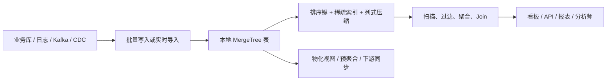

一个 ClickHouse 表至少要从三个层面理解：

```text
逻辑层：数据库、表、列、数据类型、视图、字典
存储层：partition、part、列文件、mark、索引、后台 merge
集群层：shard、replica、Distributed 表、Keeper、分布式 DDL
```

### 1.4 适合与不适合的场景

| 场景 | 适合度 | 说明 |
| --- | --- | --- |
| 日志、埋点、指标和行为明细分析 | 很高 | 追加写入，多维过滤和聚合明显 |
| 实时看板、运营分析和自助 BI | 很高 | 通过预聚合、缓存和合理排序键可获得低延迟 |
| 大规模时序数据 | 很高 | 时间范围过滤、聚合和 TTL 都有成熟实践 |
| 广告、推荐、风控特征分析 | 高 | 适合批量计算和宽表分析，需控制高基数与 Join 成本 |
| 高频单行更新、复杂事务 | 谨慎评估 | 新版本的轻量级更新适合部分小范围变更，但不等于 OLTP 事务和完整约束 |
| 任意字段点查且没有合适排序键 | 低 | 可能需要扫描大量 granule |
| 强唯一约束、外键和多表事务 | 低 | MergeTree 主键不是唯一约束，事务能力和 OLTP 数据库不同 |
| 任意字符串全文检索 | 视情况 | 新版本可评估专用 Text Index；相关性检索、复杂语言分析等需求仍应评估搜索引擎 |

## 2. ClickHouse 总体架构

### 2.1 单节点逻辑架构

ClickHouse 的单节点通常由一个 Server 进程承载连接处理、SQL 分析、查询执行、本地存储和后台任务。用户通过 HTTP、Native TCP、JDBC、ODBC 或各语言驱动访问。

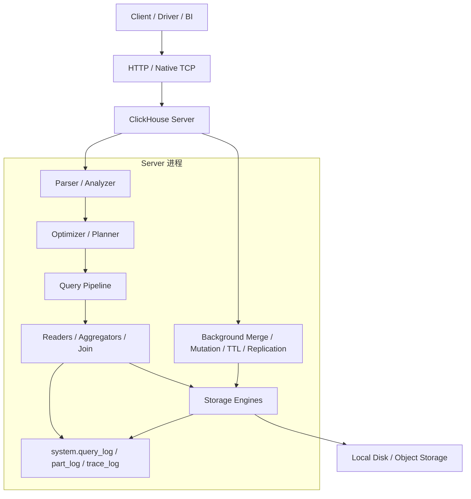

核心组件的职责：

| 组件 | 主要职责 | 学习重点 |
| --- | --- | --- |
| Client/Driver | 建立连接、发送 SQL、读取结果 | HTTP 与 Native 协议、超时、压缩和批量写入 |
| Parser/Analyzer | 解析 SQL、绑定列和表、检查语义 | CTE、别名、类型转换、当前 Analyzer 行为 |
| Planner/Optimizer | 选择读取、Join、聚合和执行策略 | 谓词下推、PREWHERE、Join 算法、Projection |
| Query Pipeline | 把计划拆成并行执行的处理器 | 并行度、线程、Exchange、Pipeline 解释 |
| Storage Engine | 定义数据如何写入、读取、合并和维护 | MergeTree 家族、Replacing、Aggregating 等 |
| Background Threads | 执行 merge、mutation、TTL、复制任务 | parts 数量、队列、资源竞争和延迟 |
| system 表 | 暴露运行时状态和历史信息 | `system.parts`、`query_log`、`merges`、`mutations` |

### 2.2 查询执行链路

一次典型查询可抽象为：

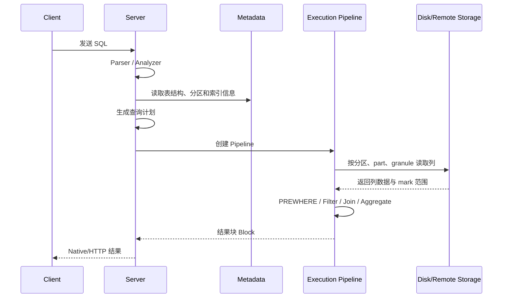

需要注意：

1. ClickHouse 不是先把整张表加载到内存再计算，而是按列、按块、按 granule 流式读取和处理。
2. 查询能否快，首先取决于“实际读了多少数据”，其次才是 CPU 算子本身。
3. 分布式查询中，协调节点还要把 SQL 发到各 shard，收集远端结果并进行必要的二次聚合或排序。

### 2.3 写入、Part 与后台 Merge

MergeTree 的写入核心是：一个批次通常形成一个或多个不可变的 data part；后台线程再把同一分区的多个 part 合并成更大的 part。

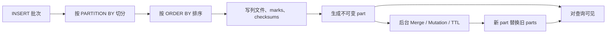

一个 part 通常包含：

- 各列的数据文件和压缩文件。
- 按排序键组织的 mark 信息。
- 分区值、块范围、列统计和校验信息。
- 供读取、复制和合并使用的元数据文件。

这带来几个工程结论：

- **批量写入很重要**：写入批次太小会产生大量小 part，后台 merge 赶不上时会出现 `Too many parts`。
- **Merge 是后台异步行为**：插入成功不等于所有 part 已经合并，也不等于 ReplacingMergeTree 的重复行已经物理消除。
- **Mutation 不是即时更新**：`ALTER UPDATE/DELETE` 通常会异步重写受影响的 part，需要监控完成状态。

### 2.4 分布式集群架构

自建 ClickHouse 集群通常在每个 shard 上部署一个或多个 replica。查询通过 Distributed 表访问本地表，数据本身通常落在各 shard 的本地 MergeTree 表中。

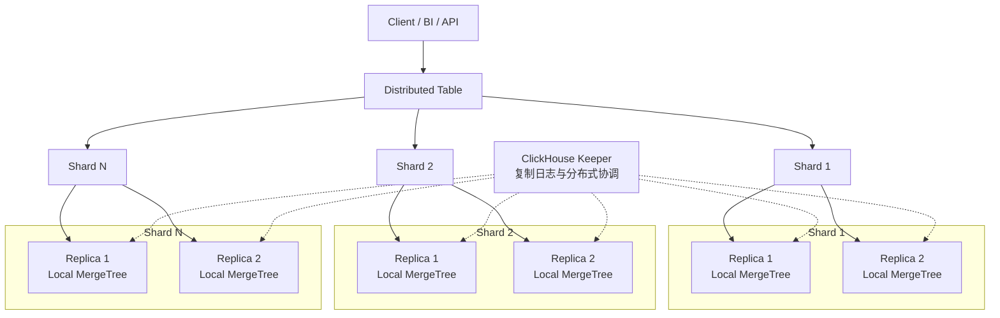

上图是逻辑关系，不代表每次查询都同时读取每个 replica。具体读取哪个 replica，取决于集群配置、负载均衡、健康状态、优先级和查询设置。

### 2.5 Shard、Replica、Distributed 与 Keeper

#### Shard：水平切分

Shard 表示数据的水平分片。假设有 4 个 shard，分片键将数据路由到其中一个 shard，则每个 shard 只保存全量数据的一部分。增加 shard 主要用于扩展容量和并行计算能力，但也会增加跨 shard Join、二次聚合、数据重分布和运维复杂度。

#### Replica：副本冗余

Replica 表示同一 shard 的数据副本。副本主要用于高可用、故障切换和读扩展。副本不是分片：

| 概念 | 解决的问题 | 数据内容 |
| --- | --- | --- |
| Shard | 容量和水平并行 | 通常是不同数据子集 |
| Replica | 容灾和可用性 | 通常是同一 shard 的相同数据 |

#### Distributed 表：查询与写入路由层

`Distributed` 通常不是主要数据存储，而是一张逻辑表。它根据集群配置把查询发送到远端本地表，并在需要时合并结果；写入时也可以根据分片表达式把数据转发到目标 shard。

查询选择 replica 与写入是否发送到所有 replica 是两个问题。前提是目标本地表使用 `ReplicatedMergeTree` 家族或其他明确的复制机制。生产集群通常让 `Distributed` 的 cluster 配置使用 `internal_replication = true`，把一个写入只发到同一 shard 的一个副本，再由 `ReplicatedMergeTree` 负责复制；若本地表是普通 `MergeTree`，设为 `true` 不会凭空产生副本，反而可能只写入一个节点。设为 `false` 时，`Distributed` 可能把写入发送到每个 replica，若又叠加复制表，容易产生重复写入。

#### ClickHouse Keeper：协调层

Keeper 用于复制表的日志、复制相关元数据、任务队列和分布式协调。它不是 ClickHouse 的用户数据存储，也不是查询结果缓存；普通表结构也不应理解为全部存放在 Keeper 中。Keeper 故障会影响复制和部分协调操作，但本地表上的已落盘数据不等同于存放在 Keeper 中。

### 2.6 自建集群与云上 SharedMergeTree

自建集群常见形态是“计算节点本地磁盘 + ReplicatedMergeTree + Keeper”。ClickHouse Cloud 等云部署可以进一步解耦计算与存储，使用共享对象存储和 SharedMergeTree 等能力，让计算节点更容易弹性扩缩；这些能力不应直接等同于所有自建开源集群的默认行为。

选型时不要把云上 SharedMergeTree 的行为直接套到所有自建开源集群：

- 自建集群要自己规划磁盘、Keeper、网络、备份和故障切换。
- 云部署通常把部分复制、存储和弹性能力托管，但可用功能、成本模型和参数范围依赖具体服务。
- 面试回答时，先说明“自建 ReplicatedMergeTree”还是“云上共享存储架构”，再讨论一致性和扩缩容。

## 3. 存储模型与 MergeTree 家族

### 3.1 表、分区、Part、Granule 的关系

ClickHouse 读取 MergeTree 表时，不是按传统 B-Tree 索引逐行定位，而是利用排序后的数据、mark 和稀疏索引跳过不可能命中的数据范围。

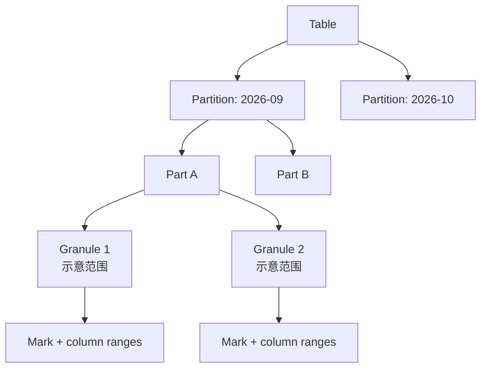

| 层级 | 含义 | 关键特性 |
| --- | --- | --- |
| Table | 逻辑表 | 由存储引擎定义读写语义 |
| Partition | `PARTITION BY` 产生的物理分组 | 便于裁剪、TTL、删除和生命周期管理 |
| Part | 一次写入或 merge 生成的不可变数据片段 | 查询可见，后台会继续合并 |
| Granule | 读取和索引跳过的基本数据范围 | 通常按行数和自适应粒度形成，不应假定固定为 8192 行 |
| Mark | 记录 granule 对应的列文件位置 | 用于快速定位列数据范围 |

同一个分区可以暂时存在多个 part；part 越多，元数据、文件打开、合并和查询调度成本越高。默认索引粒度常被记作 8192 行，但启用自适应粒度时，宽行也可能让 granule 提前结束。因此“分区少而稳定、批次足够大、part 数可控”是常见目标。

### 3.2 列式存储与压缩

ClickHouse 将不同列分开存储。查询只读取 `SELECT`、过滤条件、Join、聚合和排序实际需要的列，因此宽表不一定意味着每次查询都读取整行。

列式布局的收益：

- 同一列的数据类型相同，压缩率通常更好。
- 只读取少数列，减少磁盘 IO 和网络 IO。
- 同类型数据连续布局，适合 SIMD 和向量化执行。
- 可以对不同列选择不同压缩编码器。

常见 Codec 的理解：

| Codec | 适合关注点 | 说明 |
| --- | --- | --- |
| `LZ4` | 通用读写速度 | 常见默认选择，解压快 |
| `ZSTD` | 更高压缩率 | 适合存储成本敏感或冷数据，CPU 成本更高 |
| `Delta` | 相邻数值差值小 | 常与时间戳、递增序列等组合 |
| `DoubleDelta` | 二阶差值稳定 | 常用于规则采样时序数据 |
| `Gorilla` | 浮点时序 | 适合相邻值变化平滑的场景 |

不要只看压缩率。Codec 的选择要结合读写比例、CPU、磁盘吞吐、数据生命周期和实际基准测试。

### 3.3 ORDER BY、PRIMARY KEY 与稀疏索引

这是 ClickHouse 最容易被误解的部分。

- `ORDER BY` 定义 MergeTree 数据在 part 内的排序键，也是大多数场景下最重要的数据布局设计。
- `PRIMARY KEY` 定义主键索引表达式；如果未单独指定，通常使用 `ORDER BY` 表达式。
- 单独指定 `PRIMARY KEY` 时，它必须是 `ORDER BY` 的前缀；这样既保留完整排序，又可以控制稀疏索引大小。
- MergeTree 主键索引是**稀疏索引**，不是传统数据库的唯一约束，也不是每一行一个索引项。
- 查询条件能约束排序键的前导列时，通常更容易跳过 granule；只过滤后续列而缺少前导列条件时，主键索引收益可能很弱。

#### 稀疏主键索引如何工作

每个 data part 都有自己的主键索引和 marks。主键索引为每个 granule 记录其首行的主键值；mark 则帮助定位各列数据文件中的位置。查询先根据主键索引排除不可能命中的 granule，再读取剩余范围并逐行应用过滤条件。因此它是**范围剪枝**，不是找到一个键就直接返回对应行的行级索引。

```text
按 (tenant_id, event_time) 排序的数据：
Granule 0       Granule 1       Granule 2       Granule 3
(1, 09:00...)   (1, 10:00...)   (2, 09:00...)   (2, 10:00...)
      |               |               |               |
  边界键值        边界键值        边界键值        边界键值
```

ClickHouse 默认 `index_granularity` 常见值是 8192 行，但实际 granule 行数还会受自适应字节粒度等设置影响；小 part 也可能不足 8192 行。设计和估算时不要把“一个索引项恰好对应 8192 行”当成恒定规则。

主键索引通常需要常驻内存，键列越多、表达式结果越宽，索引的内存占用和写入/merge 成本通常越高。把大字符串、Map 等宽值直接放入主键前，应先测量索引大小和压缩收益；显式 `PRIMARY KEY` 设为 `ORDER BY` 前缀可以控制索引中保存的键列。

复合排序键按字典序组织。例如 `ORDER BY (tenant_id, event_time, event_name)` 通常适合 `tenant_id = ...` 加时间范围；若只按 `event_name` 过滤，不能假设主键能像独立 `event_name` 索引一样直接定位。需要另一种访问路径时，继续评估跳数索引或 Projection，而不是把列放入 `PRIMARY KEY` 就认为它们都能独立查找。

示例：

```sql
CREATE TABLE events
(
    event_time DateTime64(3),
    tenant_id  UInt64,
    user_id    UInt64,
    event_name LowCardinality(String),
    value      Float64,
    payload    String
)
ENGINE = MergeTree
PARTITION BY toYYYYMM(event_time)
ORDER BY (tenant_id, event_name, event_time, user_id);
```

上表的设计意图是：常见查询先按租户、事件类型和时间范围过滤。若真实查询经常只按 `user_id` 查询，当前排序键未必合适，不能因为列名出现在表中就认为会自动加速。

`PRIMARY KEY` 与 `ORDER BY` 可以不同：

```sql
ENGINE = MergeTree
PARTITION BY toYYYYMM(event_time)
PRIMARY KEY (tenant_id, event_time)
ORDER BY (tenant_id, event_time, event_name, user_id)
```

此时数据仍按完整 `ORDER BY` 排序，但主键索引只针对前两列构建。这样可以控制索引大小，但也要确认查询模式和排序收益。

### 3.4 PARTITION BY 的正确理解

分区主要服务于：

- 分区裁剪，避免读取明显不相关的分区。
- TTL、归档、迁移和生命周期管理。
- 按时间或业务周期删除历史数据。
- 在运维上隔离相对独立的数据范围。

分区不是越细越好。下面的设计通常需要警惕：

```sql
PARTITION BY user_id        -- 高基数，可能产生大量分区
PARTITION BY event_time     -- 可能按秒/毫秒产生过多分区
```

常见选择：

```sql
PARTITION BY toYYYYMM(event_time)
-- 或者数据量较大、生命周期明确时使用 toYYYYMMDD(event_time)
```

选择依据是“单分区数据量、每天写入批次、保留周期、删除/归档粒度、查询时间范围”，而不是固定记忆“永远按月分区”。

### 3.5 常见 MergeTree 与集成引擎

| 引擎 | 主要用途 | 关键语义与风险 |
| --- | --- | --- |
| `MergeTree` | 通用明细表 | 追加写入，适合分析查询 |
| `ReplicatedMergeTree` | 带副本的明细表 | 依赖 Keeper，复制和队列需监控 |
| `ReplacingMergeTree` | 去重或保留最新版本 | 去重发生在 merge，查询时可能需要 `FINAL`；不等于实时唯一约束 |
| `SummingMergeTree` | 相同排序键下的数值累加 | 只适合简单可加指标；非聚合列不能依赖任意一行的值 |
| `AggregatingMergeTree` | 保存聚合状态 | 常与物化视图、`sumState`/`uniqState` 配合 |
| `CoalescingMergeTree` | 对同一排序键按合并顺序逐列合并非 NULL 值 | 适合碎片化更新；非键列通常应使用 `Nullable`，且为版本相关能力 |
| `CollapsingMergeTree` | 通过 sign 抵消旧记录 | 写入顺序、成对记录和查询语义要求高 |
| `VersionedCollapsingMergeTree` | 带版本的折叠 | 适合特定 CDC/状态流场景，必须理解版本和 sign |

引擎选择原则：先根据数据语义选择，再根据性能和运维验证；不要为了“看起来高级”直接使用 Collapsing 或 Aggregating 引擎。

`CoalescingMergeTree` 适合“同一个业务键的不同列分批到达”的场景，例如设备状态或分阶段补全的画像；它与 `ReplacingMergeTree` 的整行替换不同，而是按合并顺序逐列保留后出现的非 NULL 值。这个合并顺序不能自动等同于业务上的 `event_time` 或 `version` 顺序；如果业务要求确定的新旧规则，应在上游整理数据或选择带版本的模型。该引擎在较新的 ClickHouse 版本中提供，生产使用前应确认版本、`Nullable` 设计和 `FINAL` 查询代价。

`Distributed` 和 `Kafka` 不属于 MergeTree 家族，但在 ClickHouse 数据链路中经常一起出现：

| 集成引擎 | 主要用途 | 关键边界 |
| --- | --- | --- |
| `Distributed` | 分布式访问、查询转发和写入路由 | 主要是逻辑访问层，数据通常落在本地表 |
| `Kafka` | 把 Kafka 消费暴露为表 | 常与物化视图配合，需处理消费、重试和重复 |

#### ReplacingMergeTree 示例

```sql
CREATE TABLE user_latest_local
(
    user_id UInt64,
    event_time DateTime64(3),
    version UInt64,
    status LowCardinality(String)
)
ENGINE = ReplacingMergeTree(version)
ORDER BY user_id;
```

它表示后台 merge 时可以根据排序键和版本列保留较新的行。较新的定义只对相同排序键生效，并且同一排序键内的版本值必须可比较，较新的业务版本应有更大的值；没有版本列时，重复行的保留规则不能当作业务上的确定顺序。以下查询边界必须明确：

- 未完成 merge 前，物理上可能仍有重复行。
- `SELECT ... FINAL` 可以在查询时做最终去重，但可能显著增加 CPU、内存和扫描成本。
- 后台 merge 只在同一分区内进行；如果同一逻辑键可能落在不同分区，不要假设后台 merge 会跨分区去重。`FINAL` 是否跨分区合并还受查询设置影响，应单独设计分区键和查询策略。
- 支持 `ReplacingMergeTree(version, is_deleted)` 的版本可以使用删除标记，但 `is_deleted`、版本列和历史删除记录必须一起设计，不能把它当作事务删除。
- 如果业务要求严格实时唯一写入，不能只依赖 ReplacingMergeTree，通常还要结合幂等键、批次控制或上游去重。

#### AggregatingMergeTree 示例

```sql
CREATE TABLE daily_uv
(
    day Date,
    site_id UInt64,
    uv_state AggregateFunction(uniq, UInt64),
    pv_state AggregateFunction(sum, UInt64)
)
ENGINE = AggregatingMergeTree
ORDER BY (day, site_id);
```

查询时应使用状态合并函数：

```sql
SELECT
    day,
    site_id,
    uniqMerge(uv_state) AS uv,
    sumMerge(pv_state) AS pv
FROM daily_uv
GROUP BY day, site_id;
```

写入这类状态列时，应使用与列类型对应的状态函数，例如 `uniqState(user_id)` 写入 `AggregateFunction(uniq, UInt64)`，使用 `sumState(value)` 写入 `AggregateFunction(sum, UInt64)`；查询阶段再使用对应的 `...Merge` 函数合并。

### 3.6 数据类型、Codec、TTL 与 Mutation

#### 数据类型选择

| 类型 | 建议 |
| --- | --- |
| `UInt32`/`UInt64` | ID、计数、枚举编码按实际范围选择，不要所有字段都用 `UInt64` |
| `Date`/`DateTime`/`DateTime64` | 按时间精度和时区要求选择，毫秒事件通常考虑 `DateTime64(3)` |
| `Decimal` | 金额、精确小数优先评估 Decimal，不要用 Float 代替精确金融计算 |
| `LowCardinality(String)` | 低基数字符串维度可减少存储和字典开销，但高基数字段不一定受益 |
| `Nullable(T)` | 有明确 NULL 语义时使用；大量 Nullable 会增加读取和计算分支 |
| `Array`/`Tuple`/`Map` | 半结构化字段或多值属性；先确认查询模式，避免把所有 JSON 原样塞进 String |
| `JSON`/`Dynamic`/`Variant` | 新版本可用于半结构化或多态数据；能力、路径类型和性能边界需按版本验证，热点字段仍优先显式建列 |
| `UUID`/`IPv4`/`IPv6` | 使用语义化类型，通常比裸字符串更节省、更易校验 |

#### TTL

TTL 可以用于按时间删除、移动到低成本磁盘或重新聚合，常见形式：

```sql
CREATE TABLE logs
(
    event_time DateTime,
    service LowCardinality(String),
    body String
)
ENGINE = MergeTree
ORDER BY (service, event_time)
TTL event_time + INTERVAL 30 DAY DELETE;
```

TTL 通常由后台任务异步处理，不应把它理解为每行到期瞬间立即消失。需要结合磁盘策略、merge 资源、合规要求和备份策略验证。

#### Mutation 与轻量级更新/删除

传统 Mutation 通常指 `ALTER TABLE ... UPDATE/DELETE`。它会对命中的数据 part 做后台重写，适合低频、批量、范围明确的修正：

```sql
ALTER TABLE events
UPDATE value = value * 1.05
WHERE event_time < now() - INTERVAL 30 DAY;

ALTER TABLE events
DELETE WHERE tenant_id = 1001;
```

在支持轻量级更新/删除的版本和配置中，普通 SQL `UPDATE`/`DELETE` 可以通过 patch part、行存在性标记等方式减少全列重写，适合小范围、频繁变更。按当前官方文档，轻量级删除在 22.8 引入、23.3 起通常可直接使用，轻量级更新在 25.7 引入；不同发行版、设置和后续版本仍可能有差异，下面的写法必须先在目标版本验证：

```sql
UPDATE events
SET value = value * 1.05
WHERE tenant_id = 1001
  AND event_time >= now() - INTERVAL 1 DAY;

DELETE FROM events
WHERE tenant_id = 1001
  AND event_time < now() - INTERVAL 90 DAY;
```

轻量级操作不是 OLTP 事务的替代品：变更可能在查询时叠加 patch，直到后台 merge 或显式物化；更新比例过大、patch 长期堆积时，查询和内存成本会升高。具体语法、设置和可见性以实际版本为准。无论哪种方式，都应监控 `system.mutations`、part 数量、后台 merge 和查询延迟，不要只看命令是否返回成功。

### 3.7 数据建模与生命周期设计

#### 明细表、最新状态表与汇总表

一个常见的分析型数据模型可以分成三类：

| 表类型 | 一行含义 | 常见引擎 | 适合查询 |
| --- | --- | --- | --- |
| 明细表 | 一次事件、一次请求或一条事实 | `MergeTree` | 明细追溯、任意时间范围分析 |
| 最新状态表 | 某个业务键在某个版本下的状态 | `ReplacingMergeTree` 或上游整理后的 `MergeTree` | 查询当前状态、快照 |
| 汇总表 | 某个时间和维度粒度的聚合状态 | `AggregatingMergeTree` 或普通 `MergeTree` | 看板、API、固定指标 |

不要让一张表同时承担“原始可回放、最新状态、分钟汇总和在线点查”四种职责。不同职责通常需要不同的排序键、更新语义和保留策略。

#### 事件时间与处理时间

实时链路建议至少保留：

- `event_time`：事件在业务系统发生的时间，用于业务窗口和指标口径。
- `ingest_time`：数据进入采集或消息系统的时间，用于延迟分析。
- `process_time`：数据被计算或写入 ClickHouse 的时间，用于任务排障。
- 来源位点、批次 ID 或幂等键：用于回放、去重和对账。

迟到数据会影响物化视图和汇总结果。需要“可修正”的指标时，预留回补窗口或按天重算机制，不要只依赖一次实时写入。

#### 归一化还是反范式

- 事实明细中的高频查询维度可以冗余，减少在线 Join。
- 变化频繁、低频访问或字段数量不稳定的属性可以放入 Map/JSON。
- 关键指标和高频看板应使用汇总表或物化视图。
- 对于需要强事务和约束的数据，保留业务库作为事实来源，ClickHouse 作为分析副本。

最终模型应由查询模板、写入模式、更新比例、保留周期和一致性要求共同决定，而不是简单套用“宽表”或“星型模型”。

## 4. 基础 SQL 与数据写入

### 4.1 建库建表与查看元数据

```sql
CREATE DATABASE IF NOT EXISTS demo;

CREATE TABLE demo.events
(
    event_time DateTime64(3),
    tenant_id UInt64,
    user_id UInt64,
    event_name LowCardinality(String),
    source LowCardinality(String),
    amount Decimal(18, 2),
    tags Array(String),
    attrs Map(String, String),
    payload String
)
ENGINE = MergeTree
PARTITION BY toYYYYMM(event_time)
ORDER BY (tenant_id, event_name, event_time, user_id)
SETTINGS index_granularity = 8192;
```

常用元数据命令：

```sql
SHOW DATABASES;
SHOW TABLES FROM demo;
SHOW CREATE TABLE demo.events;
DESCRIBE TABLE demo.events;

SELECT
    database,
    table,
    partition,
    name,
    active,
    rows,
    bytes_on_disk
FROM system.parts
WHERE database = 'demo' AND table = 'events'
ORDER BY modification_time DESC;
```

### 4.2 INSERT、格式与批量写入

#### VALUES

```sql
INSERT INTO demo.events
    (event_time, tenant_id, user_id, event_name, source, amount, tags, attrs, payload)
VALUES
    ('2026-09-05 10:00:00.123', 1, 101, 'purchase', 'app', 99.90, ['vip'], {'channel': 'ios'}, ''),
    ('2026-09-05 10:00:01.456', 1, 102, 'view', 'web', 0, ['new'], {'channel': 'chrome'}, '');
```

#### JSONEachRow

适合日志、服务接口和流式写入：

```sql
INSERT INTO demo.events FORMAT JSONEachRow
{"event_time":"2026-09-05 10:01:00.000","tenant_id":1,"user_id":103,"event_name":"view","source":"web","amount":0,"tags":["new"],"attrs":{"channel":"chrome"},"payload":"{\"device\":{\"os\":\"iOS\"},\"version\":3}"}
```

#### 批量写入原则

- 尽量把多个业务事件聚合成批次再写入。
- 控制单批行数和字节数，避免单批过大导致内存峰值，也避免单行一批造成大量 parts。
- 高并发小批量场景可评估异步插入，但必须验证去重、失败重试、可观测性和延迟。
- 生产写入应带上批次 ID、来源、事件时间和幂等键，便于回放和排重。

#### 常见输入格式

| 格式 | 适合场景 |
| --- | --- |
| `Native` | ClickHouse 原生驱动，高吞吐 |
| `JSONEachRow` | 日志、事件、服务接口 |
| `CSV`/`TSV` | 简单批量交换 |
| `Parquet`/`ORC` | 数据湖文件交换 |
| `Avro` | Schema 驱动的数据交换 |

### 4.3 SELECT、聚合与窗口函数

#### 基础过滤与聚合

```sql
SELECT
    toDate(event_time) AS day,
    source,
    count() AS events,
    uniqCombined64(user_id) AS users,
    sumIf(amount, event_name = 'purchase') AS revenue,
    avgIf(amount, event_name = 'purchase') AS avg_order_amount
FROM demo.events
WHERE tenant_id = 1
  AND event_time >= '2026-09-01'
  AND event_time <  '2026-10-01'
GROUP BY day, source
ORDER BY day, source;
```

高频聚合函数：

| 函数 | 用途 | 注意 |
| --- | --- | --- |
| `count()` | 行数 | `count(column)` 对 NULL 有不同语义 |
| `sum`/`avg` | 数值聚合 | 注意类型和溢出 |
| `countIf`/`sumIf`/`avgIf` | 条件聚合 | 常比多次过滤更清晰 |
| `uniq`/`uniqCombined64` | 近似去重 | 需要按精度、内存和速度选型 |
| `quantile` 系列 | 分位数 | 选择精确或近似算法 |
| `argMax`/`argMin` | 按版本或时间取关联值 | 常用于取最新状态 |
| `groupArray` | 聚合成数组 | 可能造成内存膨胀，要控制上限 |

#### PREWHERE 基础用法

```sql
SELECT user_id, event_name, amount
FROM demo.events
PREWHERE tenant_id = 1
    AND event_time >= now() - INTERVAL 1 DAY
WHERE event_name IN ('purchase', 'refund');
```

`PREWHERE` 让引擎先读取过滤列，筛出候选行后再读取其他列，适合宽表和过滤选择性较好的场景。具体是否自动使用、如何重排，应通过执行计划和实际读量验证。

#### 窗口函数

```sql
SELECT
    user_id,
    event_time,
    amount,
    row_number() OVER (
        PARTITION BY user_id
        ORDER BY event_time DESC
    ) AS rn,
    sum(amount) OVER (
        PARTITION BY user_id
        ORDER BY event_time
        ROWS BETWEEN UNBOUNDED PRECEDING AND CURRENT ROW
    ) AS cumulative_amount
FROM demo.events
WHERE tenant_id = 1;
```

窗口函数通常需要排序和维护状态，数据量很大时要留意内存、临时磁盘和分布式阶段。

### 4.4 日期、数组、Map、JSON 与半结构化数据

#### 日期函数

```sql
SELECT
    toDate(event_time) AS day,
    toStartOfHour(event_time) AS hour,
    toYYYYMM(event_time) AS month,
    dateDiff('minute', event_time, now()) AS age_minutes
FROM demo.events;
```

时间过滤建议使用半开区间，避免 `23:59:59`、毫秒精度和时区边界问题：

```sql
WHERE event_time >= '2026-09-01 00:00:00'
  AND event_time <  '2026-09-02 00:00:00'
```

#### Array 与 Map

```sql
SELECT
    user_id,
    has(tags, 'vip') AS is_vip,
    arrayJoin(tags) AS tag,
    attrs['channel'] AS channel
FROM demo.events
WHERE tenant_id = 1;
```

`arrayJoin` 会把一行展开成多行，可能放大数据量；在聚合前使用时要确认行数变化。

#### JSON

```sql
SELECT
    JSONExtractString(payload, 'device', 'os') AS os,
    JSONExtractUInt(payload, 'version') AS version
FROM demo.events
WHERE payload != '';
```

如果某个 JSON 字段成为高频过滤、分组或 Join 键，通常应评估抽取成显式列，而不是每次查询临时解析。

### 4.5 JOIN、Dictionary 与去范式

ClickHouse 支持多种 Join 算法和语法，但大表 Join 仍然可能是查询的主要成本。常见原则：

- 先过滤和聚合，再 Join，减少参与 Join 的行数。
- 小维表可以评估字典、`Join` 引擎或广播式策略。
- 大量稳定维度可通过宽表、物化视图或定期反范式减少在线 Join。
- Join 键的数据类型必须一致，避免隐式转换导致性能和语义问题。
- 多 shard Join 要关注数据是否需要跨 shard 传输，网络通常比本地 CPU 更昂贵。

示例：

```sql
SELECT
    e.event_name,
    d.region,
    count() AS cnt
FROM demo.events AS e
LEFT JOIN demo.user_dim AS d
    ON e.user_id = d.user_id
WHERE e.tenant_id = 1
  AND e.event_time >= now() - INTERVAL 1 DAY
GROUP BY e.event_name, d.region;
```

上例所需的维表可以用下面的最小结构表示：

```sql
CREATE TABLE demo.user_dim
(
    user_id UInt64,
    region LowCardinality(String)
)
ENGINE = MergeTree
ORDER BY user_id;
```

对于“按 key 查询最新维度属性”的场景，Dictionary 往往比每次 Join 更合适；但 Dictionary 的刷新、失效、兜底和一致性也要单独设计。

上例假设 `demo.user_dim(user_id, region)` 已存在，并且每个 `user_id` 在维表中只有一条当前有效记录。若维表本身有多版本或一对多关系，先明确去重/版本规则，否则 Join 可能放大事实行数。

### 4.6 抽样、采样键与外部表函数

如果表使用 `SAMPLE BY` 定义了采样表达式，可以使用 `SAMPLE` 做近似分析：

```sql
CREATE TABLE demo.sampled_events
(
    event_time DateTime64(3),
    tenant_id UInt64,
    user_id UInt64,
    event_name LowCardinality(String)
)
ENGINE = MergeTree
PARTITION BY toYYYYMM(event_time)
ORDER BY (tenant_id, intHash32(user_id), event_time, user_id)
SAMPLE BY intHash32(user_id);

SELECT
    event_name,
    count()
FROM demo.sampled_events
SAMPLE 0.1
WHERE event_time >= now() - INTERVAL 7 DAY
GROUP BY event_name;
```

采样不是“任意查询都自动快 10 倍”：

- 需要表定义了合适的采样键。
- 统计结果通常是近似值，需要说明误差和业务可接受范围；`count()` 默认只统计样本行，不会自动还原全量，可在均匀采样假设成立时按采样比例估算。
- 采样键的分布要避免严重偏斜。

外部表函数可以直接读取文件或外部系统，用于临时分析、迁移和验证：

```sql
SELECT *
FROM file('data/*.parquet', Parquet);
```

这里的路径通常相对于 ClickHouse 服务端允许访问的 `user_files` 目录，而不是客户端本地目录。生产链路应明确权限、文件列表、Schema、网络和失败重试，不要把临时表函数脚本直接当作长期数据服务接口。

### 4.7 常用分析 SQL 补充

#### LIMIT BY：每组取 Top N

```sql
SELECT
    tenant_id,
    user_id,
    event_time,
    amount
FROM demo.events
WHERE event_name = 'purchase'
ORDER BY tenant_id, amount DESC
LIMIT 3 BY tenant_id;
```

`LIMIT BY` 适合“每个租户/渠道/用户取前 N 条”的分析；它与全局 `LIMIT` 不同，通常需要配合稳定的 `ORDER BY` 才有确定结果。

#### argMax：按版本或时间取关联字段

下面的查询假设状态事件表已经按同一业务键保留了可比较的版本列：

```sql
CREATE TABLE demo.user_status_events
(
    user_id UInt64,
    version UInt64,
    status LowCardinality(String)
)
ENGINE = MergeTree
ORDER BY (user_id, version);
```

```sql
SELECT
    user_id,
    argMax(status, version) AS latest_status,
    max(version) AS latest_version
FROM demo.user_status_events
GROUP BY user_id;
```

`argMax(value, version)` 适合从事件表中取版本最大的关联值，但相同版本下的结果不应被当成确定的业务排序；需要严格确定性时，设计唯一且单调的版本键。

#### WITH 与参数化

```sql
WITH
    toDateTime({start_time:DateTime}) AS start_ts,
    toDateTime({end_time:DateTime}) AS end_ts
SELECT
    source,
    count() AS events
FROM demo.events
WHERE tenant_id = {tenant_id:UInt64}
  AND event_time >= start_ts
  AND event_time < end_ts
GROUP BY source;
```

服务化查询优先使用驱动或网关提供的参数绑定，不要通过字符串拼接用户输入生成 SQL。参数语法和驱动支持情况需要按客户端验证。

## 5. 查询性能优化

### 5.1 优化总原则：少读数据、少做工作

ClickHouse 性能优化可以按下面的优先级推进：

```text
1. 缩小时间范围和业务范围
2. 让分区裁剪和排序键/稀疏主键索引匹配主要查询
3. 对其他稳定且高频的访问路径评估 Projection 或预聚合
4. 只有摘要确实能跳过大量数据时，再评估 Data Skipping Index
5. 只读取需要的列；先过滤/预聚合，再 Join、排序和窗口计算
6. 控制并发、内存、网络和临时磁盘，最后再调整细粒度参数
```

一次优化至少要记录这些基线：

| 指标 | 说明 |
| --- | --- |
| `query_duration_ms` | 查询耗时，最好看 P50/P95/P99 |
| `read_rows` | 实际读取行数 |
| `read_bytes` | 实际读取字节数 |
| `result_rows`/`result_bytes` | 结果规模 |
| `memory_usage` | 峰值内存 |
| `ProfileEvents` | IO、扫描、Join、聚合和等待等运行时事件 |
| 每 shard 耗时 | 分布式场景识别慢 shard 和数据倾斜 |

“查询变快”必须同时说明是减少了读取量、降低了计算量，还是增加了缓存或预计算；否则很难判断优化能否迁移到其他查询。

### 5.2 排序键与主键设计

排序键是 ClickHouse 表设计中最重要的性能决策之一。设计时先收集真实查询，再把常用过滤条件映射到排序键前缀。

| 查询特征 | 排序键设计思路 |
| --- | --- |
| 所有查询都带租户条件 | 通常把 `tenant_id` 放在前部 |
| 主要按时间范围查询 | 把时间列放在能服务主要过滤的合理位置 |
| 常按用户查最近事件 | 评估 `(tenant_id, user_id, event_time)` |
| 主要按事件类型和时间聚合 | 评估 `(tenant_id, event_name, event_time)` |
| 需要多种完全不同的访问路径 | 评估 Projection、物化汇总表或拆分明细表，不要把所有列都塞进排序键 |

排序键的常见原则：

- 优先覆盖高频且有选择性的过滤前缀。
- 排序键列越长，写入排序、索引和 merge 成本越高。
- 低基数列放在前面并不总是正确；应结合查询选择性、数据分布和时间范围实测。
- 时间列很常用，但它放在第一个、最后一个还是中间，取决于租户隔离、查询模式和数据分布。
- 不要把高基数随机值无理由放在最前面，否则可能削弱相邻数据的聚集和压缩收益。

可以用一个小型基准验证候选排序键：

```sql
CREATE TABLE events_by_user
AS demo.events
ENGINE = MergeTree
PARTITION BY toYYYYMM(event_time)
ORDER BY (tenant_id, user_id, event_time);

CREATE TABLE events_by_type
AS demo.events
ENGINE = MergeTree
PARTITION BY toYYYYMM(event_time)
ORDER BY (tenant_id, event_name, event_time);
```

将同一批数据写入两张实验表，使用真实查询样本比较 `read_rows`、`read_bytes`、耗时和写入/merge 代价，比背诵固定顺序更可靠。

### 5.3 分区裁剪、列裁剪与 PREWHERE

#### 分区裁剪

优先使用能直接约束分区表达式的时间范围：

```sql
SELECT count()
FROM demo.events
WHERE event_time >= '2026-09-01'
  AND event_time <  '2026-10-01';
```

如果分区表达式是 `toYYYYMM(event_time)`，可以进一步核对计划是否只读目标分区。不要把高基数业务字段作为分区键，只为了让某一类查询“看起来可以裁剪”。

#### 列裁剪

避免在宽表上使用 `SELECT *`：

```sql
-- 只读实际需要的列
SELECT event_time, tenant_id, event_name, amount
FROM demo.events
WHERE tenant_id = 1;
```

尤其要注意大字符串、JSON、Array 和 Map 列，它们往往是读放大和内存放大的来源。

#### PREWHERE 的优化边界

`PREWHERE` 可以先读取过滤列，再决定是否读取其他列。对宽表、高选择性过滤和大字段较多的表通常有帮助：

```sql
SELECT user_id, event_name, payload
FROM demo.events
PREWHERE tenant_id = 1
    AND event_time >= now() - INTERVAL 1 DAY
WHERE event_name = 'purchase';
```

要通过 `EXPLAIN`、`system.query_log` 和实际读量验证，而不是把所有过滤条件都手动写到 `PREWHERE`。过度强制也可能让计划失去灵活性。

### 5.4 Data Skipping Index

ClickHouse 语境里的“二级索引”不是一个单一机制。Data Skipping Index（数据跳过索引，也常称跳数索引）在一个或多个 granule 的范围上记录摘要；查询只有在摘要能证明该范围不可能满足条件时才跳过它。它不保存每一行的精确地址，也不保证像 OLTP 的 B-tree 那样按值直接定位少数行。

| 访问路径 | 保存/利用的信息 | 主要用途 | 主要边界 |
| --- | --- | --- | --- |
| 排序键 + 稀疏主键索引 | 每个 part 中 granule 边界处的排序键值 | 最优先的范围剪枝，适合匹配排序键前导列的查询 | 受物理排序和复合键顺序约束 |
| Data Skipping Index | granule 或 granule 组级别的统计/成员摘要 | 排序键之外的条件能排除大量数据块时补充剪枝 | 不定位单行；索引与写入有成本，低剪枝率时可能更慢 |
| 轻量级 Projection | 另一种排序键及 `_part_offset`，以 Projection 的稀疏主键索引寻找候选位置 | 过滤列与基础排序键不同、又需要较细粒度候选范围时 | 依赖版本能力；读取结果列仍可能回到基础 part，随机读取局部性较弱 |
| Text Index | token 到行位置的倒排结构 | 支持的版本中做全文 token 检索 | 专用于文本检索，分词器与查询语义必须匹配 |

常见 Data Skipping Index 类型：

| 类型 | 适合场景 | 风险 |
| --- | --- | --- |
| `minmax` | 每个索引块的取值范围较窄，例如与排序键相关或局部有序的数值/日期 | 块内范围高度重叠时难以剪枝 |
| `set(N)` | 每个索引块 distinct 值较少、值有局部聚集 | 块内 distinct 数超过 `N` 时该块的集合摘要为空，无法据此剪枝；`N` 和块大小要实测 |
| `bloom_filter` | 高基数列上的稀有值成员判断，也可用于数组等适用表达式 | 可能有 false positive，导致多读块但不应漏掉匹配数据；参数和索引体积需实测 |

示例：

```sql
ALTER TABLE demo.events
ADD INDEX idx_source source TYPE set(100) GRANULARITY 4;

ALTER TABLE demo.events
MATERIALIZE INDEX idx_source;
```

`GRANULARITY 4` 表示每个索引块覆盖 4 个 granule；更大的值通常减少索引条目，但可能降低剪枝精度。具体权衡需按数据分布和查询测试。

使用跳数索引的前提是：

- 查询条件与索引表达式匹配。
- 目标值足够稀疏，或索引块内的范围/成员集合足以排除大量块；对 `minmax` 尤其要关注与排序顺序的相关性。
- 索引维护成本小于节省的读取成本。

新索引通常只会为之后写入的数据 part 建立索引。已有数据需要执行 `MATERIALIZE INDEX` 才会补建；这会产生后台工作，生产环境要评估资源和运行时长。跳数索引不是 B-Tree，也不是万能索引，更不能替代正确的 `ORDER BY`。用 `EXPLAIN indexes = 1` 检查候选剪枝，再在相同数据、缓存和设置下比较实际 `read_rows`、`read_bytes` 与耗时。

`tokenbf_v1` 和 `ngrambf_v1` 是较早的 Bloom Filter 文本索引形式，官方文档已标为 deprecated。需要全文检索时，应评估专用 `text` 索引；它是真正的倒排索引，ClickHouse 官方文档标注在 26.2 及以上版本 GA。版本较旧时，需验证可用类型和查询函数，不能把 Data Skipping Index 的成员摘要等同于完整全文检索。

26.2 及以上版本可按语言和数据选择 tokenizer，例如：

```sql
CREATE TABLE demo.search_events
(
    event_time DateTime,
    body String,
    INDEX idx_body body TYPE text(tokenizer = chinese)
)
ENGINE = MergeTree
ORDER BY event_time;
```

已有数据同样需要物化新建的索引。分词器决定哪些文本能匹配，建表前要用目标语料和搜索函数验证中英文、标点、大小写及短词等行为。

### 5.5 Projection 与 Materialized View

#### Projection

Projection 可以在同一张表内部维护另一种排序或预聚合布局，让优化器在满足条件时选择更适合的物理表示：

```sql
ALTER TABLE demo.events
ADD PROJECTION p_by_source
(
    SELECT
        tenant_id,
        source,
        event_time,
        amount
    ORDER BY (tenant_id, source, event_time)
);

ALTER TABLE demo.events MATERIALIZE PROJECTION p_by_source;
```

传统 Projection 可以保存完整列或列的子集；它以额外存储换取另一种排序/聚合布局。ClickHouse 25.5 起支持在 Projection 中使用 `_part_offset`，可以只保存排序键和回指基础 part 的行偏移，使 Projection 更像非主键列的二级访问路径：

```sql
ALTER TABLE demo.events
ADD PROJECTION p_by_user_id
(
    SELECT _part_offset ORDER BY user_id
);

ALTER TABLE demo.events MATERIALIZE PROJECTION p_by_user_id;
```

这种轻量 Projection 用自己的稀疏主键索引筛选候选位置，返回其他列时仍要读取基础 part；它节省完整副本空间，但读取局部性可能较差。`_part_offset`、多 Projection 联合剪枝及其裁剪粒度有版本差异，不能仅凭 DDL 推断优化器一定采用。对已有数据要物化 Projection，并通过 `EXPLAIN`、`system.query_log` 的 `projections` 字段和实际读量验证。Projection 还会增加写入、merge 和存储成本；部署前需确认与表上更新/删除方式及目标版本的兼容性。

#### 增量物化视图

ClickHouse 的普通 `MATERIALIZED VIEW` 是一个随源表 INSERT 触发的增量视图，不是定时重算整张源表的缓存。若使用 `TO target_table`，视图对象本身主要保存转换查询，真正保存结果的是目标表；目标表可以独立设计引擎、分区、排序键、TTL 和权限。不写 `TO` 时，可以直接给 MV 定义 `ENGINE`/排序键，让 MV 自身的内部表承载结果；生产上显式拆分视图和目标表通常更容易管理数据生命周期、权限、回填和排障。

它与普通视图的区别可以先这样记：

| 类型 | 执行时机 | 是否保存查询结果 | 源表后来新增数据 |
| --- | --- | --- | --- |
| `VIEW` | 每次查询时 | 否 | 查询时读到当前源表数据 |
| 增量 `MATERIALIZED VIEW` | 对源表 INSERT 到达的新数据块执行 | 通常写入 `TO` 指定的目标表 | 触发一次增量计算并追加到目标表 |
| Refreshable MV | 按计划执行完整查询，或按支持版本处理增量 | 是，写入目标表 | 等到下一次刷新 |

概念上，增量视图在第 `n` 次写入时计算 `Q(ΔB_n)`，其中 `ΔB_n` 是这次 INSERT 带来的数据块，而不是源表全量数据；结果进入目标表后，由目标表的引擎和查询共同合并：

```text
目标表当前结果 = 合并(已有结果, Q(本次新增数据块))
```

所以关键问题不是“SQL 能不能在 MV 里跑”，而是“每批数据独立计算后，能否与之前的结果正确合并”。这决定了增量 MV 适合的聚合类型、目标引擎以及查询写法。

#### 用可组合性理解聚合

若把全量数据拆为若干批次 `B1, B2, ...`，一个可增量维护的聚合应满足：

```text
聚合(B1 ∪ B2) = 合并(聚合(B1), 聚合(B2))
```

| 指标 | 每批能否直接算最终值再累加 | 正确的目标表达 |
| --- | --- | --- |
| `count`、`sum` | 可以 | 累加每批 count/sum，查询时再次求和 |
| `min`、`max` | 可以 | 保存每批 min/max，再取全局 min/max |
| `avg` | 不可以直接平均批次平均值 | 保存 `avgState`，或同时保存 sum 与 count，最后相除 |
| UV / distinct | 不可以把每批 UV 相加，用户可能跨批重复 | 保存 `uniq...State`，查询时用对应 `uniq...Merge`；准确性和资源按函数选择 |
| 分位数 | 通常不能平均各批分位数 | 保存分位数聚合状态，再用 `quantile...Merge` 合并 |

例如两个数据块的平均值分别为 10（1 条）和 100（9 条），平均这两个平均值会得到 55，而全量平均值是 91。增量聚合必须保存足够的中间信息，而非只保存一个看似最终的数字。`AggregateFunction` 状态是可合并的中间表示，不等同于面向展示的标量值。

#### 完整示例：PV、UV、收入和平均金额

下面的源表、目标表和 MV 是一个可以独立阅读的例子。目标表按日、租户、来源存放聚合状态；视图每次只计算新插入数据块中出现的这些分组。

```sql
CREATE DATABASE IF NOT EXISTS demo;

CREATE TABLE demo.mv_events
(
    event_time DateTime('UTC'),
    tenant_id UInt64,
    user_id UInt64,
    source LowCardinality(String),
    amount Float64
)
ENGINE = MergeTree
PARTITION BY toYYYYMM(event_time)
ORDER BY (tenant_id, event_time);

CREATE TABLE demo.mv_events_daily
(
    day Date,
    tenant_id UInt64,
    source LowCardinality(String),
    pv_state AggregateFunction(sum, UInt64),
    uv_state AggregateFunction(uniqCombined64, UInt64),
    revenue_state AggregateFunction(sum, Float64),
    avg_amount_state AggregateFunction(avg, Float64)
)
ENGINE = AggregatingMergeTree
PARTITION BY toYYYYMM(day)
ORDER BY (tenant_id, day, source);

CREATE MATERIALIZED VIEW demo.mv_events_daily_insert
TO demo.mv_events_daily
AS
SELECT
    toDate(event_time) AS day,
    tenant_id,
    source,
    sumState(toUInt64(1)) AS pv_state,
    uniqCombined64State(user_id) AS uv_state,
    sumState(amount) AS revenue_state,
    avgState(amount) AS avg_amount_state
FROM demo.mv_events
GROUP BY day, tenant_id, source;
```

查询目标表时仍要按业务维度 `GROUP BY`，并用匹配的 `...Merge` 函数合并状态：

```sql
SELECT
    day,
    tenant_id,
    source,
    sumMerge(pv_state) AS pv,
    uniqCombined64Merge(uv_state) AS uv,
    sumMerge(revenue_state) AS revenue,
    avgMerge(avg_amount_state) AS avg_amount
FROM demo.mv_events_daily
WHERE day >= '2026-09-01'
GROUP BY day, tenant_id, source
ORDER BY day, tenant_id, source;
```

设计时逐项检查：

- `...State` 的函数、参数类型必须与目标列的 `AggregateFunction(...)` 对应；查询用相同聚合家族的 `...Merge`。
- `GROUP BY` 的维度定义了业务粒度；目标表 `ORDER BY` 通常包含这组维度，使相同键的状态能在后台 merge 时合并。`PARTITION BY` 也要与数据生命周期、查询范围相配；后台 merge 不跨分区。
- 后台合并是异步的，任意时刻目标表可能有多个相同维度键的状态行。不要依赖“等 merge 完就只剩一行”；查询继续按维度 `GROUP BY` 并合并状态。
- `uniqCombined64` 是近似去重方案。需要精确 UV 时可评估 `uniqExactState`/`uniqExactMerge`，但状态内存和存储可能随基数明显增加。不同时间桶的 UV 不能直接相加成跨桶 UV，必须对用户状态重新合并。
- 如果状态列类型或聚合函数发生变更，目标表和 MV 的变更需要协调；不能只改 MV 查询而假设已有状态会自动转换。

对单纯可加指标，也可评估 `SummingMergeTree` 或 `SimpleAggregateFunction(sum, T)`，但同样要在查询阶段按维度聚合，因为后台 merge 未必已经发生。不要把 `SummingMergeTree` 当作同步的唯一行更新机制。

#### 插入、删除、更新与迟到数据

增量 MV 维护的是“插入事件的效果”，不是源表和目标表之间的持续一致性约束：

- 源表执行 `ALTER ... UPDATE/DELETE`、轻量级更新/删除、TTL 删除或 `DROP PARTITION`，不会自动在目标表产生反向修正。若源表已修正，目标聚合仍可能保留旧贡献。
- 如果同一业务事件被重复 INSERT，视图会把重复事件当成新事件。MergeTree 的 block 去重、客户端重试令牌等不等于按业务主键去重；`ReplacingMergeTree` 的后台去重也不会撤销已经写入聚合目标的旧贡献。
- 26.1 起，启用相应去重配置时，异步 INSERT 的重试去重可覆盖依赖的增量 MV；这是版本和配置相关的写入重试能力，不是对任意业务重复、CDC 更新或任意错误恢复的 exactly-once 保证。目标集群需验证相同批次重试、跨批重复和故障恢复。
- 迟到事件只要仍然 INSERT 到源表，MV 会按事件时间把增量写入旧日期分组；但如果要修正的是 UPDATE/DELETE、重复事件或已经错误计算的窗口，就需要显式补偿或重算。`event_time` 与 `ingest_time`/批次位点分开保存，便于定义迟到范围和回放边界。
- 对 `sum` 等可逆指标，可以设计带正负号的补偿事件；UV、分位数等状态通常不能简单减去一个旧贡献。涉及非可逆聚合时，更稳妥的是重算受影响日期/分区并校验后替换。

#### JOIN、子查询和维度快照

MV 查询可以包含 JOIN，但增量触发仍由其源表 INSERT 决定。典型形式中左侧源表插入新行时，查询用这批新行去查右侧维表；右表后来新增、修改或删除记录，不会自动重新计算之前写入的目标结果。`IN (SELECT ...)` 等引用其他表的形式也有相同的生命周期问题。

这意味着维度 Join 在 MV 中往往是“写入时取快照”：

- 业务要回答“事件发生时用户属于哪个地区”，在写入时把当时的维度值写入事实/目标，之后维表变更不回溯，可能正合适。
- 业务要回答“这些历史事件按用户当前地区如何分布”，维表更新后需要重算、周期性 Refreshable MV，或查询时与当前维表/Dictionary 关联。
- 每次 INSERT 都 Join 大维表会增加写入 CPU、内存和延迟；优先评估小型维表、Dictionary、上游补维或定期全量刷新。

#### 级联、扇出与链路成本

一个源表可以扇出到多个 MV；目标表也可作为下一层 MV 的源，形成 `raw → 清洗明细 → 聚合状态 → 服务表`。在级联聚合中，下一层应当合并上游状态，而不是把状态二进制当普通值再聚合。例如上游输出 `AggregateFunction(uniqCombined64, UInt64)`，下游应使用 `uniqCombined64MergeState(...)` 继续输出可合并状态，或在最终层 `uniqCombined64Merge(...)` 得到标量。

每一层都会增加写放大、目标表 parts、merge 和排障面。应画清依赖图、记录每个目标表的粒度和回放方式；有依赖关系时不要假设视图执行顺序。`parallel_view_processing` 可以让多个独立视图并行，但会提升瞬时 CPU/内存压力，且不保证同一目标表的到达顺序；依赖链和顺序敏感逻辑应按实际版本验证。

多分片集群中，MV 应绑定到真实接收 INSERT 的源表层级，通常是各 shard 上的本地源表；Distributed 表负责路由到 shard，复制副本不会因为复制到达就等价地重新触发源端 INSERT 视图。目标表是否复制、视图 DDL 如何部署到各节点，需要与 `Distributed`、`ReplicatedMergeTree` 和 `internal_replication` 一起设计，避免一个输入在多个路径重复计算。

#### 历史回填与上线切换

创建增量 MV 默认不会自动处理已存在的源表历史数据。最容易证明正确的做法是短暂停止写入：建好目标表和 MV，把历史数据按窗口 `INSERT INTO target SELECT ... FROM source GROUP BY ...` 直接写入目标表，再恢复写入。实时 MV 接管恢复后的新增数据。回填查询应复用与 MV 完全相同的表达式、类型转换、过滤条件和聚合状态函数。

不能长时间停写时，仍需定义明确的切点和并发策略，而不是只按 `event_time` 猜边界：迟到事件的事件时间可能早于切点，却在切点后才进入系统。可用稳定的摄取序号、CDC 位点或批次 ID 划分历史与实时集合；在位点 `W` 建立写入栅栏，确认 `<= W` 的写入已落库，安装只处理 `> W` 的 MV，再恢复写入，最后回填 `<= W` 并对账。若连短暂栅栏也无法建立，可评估 26.8 起支持的原子 `POPULATE`，但需确认版本/设置并评估全表扫描成本。无论采用哪种方式，都要处理在途批次并证明集合无重叠、无空隙。大型回填按分区或时间窗执行，优先写临时目标表并校验，避免一次扫描造成内存和 merge 峰值。

`POPULATE` 可在创建时填充历史数据，但大表上线仍要评估扫描成本和写入竞争。26.8 起，`materialized_views_populate_atomically` 默认开启时，`POPULATE` 的历史快照与并发 INSERT 注册可原子协调；更早版本存在并发写入落入间隙的风险。生产应确认确切版本、设置及 `TO` 用法，不要把 `POPULATE` 当作无需演练的通用回填方案。

常见验证不只看行数：对比源端与目标端按相同粒度计算的 `count`、`sum`、`min/max`，抽查 UV/分位数，检查空值和过滤边界，并分别验证一次性插入、多个批次、重试、迟到事件、回填重叠及视图失败后的恢复。

因此两者的定位不同：

| 能力 | Projection | Materialized View |
| --- | --- | --- |
| 对外是否通常表现为另一张表 | 否，属于源表内部布局 | 是，通常写入目标表 |
| 触发方式 | 查询优化器选择 | 普通增量 MV 由源表 INSERT 触发；Refreshable MV 按刷新计划执行 |
| 典型用途 | 改变排序或预聚合访问路径 | 实时汇总、清洗、路由、宽表加工 |
| 历史回填 | 物化 Projection | 通常需要单独 `INSERT SELECT` |
| 运维代价 | 增加源表存储和 merge | 增加目标表、回填、监控和链路复杂度 |

### 5.6 JOIN、聚合、排序与内存

#### JOIN 优化

```text
先过滤事实表
    -> 先聚合能聚合的指标
    -> 缩小 Join 输入
    -> 选择合适 Join 算法
    -> 控制结果放大
```

常用方法：

- 小表维度：评估 Dictionary、Join Engine、内存中的维表或合适的 Join 算法。
- 大表关联：尽量让两侧先按条件过滤和按业务粒度聚合。
- 高频稳定维度：可以把关键属性冗余到事实表，减少在线 Join。
- 多 shard：确认 Join 是否需要跨节点传输，数据分布不合理时网络和内存会成为瓶颈。
- 连接键：保持类型一致，避免字符串与整数、不同宽度整数之间隐式转换。

#### 聚合优化

- 用 `sumIf`、`countIf` 等条件聚合减少重复扫描。
- UV、分位数等指标按业务精度评估近似函数。
- 高频固定粒度指标可使用 AggregatingMergeTree 或普通汇总表。
- 高基数 `GROUP BY` 要评估聚合状态大小和是否会 spill 到磁盘。
- 不要为了“让 SQL 看起来简单”把明细和多个高基数维度一次性全部分组。

#### 排序与窗口

全局 `ORDER BY`、窗口函数和大范围 `DISTINCT` 可能需要大量内存和临时磁盘。优化时优先缩小时间范围、先聚合、减少排序列，并为交互式查询设置合理的内存与超时上限。

设置项如 `max_threads`、`max_memory_usage`、`max_bytes_before_external_group_by`、`max_bytes_before_external_sort` 和 Join 算法参数都可能受版本和用户 profile 影响，调整前应看实际计划和 ProfileEvents。

常见 Join 算法可以这样理解：

| 算法 | 基本方式 | 适用和代价 |
| --- | --- | --- |
| `hash` | 将右表构建哈希表 | 通用、速度快，但内存取决于右表规模 |
| `parallel_hash` | 并行构建多个哈希表 | 可能更快，但通常需要更多内存 |
| `grace_hash` | 哈希分桶并在必要时使用磁盘 | 降低内存峰值，增加磁盘 IO |
| `full_sorting_merge` | 两侧排序后归并 | 可降低哈希表内存，排序成本较高 |
| `partial_merge` | 利用排序/归并逐步处理 | 内存较低，但通常不如合适的 hash 快 |
| `direct` | 通过 Dictionary 或 Join Engine 直接查找 | 适合特定 Join 类型和右侧结构 |

`join_algorithm = 'auto'` 可以根据运行时情况选择或切换策略，但不能替代数据量、Join 顺序和分布式网络的治理。最终应以 `EXPLAIN`、内存峰值和真实查询基准为准。

### 5.7 EXPLAIN 与 system 表排查

常用排查语句：

```sql
EXPLAIN indexes = 1
SELECT count()
FROM demo.events
WHERE tenant_id = 1
  AND event_time >= now() - INTERVAL 1 DAY;

EXPLAIN PIPELINE
SELECT tenant_id, count()
FROM demo.events
GROUP BY tenant_id;

SELECT
    query_id,
    query_duration_ms,
    read_rows,
    read_bytes,
    result_rows,
    memory_usage,
    query
FROM system.query_log
WHERE type = 'QueryFinish'
ORDER BY event_time DESC
LIMIT 20;
```

常见系统表：

| 系统表 | 关注内容 |
| --- | --- |
| `system.query_log` | 查询耗时、读写量、内存和异常 |
| `system.query_thread_log` | 各线程耗时和并行执行细节 |
| `system.parts` | active part 数量、行数、磁盘大小和分区 |
| `system.part_log` | part 创建、merge、mutation 等生命周期事件 |
| `system.merges` | 当前 merge、进度、源/目标 part |
| `system.mutations` | UPDATE/DELETE/TTL 重写进度和失败信息 |
| `system.replicas` | 副本状态、延迟和队列摘要 |
| `system.replication_queue` | 副本待执行任务、错误和重试 |
| `system.distributed_ddl_queue` | `ON CLUSTER` DDL 任务状态 |

排障顺序建议：先判断是读多、算多、等资源、网络慢还是后台任务争抢资源，再决定改表、改 SQL 或改资源配置。

### 5.8 常见反模式

1. **高基数分区**：产生大量分区和目录，增加写入、merge 和元数据压力。
2. **单行高频 INSERT**：快速制造小 part，最终触发 `Too many parts`。
3. **把主键当唯一约束**：重复写入不会因为 `ORDER BY` 自动报错。
4. **无条件使用 `FINAL`**：可能让查询重新做昂贵的合并或去重。
5. **频繁 `ALTER UPDATE/DELETE`**：不断重写大 part，影响 IO 和后台队列。
6. **定期对大表 `OPTIMIZE ... FINAL`**：可能产生巨大 IO、临时空间和资源尖峰。
7. **把所有字段放进排序键**：写入、索引和 merge 成本升高，收益却不明确。
8. **把 ClickHouse 当缓存或 OLTP**：用它承载高频点查和行级事务，往往会把问题推迟到资源和一致性层。
9. **只看平均耗时**：长尾查询、慢 shard、复制延迟和后台任务会被平均值掩盖。

### 5.9 查询并发、并行副本与资源隔离

#### 并发治理

生产集群应按用户、应用或业务线配置 settings profile、quota 和并发限制：

- 限制同时运行的查询数、单查询内存和最大执行时间。
- 限制单次扫描字节数和返回行数，避免探索性查询拖垮服务层。
- 将批处理、BI、API 和运维查询分到不同用户或资源组。
- 对高峰期排队、拒绝和超时设置可观测指标，不要只提高 `max_threads`。

#### Parallel Replicas

在支持并行副本的版本和部署中，一条查询可以把读取工作进一步分配给同一 shard 的多个副本，以降低大范围扫描的延迟。它不是简单地“读取所有副本再相加”：需要专门的集群拓扑、协调设置和查询条件，副本之间还要避免重复读取。

因此，是否启用并行副本要验证：

- 查询是否是扫描/聚合型，而不是极小结果的点查。
- 副本间数据是否满足可用性、版本和延迟要求。
- 网络、协调开销和副本负载是否抵消了收益。
- 分布式聚合、`FINAL`、窗口和外部 Join 是否支持目标执行路径。

#### 缓存的边界

查询缓存、用户侧缓存、BI 缓存和字典缓存解决的问题不同。缓存不能掩盖错误的排序键、过大的结果集或高并发写入；要明确缓存失效、权限隔离、数据新鲜度和击穿策略。

## 6. 高可用、复制与分布式查询

### 6.1 ReplicatedMergeTree 工作方式

`ReplicatedMergeTree` 家族在本地保存数据 part，同时通过 ClickHouse Keeper 协调复制日志、元数据和任务队列。一个简化流程如下：

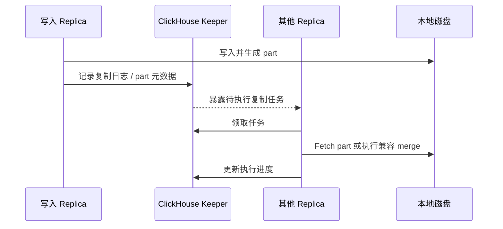

要点：

- 副本通常异步追赶，写入返回不必然代表所有副本已完成。
- 复制的是 part 和相关日志语义，不是把每一行实时逐条复制给其他节点。
- 副本可以选择本地 merge，也可以获取其他副本已经生成的兼容 part。
- Keeper 保存协调信息，不承载用户数据本体。
- 如果业务需要更强的写入确认，应评估 `insert_quorum` 等配置及其对可用性和延迟的影响。

### 6.2 复制延迟与复制队列

先看摘要：

```sql
SELECT
    database,
    table,
    replica_name,
    is_readonly,
    is_session_expired,
    queue_size,
    absolute_delay,
    lost_part_count
FROM system.replicas
WHERE database = 'demo';
```

再看具体任务：

```sql
SELECT
    database,
    table,
    replica_name,
    type,
    create_time,
    num_tries,
    last_exception,
    new_part_name
FROM system.replication_queue
WHERE database = 'demo'
ORDER BY create_time;
```

常见原因：

- 网络抖动、节点磁盘慢或磁盘空间不足。
- Keeper 不可用、会话过期或协调延迟。
- 大 merge、大 mutation 与复制任务竞争 IO/CPU。
- 某个 part 损坏、缺失或校验失败。
- 版本、表结构、磁盘策略或权限不一致。

排查时先看 `last_exception` 和任务类型，再结合节点日志、磁盘、Keeper 和 `system.merges` 判断是暂时堆积还是持续故障。不要只通过重启节点掩盖复制队列问题。

### 6.3 分片策略与 Distributed 表

分片键的目标是让数据尽量均匀，同时满足主要查询和写入路由需求：

- 不能只看 hash 均匀，还要看热点租户、热点用户和时间分布。
- 需要频繁按租户查询时，可以让租户成为路由或排序设计的一部分，但要防止超级租户热点。
- 需要跨全量数据聚合时，所有 shard 都会参与查询，分片不会自动消除全局扫描。
- 分片后扩容并不等于历史数据自动均匀迁移，通常需要重分布、双写、迁移或新旧集群切换方案。

`internal_replication` 是集群配置中的写入策略示意：

```xml
<remote_servers>
  <analytics_cluster>
    <shard>
      <internal_replication>true</internal_replication>
      <replica>
        <host>ch-1a</host>
        <port>9000</port>
      </replica>
      <replica>
        <host>ch-1b</host>
        <port>9000</port>
      </replica>
    </shard>
  </analytics_cluster>
</remote_servers>
```

`true` 的含义是由副本表负责同 shard 内复制；它不代表强同步，也不代表查询一定读到最新副本。读取哪个 replica 仍受负载均衡、健康状态和查询设置影响。

因此，`internal_replication=true` 应与 `ReplicatedMergeTree` 本地表配套使用；如果各 replica 使用的是普通 `MergeTree`，必须由其他机制负责副本写入和故障恢复。

逻辑示例：

```sql
CREATE TABLE demo.events_local
AS demo.events
ENGINE = ReplicatedMergeTree('/clickhouse/tables/{shard}/demo/events', '{replica}')
PARTITION BY toYYYYMM(event_time)
ORDER BY (tenant_id, event_name, event_time, user_id);

CREATE TABLE demo.events_all
AS demo.events_local
ENGINE = Distributed(
    'analytics_cluster',
    'demo',
    'events_local',
    cityHash64(tenant_id)
);
```

上面的 Keeper 路径和宏只是示意，实际路径必须保证不同集群、表和副本之间隔离，并与部署配置保持一致。

### 6.4 分布式写入、重复与一致性

分布式写入至少涉及四个问题：

1. 数据由哪个节点路由到哪个 shard。
2. shard 内写入哪个 replica 或由副本复制到其他 replica。
3. 客户端超时后重试是否会产生重复 block。
4. 下游读取是否允许短暂副本延迟或部分 shard 不可用。

工程建议：

- 为批次设计稳定的业务幂等键和批次 ID。
- 客户端重试要区分“服务端未执行”和“服务端已执行但响应丢失”。
- 使用 ReplicatedMergeTree 的去重相关机制时，要确认去重窗口、块边界和异步插入配置。
- 不要把 ReplacingMergeTree 当作完整的分布式事务或精确一次语义。
- 对账和回放链路应能识别重复、缺失、乱序和延迟数据。
- 如果写入链路使用异步插入，要明确 `wait_for_async_insert` 等等待语义；客户端收到响应的时间不一定等于数据已经按预期落到目标表。

### 6.5 ON CLUSTER 与分布式 DDL

`ON CLUSTER` 让 DDL 通过集群配置和 DDL 队列传播到多个节点，例如：

```sql
CREATE TABLE IF NOT EXISTS demo.events_local ON CLUSTER analytics_cluster
(
    event_time DateTime64(3),
    tenant_id UInt64,
    user_id UInt64,
    event_name LowCardinality(String)
)
ENGINE = ReplicatedMergeTree('/clickhouse/tables/{shard}/demo/events_local', '{replica}')
PARTITION BY toYYYYMM(event_time)
ORDER BY (tenant_id, event_name, event_time, user_id);
```

要点：

- DDL 传播的是元数据操作，不是把已有数据自动复制到新节点。
- 节点离线时，任务可能在 `system.distributed_ddl_queue` 中等待或失败。
- 先创建本地表，再创建 Distributed 访问层，通常更容易理解和排障。
- Schema 变更要考虑老节点、回滚、字段默认值、物化视图和下游兼容性。

### 6.6 跨 shard 查询与一致性设置

#### 跨 shard 聚合

分布式聚合通常经历“各 shard 本地预聚合 -> 发送中间状态 -> 协调节点二次合并”。普通 `sum`、`count` 等可合并聚合比较直接；`uniq`、分位数和自定义聚合也必须使用 ClickHouse 能正确合并的聚合语义。直接查询 Distributed 表时，引擎通常会自动处理状态合并；如果先落地到汇总表，则应保存状态并使用对应的 `...Merge` 函数，不能把各 shard 的独立结果简单相加。

#### 跨 shard JOIN / IN

跨 shard `JOIN`、子查询和 `IN` 可能导致远端数据传输、重复访问或查询被拒绝。需要特别关注：

- Join 两侧是否分布在相同 shard，能否本地完成。
- 是否需要 `GLOBAL JOIN`/`GLOBAL IN`，以及广播数据大小。
- `distributed_product_mode` 等设置是否改变了分布式子查询行为。
- 右表是否会在每个 shard 重建，造成内存和网络放大。

不要只在单节点验证 Join 后直接上线多 shard；至少用接近生产的数据分布和节点数量测试。

#### 读取一致性

可以把“写入可见”“副本已追平”“物化视图已处理”“merge 已完成”拆成不同 SLA。需要更强读取确认时，评估 `select_sequential_consistency`、副本选择、quorum 和客户端重试策略，但这些设置可能牺牲可用性或增加延迟。

## 7. 物化视图、实时数仓与数据链路

### 7.1 增量物化视图

增量 MV 的聚合可组合性和完整 SQL 示例见 [5.5 Projection 与 Materialized View](#55-projection-与-materialized-view)。本节从数据链路角度继续深入：一次写入具体触发什么、目标表怎样建模、回填和失败时如何保证可解释。

把它想成“挂在 INSERT 路径上的转换器”，而不是“跟源表保持同步的第二份查询结果”：

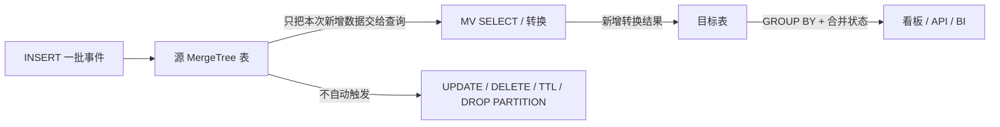

这条链路包含三个不同时间点：

1. **INSERT 处理**：正常同步 INSERT 中，MV 查询和目标表写入处于源 INSERT 的处理链路，目标表结果通常随这次写入变得可查询；MV 不会自动扫描源表旧数据。异步 INSERT、Kafka Engine、分布式写入和错误忽略设置会改变客户端何时收到确认，需按具体链路验证。
2. **查询正确性**：即便本次转换已经写入，目标 MergeTree 仍可能有多个尚未后台合并的 part。对 Summing/Aggregating 目标表，查询要显式按维度汇总；对聚合状态列要使用对应 `...Merge` 函数。
3. **副本与下游可见性**：目标副本是否追平、分布式查询选中了哪个副本、下游是否读取汇总表，是额外的一致性问题。不要把“源 INSERT 返回成功”笼统解释为所有副本和所有下游都已达到同一可见状态。

当不需要聚合、只需字段映射、过滤或路由时，目标可用普通 `MergeTree`。需要跨插入批次合并时，选择与指标相符的目标表引擎或状态列。MV 的 `SELECT` 结果列应通过显式别名与目标表列名对应；目标列类型、默认值和空值处理要在写入前验证。

#### AggregatingMergeTree 实时汇总示例

```sql
CREATE TABLE demo.events_daily_local
(
    day Date,
    tenant_id UInt64,
    source LowCardinality(String),
    pv_state AggregateFunction(sum, UInt64),
    uv_state AggregateFunction(uniqCombined64, UInt64)
)
ENGINE = AggregatingMergeTree
PARTITION BY toYYYYMM(day)
ORDER BY (tenant_id, day, source);

CREATE MATERIALIZED VIEW demo.mv_events_daily
TO demo.events_daily_local
AS
SELECT
    toDate(event_time) AS day,
    tenant_id,
    source,
    sumState(toUInt64(1)) AS pv_state,
    uniqCombined64State(user_id) AS uv_state
FROM demo.events
GROUP BY day, tenant_id, source;
```

查询汇总表时使用状态合并函数：

```sql
SELECT
    day,
    tenant_id,
    source,
    sumMerge(pv_state) AS pv,
    uniqCombined64Merge(uv_state) AS uv
FROM demo.events_daily_local
WHERE day >= '2026-09-01'
GROUP BY day, tenant_id, source;
```

必须明确四个边界：

1. 视图通常处理新增插入块，不是每次都扫描源表全量数据。
2. 创建视图前已经存在的历史数据，通常需要单独回填。
3. 增量视图的计算和目标表写入通常属于同一次源表 `INSERT` 流程；但这不构成跨任意多个目标表的通用事务保证，后台状态合并仍是异步的。
4. 如果源表写入会重试或重复，必须区分“同一个 INSERT 批次重试”和“业务上重复事件”。前者可在匹配版本/引擎/设置下通过 block deduplication 处理；后者要依赖业务幂等键、上游去重或可重算模型。

不要只验证单条 INSERT。至少用两次不同批次写入相同聚合键，再在后台 merge 之前查询目标表；这能暴露是否错误依赖“当前恰好已经合成一行”。

还要注意：

- 对源表执行 `ALTER UPDATE/DELETE`、轻量级更新/删除、TTL 或 `DROP PARTITION`，不会自动按同样语义回溯修正已经写入目标表的增量物化视图结果。
- 物化视图查询中使用 JOIN 时，通常只有左侧源表插入会触发视图；右侧维表变化不会自动重新计算历史结果。
- 多个物化视图挂在同一源表上会放大写入、CPU、内存和失败重试成本，应监控每个目标表和视图链路。
- 视图查询或目标表写入失败时，源 `INSERT` 的返回和重试语义受设置、异步插入及客户端驱动影响，应做故障演练；不能只监控源表写入成功率。
- 回填应使用独立时间范围、批次标识或临时目标表，并明确如何避免与实时视图重复处理。
- MV 的创建、删除只改变触发器，不等于创建或删除 `TO` 目标表；确认生命周期时分别检查视图 DDL 和目标表。删除并重建 MV 不会自动重建目标历史结果。
- 一个源表上的多个 MV 会让每次 INSERT 多跑多份查询。MV 数量、JOIN、GROUP BY 基数、分区数量和小批量写入都可能放大写入成本，并使目标表产生更多 parts。

#### 历史回填

先定义一个“写入切点”，再选择回填方式。最容易证明正确的流程是暂停源写入、创建 MV、按窗口将历史结果直接写入目标表、完成对账后恢复写入。不要把历史回填写回源表来触发 MV，否则容易与实时写入重叠或重复触发其他链路。

示例中回填 SQL 与实时视图使用同一组转换和状态函数：

```sql
INSERT INTO demo.events_daily_local
SELECT
    toDate(event_time) AS day,
    tenant_id,
    source,
    sumState(toUInt64(1)) AS pv_state,
    uniqCombined64State(user_id) AS uv_state
FROM demo.events
WHERE event_time >= '2026-08-01'
  AND event_time <  '2026-09-01'
GROUP BY day, tenant_id, source;
```

回填前要确认实时视图是否会同时处理同一时间范围，否则可能重复累计。

生产回填通常还需要：

- 对大表按源分区或固定时间窗口限量执行，避免一次全量聚合占满内存并压垮后台 merge。
- 记录每批回填的起止边界、批次 ID、行数和聚合校验值，失败后能够安全重跑。
- 若不能暂停写入，使用摄取序号、CDC 位点或批次号建立无重叠切点。不要仅按事件时间切分，因为切点后到达的迟到事件可能带有更早的 `event_time`。
- 可先写入独立暂存目标，核对后再按分区替换或切换读路径。注意更换目标表不会自动重放已经发生过的源 INSERT。

#### 故障排查与监控

排查“目标表少数据/重复数据”时，按数据链路分层，不要先做 `OPTIMIZE FINAL`：

1. 用 `SHOW CREATE TABLE` 确认 MV 实际监听的源表、过滤条件、目标表和列映射。
2. 确认写入经过了这个源表；直接写入另一张本地表、目标表或副本，不一定触发预期的 MV。
3. 比较源表按回填/实时边界的 `count()`、目标表按相同维度合并后的指标；不要用物理行数与源表行数直接比较，因为一行目标数据可能代表很多源行。
4. 检查目标表 `system.parts`、源/目标查询日志、复制队列及刷新状态；表名、日志列和可用系统表随版本/部署而异。
5. 对异步写入、Kafka、网络超时和客户端重试做故障注入，分别观察“数据是否已落源表”“是否进入 MV 目标”“重试是否再次计入”。

MV 相关对象和目标表都应纳入 schema migration、权限、备份、恢复、容量规划和数据校验。线上至少监控源 INSERT 延迟/失败率、各目标表的活跃 parts/磁盘/merge、复制延迟、聚合对账差异以及回填积压。

### 7.2 Refreshable Materialized View

Refreshable MV 按计划执行查询，适合多表 Join、需要读源表当前整体状态的计算，以及可接受一定陈旧度的结果。它不是普通增量 MV 的另一个名字；刷新时机和输出模式需要明确区分：

| 模式 | 每次刷新读取什么 | 目标表行为 | 常见用途 |
| --- | --- | --- | --- |
| 默认 `REPLACE` | 查询定义的完整结果集 | 原子替换为最新结果 | 当前快照、完整重算、定期去重/Join |
| `APPEND` | 查询定义的完整结果集 | 将本次完整结果追加到目标表 | 保存每次刷新快照；通常要带 `snapshot_time` 并限制保留 |
| `APPEND INCREMENTAL` | 上次刷新后新提交的数据（26.9 起） | 追加本次增量查询结果 | 对 append-only MergeTree 源表做定时增量复制/加工 |

普通 `APPEND` 是“全量查询结果追加”，不是增量计算。若每小时把全体用户的当前累计值追加一次，目标表会有每小时一份全量快照；这些快照不能再直接 `SUM` 当作总量。需要历史快照时，记录刷新时点并只读取指定快照；只需要当前结果时通常选择默认的 `REPLACE`。

示例：

```sql
CREATE TABLE demo.hourly_summary
(
    hour DateTime,
    tenant_id UInt64,
    events UInt64
)
ENGINE = MergeTree
ORDER BY (tenant_id, hour);

CREATE MATERIALIZED VIEW demo.mv_hourly_refresh
REFRESH EVERY 1 HOUR
TO demo.hourly_summary
AS
SELECT
    toStartOfHour(event_time) AS hour,
    tenant_id,
    count() AS events
FROM demo.events
GROUP BY hour, tenant_id;
```

当前官方语义中，未指定写入模式时默认为 `REPLACE`：每次刷新会用最新查询结果替换目标表；指定 `APPEND` 时则把新结果追加到目标表，适合周期快照，但目标表会持续增长。`APPEND`、首次刷新时机、失败重试和相关设置仍需按目标版本确认。需要手动触发或查看刷新状态时，可评估 `SYSTEM REFRESH VIEW` 与 `system.view_refreshes` 等版本相关能力。

26.9 新增 `APPEND INCREMENTAL`，让刷新型视图在**计划刷新时**处理 MergeTree 源表自上次成功刷新后提交的新数据。它介于“每次 INSERT 即时触发的增量 MV”和“每次刷新重扫全表的 Refreshable MV”之间：写入端没有普通 MV 那样的即时转换成本，但结果要等刷新；与普通 `APPEND` 不同，它跟踪数据块位点而不是每次追加全表结果。

下面演示按小时计算新增事件数。为让源 MergeTree 表记录可用于增量游标的 block number/offset，表设置和可用性必须在目标版本确认；官方 26.9 示例还为这些列增加了 minmax 索引：

```sql
CREATE TABLE demo.mv_event_stream
(
    event_time DateTime,
    event_id UInt64,
    tenant_id UInt64
)
ENGINE = MergeTree
ORDER BY (event_time, event_id)
SETTINGS
    enable_block_number_column = 1,
    enable_block_offset_column = 1,
    add_minmax_index_for_block_number_column = 1,
    add_minmax_index_for_block_offset_column = 1,
    part_minmax_index_columns = 'with_block_number_offset';

CREATE TABLE demo.mv_event_counts
(
    tenant_id UInt64,
    count_state AggregateFunction(sum, UInt64)
)
ENGINE = AggregatingMergeTree
ORDER BY tenant_id;

CREATE MATERIALIZED VIEW demo.mv_event_counts_hourly
REFRESH EVERY 1 HOUR APPEND INCREMENTAL
TO demo.mv_event_counts
AS
SELECT
    tenant_id,
    sumState(toUInt64(1)) AS count_state
FROM demo.mv_event_stream
GROUP BY tenant_id;
```

查看累计结果仍需合并每次刷新写入的状态：

```sql
SELECT tenant_id, sumMerge(count_state) AS events
FROM demo.mv_event_counts
GROUP BY tenant_id;
```

`APPEND INCREMENTAL` 适用于 append-only 增量，不会因为源表中已有行后来被 UPDATE/DELETE 就自动产生撤销记录；对源数据修正、去重和游标重置的支持边界要按目标版本验证。它不是 CDC 状态表的自动同步机制，也不意味着对任意 SQL 查询都能安全地改写为增量计算。首次刷新如何初始化、目标写入与游标的原子性、失败后重试和复制目标的语义，都应先在实际版本验证。示例中用 `sumState` + `AggregatingMergeTree`，避免把每小时各批 `count()` 结果误当最终唯一行。

Refreshable MV 还可通过 `DEPENDS ON` 表达刷新依赖，让下游在上游刷新后更新；依赖刷新与增量 MV 级联不同，不应混淆。监控可检查目标版本提供的 `system.view_refreshes` 等系统表，并用 `SYSTEM REFRESH VIEW` 触发一次刷新、`SYSTEM WAIT VIEW` 等待完成；命令、权限及系统表字段以实际版本为准。

适合：

- 依赖多个表或外部数据，无法简单按插入块增量计算。
- 结果规模可控，允许按周期重算。
- 需要把复杂查询结果提供给看板或服务层。
- append-only 源表按固定周期只处理新增数据时，可评估 26.9 起的 `APPEND INCREMENTAL`。

不适合：

- 每秒大规模更新且刷新成本远大于新增数据量。
- 需要严格实时一致的在线事务结果。
- 结果表没有明确的替换、分区和失败恢复策略。
- 源表频繁修改/删除、需要立即维护精确的非可逆聚合，且没有增量抵消或重算方案。

### 7.3 Kafka、CDC、Flink、Spark 与 ClickHouse

#### Kafka Engine 与物化视图

```sql
CREATE TABLE demo.kafka_events
(
    event_time DateTime64(3),
    tenant_id UInt64,
    user_id UInt64,
    event_name LowCardinality(String),
    source LowCardinality(String),
    amount Decimal(18, 2),
    tags Array(String),
    attrs Map(String, String),
    payload String
)
ENGINE = Kafka
SETTINGS
    kafka_broker_list = 'kafka-1:9092,kafka-2:9092',
    kafka_topic_list = 'events',
    kafka_group_name = 'clickhouse-events',
    kafka_format = 'JSONEachRow';

CREATE MATERIALIZED VIEW demo.mv_kafka_to_events
TO demo.events
AS
SELECT
    event_time,
    tenant_id,
    user_id,
    event_name,
    source,
    amount,
    tags,
    attrs,
    payload
FROM demo.kafka_events;
```

工程上更常见的是“Kafka Engine + 物化视图 + MergeTree 目标表”。不要把 Kafka Engine 表直接当作长期查询表：直接 `SELECT` 可能触发消费行为，消费位点、失败重试、重复和积压需要单独治理。

#### CDC

MySQL/PostgreSQL CDC 写入 ClickHouse 时，常见建模方式有：

| 数据变化 | 可能的 ClickHouse 方案 | 适用边界 |
| --- | --- | --- |
| 追加型事件 | 直接写入 `MergeTree` | 不需要修改历史行 |
| 同一主键保留最新版本 | `ReplacingMergeTree(version)` | 接受异步去重，查询需理解 `FINAL` |
| 有明确新增/撤销对 | `CollapsingMergeTree` | 需要严格设计 sign 和顺序 |
| 复杂 CDC 合并 | Flink/Spark 上游先整理 | 把状态和乱序处理放在计算引擎 |
| 低延迟点查最新状态 | 另建 KV/OLTP 服务 | ClickHouse 作为分析副本 |

CDC 链路至少要记录主键、版本或源端 LSN/位点、操作类型、事件时间和批次 ID，便于幂等、回放和对账。

#### Flink 与 Spark 的职责划分

- **Flink**：更适合持续流、事件时间、窗口、状态、乱序和实时 Join；可把整理后的数据写入 ClickHouse。
- **Spark**：更适合离线回填、批量 ETL、历史重算和大规模数据湖加工；也可用于批量写入 ClickHouse。
- **ClickHouse**：更适合承接结构化明细、预聚合和面向查询的服务层，不必承担所有上游状态计算。

### 7.4 一套实时指标链路示例

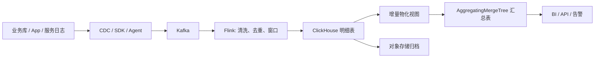

一套可维护的链路通常包含：

- 原始层：尽量保留可回放字段和来源信息。
- 明细层：统一类型、时区、租户、事件时间和幂等字段。
- 汇总层：按看板和 API 的固定粒度预聚合。
- 校验层：对 Kafka 位点、源端数量、ClickHouse 行数和核心指标做对账。
- 重放层：能够按日期、租户或批次重跑，而不是只能全量重建。

### 7.5 物化视图常见陷阱

| 陷阱 | 结果 | 处理方式 |
| --- | --- | --- |
| 把增量 MV 当全量视图 | 创建前的历史数据缺失；目标表也不会自动感知源表全部状态 | 明确其只计算新增 INSERT；建视图后单独回填 |
| 回填与实时 INSERT 没有切点 | 漏数或同一批次重复累计 | 暂停写入或用摄取序号/位点建立无重叠边界，回填后对账 |
| 在每批计算 `avg()` 后再平均 | 批次权重不同，结果不等于全量平均 | 保存 `avgState`，查询用 `avgMerge`，或保存 sum/count |
| 将每批 UV/分位数结果相加 | 同一用户或分布在多个桶的数据重复计数 | 保存可合并状态；跨桶查询重新合并状态 |
| 源表 UPDATE/DELETE、TTL 后期待目标同步 | 目标表保留已撤销的数据贡献 | 设计补偿事件，或重算受影响窗口/分区并替换 |
| 业务重复事件当作写入重试处理 | 不同批次的相同事件仍可能重复计入 | 上游按业务键幂等/去重；block dedup 只覆盖特定重试语义 |
| 视图 JOIN 外部维表 | 维表后续变更不触发历史重算 | 明确做事件时快照还是当前维度；按需重算、刷新或查询时 Join |
| 目标表依赖后台 merge 才正确 | merge 未发生时出现多行或错误平均 | 查询按聚合维度 `GROUP BY`，合并状态；不依赖 `FINAL`/`OPTIMIZE` |
| Refreshable MV 使用 `APPEND` 却当增量追加 | 每次追加的可能是完整查询快照，表持续膨胀 | 需要当前态用默认 `REPLACE`；快照用时间戳并明确查询口径 |
| 把 `APPEND INCREMENTAL` 当普通即时 MV | 结果会等计划刷新；版本或源表设置不匹配时无法按预期追踪增量 | 26.9 起才有此模式，确认 block cursor、append-only 假设和目标版本 |
| 忽略目标表排序键/分区设计 | 合并效率差、parts 或资源压力高 | 依据 `GROUP BY` 粒度、查询模板和生命周期设计目标表 |
| 盲目使用 `POPULATE` | 大表回填有资源冲击；旧版本并发创建可能有漏数据风险 | 按版本验证原子填充行为，生产优先使用可控切点和分批回填 |
| 一个源表挂过多重型 MV | INSERT 延迟、CPU/内存、part 数和维护面放大 | 按收益评估视图，合并逻辑、分层，并监控各目标表 |
| 在级联链路开启并行视图却依赖执行顺序 | 依赖链可能出现竞态或结果不确定 | 依赖关系显式化；并行处理只用于独立视图并实测 |
| 忽略分布式写入和复制边界 | 同一输入可能在错误层重复加工，或目标副本未追平 | 在本地源表、Distributed 路由、目标复制和 `internal_replication` 间画清拓扑 |
| 忽略迟到事件 | 旧日期汇总不完整或迟到窗口无法修正 | 分开保存 `event_time` 与摄取位点，预留回补范围并按批次校验 |

## 8. 下游应用与生态

### 8.1 实时看板与自助分析

ClickHouse 常作为 BI 和运营分析的数据服务层。推荐的查询链路是：

```text
看板筛选条件
    -> API / BI 生成参数化 SQL
    -> 限制时间范围、租户范围和最大返回行数
    -> ClickHouse 聚合或读取汇总表
    -> 缓存短周期重复结果
    -> 返回图表所需的窄结果集
```

看板设计要避免：

- 一个页面同时发起几十个全表扫描。
- 每个组件都对明细表做高基数 `GROUP BY`。
- 允许用户无时间范围查询 PB 级数据。
- 直接把大量明细行返回浏览器。
- 用 `SELECT *` 把 JSON、Map 和大文本列带到前端。

适合把固定粒度指标提前汇总，例如分钟、小时、天、租户、地域、产品和渠道组合；对探索性分析则保留明细表和合理的查询限制。

### 8.2 日志、指标、链路与可观测性

ClickHouse 适合统一保存结构化日志、应用指标、请求链路和审计事件：

| 数据 | 推荐字段 |
| --- | --- |
| 日志 | `event_time`、service、level、status、trace_id、message、attributes |
| 指标 | `timestamp`、metric_name、value、labels、source |
| 链路 | `trace_id`、span_id、parent_id、start_time、duration、status |
| 审计 | actor、action、resource、result、event_time、request_id |

注意事项：

- 标签字段可能产生高基数，不能无约束地把每个动态值都作为独立列或维度。
- 原始 message、stack trace 等大文本宜按查询需求决定是否长期保存、压缩或归档。
- 需要全文搜索、模糊匹配和相关性排序时，评估 ClickHouse 与专用搜索引擎的组合，而不是只看聚合性能。

### 8.3 埋点、广告、风控与 IoT

#### 埋点与用户行为

典型查询是按时间、租户、应用、渠道、事件和用户做过滤与聚合。表设计常包含：

```text
事件时间 + 租户/应用 + 事件类型 + 用户标识 + 来源 + 关键属性
```

将高频查询属性抽成显式列，把低频、变化快的属性放入 Map 或 JSON，并为高频访问路径设计排序键。

#### 广告与推荐

广告曝光、点击、转化和成本数据通常需要按 campaign、creative、渠道、地域和时间做多维聚合。要重点处理：重复上报、归因窗口、迟到事件、金额精度、数据回补和跨系统口径一致。

#### 风控

ClickHouse 适合历史行为聚合和离线/准实时特征分析，但毫秒级在线决策通常需要 Redis、特征服务或专用在线存储配合。把一条请求的全部风险判断都同步依赖大范围 ClickHouse 扫描，通常不是稳妥的服务化架构。

#### IoT 与时序

常见查询是设备、指标、时间范围和采样窗口聚合。可以评估：

- `DateTime64` 和合适的时间排序键。
- Delta、DoubleDelta、Gorilla 等 Codec。
- 按月/日分区和 TTL。
- 设备维度是否会造成高基数分区或热点。
- 原始采样数据与分钟/小时汇总是否分层保存。

### 8.4 数仓、数据湖和联邦查询

ClickHouse 可以作为数仓服务层，也可以读取对象存储、Hive、MySQL、PostgreSQL、Kafka 等外部系统。常见架构：

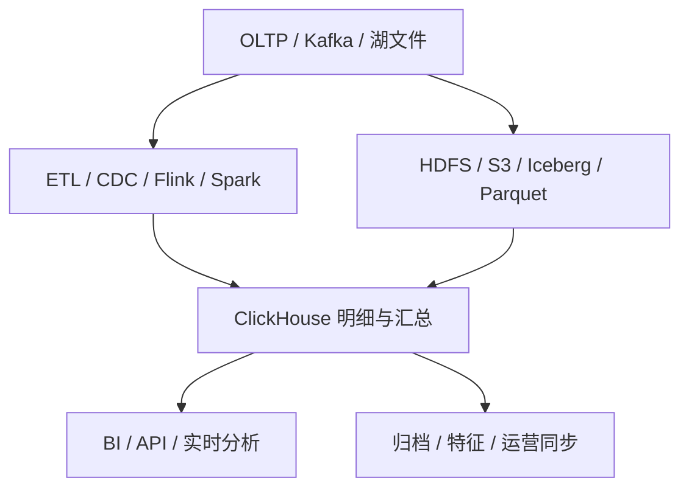

选型时区分三种用途：

- **查询服务层**：数据经过清洗和建模，目标是低延迟和稳定 SLA。
- **湖上临时分析**：直接读取 Parquet 等文件，灵活但不一定稳定或高性能。
- **混合查询**：ClickHouse 与外部系统 Join 或联邦读取，需关注网络、权限和外部系统可用性。

不要因为 ClickHouse 能读取某个外部系统，就认为它自动提供了该系统的事务、索引和一致性语义。

### 8.5 API、服务化与权限治理

ClickHouse 作为查询服务层时，建议增加一层 API 或查询网关：

- 为租户、用户和应用绑定默认过滤条件。
- 使用参数化查询，限制可选字段、时间范围、排序和返回行数。
- 为不同用户 profile 设置并发、内存、执行时间和扫描字节上限。
- 使用行策略、列权限、masking、quota 和审计日志保护敏感数据。
- 对慢查询、异常查询和高频重复查询做缓存、限流或预聚合。

权限治理要覆盖：数据库/表/列访问、对象存储、Kafka、Keeper、备份和运维接口，而不仅是 SQL 用户名密码。

### 8.6 生态组件地图

| 环节 | 常见组件 | 典型职责 |
| --- | --- | --- |
| 采集与消息 | Kafka、Redpanda、Vector、Fluent Bit | 采集日志、缓冲事件、管理消费位点 |
| CDC | Debezium、Flink CDC、云厂商 DMS | 把业务库变更转成可回放事件 |
| 流处理 | Flink、Kafka Streams | 乱序、窗口、状态、去重和实时 Join |
| 批处理 | Spark、dbt、调度系统 | 历史回填、ETL、指标重算和模型管理 |
| 查询与可视化 | Grafana、Superset、Metabase、Tableau、Power BI | 看板、自助分析和报表 |
| 数据服务 | Java/Python/Go API、查询网关 | 参数化、权限、限流、缓存和结果裁剪 |
| 湖仓协作 | S3/HDFS、Parquet、Iceberg、Hive Metastore | 低成本存储、归档、交换和跨引擎分析 |
| 监控治理 | Prometheus、OpenTelemetry、日志平台 | 指标、链路、审计、告警和容量观察 |

组件越多，数据链路越需要定义唯一事实来源、Schema 演进规则、失败重试、回放入口和对账指标。不要把“能够连通”误认为“具备端到端一致性”。

## 9. 优点、缺点与技术选型

### 9.1 ClickHouse 的核心优点

1. **列式存储**：只读需要的列，适合宽表分析。
2. **高压缩率**：同列同类型数据集中，配合 Codec 可显著降低存储和 IO。
3. **向量化和批处理执行**：以 Block/批量数据为单位处理，减少逐行解释开销。
4. **稀疏索引和数据跳过**：排序键、分区和跳数索引可以快速排除大块无关数据。
5. **MergeTree 生态成熟**：覆盖明细、复制、去重、聚合、折叠等典型分析语义。
6. **丰富的分析函数**：数组、Map、时间序列、近似去重、分位数和窗口函数较完整。
7. **水平扩展**：可以通过 shard 扩展容量和并行度，通过 replica 提供冗余和读扩展。
8. **实时与离线兼容**：既可以接入 Kafka/CDC，也可以承接批量回填和历史分析。
9. **开源和生态广**：驱动、BI、日志、云服务和数据工程工具较丰富。

### 9.2 ClickHouse 的主要缺点

1. **不以 OLTP 式高频、强事务行级更新为主要目标**：ReplacingMergeTree 和轻量级更新/删除可以覆盖部分分析型更新，但重型 mutation 会重写受影响 part，patch/merge 也不等于跨表事务和完整约束。
2. **不提供传统主键唯一约束**：排序键主要用于物理布局和索引，不会自动拒绝重复行。
3. **事务和跨表一致性有限**：不能直接替代具备完整 ACID 语义的业务数据库。
4. **性能高度依赖数据布局**：排序键不匹配时，列式扫描优势可能被大量读放大抵消。
5. **写入批次管理复杂**：小批次、高并发和高基数分区容易制造大量 parts。
6. **大 Join 和高基数聚合可能很贵**：内存、网络和临时磁盘都可能成为瓶颈。
7. **分布式扩缩容有迁移成本**：新增 shard 后历史数据不会自动均匀迁移。
8. **复制与后台任务需要运维**：Keeper、复制队列、merge、mutation 和磁盘健康都要监控。
9. **部分语义版本相关**：设置、Analyzer、云上架构和新引擎能力不能脱离版本直接照搬。

### 9.3 与常见系统的对比

| 维度 | ClickHouse | MySQL/PostgreSQL | Doris/StarRocks | Trino/Presto | Elasticsearch |
| --- | --- | --- | --- | --- | --- |
| 主要定位 | 高吞吐 OLAP 数据库 | OLTP 与通用关系数据库 | MPP OLAP 数据库 | 联邦查询引擎 | 搜索与日志检索 |
| 存储形态 | 本地/共享 MergeTree、列式 | 以行存储为主 | 列式 MPP | 通常不负责主存储 | 倒排索引为主 |
| 更新事务 | 分析型、有限事务语义 | 强事务和行级更新 | 分析型，具体能力依版本 | 依赖外部存储 | 文档级写入和更新 |
| 典型优势 | 大扫描、聚合、压缩、时序 | 点查、事务、约束 | BI、MPP、数仓查询 | 跨湖仓联邦查询 | 文本检索、相关性 |
| 主要风险 | 排序键、parts、Join、复制运维 | 大规模扫描和水平扩展成本 | 写入/索引/生态迁移成本 | 外部存储性能和网络 | 聚合成本、存储膨胀、强一致取舍 |

“谁更快”没有脱离数据模型的答案。应使用真实数据量、查询模板、并发、延迟目标、写入模式和运维团队能力做基准测试。

### 9.4 选型决策表

| 需求 | 优先评估 | ClickHouse 位置 |
| --- | --- | --- |
| 事务订单、库存、账户 | MySQL/PostgreSQL 等 OLTP | 作为分析副本或报表层 |
| TB 级日志和多维聚合 | ClickHouse、Doris/StarRocks 等 OLAP | 强候选 |
| 跨多个湖表、数据源临时查询 | Trino/Presto 等 | ClickHouse 可作为高性能服务层或结果落盘层 |
| 文本相关性检索 | Elasticsearch/OpenSearch 等 | 可配合存结构化聚合和明细分析 |
| 高实时窗口和复杂状态 | Flink 等流计算引擎 | 作为下游分析存储或结果服务 |
| 低延迟 KV 特征读取 | Redis、在线特征库 | ClickHouse 用于离线/准实时特征计算 |

## 10. 生产设计、运维与排障

### 10.1 表设计与容量规划

#### 容量估算

不要只按原始日志大小估算 ClickHouse 磁盘。至少考虑：

```text
预计存储
≈ 日写入行数
 × 保留天数
 × 实际压缩后每行字节数
 × 副本数
 × merge / mutation / 备份安全系数
```

其中“压缩后每行字节数”应从抽样数据和真实 Codec 测得，而不是直接使用 JSON 原文大小。还要单独估算：

- 临时 merge、mutation 和排序所需空间。
- 物化视图、Projection、汇总表的额外存储。
- 复制、备份、归档和重放期间的峰值空间。
- 热数据磁盘、冷数据磁盘和对象存储的不同成本。

#### 表设计检查表

| 维度 | 检查问题 |
| --- | --- |
| 数据粒度 | 一行代表事件、订单、快照还是聚合状态？ |
| 时间字段 | 事件时间、处理时间、更新时间是否分开？时区是否统一？ |
| 主键/排序键 | 最常见过滤前缀是什么？是否存在超级热点？ |
| 分区 | 删除、TTL、归档和查询时间范围是否一致？分区数量是否可控？ |
| 类型 | 是否存在不必要的 `String`、`Nullable`、`UInt64` 或 JSON？ |
| 写入 | 批次大小、并发、重试、幂等和乱序如何处理？ |
| 更新 | 是追加、版本替换、折叠还是外部计算后重写？ |
| 下游 | BI、API、导出、湖表和备份是否需要不同物理布局？ |

#### 磁盘与资源

建议为生产集群设置明确的保留空间阈值，避免磁盘接近满盘后 merge、mutation、复制和新写入同时失败。CPU、内存、磁盘吞吐、IOPS、网络带宽和 Keeper 延迟都可能成为瓶颈，不能只按总磁盘容量采购。

### 10.2 写入治理与 Too many parts

#### 典型原因

- 单行或极小批量高频写入。
- 同一分区产生大量并发插入。
- 分区键过细，单个批次被切成大量分区。
- merge 线程不足、磁盘慢或后台 mutation 持续占用资源。
- 网络重试和异步写入配置让相同数据反复落盘。

#### 排查

```sql
SELECT
    database,
    table,
    partition,
    countIf(active) AS active_parts,
    sumIf(rows, active) AS rows,
    sumIf(bytes_on_disk, active) AS bytes
FROM system.parts
WHERE database = 'demo'
GROUP BY database, table, partition
ORDER BY active_parts DESC;

SELECT *
FROM system.merges
ORDER BY elapsed DESC;
```

#### 处理原则

1. 优先在采集端、Kafka 消费端或写入服务端合并小批次。
2. 降低同一表、同一分区的无效并发，避免大量线程同时制造 parts。
3. 检查分区设计和每天真实分区数量。
4. 确认后台 merge 是否被 mutation、TTL、复制或磁盘限速挤占。
5. 评估异步插入，但把失败重试、去重和延迟纳入测试。
6. 不要把频繁 `OPTIMIZE FINAL` 当作常规修复手段；它可能制造更大的资源峰值。

### 10.3 数据生命周期、冷热分层与备份

#### TTL 与分层

生命周期设计通常包括：

```text
热层：最近数据，低延迟、高并发
温层：较早数据，允许更高延迟或更低并发
冷层：对象存储/归档，低成本、低频访问
删除层：超过合规保留期的数据彻底清理
```

使用 TTL 时要明确：

- TTL 执行是异步的，过期数据不会必然在时间点瞬间消失。
- TTL 删除可能触发 part 重写并消耗后台资源。
- 合规删除需要验证副本、备份、对象存储和下游导出是否也完成删除。
- 归档前要确认恢复路径和查询入口，而不是只把文件移动到便宜磁盘。

#### 备份与恢复

生产备份至少需要验证：

- 备份是否包含表结构、数据、字典、用户权限和必要配置。
- 备份是否跨故障域保存，是否加密和有生命周期管理。
- 是否做过定期恢复演练，恢复时间目标（RTO）和恢复点目标（RPO）是否满足要求。
- 备份期间对写入、merge、复制和对象存储带宽的影响。

备份命令、云服务快照、对象存储复制和表级导出在不同版本/部署中差异较大，应以对应版本文档和演练结果为准。

### 10.4 监控指标与告警

#### 查询层

- 查询 QPS、P50/P95/P99 延迟。
- `read_rows`、`read_bytes`、结果大小和内存峰值。
- 慢查询、异常查询、取消查询和超时数量。
- 各 shard 查询耗时、网络传输和结果合并耗时。

#### 写入层

- INSERT QPS、每批行数和每批字节数。
- 写入失败、重试、异步队列长度和消费延迟。
- 每个表/分区 active parts 数量。
- merge 任务数量、失败次数、耗时和待处理字节。

#### 复制与存储层

- `system.replicas` 中的 `queue_size`、`absolute_delay`、只读和会话状态。
- `system.replication_queue` 中的错误和重试次数。
- 磁盘使用率、IOPS、吞吐、临时空间和 inode/文件数。
- Keeper 会话、延迟、节点状态和连接数。

#### 资源层

- CPU、内存、Page Cache、网络带宽。
- 查询线程池、后台线程池、文件描述符和连接数。
- OOM、外部聚合/排序 spill、磁盘读写队列。

### 10.5 常见故障定位流程

#### 查询变慢

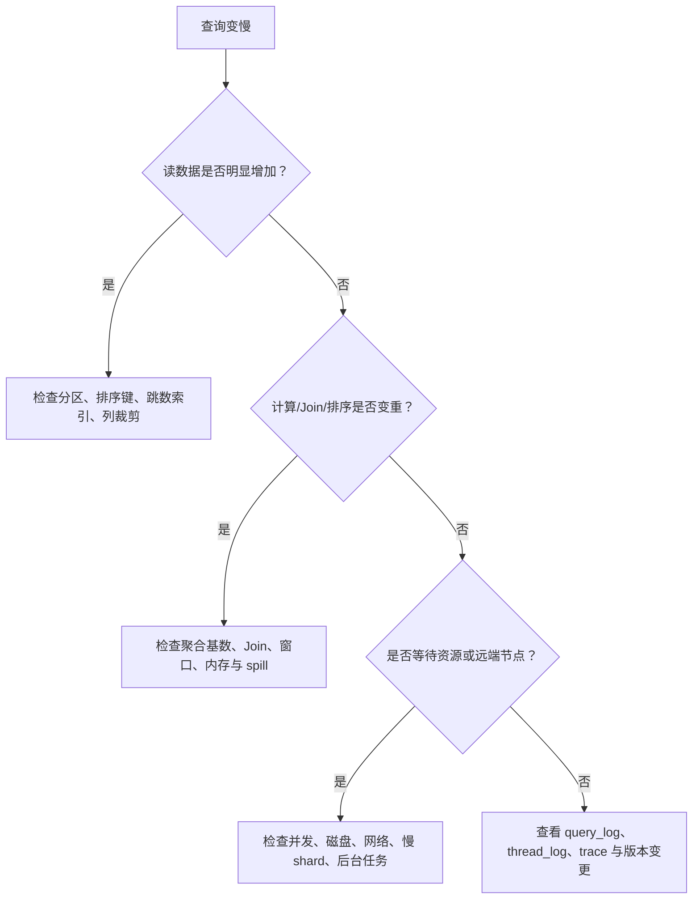

#### 写入失败

1. 看错误码和完整异常，不要只看客户端超时。
2. 判断是 Schema、类型、权限、磁盘、连接、parts 还是 Keeper 问题。
3. 检查写入批次大小、分区数量、并发和重试策略。
4. 对照 `system.parts`、`system.merges`、`system.mutations` 和复制队列。
5. 恢复后做源端与 ClickHouse 行数、批次和业务指标对账。

#### 查询结果不一致

先区分：

- 副本延迟导致读到不同状态。
- 分布式聚合未正确合并，尤其是状态函数、`DISTINCT` 和自定义聚合。
- Replacing/Collapsing 表尚未 merge，或是否使用了 `FINAL`。
- CDC 重复、乱序、缺失或回放造成数据差异。
- 时区、日期边界、NULL 和 Decimal/Float 类型造成口径差异。

### 10.6 权限、配额与安全

ClickHouse 的生产安全不止是给用户设置密码，还要同时治理身份、授权、资源和数据出口：

| 层面 | 建议 |
| --- | --- |
| 身份 | 使用独立用户、角色和外部认证；禁止应用共用管理员账号 |
| 权限 | 按库、表、列和操作最小授权；将 DDL、查询和运维权限分开 |
| 行级隔离 | 多租户场景使用行策略或查询网关注入租户条件，并防止绕过 |
| 敏感列 | 使用列级权限、脱敏/掩码和独立导出权限 |
| 资源 | 用 settings profile、quota、并发和扫描上限隔离 BI、API、批处理 |
| 网络 | 限制 HTTP/Native 端口暴露范围，启用 TLS 和网络访问控制 |
| 审计 | 保留 query_log、登录、DDL、导出和权限变更审计 |
| 密钥 | 对象存储、Kafka、备份和 Keeper 凭据使用密钥管理，不写入 SQL 脚本 |

多租户系统要特别防止三类问题：租户条件缺失造成越权读取；低权限用户通过函数、外部表或导出能力绕过治理；一个租户的大查询耗尽共享资源。安全策略上线前应使用真实角色做正向和反向验证。

## 11. 高频面试题与参考答案

### 11.1 基础与定位

#### 1. ClickHouse 为什么适合 OLAP？

答题要点：列式存储减少无关列读取；数据按批处理和向量化执行；MergeTree 通过排序键、marks 和稀疏索引跳过数据；后台 merge 保持物理布局；分片提供水平并行，副本提供冗余。

#### 2. ClickHouse 和 MySQL 的核心区别是什么？

ClickHouse 重点是海量数据分析、批量追加和聚合吞吐；MySQL 重点是事务、点查、行级更新、约束和并发写入。二者常见关系是 MySQL 做业务库，ClickHouse 做分析副本或服务层。

#### 3. ClickHouse 是不是内存数据库？

不是。数据主要持久化在磁盘或共享存储，查询按列、块和 granule 流式读取；内存用于缓存、排序、聚合、Join 和执行中间状态。内存不足时部分算子可能 spill 到临时磁盘，具体行为取决于设置和版本。

#### 4. ClickHouse 的主键是否唯一？

通常不是。MergeTree 的主键主要用于排序和稀疏索引，不像 OLTP 主键那样强制唯一。需要去重时可以使用上游幂等、ReplacingMergeTree、聚合或专门的数据校验方案。

#### 5. 什么是 MergeTree？

MergeTree 是 ClickHouse 最重要的表引擎家族。数据批量写入后生成不可变 parts，按排序键组织，后台异步 merge；查询通过分区、稀疏索引和列式读取减少扫描。

#### 6. 什么是 part？

part 是一次插入或后台 merge 生成的数据片段，包含列文件、marks、校验和元数据。查询可以读取多个 active parts；后台 merge 会把多个 part 合成更大的 part。

#### 7. 为什么会出现 Too many parts？

通常是小批量高频写入、过细分区、merge 跟不上或后台任务抢占资源。优先合并写入批次、控制并发、检查分区和 merge；不要只靠调大限制或频繁 `OPTIMIZE FINAL`。

### 11.2 存储与 MergeTree

#### 8. ORDER BY、PRIMARY KEY、PARTITION BY 的区别？

- `ORDER BY`：定义数据排序和主要物理访问路径。
- `PRIMARY KEY`：定义稀疏主键索引表达式，未单独指定时通常与 `ORDER BY` 相同。
- `PARTITION BY`：把数据划分为物理分区，主要服务于裁剪、TTL、删除和生命周期。

主键索引按 part 内 granule 边界记录排序键值，帮助排除候选数据范围，不是逐行定位结构；复合键的前导列最重要。单独指定的 `PRIMARY KEY` 必须是 `ORDER BY` 的前缀。它们都不是唯一约束或外键；MergeTree 也不提供通用 OLTP B-Tree 主键索引。

#### 9. 如何设计排序键？

先收集真实查询模板，找出高频、高选择性、稳定的过滤前缀，再结合时间范围、租户隔离、压缩和数据分布设计。用真实数据对多个候选键比较 `read_rows`、`read_bytes`、耗时、写入和 merge 成本。

#### 10. 分区应该按什么字段？

通常按时间或低基数业务周期，例如月、日；只有在租户数量确实较少且删除/隔离粒度明确时，才评估把租户纳入分区键。没有固定答案，要平衡分区数量、单分区大小、查询时间范围、TTL、删除和归档粒度；高基数字段通常不适合直接做分区键。

#### 11. ReplacingMergeTree 是如何去重的？

根据排序键识别同一逻辑键，在后台 merge 时按版本规则保留行。去重是异步的，不是插入时唯一校验；`FINAL` 可在查询时强制处理，但可能很贵。严格实时唯一需求应结合幂等写入或上游去重。

#### 12. SummingMergeTree 和 AggregatingMergeTree 怎么选？

简单可加数值、维度和排序键明确时可以考虑 SummingMergeTree；需要 `uniq`、分位数或复杂聚合状态时用 AggregatingMergeTree，并通过 `...State` 写入、`...Merge` 查询；如果更新以不同列分批到达，可进一步评估 CoalescingMergeTree。三类方案都要先验证重复、回填和部分 merge 的语义。

#### 13. Mutation 是什么？

`ALTER TABLE ... UPDATE/DELETE` 等重型 Mutation 会触发受影响 part 的异步重写。部分新版本还支持轻量级更新/删除，通过 patch 或行存在性标记降低全列重写，但仍不是传统 OLTP 的单行即时更新。生产中应按版本选择方式，控制范围并监控 `system.mutations`、parts 和查询延迟。

#### 14. 为什么不要把分区设计得很细？

分区会带来目录、元数据、part、merge 和查询调度成本。高基数或按秒分区会快速产生大量分区，写入和运维都变差。分区应该服务于裁剪和生命周期，而不是替代排序键。

### 11.3 SQL、引擎与数据一致性

#### 15. PREWHERE 和 WHERE 有什么区别？

`PREWHERE` 可以先读取过滤列，筛选出候选行后再读取其他列，常对宽表和高选择性过滤有帮助。现代 ClickHouse 可能自动重排部分条件，是否手写应通过计划和读量验证。

#### 16. ClickHouse 有二级索引吗？

没有可直接等同 OLTP B-tree 的通用行级二级索引。ClickHouse 有几类剪枝/检索路径：排序键对应的稀疏主键索引优先；轻量级 Projection 可为非主键过滤提供另一种排序索引式路径；Data Skipping Index 用块摘要跳过数据；全文检索则评估受支持版本的倒排 `text` 索引。当跳数索引的 `minmax`、`set` 或 Bloom Filter 摘要能排除大量索引块时再使用。它们不是行级精确索引，收益取决于数据分布和查询表达式，必须用基准测试验证。

#### 17. Projection 和物化视图有什么区别？

Projection 是源表内部的另一种物理布局，由优化器按查询选择；普通增量物化视图通常在源表 INSERT 时处理新数据块并写入另一张目标表；Refreshable MV 则按计划完整重算，26.9 起还支持 `APPEND INCREMENTAL` 定时处理 MergeTree 源表新增数据。Projection 偏访问路径，MV 偏数据链路，两者都增加存储或写入维护成本。

#### 18. ClickHouse 如何处理 JSON 和高基数字段？

低频、变化快的属性可放在 JSON/Map；成为高频过滤、分组或 Join 键的字段应抽成显式列。高基数会影响压缩、排序、聚合、字典和内存，不能只按字段灵活性设计。

#### 19. ClickHouse 为什么常见宽表？

列式存储让查询只读需要的列，适当反范式可以减少在线 Join，提升看板和 API 稳定性。但宽表不是无限加列；大文本、动态 JSON、更新字段和多种访问路径应通过分层、Projection 或汇总表管理。

#### 20. 如何实现实时 UV？

需要按天、租户、渠道等固定粒度实时汇总时，用增量 MV 写入 `AggregatingMergeTree` 的 `uniq...State`，查询用对应 `uniq...Merge` 并按粒度 `GROUP BY`。选择近似或精确函数取决于误差和状态成本；不能把日 UV 相加当作跨日 UV。还要处理历史回填、业务重复事件、迟到数据和源表修正。

#### 21. Kafka Engine 为什么通常配物化视图？

Kafka Engine 负责消费消息，物化视图负责把消费到的数据写入持久化 MergeTree 表。直接查询 Kafka Engine 表可能涉及消费行为和位点语义，不适合作为长期查询层；生产上还要处理重试、重复、积压和 Schema 演进。

### 11.4 性能优化

#### 22. 一条 ClickHouse SQL 很慢，怎么排查？

先查 `system.query_log` 的 `read_rows`、`read_bytes`、内存和 ProfileEvents；再用 `EXPLAIN indexes = 1` 看分区和主键是否裁剪，用 `EXPLAIN PIPELINE` 看并行、聚合、Join 和排序。然后区分是读多、算多、等资源、网络慢、慢 shard 还是后台 merge/mutation 抢资源。

#### 23. 如何优化大表 JOIN？

先过滤和聚合，缩小两侧输入；保持 Join 键类型一致；小维表评估 Dictionary 或合适的内存策略；稳定高频维度考虑反范式；多 shard 场景关注跨节点网络和数据分布。不能只通过调大内存解决数据模型问题。

#### 24. `FINAL` 为什么可能很慢？

它可能在查询时处理 Replacing/Collapsing 等引擎的合并语义，增加扫描、CPU、内存和分布式代价。应把 `FINAL` 限制在必要范围，优先通过排序键、版本设计、预聚合和上游去重减少依赖。

#### 25. 为什么 `SELECT *` 是反模式？

列式存储的优势是只读取需要的列；`SELECT *` 会读取大文本、JSON、Map 和不必要字段，增加 IO、解压、内存和网络。API 与看板应显式选择列。

#### 26. 查询只按非排序键过滤，怎么办？

先确认访问频率和延迟目标，再评估轻量级 Projection、Data Skipping Index、汇总表、维表反范式或重新建表。若是全文检索，再评估 Text Index 或搜索引擎。不要仅凭“加一个索引”假设一定有效；对比执行计划、实际读取量、写入/merge 成本和存储开销。

#### 27. ClickHouse 为什么会 OOM？

常见原因是高基数聚合、大 Join、全局排序、窗口函数、`groupArray`、`FINAL`、并发过高或分布式结果集中。先缩小输入、拆分查询和启用合适的外部聚合/排序，再调整用户 profile 和资源上限。

### 11.5 集群、复制与分片

#### 28. Shard 和 Replica 的区别？

Shard 是数据水平切分，用于扩容容量和并行度；Replica 是同一 shard 的副本，用于高可用、故障切换和读扩展。增加副本不会增加唯一数据容量，增加 shard 也不会自动提供冗余。

#### 29. Distributed 表是什么？

它通常是分布式访问和路由层，不是主要数据存储。查询会被发往各 shard 的本地表，再做远端结果合并；写入可以按分片表达式路由。实际数据和复制语义由本地 MergeTree 表承担。

#### 30. ReplicatedMergeTree 如何复制？

写入副本生成 part 并把复制日志/元数据写入 Keeper，其他副本从队列领取任务，fetch part 或执行兼容 merge，再更新进度。复制通常是异步追赶，Keeper 存协调信息而不是业务数据。

#### 31. 副本延迟怎么排查？

看 `system.replicas` 的 `queue_size`、`absolute_delay`、只读和会话状态，再看 `system.replication_queue` 的任务、重试和 `last_exception`。结合磁盘、网络、Keeper、merge、mutation 和节点日志区分暂时积压与持续故障。

#### 32. 分布式查询为什么结果会重复或不准确？

可能是重复写入、客户端超时重试、Replacing 表未完成去重、手工汇总时错误合并跨 shard 聚合结果、读取副本延迟、分片键不均匀或 CDC 乱序。直接查询 Distributed 表时，先确认查询使用的是可合并的聚合语义；如果结果已经在上游或汇总表中被错误相加，ClickHouse 无法自动恢复原始明细。先定位重复产生在哪一层，再决定幂等、聚合或路由修复方案。

#### 33. 扩容增加 shard 后，历史数据会怎样？

通常不会自动均匀迁移。需要设计数据重分布、历史回灌、双写、路由切换、校验和回滚方案。新增 shard 主要改变后续写入和查询拓扑，不能把它当作无感扩容。

### 11.6 项目场景题

#### 34. 设计一个日志分析平台

答题结构：日志采集进入 Kafka；Flink 或采集服务完成 Schema 标准化、脱敏、补充时间和 trace 字段；ClickHouse 明细表按时间分区、按服务/时间/状态等查询模式排序；物化视图生成分钟/小时汇总；Grafana/BI/API 读取汇总；原始日志归档对象存储；监控 parts、复制、积压、读量和 P99。

#### 35. 设计 MySQL 到 ClickHouse 的 CDC

先说明业务表是否要求最新快照、历史变更还是事件明细。采集 binlog/逻辑复制到 Kafka，保留主键、版本、操作类型和位点；简单最新状态可用 ReplacingMergeTree，但要说明异步去重和 `FINAL` 成本；复杂乱序和状态合并由 Flink 等上游处理；设置对账、回放和故障切换机制。

#### 36. 运营看板从 2 秒变成 20 秒，怎么处理？

先按 query_id 对比前后 `read_rows`、`read_bytes`、内存和执行计划；确认数据量、排序键、分区、索引和汇总表是否变化；再查慢 shard、后台 merge/mutation、磁盘和并发。若查询固定，把指标下沉到小时/天汇总表或物化视图；若是探索性查询，增加时间和返回量限制。

#### 37. 需要每天删除某个租户的全部数据，怎么设计？

若租户是独立低基数分区且删除粒度稳定，可以评估按分区删除；否则使用范围明确的 mutation、TTL 或重建分区方案，并考虑副本、备份、归档和合规确认。不要把高基数租户直接作为唯一分区键而忽略 parts 和分区数量。

#### 38. 如何解释 ClickHouse 的“最终一致性”？

先区分本地 INSERT 可见性、物化视图处理、后台 merge、复制追赶、分布式 DDL 和读副本选择。不同功能有不同可见时间；如果业务需要强确认，应明确等待条件、quorum、读取策略和失败处理，而不是笼统说“ClickHouse 最终一致”。

### 11.7 进阶与版本边界

#### 39. `internal_replication` 是做什么的？

它是 `Distributed` 集群配置中的写入策略。设为 `true` 时，同一 shard 的写入通常只发送到一个副本，再由 `ReplicatedMergeTree` 负责复制；设为 `false` 时，写入可能发送到每个副本。它不等于强同步，也不决定查询一定读取最新副本。

#### 40. `Distributed` 表查询时会不会把同一 shard 的所有副本数据都读一遍？

通常不会。Distributed 会按健康状态、负载均衡、优先级和查询设置选择副本；副本主要用于冗余和故障切换。只有启用特定的并行副本能力时，才可能把读取工作拆到多个副本，并且需要专门验证重复读取和一致性。

#### 41. 物化视图为什么会出现“目标表少数据”或“重复数据”？

增量物化视图通常只处理创建之后源表的新插入块，历史数据要单独回填；回填和实时写入重叠会重复。源表的 UPDATE、DELETE、TTL 和 DROP PARTITION 通常不会自动反向修正目标表；重试、重复 block、多个视图和 CDC 乱序也会放大差异。

#### 42. 轻量级 DELETE/UPDATE 与重型 Mutation 怎么选？

先确认目标版本和设置是否支持轻量级能力。小范围、高频但可接受 patch 查询代价的变更可以评估轻量方式；大范围、低频、需要物理重写或明确清理的操作才考虑重型 Mutation。两者都不等于跨表事务，也都要监控后台任务和查询成本。

#### 43. `SAMPLE` 查询的 `count()` 会自动换算成全量数量吗？

不会。`SAMPLE 0.1` 通常只读取约 10% 样本，`count()` 默认返回样本中的行数；只有在采样均匀、统计口径允许时，才可以按采样比例估算全量，并需要说明误差。

#### 44. Data Skipping Index 能否替代排序键？

不能。排序键决定数据布局和主键稀疏索引，是第一层访问路径；跳数索引只在 granule 摘要足够有效时跳过数据块，且需要额外存储、写入和维护。正确做法是先评估排序键，再用跳数索引补充特定访问条件。

#### 45. 为什么跨 shard 的 `GLOBAL JOIN` 可能很危险？

它可能把右表结果广播到多个远端节点，右表越大，网络和内存放大越明显。应优先让 Join 本地化、先过滤/聚合右表，或使用 Dictionary/宽表；必须广播时要限制数据规模并测试并发场景。

#### 46. `async_insert` 是否等于精确一次写入？

不等于。异步插入改变的是客户端提交与服务端落盘的时间关系，可以帮助合并小批次；失败重试、去重窗口、批次边界、物化视图触发和客户端等待设置仍需要单独设计。`wait_for_async_insert` 只影响等待语义，不自动提供业务幂等。

#### 47. ClickHouse 表结构变更要注意什么？

要同时检查本地表、Distributed 表、物化视图、Projection、Kafka/CDC Schema、旧节点和下游 BI/API。新增列通常比修改类型安全；删除或改类型前要做兼容读取、回滚和历史数据验证。`ON CLUSTER` 传播 DDL 也不等于完成数据迁移。

## 12. 实操实验与学习检查清单

### 12.1 最小本地实验

可以使用 Docker 运行一个与生产接近的固定版本镜像；不要在学习文档中无条件依赖 `latest`，实际使用时选择并记录已验证版本。

```bash
docker run -d \
  --name clickhouse-server \
  --ulimit nofile=262144:262144 \
  -p 8123:8123 \
  -p 9000:9000 \
  clickhouse/clickhouse-server:<verified-version>
```

创建实验表并生成数据：

```sql
CREATE DATABASE IF NOT EXISTS lab;

CREATE TABLE lab.events
(
    event_time DateTime,
    tenant_id UInt32,
    user_id UInt64,
    event_name LowCardinality(String),
    value UInt32
)
ENGINE = MergeTree
PARTITION BY toYYYYMM(event_time)
ORDER BY (tenant_id, event_name, event_time, user_id);

INSERT INTO lab.events
SELECT
    now() - INTERVAL number SECOND,
    number % 10,
    number % 100000,
    if(number % 3 = 0, 'purchase', 'view'),
    number % 100
FROM numbers(1000000);

SELECT
    toDate(event_time) AS day,
    tenant_id,
    event_name,
    count(),
    uniqCombined64(user_id),
    sum(value)
FROM lab.events
WHERE tenant_id = 1
  AND event_time >= now() - INTERVAL 1 DAY
GROUP BY day, tenant_id, event_name;
```

实验观察：

1. 查询 `system.parts`，观察分区、part、行数和磁盘大小。
2. 对排序键前缀过滤和非前缀过滤分别运行 `EXPLAIN indexes = 1`。
3. 比较 `SELECT event_name` 与 `SELECT *` 的 `read_bytes`。
4. 用多个小批次插入，再观察 parts 和 merge；与一个大批次比较。
5. 分别测试 `minmax`、`set` 或 Bloom Filter Data Skipping Index；对已有数据执行 `MATERIALIZE INDEX` 后比较读取量和索引成本。
6. 给非排序键增加 `_part_offset` Projection（目标版本支持时），检查执行计划和回表读取代价。
7. 在支持 Text Index 的版本中验证分词、查询语义和索引构建成本。
8. 建立 AggregatingMergeTree 和增量物化视图，验证历史回填与重复写入行为。
9. 把同一聚合键分两个 INSERT 批次写入，merge 前后查询目标表；验证必须 `GROUP BY` 并合并状态。
10. 对比“平均每批 avg”与 `avgState`/`avgMerge`，构造批次大小不同的数据证明结果差异。
11. 分别做源表 UPDATE/DELETE、迟到事件和重复业务事件，确认哪些变化会/不会传播到汇总表。
12. 在 MV 查询中 Join 维表后修改维表，观察历史目标行不变；再比较定期刷新或查询时 Join。
13. 比较 Refreshable 默认替换、`APPEND` 全量快照追加和 26.9 `APPEND INCREMENTAL`；查看各自刷新成本和目标表数据形态。

### 12.2 进阶实验题

| 实验 | 目标 |
| --- | --- |
| 两张表使用不同 `ORDER BY` | 理解排序键对 `read_rows` 的影响 |
| 月分区与日分区对比 | 观察分区数量、删除粒度和查询裁剪 |
| ReplacingMergeTree 重复写入 | 比较普通查询、`FINAL` 和 merge 后结果 |
| AggregatingMergeTree UV | 理解状态函数、合并函数和回填 |
| 按批次写入同一维度键 | 验证后台 merge 前目标表仍有多行，查询要合并 |
| `avg()` 与 `avgState()` | 观察批次平均值不可直接平均，理解状态可组合性 |
| MV 中的维表 JOIN | 验证右表变更不会回溯重算已写入行 |
| `APPEND` 与 `APPEND INCREMENTAL` | 比较周期全量快照追加与按提交增量追加的差异 |
| MV 回填竞态 | 用摄取位点/写入栅栏分割历史和实时数据并做对账 |
| Kafka Engine + MV | 观察消费、积压、重复和失败重试 |
| 两 shard 两 replica | 理解 Distributed、复制队列和副本延迟 |
| 大 Join 与 Dictionary | 比较网络、内存和查询延迟 |
| TTL 和磁盘策略 | 观察后台删除/迁移与资源消耗 |
| Mutation | 观察 part 重写、`system.mutations` 和查询影响 |
| 慢查询诊断 | 从 query_log 到 EXPLAIN/系统指标形成闭环 |

### 12.3 学习检查清单

#### 基础与架构

- [ ] 能解释 ClickHouse 与 OLTP、消息队列、湖存储、搜索引擎的边界。
- [ ] 能画出 Client、Server、Local Table、Distributed、Shard、Replica、Keeper 的关系。
- [ ] 能说明查询、写入、part、merge 和物化视图的生命周期。

#### 存储与 SQL

- [ ] 能区分排序键/稀疏主键索引、Data Skipping Index、轻量级 Projection、全文 Text Index 和分区裁剪。
- [ ] 能根据查询模板设计排序键，并解释前缀过滤。
- [ ] 能使用 MergeTree、ReplacingMergeTree、AggregatingMergeTree。
- [ ] 能写批量 INSERT、条件聚合、窗口、数组/Map/JSON 和基本 JOIN。
- [ ] 能解释增量 MV 只处理新 INSERT 数据块，并说明普通视图、增量 MV 与 Refreshable MV 的区别。
- [ ] 能用聚合可组合性解释 `avgState`、`uniq...State` 和相应 `...Merge` 查询。

#### 性能与生产

- [ ] 能用 `EXPLAIN indexes`、`EXPLAIN PIPELINE` 和 `system.query_log` 排查慢查询。
- [ ] 能定位 `Too many parts`、mutation 堵塞、复制延迟和磁盘不足。
- [ ] 能解释 `FINAL`、mutation、轻量级更新/删除、TTL、Projection 和物化视图的代价。
- [ ] 能设计批量写入、幂等、回放、对账、备份和恢复方案。

#### 集群与应用

- [ ] 能说明 shard 与 replica 的区别，以及扩容为何需要数据迁移。
- [ ] 能解释 `internal_replication`、跨 shard JOIN、并行副本和读取一致性设置的边界。
- [ ] 能设计 Kafka/CDC/Flink/Spark 到 ClickHouse 的实时和离线链路。
- [ ] 能说明增量/刷新型物化视图的回填、源表变更影响和失败恢复。
- [ ] 能区分 Refreshable `REPLACE`、全量 `APPEND` 快照和 26.9 起的 `APPEND INCREMENTAL`。
- [ ] 能为 BI/API 设计权限、限流、超时、缓存、资源隔离和汇总层。

### 12.4 面试前速记卡

```text
列式：少读列，压缩好，适合扫描聚合
排序键：决定物理布局和稀疏索引，优先匹配真实查询前缀
稀疏主键索引：按 granule 边界剪枝，不是逐行定位或唯一约束
分区：服务裁剪和生命周期，不是万能索引
二级路径：先评估 Projection；摘要有剪枝能力再用 skip index；全文检索看 Text Index
Part：写入生成，后台 merge；小批次会制造 Too many parts
主键：默认不是唯一约束
Replacing：异步去重，FINAL 有代价
重型 Mutation：异步重写；轻量更新/删除：patch 语义，均不是 OLTP
物化视图：通常处理新增插入块，历史要单独回填
聚合 MV：按批次保存可合并状态，不能平均各批 avg 或相加各批 UV
Refreshable：默认 REPLACE 全量刷新；APPEND 是全量快照追加；26.9 有 APPEND INCREMENTAL
Shard：分数据，扩容量和并行
Replica：复制数据，做高可用和读扩展
Distributed：路由和查询合并层
Keeper：复制和分布式协调，不存业务数据
优化：先看 read_rows/read_bytes，再看 CPU、内存、网络和后台任务
```

## 13. 官方参考资料

以下链接使用 ClickHouse 官方文档或官方博客。版本敏感内容请切换到与实际部署一致的版本文档：

1. [ClickHouse Documentation](https://clickhouse.com/docs/en/intro)
2. [ClickHouse Architecture](https://clickhouse.com/docs/en/architecture/architecture)
3. [MergeTree](https://clickhouse.com/docs/en/engines/table-engines/mergetree-family/mergetree)
4. [ReplacingMergeTree](https://clickhouse.com/docs/en/engines/table-engines/mergetree-family/replacingmergetree)
5. [ReplicatedMergeTree](https://clickhouse.com/docs/en/engines/table-engines/mergetree-family/replication)
6. [Distributed Table Engine](https://clickhouse.com/docs/en/engines/table-engines/special/distributed)
7. [ClickHouse Keeper](https://clickhouse.com/docs/en/guides/sre/keeper)
8. [Data Skipping Indexes](https://clickhouse.com/docs/en/optimize/skipping-indexes)
9. [Projections](https://clickhouse.com/docs/en/data-modeling/projections)
10. [Materialized Views](https://clickhouse.com/docs/en/sql-reference/statements/create/view#materialized-view)
11. [Refreshable Materialized Views](https://clickhouse.com/docs/en/materialized-view/refreshable-materialized-view)
12. [Kafka Table Engine](https://clickhouse.com/docs/en/engines/table-engines/integrations/kafka)
13. [Dictionaries](https://clickhouse.com/docs/en/sql-reference/dictionaries)
14. [System Tables](https://clickhouse.com/docs/en/operations/system-tables)
15. [Query Optimization](https://clickhouse.com/docs/en/optimize/query-optimization)
16. [EXPLAIN](https://clickhouse.com/docs/en/sql-reference/statements/explain)
17. [Backup and Restore](https://clickhouse.com/docs/en/operations/backup)
18. [ClickHouse Cloud SharedMergeTree](https://clickhouse.com/docs/en/cloud/reference/shared-merge-tree)
19. [CoalescingMergeTree（官方博客）](https://clickhouse.com/blog/clickhouse-25-6-coalescingmergetree)
20. [Selecting a Primary Key](https://clickhouse.com/docs/best-practices/choosing-a-primary-key)
21. [Full-text Search with Text Indexes](https://clickhouse.com/docs/reference/engines/table-engines/mergetree-family/textindexes)
22. [Projections as Secondary Indices（官方博客）](https://clickhouse.com/blog/projections-secondary-indices)
23. [Incremental Materialized Views](https://clickhouse.com/docs/concepts/features/materialized-views/incremental-materialized-view)
24. [Cascading Materialized Views](https://clickhouse.com/docs/concepts/features/materialized-views/cascading-materialized-views)
25. [ClickHouse 26.9：APPEND INCREMENTAL（官方发布说明）](https://clickhouse.com/blog/clickhouse-release-26-09)
26. [ClickHouse 26.8：原子 POPULATE（官方发布说明）](https://clickhouse.com/blog/clickhouse-release-26-08)
27. [ClickHouse 中的物化视图使用与回填（官方博客）](https://clickhouse.com/blog/using-materialized-views-in-clickhouse)
