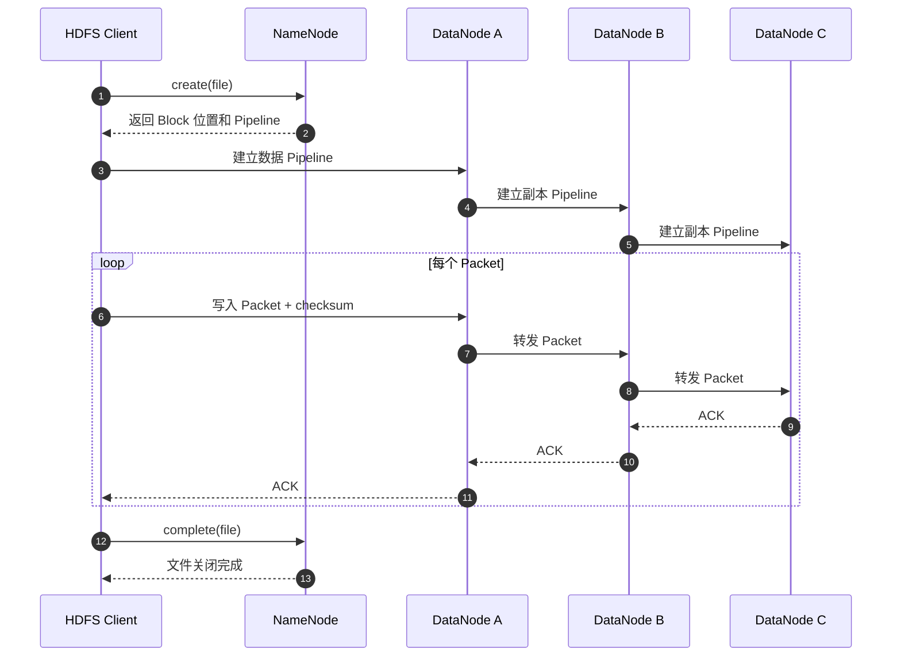
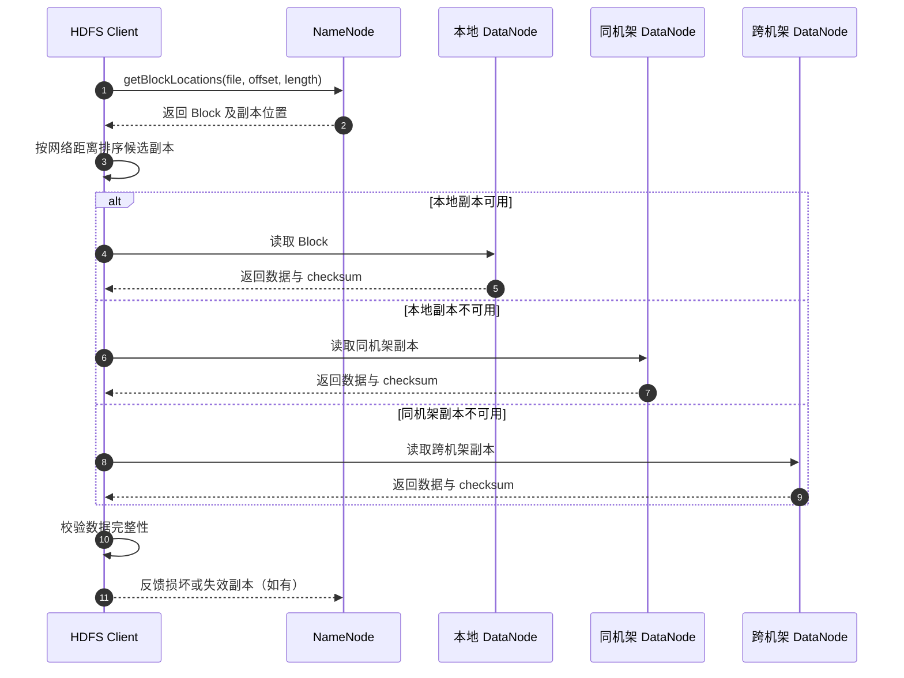
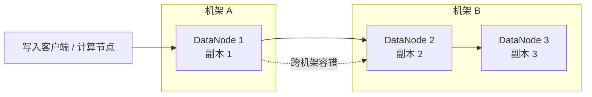
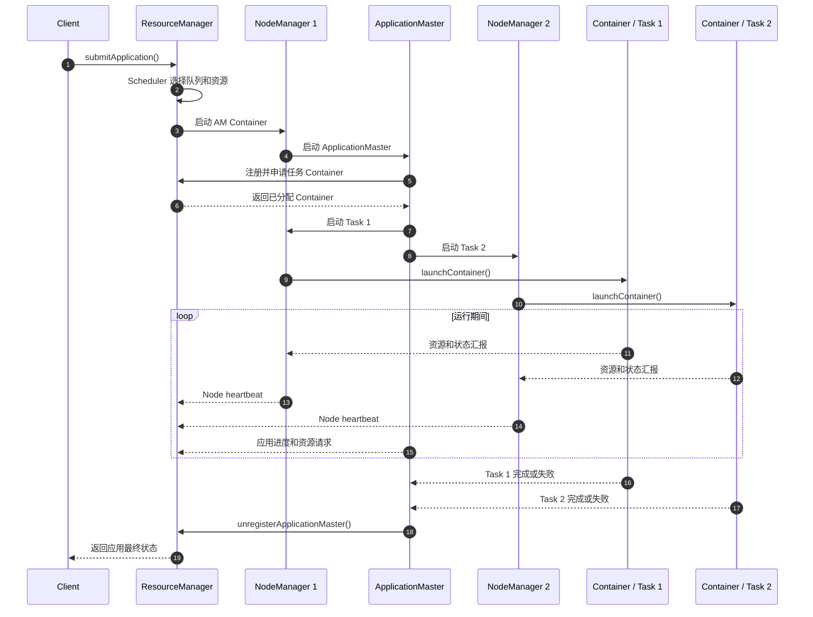
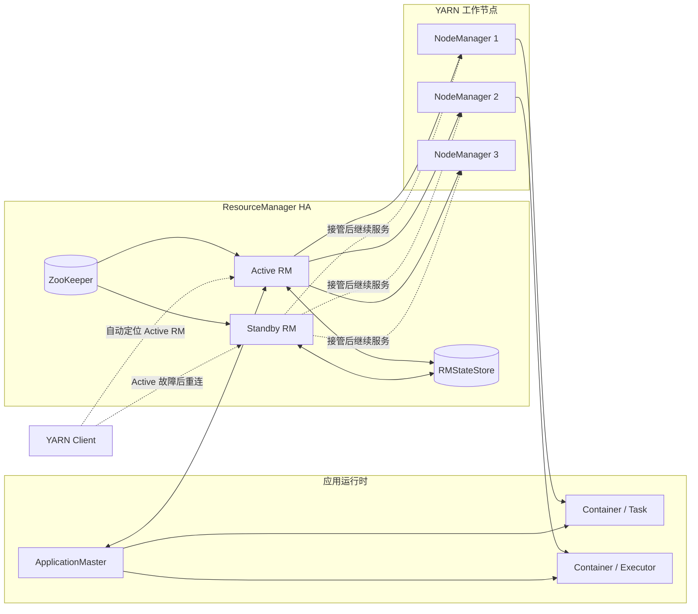
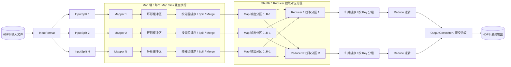
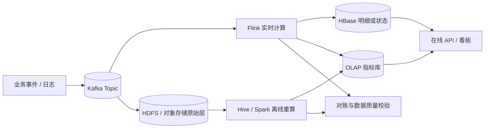
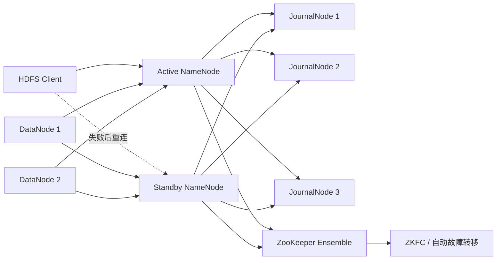

# Hadoop 学习指南

> 面向希望系统学习大数据基础、准备 Hadoop 相关面试，或需要维护传统数据平台的读者。
>
> 本文以 Hadoop 3.x 的思想和组件为主线，同时说明 Hadoop 1.x、2.x 与 3.x 的演进。命令示例默认运行在 Linux 环境，配置项以常见发行版和 Apache Hadoop 为参考；不同发行版可能存在路径、默认值和管理命令差异。

## 目录

- [1. Hadoop 是什么](#1-hadoop-是什么)
- [2. 版本演进与整体架构](#2-版本演进与整体架构)
- [3. HDFS：分布式文件系统](#3-hdfs分布式文件系统)
- [4. YARN：资源管理与调度](#4-yarn资源管理与调度)
- [5. MapReduce：批处理计算模型](#5-mapreduce批处理计算模型)
- [6. Hadoop 生态与下游应用](#6-hadoop-生态与下游应用)
- [7. 数据格式、分区与小文件问题](#7-数据格式分区与小文件问题)
- [8. 高可用、容错与安全](#8-高可用容错与安全)
- [9. 性能调优方法](#9-性能调优方法)
- [10. 常用命令与实践示例](#10-常用命令与实践示例)
- [11. 学习路线与实战项目](#11-学习路线与实战项目)
- [12. 高频面试题与参考答案](#12-高频面试题与参考答案)
- [13. 速查表](#13-速查表)
- [14. 官方资料与延伸阅读](#14-官方资料与延伸阅读)
- [15. 结语](#15-结语)

---

## 1. Hadoop 是什么

### 1.1 一句话定义

Hadoop 是 Apache 基金会开源的分布式数据处理平台，核心目标是将大规模数据分散存储在多台普通服务器上，并通过并行计算、数据本地性和故障自动恢复来处理海量数据。

它并不等于某一个单独的组件，而是一套生态。狭义的 Hadoop Core 通常指：

| 核心模块 | 作用 |
| --- | --- |
| HDFS | 分布式文件系统，负责可靠存储大文件 |
| YARN | 集群资源管理和作业调度平台 |
| MapReduce | 基于 Map、Shuffle、Reduce 的批处理计算框架 |
| Hadoop Common | 配置、RPC、序列化、文件系统抽象等公共库 |

广义的 Hadoop 生态还包括 Hive、HBase、Spark、Flink、Kafka、ZooKeeper，以及历史上常用的 Sqoop、Flume、Oozie 等组件；它们分别承担 SQL 分析、在线随机读写、流处理、消息采集、调度和协调等职责。

### 1.2 Hadoop 解决了什么问题

传统单机数据库或文件系统在数据规模增长后，常见瓶颈包括：

- 单机磁盘容量有限，无法容纳持续增长的数据。
- 单机网络、CPU、内存和磁盘 I/O 成为上限。
- 购买大型专用机器成本高，扩展不够灵活。
- 硬件故障不可避免，单机故障可能导致数据或作业不可用。
- 手动拆分数据、并行执行和汇总结果的开发成本高。

Hadoop 的基本思路是：

1. 把大文件切成多个 Block，分散到多个 DataNode。
2. 对 Block 做副本和校验，降低单机故障造成数据丢失的概率。
3. 把计算任务拆成多个并行任务，提交给集群执行。
4. 尽量让计算靠近数据，减少跨网络传输。
5. 使用软件机制处理节点故障，而不是假设硬件永不出错。

### 1.3 适合与不适合的场景

适合：

- TB、PB 级日志、埋点、历史订单、设备数据和文件归档。
- 批量 ETL、离线数仓、报表、用户画像、推荐特征加工。
- 需要水平扩展、允许一定延迟、主要进行顺序读写的任务。
- 原始数据长期保存、需要重复计算或追溯的场景。

不适合单独承担：

- 毫秒级低延迟的在线事务处理。
- 大量随机更新、随机小文件读取的业务。
- 强一致、高频点查、复杂多行事务。
- 数据量很小且单机数据库已经足够的系统。
- 需要实时交互分析但没有配套低延迟引擎的场景。

重要判断：Hadoop 更像一个分布式数据基础设施和批处理底座，不是所有“大数据”问题的统一答案。现代平台经常使用 HDFS 或对象存储作为数据湖底座，用 Spark/Flink 等计算引擎运行在 YARN、Kubernetes 或云服务上。

### 1.4 Hadoop 的总体优点与缺点

| 维度 | 优点 | 缺点或代价 |
| --- | --- | --- |
| 扩展性 | 通过增加节点扩容存储和计算能力，适合海量数据 | 节点数量增加后，网络、监控、调度和故障管理更复杂 |
| 成本 | 可以使用通用服务器，降低初始硬件成本 | 副本、运维团队、机房、备份和升级会带来长期成本 |
| 可靠性 | 副本、校验、任务重试和 HA 能处理常见硬件故障 | 副本不等于备份，误删、错误写入和机房级故障仍需额外方案 |
| 吞吐 | 大文件顺序读写和批量计算吞吐高 | 小文件、随机读写和低延迟查询表现较弱 |
| 灵活性 | YARN 可以承载 MapReduce、Spark、Flink 等多种引擎 | 组件多、依赖复杂，版本兼容和运维学习成本高 |
| 数据价值 | 适合保存原始数据，支持重复计算、回溯和离线加工 | 原始数据规模大时，治理、血缘、质量和生命周期管理压力大 |
| 生态 | Hive、HBase、Spark、Flink 等工具链丰富 | 生态组件演进快，部分历史组件已被云服务或新引擎替代 |
| 延迟 | 可以通过缓存、列式格式和交互式引擎改善查询体验 | HDFS + MapReduce 的启动和调度开销较高，不适合毫秒级服务 |

选型时应同时看数据规模、访问模式、延迟目标、可靠性等级、团队运维能力和云环境约束。不要因为数据量“大”就直接选择完整 Hadoop 集群；在云上，小团队可能更适合对象存储加托管 Spark/Flink/SQL 服务。

---

## 2. 版本演进与整体架构

### 2.1 Hadoop 版本演进

| 版本 | 关键特征 | 主要限制或变化 |
| --- | --- | --- |
| Hadoop 1.x | HDFS + 单体 JobTracker/TaskTracker + MapReduce | JobTracker 同时负责资源管理和作业调度，扩展性与可靠性有限 |
| Hadoop 2.x | 引入 YARN，资源管理与计算框架解耦；支持 NameNode HA | Spark、Tez 等非 MapReduce 引擎可以共享集群资源 |
| Hadoop 3.x | Erasure Coding、Router-based Federation、更多资源类型、改进可用性 | 生态兼容性、组件版本矩阵和运维复杂度需要重点管理 |

### 2.2 Hadoop 3.x 逻辑架构

下面的图展示数据从接入、存储到计算和服务的典型关系。箭头表示常见数据流，并不代表所有部署都必须包含这些组件。

```mermaid
flowchart TB
    classDef control fill:#e8f1ff,stroke:#3973c6,color:#102a43
    classDef storage fill:#eaf7ee,stroke:#2f855a,color:#143d2a
    classDef compute fill:#fff4df,stroke:#b7791f,color:#4a2c0a
    classDef service fill:#f5eafa,stroke:#805ad5,color:#32204f
    classDef source fill:#f4f4f5,stroke:#52525b,color:#27272a

    subgraph Access[数据接入层]
        Log[业务日志 / 埋点]:::source
        DB[业务数据库]:::source
        CDC[CDC / Binlog]:::source
        APIIn[文件 / API / SFTP]:::source
        Kafka[(Kafka 消息队列)]:::source
        Log --> Kafka
        DB --> CDC --> Kafka
    end

    subgraph Control[控制面：元数据、协调与资源管理]
        NN_A[Active NameNode]:::control
        NN_S[Standby NameNode]:::control
        JN[(JournalNode 集群)]:::control
        ZK[(ZooKeeper Ensemble)]:::control
        RM_A[Active ResourceManager]:::control
        RM_S[Standby ResourceManager]:::control
        Meta[(Hive Metastore)]:::control
        ZK --> NN_A
        ZK --> NN_S
        ZK --> RM_A
        ZK --> RM_S
        NN_A <--> JN
        NN_S <--> JN
    end

    subgraph Storage[数据面：持久化存储]
        DN1[(DataNode 1)]:::storage
        DN2[(DataNode 2)]:::storage
        DN3[(DataNode 3)]:::storage
        HDFS[(HDFS 命名空间)]:::storage
        Obj[(对象存储 / 数据湖)]:::storage
        HBase[(HBase 面向列族的宽列存储)]:::storage
        DN1 --- HDFS
        DN2 --- HDFS
        DN3 --- HDFS
    end

    subgraph Resource[执行资源面：YARN]
        NM1[NodeManager 1]:::compute
        NM2[NodeManager 2]:::compute
        NM3[NodeManager 3]:::compute
        C1[Container / Executor]:::compute
        C2[Container / Executor]:::compute
        C3[Container / Executor]:::compute
        RM_A --> NM1
        RM_A --> NM2
        RM_A --> NM3
        NM1 --> C1
        NM2 --> C2
        NM3 --> C3
    end

    subgraph Compute[计算层]
        MR[MapReduce]:::compute
        Tez[Tez]:::compute
        Spark[Spark]:::compute
        Flink[Flink]:::compute
        AM[ApplicationMaster / Driver]:::compute
        MR --> AM
        Tez --> AM
        Spark --> AM
        Flink --> AM
        RM_A --> AM
    end

    subgraph Service[查询、服务与消费层]
        Hive[Hive SQL]:::service
        Trino[Trino / Presto]:::service
        BI[BI / 报表]:::service
        ML[特征工程 / 机器学习]:::service
        Online[在线 API / 推荐服务]:::service
    end

    Kafka --> HDFS
    Kafka --> Flink
    APIIn --> HDFS
    DB --> HBase
    NN_A -. 心跳 / Block Report .-> DN1
    NN_A -. 心跳 / Block Report .-> DN2
    NN_A -. 心跳 / Block Report .-> DN3
    AM --> C1
    AM --> C2
    AM --> C3
    C1 -. 直接读写 Block .-> DN1
    C2 -. 直接读写 Block .-> DN2
    C3 -. 直接读写 Block .-> DN3
    HDFS --> MR
    HDFS --> Tez
    HDFS --> Spark
    HDFS --> Flink
    Obj --> Spark
    Obj --> Flink
    Hive -. 表定义 / 分区 / 文件位置 .-> Meta
    Spark -. 读取表元数据 .-> Meta
    Trino -. 读取表元数据 .-> Meta
    Hive -. 通过文件系统 API .-> HDFS
    Trino -. 通过文件系统 API .-> HDFS
    Hive --> BI
    Hive --> ML
    Trino --> BI
    Spark --> ML
    Flink --> Online
    HBase --> Online

    linkStyle default stroke:#64748b,stroke-width:1px
```



图中实线主要表示数据流或资源启动关系，虚线表示元数据访问、心跳或直接数据访问。Hive Metastore 与 HDFS NameNode 是两套独立的元数据系统：NameNode 管理 HDFS 文件和 Block，Hive Metastore 管理表、列、分区、Schema 与文件位置。Hive 使用 Metastore 解释表结构，再通过文件系统 API 访问 HDFS 或对象存储中的数据。

### 2.3 从提交到执行的总流程

以一个运行在 YARN 上的批处理任务为例：

1. 客户端读取配置、解析输入路径和资源需求。
2. 客户端向 ResourceManager 提交应用。
3. ResourceManager 为 ApplicationMaster 分配第一个 Container。
4. ApplicationMaster 向 ResourceManager 申请更多 Container。
5. NodeManager 在对应节点启动 Container，并负责监控其资源使用。
6. 计算任务从 HDFS 读取输入数据，优先调度到数据所在节点或同机架节点。
7. 任务执行过程中通过心跳汇报状态，失败任务由框架重试。
8. 作业完成后释放 Container，客户端取得最终状态和计数器。

### 2.4 控制流与数据流

理解 Hadoop 时要区分两类流量：

- 控制流：客户端、NameNode、ResourceManager、ApplicationMaster、NodeManager 之间的 RPC、心跳、任务状态和元数据交互。
- 数据流：客户端或计算任务与 DataNode 之间的文件读写，Map 与 Reduce 之间的 Shuffle 数据传输。

NameNode 和 ResourceManager 主要管理元数据、资源和状态，不应该成为所有业务数据的转发节点。真正的大块数据通常直接在客户端/计算进程与 DataNode 之间传输。

### 2.5 常见配置文件

Hadoop 的配置由多个 XML 文件共同组成。不同发行版可能将配置放在不同目录，但职责大体如下：

| 文件 | 关注内容 | 常见配置示例 |
| --- | --- | --- |
| `core-site.xml` | Hadoop 通用配置和默认文件系统 | `fs.defaultFS`、临时目录、RPC 相关配置 |
| `hdfs-site.xml` | HDFS NameNode、DataNode、Block 和副本 | `dfs.namenode.name.dir`、`dfs.datanode.data.dir`、`dfs.replication`、`dfs.blocksize` |
| `yarn-site.xml` | YARN ResourceManager、NodeManager 和服务 | RM 地址、节点资源、日志聚合、Shuffle 服务 |
| `mapred-site.xml` | MapReduce 在 YARN 上的执行配置 | `mapreduce.framework.name`、任务资源和输出提交配置 |
| `capacity-scheduler.xml` | Capacity Scheduler 队列和资源策略 | 队列容量、最大容量、用户限制和抢占 |
| `workers` | Shell 脚本启动哪些工作节点 | DataNode、NodeManager 等工作节点主机名 |

配置要同时满足“客户端能找到集群”和“各个守护进程使用一致配置”。修改配置后应分批验证，并通过 Web UI、日志和实际读写确认生效；不能只根据 XML 文件中存在某个键就判断配置已经生效。

---

## 3. HDFS：分布式文件系统

### 3.1 HDFS 的设计目标

HDFS 主要针对大文件、顺序访问、吞吐优先和廉价硬件环境设计。它的典型特点是：

- 文件按 Block 切分并分布式保存。
- Block 默认有多个副本，副本数量由 replication factor 决定。
- NameNode 管理命名空间和 Block 映射，DataNode 存储实际 Block。
- 客户端先向 NameNode 获取元数据，再直接访问 DataNode。
- 通过心跳、Block Report、校验和、副本恢复处理故障。
- 对追加写和一次写、多次读支持较好，对原地随机修改支持较弱。

### 3.2 HDFS 核心组件

#### NameNode

NameNode 是 HDFS 的主控节点，主要维护：

- 文件和目录的命名空间。
- 文件到 Block 的映射。
- Block 到 DataNode 的位置信息。
- 文件权限、所有者、时间戳、配额等元数据。
- 副本数量、故障恢复和安全模式状态。

NameNode 通常不保存用户文件的实际内容。用户数据在 DataNode 上，NameNode 保存的是“文件系统目录树和 Block 位置”等元数据。

NameNode 元数据主要由两部分组成：

- FsImage：某个时间点的命名空间快照。
- EditLog：FsImage 之后发生的文件系统变更日志。

启动或检查点流程会将 EditLog 合并到 FsImage，生成新的快照，避免日志无限增长。

需要区分持久化元数据和运行时状态：Block 到 DataNode 的当前位置主要由 DataNode 的心跳和 Block Report 汇报，NameNode 会在内存中维护这类动态状态。它不能简单等同于“所有 Block 位置都持久化在 FsImage 中”。

#### DataNode

DataNode 负责：

- 在本地磁盘保存和删除 Block。
- 按客户端请求读写 Block。
- 定期向 NameNode 发送心跳。
- 定期发送 Block Report，汇报本节点拥有哪些 Block。
- 校验数据完整性并参与副本复制、删除和恢复。

DataNode 丢失心跳后，NameNode 会将其标记为失效，并根据剩余副本情况触发重新复制。失效判定不是瞬时完成的，涉及超时配置和网络状态。

#### SecondaryNameNode

SecondaryNameNode 不是 NameNode 的实时备份，也不能在 NameNode 故障后直接替换它。它的主要职责是定期执行 Checkpoint：拉取 FsImage 和 EditLog，合并后生成新的 FsImage，再交给 NameNode。

在生产环境中，NameNode HA 通常使用 Active/Standby NameNode、JournalNode 和 ZooKeeper Failover Controller，而不是把 SecondaryNameNode 当成热备节点。

#### Checkpoint Node 与 Backup Node

Checkpoint Node 可以定期执行检查点，但不承担 NameNode 的热备职责。Backup Node 能维护较新的命名空间状态，但实际部署中应优先采用官方 HA 方案，并根据具体 Hadoop 版本核对支持情况。

### 3.3 Block、Packet 与副本

#### Block

HDFS 将文件切成多个 Block。Hadoop 3.x 常见默认 Block 大小为 128 MB，但实际值由 `dfs.blocksize` 决定，可以按工作负载调整。

Block 大小不是“每个文件都固定占用 128 MB”：

- 文件小于 Block 大小时只占实际数据空间，但仍会产生 NameNode 元数据。
- 文件大于 Block 大小时会拆成多个 Block。
- 文件大小不是 Block 大小整数倍时，最后一个 Block 通常小于标准大小。

大 Block 可以减少元数据数量和寻址次数，也更适合大文件顺序读；过大则可能降低并行度，具体要结合文件大小、任务数、网络和计算引擎判断。

#### 副本放置

默认复制因子常见为 3，但应以集群配置为准。HDFS 通常结合机架感知放置副本，使副本分散到不同机架，降低交换机或机架故障的影响。

复制因子的含义是可靠性和空间成本之间的平衡：

- 副本越多，容错能力和读取机会通常越好。
- 副本越多，磁盘占用、网络复制和写入成本越高。
- 副本数量不是备份策略的完整替代，误删、逻辑错误和勒索会同步作用于副本。

#### 写入路径

典型 HDFS 写入流程如下：

1. 客户端向 NameNode 请求创建文件。
2. NameNode 检查权限、文件是否存在，并返回第一个 Block 的 DataNode 列表。
3. 客户端选择一个 DataNode 作为 Pipeline 的第一个节点。
4. 数据以 Packet 形式写入第一个 DataNode，再由它转发到后续副本节点。
5. 副本节点完成校验后沿 Pipeline 返回确认信息。
6. 客户端继续申请下一个 Block，直到文件写完并关闭。

可用 Mermaid 表示一次典型的 HDFS 写入：



#### 读取路径

1. 客户端向 NameNode 请求文件的 Block 列表和位置。
2. NameNode 返回每个 Block 的候选 DataNode。
3. 客户端优先选择距离最近的副本，通常依次考虑本地节点、同机架节点、跨机架节点。
4. 客户端直接从 DataNode 读取数据。
5. 如果某个副本校验失败或节点不可用，客户端尝试其他副本，并将坏副本信息反馈给 NameNode。



读取时 NameNode 返回的是候选位置，实际数据通常由客户端直接从 DataNode 获取。副本选择会考虑网络距离、节点状态和读取策略；当校验失败时，客户端可以切换副本，但业务仍应通过监控和 `fsck` 关注损坏副本。

### 3.4 数据本地性

Hadoop 的数据本地性包含三个常见层级：

1. Node Local：任务运行在保存目标 Block 的节点上。
2. Rack Local：任务运行在同机架但不同节点上。
3. Off Rack：需要跨机架读取。

数据本地性不是强制保证。如果本地节点资源不足、任务等待超过调度器阈值，系统可能牺牲本地性来尽快启动任务。数据本地性可以减少网络传输，但不能简单理解为“任务一定在数据所在机器执行”。

### 3.5 副本放置的典型策略

在默认机架感知策略下，复制因子为 3 时可以粗略理解为：



典型策略会将第一个副本放在写入者本地或附近节点，将第二个副本放到不同机架，再将第三个副本放在第二个副本所在机架的另一个节点。实际选择还受机架拓扑、节点负载、可用磁盘和具体 Hadoop 版本影响，图示用于帮助理解，不能当作每次写入的固定位置。

### 3.6 一致性与并发写

HDFS 的常见文件写入语义包括：

- 一个文件一般由一个写入者创建和写入。
- 文件关闭表示写入完成；在文件关闭前，其他客户端通常只能依赖已经 Flush 的数据读取已完成前缀。
- 支持追加写，但不是通用的原地随机修改文件系统。
- 适合写入大文件、批量追加和读取，不适合高频小块更新。

`hflush()` 通常用于让已经写入的数据对新的读取者可见，但不应简单等同于所有副本都已持久化；`hsync()` 提供更强的持久化语义。不同版本和配置下行为可能存在差异，涉及关键数据时应结合具体版本文档和客户端 API 验证。

### 3.7 安全模式 Safemode

NameNode 启动后会进入 SafeMode。在 SafeMode 中，系统会等待一定比例的 Block 汇报到位，期间通常不允许普通的写操作。等到满足阈值或管理员手动退出后，集群恢复正常。

常用排查命令：

```bash
hdfs dfsadmin -safemode get
hdfs dfsadmin -safemode leave
hdfs fsck / -files -blocks -locations
```

不要把强制退出 SafeMode 当成万能修复手段。应先确认 DataNode 是否正常、磁盘是否损坏、是否存在大量缺失副本，以及 NameNode 是否仍在加载元数据。

### 3.8 HDFS 的优点与限制

优点：

- 水平扩展方便，容量和吞吐可以随节点增长。
- 多副本和自动恢复提高了对硬件故障的容忍度。
- 顺序读写吞吐高，适合海量文件和批处理。
- 数据本地性减少了大规模计算中的网络压力。
- 与 Hive、Spark、Flink、HBase 等生态集成成熟。

限制：

- NameNode 元数据占用内存，小文件过多会造成压力。
- 对低延迟随机读写、原地更新和小文件场景不友好。
- 副本机制带来明显的存储和网络开销。
- 组件多、版本矩阵复杂，运维和升级成本高。
- HDFS 副本主要解决硬件故障，不等于异地备份、版本管理或灾备。
- Hadoop 生态历史包袱较多，部分组件在云原生环境中已被其他方案替代。

### 3.9 HDFS 运维能力

#### 快照、配额与回收站

- HDFS Snapshot 是某个目录在特定时间点的只读视图，通常采用 Copy-on-Write 思路，适合误删恢复和数据审计。
- Snapshot 不是独立的异地备份。底层 Block 仍可能共享，快照保留过多会增加存储和元数据压力。
- 目录配额可以限制命名空间数量和空间用量，适合按团队或业务隔离资源。
- Trash 可以延迟物理删除，降低误删风险，但会占用空间，也不能替代备份。

#### 均衡与健康检查

```bash
# 在 DataNode 之间均衡 Block 分布
hdfs balancer -threshold 10

# 检查文件、Block、副本和位置
hdfs fsck /data -files -blocks -locations

# 查看 HDFS 管理命令
hdfs dfsadmin -help
```

`hdfs balancer` 主要解决 DataNode 之间的容量或 Block 分布不均；单个 DataNode 内部多个磁盘卷之间的均衡属于另一类问题，应使用对应版本支持的 DiskBalancer 能力。均衡会消耗网络和磁盘资源，不应在业务高峰无计划执行。

---

## 4. YARN：资源管理与调度

### 4.1 YARN 要解决的问题

Hadoop 1.x 的 JobTracker 同时负责集群资源管理、作业调度和任务监控，单点压力较大。YARN 将资源管理和计算逻辑解耦，让 MapReduce 之外的引擎也能运行在同一个集群上。

YARN 管理的是 CPU、内存和可扩展资源（例如 GPU、FPGA 或自定义资源），不限定上层只能使用 MapReduce。

### 4.2 YARN 核心组件

#### ResourceManager（RM）

ResourceManager 是全局资源管理者，主要包含两个逻辑职责：

- ApplicationsManager：接收应用提交、启动和管理 ApplicationMaster。
- Scheduler：根据队列、容量、优先级和资源需求分配 Container。Scheduler 通常不负责监控任务执行，也不保证应用内部的任务重试。

#### NodeManager（NM）

NodeManager 运行在每个工作节点上，负责：

- 向 ResourceManager 汇报节点状态和资源使用。
- 启动、监控和终止 Container。
- 管理本地日志、缓存和磁盘目录。
- 监控 Container 的 CPU、内存等资源使用。

#### ApplicationMaster（AM）

每个 YARN 应用通常有一个 ApplicationMaster。AM 是“应用级”的协调者，负责：

- 与 ResourceManager 申请 Container。
- 与 NodeManager 协商启动任务。
- 管理应用内部任务的生命周期。
- 根据计算框架逻辑处理失败、重试和结果汇总。

MapReduce、Spark on YARN、Flink on YARN 的 ApplicationMaster 行为并不完全相同。

#### Container

Container 是 YARN 分配的资源封装，通常包含内存、虚拟 CPU（vCore）以及可选的 GPU 等资源。Container 不是虚拟机，也不等同于 Docker 容器；它是 YARN 资源调度和进程启动的基本单位。

### 4.3 YARN 应用生命周期



### 4.4 调度器

#### Capacity Scheduler

Capacity Scheduler 通过队列划分容量，适合多租户共享集群。常见能力包括：队列容量、最大容量、用户/组 ACL、用户资源限制、优先级和抢占。

#### Fair Scheduler

Fair Scheduler 试图在一段时间内让不同应用获得相对公平的资源份额，适合希望减少长作业长期独占资源的环境。Capacity Scheduler 是多租户生产环境中更常见的选择；Fair Scheduler 的支持状态、默认调度器和配置项会随 Apache Hadoop 版本及发行版变化，使用前必须查阅对应版本文档。

#### FIFO Scheduler

FIFO 按提交顺序运行，配置简单，但缺少多租户隔离和资源公平能力，生产环境通常不作为首选。

### 4.5 资源不足时的排查思路

当应用长时间处于 `ACCEPTED` 状态，常见原因有：

- 队列没有足够的可用资源。
- 应用请求的单个 Container 大于队列或节点允许的最大值。
- 用户或队列达到并发、内存、CPU 上限。
- NodeManager 宕机、心跳异常或可用节点不足。
- 节点标签、资源类型、优先级或队列 ACL 不匹配。
- 容器内存配置与物理节点可分配资源不一致。

建议查看 RM UI、应用诊断信息、队列配置和 NodeManager 日志，不要只反复提交任务。

### 4.6 ResourceManager 高可用

ResourceManager 也可以配置 Active/Standby HA，避免单个 RM 故障导致新的应用无法提交或集群资源管理中断。典型机制包括：

- 两个或多个 ResourceManager，其中一个 Active，其他处于 Standby。
- ZooKeeper 协调选主和故障转移，防止多个 RM 同时对外提供 Active 服务。
- 客户端、NodeManager 和 ApplicationMaster 按 HA 配置重新定位 Active RM。
- StateStore 持久化应用、Token、预约等可恢复状态；是否能够恢复正在运行的应用，取决于 RM Recovery 和计算框架配置。

RM HA 与 NameNode HA 是两套独立机制。前者保护 YARN 资源管理，后者保护 HDFS 命名空间；部署其中一套不会自动让另一套获得高可用。



ResourceManager HA 主要保证资源管理和应用提交入口可切换；它不负责复制 HDFS 文件，也不等于每个计算引擎都能无损恢复。应用是否从断点继续，取决于 RM Recovery、ApplicationMaster 和具体计算框架的恢复能力。

---

## 5. MapReduce：批处理计算模型

### 5.1 MapReduce 的核心思想

MapReduce 将大规模数据处理拆成多个阶段：

- Map：读取输入记录，转换为中间键值对。
- Shuffle：对中间键值对进行分区、排序、拉取和归并。
- Reduce：按键处理一组值，生成最终结果。

抽象形式：


### 5.2 MapReduce 执行阶段

1. InputFormat 决定如何切分输入数据并创建 RecordReader。
2. InputSplit 描述一个逻辑输入分片，通常对应一个 Map Task 的输入范围。
3. Mapper 读取记录并输出中间键值对。
4. Partition 分配每条中间数据属于哪个 Reducer。
5. Map 端对每个分区进行排序、溢写和归并。
6. Reducer 通过 Shuffle 拉取各个 Map Task 对应分区的数据。
7. Reduce 端合并、排序并按 Key 分组。
8. Reducer 执行业务逻辑并通过 OutputFormat 写出结果。

### 5.3 InputSplit 与 Block 的区别

这是面试高频点：


| 对比项 | HDFS Block | InputSplit |
| --- | --- | --- |
| 所属层次 | 存储层 | 计算输入层 |
| 是否真实存储单位 | 是 | 否，是逻辑切分描述 |
| 作用 | 文件在 HDFS 上如何分布 | 一个 Map Task 处理哪些数据 |
| 大小来源 | `dfs.blocksize` | InputFormat、文件切分策略和配置 |
| 是否必须相等 | 否 | 通常接近 Block，但不一定相同 |

InputSplit 可以跨 Block，也可能因为不可切分压缩格式、文件格式或配置而与 Block 不一致。Map Task 的数量通常取决于 InputSplit 数量，而不是简单等于 HDFS Block 数量。

### 5.4 Shuffle 详解

Shuffle 是 MapReduce 性能和稳定性的关键阶段，主要包含：

1. Map 输出写入环形缓冲区。
2. 达到阈值后按分区、排序并溢写到本地磁盘。
3. 多个溢写文件通过 Merge 合并。
4. Reduce 从各个 Map 节点拉取属于自己的分区。
5. Reduce 端进行归并排序和按 Key 分组。

Shuffle 的成本通常来自三方面：磁盘 I/O、网络传输、排序/序列化 CPU。调优时要先判断瓶颈属于哪一类。

#### MapReduce Shuffle 拓扑



图中 Map 输出通常位于 Map 执行节点的本地磁盘，Reducer 通过网络拉取对应分区；最终结果才通常由 OutputCommitter 协调写入持久化存储。实际任务数、分区数量和是否存在 Combiner 由作业配置与执行计划决定。

### 5.5 Partitioner

Partitioner 决定 Key 被发送到哪个 Reducer。Java MapReduce 中默认 `HashPartitioner` 的核心逻辑可以简化为：

```text
partition = (key.hashCode() & Integer.MAX_VALUE) % numReduceTasks
```

自定义 Partitioner 可以实现：

- 按业务维度路由到不同 Reducer。
- 对热点 Key 做更合理的分散。
- 保证相同业务分组进入指定分区。

需要注意：单纯让一个热点 Key 分到同一个 Reducer，并不能解决热点问题。热点 Key 往往需要加盐、二次聚合或特殊拆分策略。

### 5.6 Combiner

Combiner 是运行在 Map 端的局部聚合器，用来减少需要写入磁盘、传输到 Reduce 端的中间数据量。它不是必然执行，也可能执行零次、一次或多次，因此必须满足结合律和交换律，结果不能依赖执行次数。

适合：求和、计数、求最大值等局部可聚合操作。

不适合直接使用：平均值。平均值需要传输 `sum` 和 `count`，Reduce 端再计算 `sum / count`；直接对局部平均值再求平均会在数据量不均衡时得到错误结果。

### 5.7 Map Task 与 Reduce Task 数量

Map Task 数量通常由 InputSplit 决定，Reduce Task 数量由作业配置和数据规模决定。Reducer 太少会造成单个 Reducer 数据过大，Reducer 太多会增加调度、连接、文件和小结果开销。

Reduce 数量没有通用固定公式，但可以从以下维度估计：

- Shuffle 数据总量。
- 单个 Reducer 可承受的内存、磁盘和处理时间。
- 集群并发度和队列资源。
- 输出文件数量是否需要控制。
- 是否存在数据倾斜。

### 5.8 数据倾斜

数据倾斜指不同分区或任务接收的数据量严重不均衡，表现为大部分任务完成后少数任务长时间运行。

常见原因：

- 某些 Key 出现频率极高。
- Join 的一侧存在空值或默认值，导致大量记录聚到同一个 Key。
- 分区函数不合理。
- 数据源本身分布不均匀。

常见处理方式：

- 对热点 Key 加随机盐，将一个 Key 拆到多个分区，之后再做二次聚合。
- 对小表做 Map 端广播或 Map-side Join。
- 对空值单独处理，避免所有空值进入同一分区。
- 使用采样统计 Key 分布，再重新设计分区策略。
- 提高并行度，但只有在分区逻辑能分散热点时才有效。

### 5.9 容错机制

MapReduce/YARN 常见容错手段包括：

- 任务失败自动重试。
- 节点失联后在其他节点重新运行任务。
- 推测执行：当少数任务明显慢于同批任务时启动备份执行，由 OutputCommitter/框架提交协议选择一个成功的任务尝试提交结果。
- Map Task 读取输入数据时依靠 HDFS 副本从其他 DataNode 读取；Map 输出通常保存在执行节点本地磁盘，Map Task 失败后一般由框架重新计算。
- Reducer 通过 Shuffle 拉取 Map 输出；Map 输出并不等同于 HDFS 中带副本的最终文件。

推测执行并非总是有益。如果任务本身正在访问外部系统、存在副作用、会产生重复写入或节点慢的原因是共享资源瓶颈，推测执行可能放大问题。需要按任务类型谨慎启用。

### 5.10 MapReduce 常见高级机制

- `OutputCommitter`：协调任务临时输出与最终输出的提交，避免失败尝试直接污染最终结果。不同文件系统和提交协议的原子性边界不同，不能把它等同于数据库事务。
- Counter：记录输入记录数、输出记录数、坏记录数、跳过记录数等统计信息，适合监控和质量校验，但不应保存大规模业务数据。
- DistributedCache：将小型只读依赖文件、字典或配置分发到任务节点；大文件不适合通过它分发。
- Secondary Sort：通过复合 Key、分区器和分组比较器，让 Reduce 端在同一业务 Key 内按第二字段有序处理。
- Map-side Join：将小表或字典放入任务节点，减少大表 Shuffle；小表过大时会造成任务内存压力。
- Job 与 Task：Job 是一次完整作业，Task 是其中处理一个 InputSplit 或一个 Reduce 分区的执行单元；失败重试的是 Task Attempt，而不是简单重新提交整个 Job。

---

## 6. Hadoop 生态与下游应用

### 6.1 常见生态地图

| 类别 | 组件 | 主要用途 |
| --- | --- | --- |
| 存储 | HDFS | 分布式文件存储、数据湖底座 |
| 对象存储 | S3、OSS、COS、OBS 等 | 云上持久化存储，常与计算引擎分离 |
| SQL 数仓 | Hive | 表结构、元数据管理和离线 SQL |
| SQL 查询 | Trino、Presto、Impala | 交互式查询和联邦查询 |
| 批处理 | MapReduce、Spark、Tez | 离线 ETL、聚合、特征加工 |
| 流处理 | Flink、Spark Structured Streaming | 实时计算、状态处理、窗口计算 |
| 消息与采集 | Kafka、Flume（传统）、Logstash、NiFi | 日志采集、消息缓冲、数据管道 |
| NoSQL | HBase | 海量稀疏表、按 RowKey 随机读写 |
| 工作流 | Airflow、Azkaban、Oozie（传统） | 定时任务、DAG 编排、重试和依赖管理 |
| 协调服务 | ZooKeeper | 选主、配置、服务发现和分布式协调 |
| 传输 | DistCp、Sqoop（Apache 项目已退役） | 集群或存储间复制；Sqoop 属于历史上的关系库导入导出工具 |
| 权限治理 | Ranger、Sentry（历史/发行版依赖） | 集中授权、审计和策略管理 |
| 机器学习 | Spark MLlib、外部训练平台 | 特征工程、训练和批量推理 |

### 6.2 Hive

Hive 为 HDFS、对象存储或其他 Hadoop-compatible 文件系统上的数据提供表、列、分区、类型和 SQL 抽象。它通常包含：

- Driver：解析 SQL、生成执行计划、管理会话。
- Compiler：语法解析、语义分析、优化和物理计划生成。
- Metastore：保存表、列、分区、文件位置、统计信息等元数据。
- Execution Engine：将计划交给具体执行引擎。常见是 Tez 或 MapReduce；部分历史版本和发行版支持 Hive on Spark，现代平台也经常由 Spark、Trino 等引擎直接读取 Hive Metastore。

Hive 表数据通常不由 Hive 自己存放，而是存放在 HDFS 或对象存储中。删除 Hive 表时，内部表可能同时删除数据；外部表一般只删除元数据，具体行为取决于表类型和命令，生产操作前必须确认。

重要概念：

- Internal/Managed Table：表数据由 Hive 管理。
- External Table：表只管理元数据，数据生命周期通常由外部系统负责。
- Partition：按日期、地区等字段将数据目录化，减少扫描范围。
- Bucket：按哈希将数据划分为固定桶，帮助某些 Join、采样和数据组织场景。
- SerDe：负责记录与存储格式之间的序列化/反序列化。
- Statistics：帮助优化器估算数据量、选择 Join 策略和执行计划。

#### Hive 中容易混淆的执行细节

- 动态分区可以根据查询结果自动生成分区，但需要控制分区数量和动态分区相关配置，避免一次作业创建过多分区。
- `INSERT OVERWRITE` 通常会覆盖目标表或目标分区，适合幂等重算，但执行前应确认覆盖范围。
- Hive ACID 表需要匹配的事务配置、写入方式和 Compaction；普通外部表的文件覆盖不能自动获得完整事务语义。
- `ORDER BY` 通常要求全局排序，可能形成单个或少量全局汇聚阶段；只需要分区内排序时，应评估 `SORT BY`、`DISTRIBUTE BY` 或 `CLUSTER BY`。
- CBO、列裁剪、谓词下推、向量化和统计信息能改变执行计划，但是否生效取决于 Hive 版本、表格式、配置和执行引擎。

### 6.3 HBase

HBase 是运行在 HDFS 之上的分布式、面向列族的宽列 NoSQL 数据库，适合：

- 按 RowKey 高效随机读写。
- 海量稀疏数据。
- 需要水平扩展和较高吞吐的在线或准在线服务。

核心组件：

- HMaster：表管理、Region 分配、负载均衡等。
- RegionServer：负责读写 Region。
- Region：表按 RowKey 范围切分后的水平分片。
- WAL：先写日志，再写 MemStore，保证故障恢复。
- MemStore：内存中的写缓存。
- HFile：落盘后的有序文件。
- ZooKeeper：协调、发现和选主。

HBase 表设计最重要的是 RowKey 设计。顺序递增 RowKey 可能产生单 Region 热点；完全随机 RowKey 虽然能分散写入，却可能降低范围扫描能力。应结合访问模式、时间范围查询和热点风险设计前缀、分桶或散列。

### 6.4 Spark 与 Hadoop 的关系

Spark 不是 Hadoop 的同义词，也不是 HDFS 的替代品。常见关系是：

- HDFS 提供存储。
- YARN 提供资源管理。
- Spark 提供内存计算和通用计算引擎。
- Hive Metastore 提供表元数据。

Spark 也可以脱离 YARN，运行在 Standalone、Kubernetes 或云托管环境。现代架构常将计算引擎与存储解耦，以对象存储或其他数据湖存储替代 HDFS，但 Hadoop 的文件系统 API、元数据和资源管理思想仍然广泛存在。

### 6.5 Kafka、Flink 与 Hadoop

- Kafka 负责高吞吐消息追加和消费，不是长期分析型文件系统。
- Flink 负责流批一体或实时状态计算，可以从 Kafka 读取数据并将结果写入 HDFS、对象存储、HBase、OLAP 数据库等。
- Hadoop/HDFS 通常承担原始数据沉淀、历史重算和离线分析。

一个常见链路是：



### 6.6 现代数据湖与 Hadoop 的关系

现代数据平台经常采用“对象存储/HDFS + 湖仓表格式 + 计算引擎”的组合：

- Apache Iceberg、Apache Hudi、Delta Lake 等表格式在文件之上提供 Schema 管理、快照、时间旅行、事务或增量处理能力；具体能力和事务语义取决于表格式、Catalog、文件系统和使用方式。
- Parquet/ORC 是文件格式，Iceberg/Hudi/Delta 是表格式或表管理层，二者不是同一层概念。
- Hive Metastore、REST Catalog、JDBC Catalog 等负责表元数据入口，不等同于 HDFS NameNode。
- 对象存储适合持久化和计算存储分离，但通常存在目录重命名成本、并发提交、删除延迟和小文件等问题；不同厂商和版本的读取/列表一致性语义也可能不同，很多现代对象存储已经提供较强的一致性，但不能默认所有对象存储都与 HDFS 行为相同。

因此，学习 Hadoop 既要掌握 HDFS/YARN/MapReduce 的底层机制，也要理解它们如何与 Spark、Flink、Trino、湖仓表格式和云对象存储组合。现代系统可能不部署 YARN 或 HDFS，但仍会使用 Hadoop FileSystem API、Hive Metastore 或 HDFS 兼容协议。

---

## 7. 数据格式、分区与小文件问题

### 7.1 文本格式与列式格式

常见格式对比：

| 格式 | 特点 | 适用场景 |
| --- | --- | --- |
| Text/CSV | 可读、兼容性强、解析成本高、体积大 | 原始落地、临时交换、人工检查 |
| SequenceFile | Hadoop 原生键值文件，支持压缩和切分 | 传统 MapReduce 中间或历史数据 |
| Avro | 行式、Schema 演进较方便 | 交换、消息、行级写入和 Schema 管理 |
| Parquet | 列式、列裁剪、谓词下推、压缩好 | Hive/Spark/Flink 离线分析 |
| ORC | 列式、索引和统计信息丰富，Hive 集成好 | Hive 数仓、批量分析 |

离线分析一般优先使用 Parquet 或 ORC，而不是直接长期保存 CSV。列式格式的优势包括：

- 只读取查询需要的列。
- 同列数据类型相同，压缩率通常更好。
- 支持谓词下推，尽早过滤无关数据。
- 便于统计信息和编码优化。

### 7.2 压缩格式与可切分性

压缩可以减少磁盘占用和网络传输，但会增加压缩/解压 CPU。MapReduce 是否能并行读取压缩文件，还取决于压缩格式是否可切分：

- Gzip 通常不可切分，单个大 Gzip 文件可能只能由一个 Map 处理。
- BZip2 通常可切分，但压缩和解压速度可能较慢。
- Snappy、LZ4 通常速度快，但单独的压缩文件切分能力要结合容器格式判断。
- Parquet/ORC 自身有 Row Group/Stripe 等组织结构，适合并行分析。

实际选择应同时考虑压缩率、CPU、切分、下游兼容性和读写模式。

### 7.3 分区设计

Hive 分区的主要价值是减少扫描数据量。常见分区字段有日期、小时、业务线或地域。

好的分区字段通常满足：

- 查询经常用于过滤。
- 基数适中，不会生成海量空目录。
- 数据写入相对稳定，便于增量管理。
- 业务语义清晰、格式统一。

风险：

- 分区字段基数过高，造成大量分区和小文件。
- 只分区不排序，单分区内部查询仍然扫描大量数据。
- 分区值不规范，出现空分区、大小写不一致或日期格式不一致。

### 7.4 小文件问题

小文件指数量多、单个文件远小于 HDFS Block 的文件。它会造成：

- NameNode 保存大量文件和 Block 元数据，增加堆内存和 GC 压力。
- 大量 Map Task 启动，调度和 JVM 启动成本高。
- 文件打开、List、权限检查和 RPC 次数增加。
- Hive/Trino/Spark 查询规划和元数据访问变慢。

常见来源：

- 流式任务频繁滚动产生小文件。
- 过度细化的分区。
- 并发任务过多，每个任务输出一个小文件。
- 失败重试遗留临时文件或重复结果。

治理手段：

- 设计合理的滚动策略，按时间和大小控制输出。
- 使用 Compaction 合并小文件。
- 在批处理作业中控制 Reducer/Writer 数量。
- 使用 `repartition`、`coalesce` 或文件合并任务调整输出规模。
- 定期清理临时目录和过期分区。
- 将高频小对象存入适合的 KV/对象存储服务，而不是直接写 HDFS。

### 7.5 数据湖分层

常见数仓分层可以这样理解：

- ODS：原始数据层，尽量保留源系统事实，便于追溯。
- DWD：明细清洗层，统一字段、类型、去重和业务规则。
- DWS：主题汇总层，面向常用主题和粒度聚合。
- ADS：应用数据层，直接服务报表、接口或指标消费。

分层不是为了增加目录数量，而是为了明确数据责任、复用公共逻辑、降低重复计算，并支持问题追溯。

---

## 8. 高可用、容错与安全

### 8.1 NameNode HA

典型 HDFS HA 架构包含：

- Active NameNode：负责处理客户端请求。
- Standby NameNode：同步元数据并准备接管。
- JournalNode：多数节点组成共享日志存储，保存 EditLog。
- ZooKeeper：保存选主信息和故障转移协调状态。
- ZKFC：监控 NameNode 健康状态，并执行自动故障转移。
- DataNode：同时向两个 NameNode 汇报信息。



要点：

- JournalNode 通常需要奇数个节点，依靠多数派写入保证日志可靠性。
- Standby 不是简单复制一份 NameNode 进程，而是持续同步命名空间和编辑日志。
- 自动故障转移需要防止脑裂，通常依赖 fencing 机制。
- HA 不等于灾备。机房级故障还需要异地复制、对象存储、DistCp 或其他备份方案。

### 8.2 NameNode Federation

Federation 通过多个独立 NameNode 管理不同命名空间或命名空间卷，使元数据压力和命名空间规模可以横向扩展。Router-based Federation 可以提供统一访问入口。

HA 关注“一个命名空间的主备切换”；Federation 关注“多个命名空间分摊元数据压力”，二者可以组合使用。

### 8.3 Erasure Coding

纠删码把数据编码成数据块和校验块，例如某种策略可用 `k` 个数据单元和 `m` 个校验单元恢复一定数量的故障单元。相比 3 副本，纠删码的存储开销可能更低，但读写、编码和恢复 CPU/网络成本更高。

适用倾向：冷数据、归档、顺序读为主的数据。

不适合盲目使用：高频写入、小文件、低延迟随机读写、恢复窗口严格受限的热点数据。

具体策略、目录设置和支持能力必须以 Hadoop 版本为准，不同发行版默认值可能不同。

### 8.4 数据完整性

HDFS 对数据块和传输过程使用校验和。读取时发现校验失败，客户端可从其他副本读取；NameNode 还可以标记损坏副本并触发修复。

完整性机制可以发现传输或存储损坏，但不能防止应用写入错误数据，也不能替代数据质量校验、血缘和业务对账。

### 8.5 Kerberos、Delegation Token 与权限

安全集群常见认证与授权机制：

- Kerberos：解决“你是谁”的身份认证。
- Hadoop RPC/SASL：提供服务间通信的认证，并可根据配置提供消息完整性或隐私保护。
- Delegation Token：任务运行期间使用的委派凭证，避免每个任务都持有长期 Kerberos 凭据。
- HDFS POSIX 权限：文件/目录所有者、组和读写执行权限。
- ACL：对特定用户和组提供更细粒度权限。
- Ranger 等外围系统：集中授权、审计和策略管理；Sentry 属于历史方案，具体支持依发行版而定。

`hdfs dfs -chmod 777` 不能当作正常的权限解决方案。生产环境应最小权限、按队列和服务账号隔离，并保留审计。

### 8.6 数据安全实践

- 加密传输：保护客户端、NameNode、DataNode 之间的通信。
- 加密区：对敏感目录进行透明加密，密钥由 KMS 管理。
- 脱敏和分级：身份证号、手机号、支付信息等数据按敏感等级治理。
- 备份与保留：区分副本、快照、跨集群复制和离线备份。
- 审计：记录数据访问、权限变化、删除和导出行为。
- 删除治理：按法规和业务要求执行保留期限、逻辑删除和物理清理。

---

## 9. 性能调优方法

### 9.1 先定位瓶颈，再调整参数

调优不应从“把所有内存参数调大”开始。建议按以下顺序：

1. 确认作业输入、输出、数据格式和过滤条件。
2. 查看任务时间线：Map、Shuffle、Reduce 分别占多长时间。
3. 对比输入数据量、Shuffle 数据量、输出数据量。
4. 检查数据倾斜、GC、磁盘、网络、CPU 和容器失败情况。
5. 只改动能解释问题的参数，并记录前后对比。

### 9.2 HDFS 层调优

- 合理设置 Block 大小，避免过多 Block 元数据或并行度不足。
- 控制小文件数量，定期合并和清理。
- 使用机架感知，让副本分布合理。
- 检查磁盘类型、坏盘、磁盘利用率和 DataNode 目录均衡。
- 通过副本数量、纠删码和冷热分层平衡可靠性与成本。
- 确保 NameNode 堆内存与命名空间规模匹配，并观察 GC 停顿。

### 9.3 YARN 层调优

- 合理设置每个节点可分配的内存和 vCore，不要超卖到频繁 OOM。
- 让 Container 内存和执行引擎堆外内存需求匹配。
- 设计队列容量、最大容量、用户限制和抢占策略。
- 控制并发任务，避免大量小任务压垮 RM/NM。
- 让单个 Container 请求不超过队列和节点允许的最大资源。
- 监控 NodeManager 本地磁盘、日志目录和 Container 退出码。

### 9.4 MapReduce 层调优

- 使用可切分压缩格式或列式格式。
- 使用 Combiner 减少 Map 输出，但先证明聚合逻辑正确。
- 采用合理的 Partitioner 处理热点和业务路由。
- 使用压缩降低 Shuffle 网络和磁盘成本。
- 适当提高 Map 输出缓冲区和溢写阈值，避免频繁溢写，但要防止内存挤压。
- 合理设置 Reducer 数量，避免少数 Reducer 过大或产生过多小文件。
- 对小表使用 Map-side Join 或广播，减少大规模 Shuffle。
- 谨慎处理推测执行和失败重试，避免外部副作用。

### 9.5 Hive/Spark SQL 层调优

- 只选择需要的列，避免 `SELECT *`。
- 尽早过滤分区和数据，利用分区裁剪、谓词下推。
- 使用 ORC/Parquet 等列式格式。
- 开启并验证统计信息，让优化器选择合适 Join 策略。
- 小表与大表 Join 时评估广播 Join。
- 处理数据倾斜 Join，例如拆分热点 Key、加盐、两阶段聚合。
- 合并小文件，控制输出分区数。
- 避免在循环中反复读取同一批数据。
- 检查执行计划，不要只根据 SQL 表面写法判断性能。

### 9.6 常见反模式

- 把大量几 KB 的文件直接写入 HDFS。
- 用高副本数解决所有可靠性问题。
- 对每个查询都全表扫描，不做分区过滤。
- 用 `ORDER BY` 处理不需要全局排序的任务。
- 用 `DISTINCT` 掩盖重复数据产生原因。
- 为了“并行”无上限增加 Reducer，导致大量小文件。
- 在高峰期频繁重跑同一大作业，放大集群拥塞。
- 只看平均任务耗时，不看长尾任务和数据分布。

### 9.7 监控指标

建议至少关注：

| 层次 | 指标 |
| --- | --- |
| NameNode | JVM 堆、GC、RPC 队列、文件数、Block 数、缺失/低副本 Block |
| DataNode | 心跳、磁盘容量、坏盘、网络吞吐、读写延迟、DataNode 数量 |
| YARN | 队列使用率、Pending/Running 应用、Container 失败、NodeManager 健康 |
| MapReduce | Map/Reduce 长尾、Shuffle 量、Spill 次数、失败重试、Counter |
| Hive/Spark | 扫描数据量、Shuffle、Stage 耗时、倾斜、GC、Executor/Container OOM |
| 数据质量 | 分区到达、记录数、重复数、空值率、上下游对账、延迟 |

---

## 10. 常用命令与实践示例

### 10.1 HDFS 文件操作

```bash
# 查看帮助
hdfs dfs -help

# 创建目录
hdfs dfs -mkdir -p /data/ods/events/dt=2026-08-27

# 上传本地文件
hdfs dfs -put events.json /data/ods/events/dt=2026-08-27/

# 覆盖上传
hdfs dfs -put -f events.json /data/ods/events/dt=2026-08-27/

# 查看目录和文件大小
hdfs dfs -ls -h /data/ods/events
hdfs dfs -du -h -s /data/ods/events

# 查看文件内容的前几行
hdfs dfs -cat /data/ods/events/dt=2026-08-27/events.json | head

# 下载到本地
hdfs dfs -get /data/ods/events/dt=2026-08-27/events.json ./

# 移动、删除
hdfs dfs -mv /tmp/result /data/ads/result
hdfs dfs -rm -r -skipTrash /tmp/result

# 修改权限和副本数
hdfs dfs -chmod -R 750 /data/ods/events
hdfs dfs -setrep -w 3 /data/ods/events/dt=2026-08-27/events.json

# 查看文件状态和 Block 位置
hdfs fsck /data/ods/events/dt=2026-08-27/events.json -files -blocks -locations
```

`hdfs dfs` 与 `hadoop fs` 在常见 HDFS 场景下功能相近，但面向具体文件系统时优先使用 `hdfs dfs` 更直观。删除命令、权限命令和副本调整命令在生产环境执行前应核对路径与影响范围。

### 10.2 运行 MapReduce 示例

```bash
hadoop jar hadoop-mapreduce-examples-*.jar wordcount \
  /data/input/books \
  /data/output/wordcount_20260827

hdfs dfs -ls /data/output/wordcount_20260827
hdfs dfs -cat /data/output/wordcount_20260827/part-r-00000 | head
```

输出目录通常不能预先存在，否则作业可能失败。生产作业应使用带批次或版本的临时目录，成功后再原子切换或登记分区，避免下游读到半成品。

### 10.3 Hive 分区表示例

```sql
CREATE DATABASE IF NOT EXISTS demo;

CREATE EXTERNAL TABLE IF NOT EXISTS demo.events (
  event_id   STRING,
  user_id    BIGINT,
  event_type STRING,
  event_time TIMESTAMP,
  payload    STRING
)
PARTITIONED BY (dt STRING)
STORED AS PARQUET
LOCATION '/data/dwd/events';

ALTER TABLE demo.events
ADD IF NOT EXISTS PARTITION (dt = '2026-08-27')
LOCATION '/data/dwd/events/dt=2026-08-27';

SELECT event_type, COUNT(*) AS cnt
FROM demo.events
WHERE dt BETWEEN '2026-08-20' AND '2026-08-27'
GROUP BY event_type;
```

注意：分区目录已经写入文件，不代表 Hive 一定自动知道分区。可以显式 `ALTER TABLE ADD PARTITION`，或使用 `MSCK REPAIR TABLE` 扫描目录；大规模频繁分区场景需要评估元数据操作成本。

### 10.4 DistCp 跨集群复制

```bash
hadoop distcp \
  -update \
  -delete \
  hdfs://cluster-a/data/ods/ \
  hdfs://cluster-b/backup/ods/
```

`-update` 和 `-delete` 会影响目标端文件，使用前必须确认源和目标路径。复制前应验证权限、加密区、带宽、快照策略和失败重试行为。

### 10.5 一次完整的离线数据链路

以“每日用户行为报表”为例：

1. Flume/Kafka 接收应用日志。
2. 原始日志写入 ODS 分区，保留原始字段和采集时间。
3. Spark/Hive 清洗格式、去重、校验事件时间，产出 DWD。
4. 按用户、日期和事件类型聚合，产出 DWS。
5. 将报表指标写入 ADS 或 OLAP 引擎。
6. Airflow/Oozie 编排依赖，校验分区到达、记录数和业务对账。
7. 对临时目录、旧分区、小文件和失败产物执行治理。

这条链路的关键不只是“作业跑成功”，还包括可重跑、幂等、数据质量、血缘、监控、告警和回滚。

### 10.6 幂等与可重跑设计

离线任务建议遵循：

- 输入按明确批次或分区确定，不依赖当前时间的模糊范围。
- 输出写入临时路径，成功后再提交到正式路径或元数据。
- 重跑同一批次不会重复累加或产生重复分区。
- 结果表按批次覆盖、Merge 或先清理再写入，具体策略与存储格式匹配。
- 记录作业版本、输入分区、输出分区、代码版本和参数。
- 对迟到数据支持补数或回刷，而不是直接修改历史事实却不留痕迹。

---

## 11. 学习路线与实战项目

### 11.1 第一阶段：Linux、Java 与分布式基础

#### 环境与版本建议

- 学习时应固定一组兼容版本，例如 Hadoop 3.x、匹配的 JDK、Hive/Spark/HBase 版本，以及明确的 Linux 或容器环境。
- 版本号不能只看主版本。Hadoop、JDK、Hive、Spark、Flink、HBase 和发行版之间存在兼容矩阵，安装前应查看目标发行版的支持列表。
- 初学者可先使用伪分布式或 Docker 环境理解流程，再使用多节点环境观察副本、机架感知、数据本地性、故障转移和队列调度。
- 单机实验不能证明高可用、机架感知和跨节点容错已经生效；这些能力必须在多节点环境中验证。

重点掌握：

- Linux 文件、进程、权限、网络、磁盘和日志命令。
- Java 集合、IO、线程、序列化、异常和 JVM 基础。
- TCP、RPC、心跳、超时、重试、选主和一致性概念。
- 磁盘吞吐、网络带宽、内存、CPU、GC 对系统的影响。

练习建议：使用本地目录模拟分片文件，思考如何处理副本、校验、节点失败和元数据。

### 11.2 第二阶段：HDFS

学习顺序：

1. 文件上传、下载、删除、权限和副本命令。
2. Block、NameNode、DataNode、心跳、Block Report。
3. 写入 Pipeline、读取副本、数据本地性。
4. FsImage、EditLog、Checkpoint、SafeMode。
5. HA、JournalNode、ZooKeeper、fencing。
6. 小文件、配额、快照、回收站、DistCp 和数据治理。

验收标准：能够解释上传一个大文件时客户端、NameNode 和多个 DataNode 之间发生了什么；能够定位缺失副本、NameNode SafeMode 和磁盘不足等问题。

### 11.3 第三阶段：YARN 与 MapReduce

重点掌握：

- RM、NM、AM、Container 的职责边界。
- 队列、容量、资源申请、应用生命周期和 ResourceManager HA。
- InputFormat、InputSplit、Mapper、Reducer、Partitioner、Combiner。
- Shuffle 的磁盘、网络和排序成本，以及 OutputCommitter、Counter、Secondary Sort。
- 任务重试、推测执行、数据倾斜和输出文件控制。

验收标准：能画出应用提交到完成的流程；能解释一个 Reducer 长尾的可能原因；能说明为什么 Combiner 不能直接用于平均值。

### 11.4 第四阶段：Hive 与数据仓库

重点掌握：

- 外部表、内部表、分区、分桶、SerDe 和 Metastore。
- Text、Avro、Parquet、ORC 和压缩格式。
- 分区裁剪、列裁剪、谓词下推、Join 策略。
- 动态分区、ACID/Compaction、`ORDER BY` 与 `SORT BY` 的差异。
- ODS/DWD/DWS/ADS 分层、维度建模和指标口径。
- 小文件、数据倾斜、统计信息、幂等和补数。

验收标准：能把原始日志设计为合理的分区列式表，并解释如何避免全表扫描和小文件爆炸。

### 11.5 第五阶段：实时与现代数据平台

重点掌握：

- Kafka 分区、Offset、消费组和消息语义。
- Flink 的状态、Checkpoint、Watermark、窗口和一致性。
- Spark 的 RDD、DataFrame、Catalyst、Shuffle、缓存和 AQE。
- 数据湖表格式、Schema 演进、时间旅行、Compaction 和事务。
- 计算存储分离、Kubernetes、对象存储和云上替代方案。

### 11.6 推荐实战项目

项目一：日志离线数仓

- Kafka 或本地文件模拟日志输入。
- HDFS ODS 分区保存原始数据。
- Hive 建表并设计 DWD/DWS/ADS。
- 使用 Spark 或 MapReduce 完成清洗和聚合。
- 加入质量校验、失败重跑、历史补数和小文件治理。

项目二：电商行为分析

- 统计 UV、PV、转化率、留存和漏斗指标。
- 设计用户、商品、订单和行为事实表。
- 对日期、渠道、地域进行分区或排序设计。
- 分析热点 Key、Join 倾斜和输出文件数量。

项目三：实时与离线一体化

- Kafka 接入事件。
- Flink 计算实时指标并写入 HBase/OLAP。
- 原始数据同步到 HDFS/对象存储。
- 离线任务定期重算并校准实时结果。
- 对延迟事件、重复事件和消费失败进行处理。

---

## 12. 高频面试题与参考答案

### 12.1 Hadoop 基础

#### 1. Hadoop 的核心组件是什么？

Hadoop Common 提供公共能力，HDFS 负责分布式存储，YARN 负责资源管理和调度，MapReduce 提供批处理计算模型。Hive、Spark、HBase 等属于常见生态组件，不应和 Hadoop Core 混为一谈。

#### 2. Hadoop 为什么适合大数据？

因为它通过 Block 分片和横向扩展提升存储容量，通过并行任务提升吞吐，通过副本和任务重试处理故障，并通过数据本地性减少网络传输。代价是延迟、运维复杂度、元数据和副本开销。

#### 3. Hadoop 1.x、2.x、3.x 的主要区别是什么？

1.x 使用 JobTracker/TaskTracker，资源管理与作业调度耦合；2.x 引入 YARN 并支持多个计算框架共享集群，同时完善 NameNode HA；3.x 增加纠删码、Federation 等能力，并继续提升资源管理和可用性。

### 12.2 HDFS

#### 4. NameNode 和 DataNode 分别做什么？

NameNode 管理目录树、权限、文件到 Block 的映射和 Block 位置等元数据；DataNode 保存真实 Block，响应读写请求，并通过心跳和 Block Report 向 NameNode 汇报状态。

#### 5. SecondaryNameNode 是 NameNode 的备份吗？

不是。它主要负责定期合并 FsImage 和 EditLog 执行 Checkpoint，不能在 NameNode 故障后直接无缝接管。生产高可用应使用 Active/Standby NameNode、JournalNode、ZooKeeper 和自动故障转移机制。

#### 6. HDFS 为什么不适合小文件？

每个文件和 Block 都会消耗 NameNode 内存和元数据管理资源；大量小文件还会带来更多 RPC、文件打开、任务调度和查询规划开销。解决办法是合并文件、控制分区和输出并发，或选择更适合小对象/随机访问的存储。

#### 7. HDFS 的副本是如何放置的？

系统结合机架感知将副本分散到不同节点和机架，在可靠性、网络成本和读写性能之间折中。具体放置策略不是简单的“每台机器一份”，要以版本实现和机架拓扑配置为准。

#### 8. HDFS 写入流程是什么？

客户端先向 NameNode 申请文件和 Block 位置，再将数据通过 DataNode Pipeline 写入多个副本节点。副本节点逐级转发数据并返回 ACK，客户端完成所有 Block 后关闭文件。

#### 9. HDFS 读取流程是什么？

客户端向 NameNode 获取 Block 和副本位置，然后根据距离优先选择本地或同机架 DataNode 直接读取；如果某副本不可用或校验失败，则切换到其他副本。

#### 10. HDFS 如何实现容错？

数据层依靠多副本或纠删码，服务层依靠 NameNode HA 和 JournalNode，节点层通过 DataNode 心跳检测，数据层通过校验和发现损坏，计算层通过任务重试和推测执行恢复失败任务。

#### 11. HDFS 的副本数越多越好吗？

不是。副本多能提高容错能力和读取机会，但会增加空间、写入网络和恢复成本。应根据数据冷热、可靠性目标、备份策略和成本选择；重要数据还需要快照、备份或异地复制。

#### 12. 什么是 SafeMode？如何处理？

NameNode 启动后等待一定数量的 Block 汇报，以确认数据状态。在 SafeMode 中写操作通常受限。先检查 DataNode、缺失 Block、磁盘和网络状态，确认集群健康后再等待自动退出或谨慎执行 `hdfs dfsadmin -safemode leave`。

#### 13. NameNode 内存为什么会成为瓶颈？

NameNode 需要在内存中维护文件、目录、Block、权限和副本映射等元数据。文件数量、目录数量和 Block 数量增长会直接增加内存压力，所以小文件治理、命名空间规划、Federation 和堆内存监控很重要。

### 12.3 YARN

#### 14. YARN 的 RM、NM、AM、Container 分别是什么？

RM 是全局资源管理者和调度器；NM 运行在工作节点上，负责启动和监控 Container；AM 负责单个应用内部的资源申请和任务协调；Container 是资源分配和进程启动的基本单位。

#### 15. ApplicationMaster 挂了怎么办？

YARN 可以根据配置重新启动 ApplicationMaster，具体恢复能力由计算框架决定。对于 MapReduce，AM 重启后可根据已完成任务信息恢复；其他引擎也有自己的重试和恢复逻辑，不能假设所有框架行为完全相同。

#### 16. 应用为什么长时间处于 ACCEPTED？

常见原因是队列没有足够资源、单个 Container 需求过大、用户/队列并发限制、节点不可用、节点标签不匹配或 ResourceManager 资源配置不合理。应结合队列和应用诊断信息分析。

#### 17. Capacity Scheduler 和 Fair Scheduler 有什么区别？

Capacity Scheduler 以队列容量和多租户资源隔离为重点；Fair Scheduler 以不同应用在时间维度上的相对公平为重点。实际差异取决于配置和版本，面试回答应先讲设计目标，再结合具体配置说明。

### 12.4 MapReduce

#### 18. InputSplit 和 HDFS Block 有什么区别？

Block 是存储层真实的物理切分单位，InputSplit 是计算层的逻辑输入范围。Map Task 通常按 InputSplit 创建，Split 大小由 InputFormat 和配置决定，不必与 Block 完全相等。

#### 19. MapReduce 的 Shuffle 为什么慢？

Shuffle 同时涉及 Map 端溢写排序、磁盘归并、网络拉取和 Reduce 端归并排序。数据量大、序列化效率低、分区倾斜、磁盘慢、网络拥塞或 Spill 过多都可能成为瓶颈。

#### 20. Combiner 和 Reducer 有什么区别？

Combiner 是可选的 Map 端局部聚合，用于减少中间数据；Reducer 是作业逻辑中的最终分组处理阶段。Combiner 不保证执行，不能承担必须执行的业务逻辑。

#### 21. 为什么平均值不能直接用 Combiner？

不同 Map 的数据量可能不同，局部平均值的平均值不等于全局平均值。应让 Combiner 聚合 `sum` 和 `count`，Reducer 最后计算 `sum / count`。

#### 22. Partitioner 的作用是什么？

它决定每条中间 Key 被发送到哪个 Reducer；一个正确的确定性 Partitioner 必须让相同 Key 进入同一分区。默认常见的是 HashPartitioner；热点 Key 需要结合加盐、二次聚合或定制分区策略解决。

#### 23. 什么是推测执行？有什么副作用？

推测执行发现少数任务明显慢时启动备份任务，由 OutputCommitter/框架提交协议选择并提交一个成功的任务尝试。它能缓解偶发慢节点，但会增加资源和重复计算；对有外部副作用、非幂等写入或共享瓶颈任务可能造成更大问题。

#### 24. MapReduce 如何处理任务失败？

YARN/计算框架监控任务状态，失败后在其他资源上重试；输入数据从 HDFS 的其他副本读取。若超过最大重试次数，应用失败。应结合失败日志、退出码和输入数据定位根因。

#### 25. 如何处理数据倾斜？

先统计 Key 分布并确认热点来源，再通过加盐拆分热点 Key、空值单独处理、Map-side Join、小表广播、两阶段聚合或自定义 Partitioner 分散负载。仅增加 Reducer 数量通常不能解决单个热点 Key。

### 12.5 Hive、存储与数仓

#### 26. Hive 是数据库吗？

Hive 是面向数据仓库的 SQL 和元数据系统，底层数据通常在 HDFS 或对象存储上，查询由 MapReduce、Tez、Spark 等引擎执行。它不是传统意义上为高并发低延迟事务设计的 OLTP 数据库。

#### 27. 内部表和外部表有什么区别？

内部表数据生命周期由 Hive 管理，删除表时通常会影响数据；外部表主要管理元数据，删除表通常保留外部数据。实际行为受 Hive 版本、表属性和命令影响，生产操作前必须确认。

#### 28. 分区和分桶有什么区别？

分区通常按字段目录化，查询可以通过分区裁剪减少扫描；分桶是按哈希将数据分成固定数量的桶，有助于特定 Join、采样或数据组织。分区主要解决扫描范围，分桶主要改善数据组织和某些计算方式，二者不是互相替代。

#### 29. 为什么要使用 ORC/Parquet？

它们是列式格式，支持列裁剪、压缩和谓词下推，适合分析型查询，通常能降低扫描和网络成本。要注意写入并发、Schema 演进、兼容性和小文件治理。

#### 30. 分区越多越好吗？

不是。分区可以减少扫描，但高基数字段会产生大量分区目录和元数据，使写入、Metastore 和查询规划变慢。分区设计应基于常用过滤条件和合理粒度。

#### 31. 如何定位 Hive 查询慢？

先看执行计划和实际扫描量，确认是否发生分区裁剪、列裁剪和谓词下推；再看 Join 策略、数据倾斜、Shuffle、Reducer 长尾、文件数量、文件格式和统计信息。不要只靠增加计算资源。

#### 32. HBase 为什么适合随机读写？

HBase 通过 RowKey 将数据组织为有序 Region，RegionServer 负责在线访问，写入先进入 WAL/MemStore，再异步落盘为 HFile。它适合按 RowKey 或范围访问，但不适合像关系库一样依赖复杂事务和任意多列 Join。

#### 33. HDFS、HBase、Hive 如何选择？

- HDFS：大文件、顺序读写、离线存储。
- Hive：基于文件的批量 SQL 分析和数仓。
- HBase：按 RowKey 的海量随机读写和在线查询。

三者可以组合使用：HDFS 保存历史明细，Hive 做离线分析，HBase 为在线接口提供结果。

### 12.6 场景题

#### 34. 一个作业只有最后一个 Reducer 很慢，你怎么排查？

先检查该 Reducer 的输入数据量和 Key 分布，确认是否有热点 Key 或空值聚集；查看 Map 输出、分区统计、Shuffle 拉取和 GC；再决定使用加盐、两阶段聚合、自定义 Partitioner、小表广播或调整 Reducer 数量。不能一上来只加机器。

#### 35. NameNode 磁盘满了或元数据增长过快怎么办？

先区分 NameNode 本地磁盘日志/镜像空间不足，还是堆内存被文件和 Block 元数据占满；检查小文件、临时文件、快照、EditLog、回收站和日志保留；通过清理无效数据、合并小文件、合理快照、扩容元数据资源或 Federation 治理。删除前要确认数据归属和保留要求。

#### 36. 如何设计一个可重跑的日批任务？

以日期或批次作为明确输入，产出写入临时目录，作业成功并完成质量校验后再发布；重复运行同一批次时采用覆盖、幂等 Merge 或先清理后写入；记录代码版本和参数，处理迟到数据和下游依赖，避免半成品被消费。

#### 37. 为什么“任务成功”不代表数据正确？

计算框架只说明进程按预期退出，不代表业务口径、数据完整性、重复率、延迟、分区到达和上下游对账都正确。生产数据链路还需要记录数校验、空值/枚举校验、主键重复检测、金额对账、分区检查和异常告警。

#### 38. Hadoop 现在过时了吗？

Hadoop 早期的单体架构不再是所有新系统的首选，但 HDFS、YARN、Hive Metastore、Hadoop FileSystem API 和 Hadoop 生态的设计仍影响现代数据平台。现在常见趋势是存储与计算分离、对象存储、Spark/Flink、Trino、湖仓格式、Kubernetes 和云托管服务。正确回答应是“架构形态在演进”，而不是简单说过时或不过时。

#### 39. NameNode HA 和 ResourceManager HA 有什么区别？

NameNode HA 保护 HDFS 命名空间和文件系统元数据，典型组件包括 Active/Standby NameNode、JournalNode、ZooKeeper 和 ZKFC；ResourceManager HA 保护 YARN 的资源管理和应用调度，重点是 RM 主备、ZooKeeper、StateStore 和应用恢复。两套 HA 相互独立，部署 NameNode HA 不会自动提供 RM HA。

#### 40. HDFS Snapshot 是备份吗？

不是。Snapshot 是目录在某个时间点的只读视图，通常用于误删恢复、审计和版本查看；它可能与当前数据共享底层 Block，且仍在同一集群中。异地灾备和介质级恢复仍需要 DistCp、对象存储、备份系统或其他复制方案。

#### 41. `ORDER BY`、`SORT BY`、`DISTRIBUTE BY` 和 `CLUSTER BY` 有什么区别？

`ORDER BY` 追求全局有序，通常需要全局汇聚，代价较高；`SORT BY` 只保证每个 Reducer 内有序；`DISTRIBUTE BY` 决定数据分发到哪个 Reducer，但不负责排序；`CLUSTER BY` 通常等价于按同一列进行 `DISTRIBUTE BY` 和 `SORT BY`。具体执行计划仍需结合 Hive 版本和引擎查看。

#### 42. Map 输出为什么通常不写入 HDFS？

Map 输出是 Shuffle 的中间结果，生命周期短、需要被 Reducer 拉取。写入本地磁盘可以减少 HDFS 副本和网络开销；如果 Map Task 失败，框架重新计算它。Reducer 的最终输出才通常写入 HDFS 或其他持久化存储。

#### 43. HDFS 的快照、回收站和副本分别解决什么问题？

副本主要应对节点或磁盘故障，快照主要提供目录级时间点视图，回收站主要延迟物理删除以降低误删风险。三者都不能单独替代异地备份、数据版本治理和恢复演练。

#### 44. 如何判断一个 Hadoop 作业是否真的优化成功？

不能只看总耗时。应对比输入和输出数据量、Shuffle 数据量、任务并行度、长尾、Spill、GC、磁盘/网络利用率、失败重试次数、输出文件数量和数据质量结果，并在相同数据规模与资源条件下做前后对照。

#### 45. 为什么现代系统仍然需要学习 Hadoop？

因为许多数据平台仍使用 HDFS、Hive Metastore、Hadoop FileSystem API、YARN 或兼容协议，而且 Spark/Flink/Trino 等引擎的文件读取、分区、Shuffle、容错和资源管理问题都能通过 Hadoop 的基础模型理解。学习重点应从死记命令转向存储、计算、资源、故障和数据治理的系统设计。

---

## 13. 速查表

### 13.1 组件职责

```text
HDFS         存储文件和 Block
NameNode     管命名空间、元数据和 Block 映射
DataNode     存数据、提供读写、汇报状态
YARN         管集群资源和应用调度
RM           管全局资源与队列
NM           管节点和 Container
AM           管单个应用内部的任务
Container    资源分配与进程运行单元
MapReduce    Map + Shuffle + Reduce 批处理
Hive         SQL、表和 Metastore
HBase        RowKey 随机读写 NoSQL
Spark        通用批处理/流处理计算
Flink        实时和流批一体计算
ZooKeeper    协调、选主、服务发现
```

### 13.2 典型故障到排查方向

| 现象 | 优先检查 |
| --- | --- |
| HDFS 进入 SafeMode | DataNode 数量、缺失 Block、磁盘、网络和启动日志 |
| 文件上传失败 | 权限、目标路径、配额、磁盘空间、Pipeline 和副本状态 |
| NameNode 内存高 | 文件数、Block 数、小文件、快照、堆和 GC |
| 应用长期 ACCEPTED | 队列容量、用户限制、单 Container 需求、节点健康 |
| 少数任务长尾 | 数据倾斜、热点 Key、慢节点、GC、磁盘和网络 |
| Shuffle 很大 | 过滤下推、Join 策略、Combiner、列式格式和压缩 |
| 查询扫描量大 | 分区裁剪、列裁剪、谓词下推、表格式和执行计划 |
| 输出文件过多 | Reducer 数、分区粒度、流式滚动和 Compaction |
| HBase 写入热点 | RowKey 顺序、Region 分布、预分区和热点前缀 |

### 13.3 学习时最容易混淆的概念

| 概念对 | 记忆方式 |
| --- | --- |
| NameNode / SecondaryNameNode | 主控元数据 / Checkpoint，不是主备 |
| Block / InputSplit | 物理存储块 / 逻辑计算切分 |
| RM / AM | 集群资源管理 / 单应用协调 |
| Container / Docker 容器 | YARN 资源单元 / 容器化运行环境，概念不同 |
| Combiner / Reducer | 可选局部聚合 / 必需的最终分组处理 |
| 分区 / 分桶 | 目录裁剪 / 哈希组织 |
| 副本 / 备份 | 在线容错 / 可恢复的数据副本或历史版本 |
| Hive / 传统数据库 | 批量分析 SQL / 低延迟事务处理 |
| HDFS HA / Federation | 同命名空间主备 / 多命名空间扩展 |

---

## 14. 官方资料与延伸阅读

不同 Hadoop 发行版会修改默认配置、打包方式和组件兼容矩阵。学习和生产排障时，优先以实际版本的官方文档为准：

- [Apache Hadoop Documentation](https://hadoop.apache.org/docs/current/)
- [HDFS Architecture Guide](https://hadoop.apache.org/docs/current/hadoop-project-dist/hadoop-hdfs/HdfsDesign.html)
- [YARN Documentation](https://hadoop.apache.org/docs/current/hadoop-yarn/hadoop-yarn-site/YARN.html)
- [MapReduce Tutorial](https://hadoop.apache.org/docs/current/hadoop-mapreduce-client/hadoop-mapreduce-client-core/MapReduceTutorial.html)
- [Apache Hive](https://hive.apache.org/)
- [Apache Spark Documentation](https://spark.apache.org/docs/latest/)
- [Apache Flink Documentation](https://nightlies.apache.org/flink/flink-docs-stable/)
- [Apache Iceberg Documentation](https://iceberg.apache.org/docs/latest/)

阅读文档时应同时记录 Hadoop、JDK、Hive、Spark、Flink、HBase 和发行版版本，避免把某个版本的默认行为当成所有版本的通用规则。

## 15. 结语

学习 Hadoop 不应只记组件名称和命令。真正需要建立的是一套系统思维：

1. 数据如何切分、分布、复制和校验。
2. 计算如何申请资源、靠近数据并行执行。
3. Shuffle 如何产生磁盘、网络和排序成本。
4. 故障如何被检测、重试、恢复和告警。
5. 表如何分区、存储、查询、补数和治理。
6. 系统如何在可靠性、性能、成本、延迟和可维护性之间取舍。

掌握 HDFS、YARN、MapReduce 的基本机制，再结合 Hive、Spark、Flink、HBase 和 Kafka 做完整数据链路实践，就能把 Hadoop 从“背过的组件”变成可解释、可排查、可设计的工程能力。
