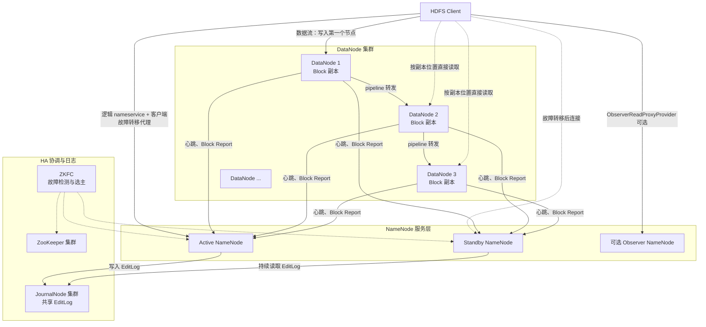
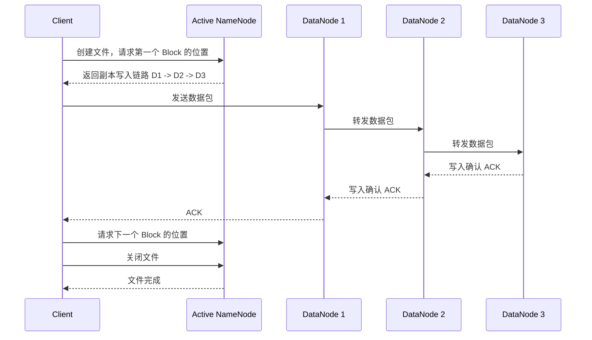
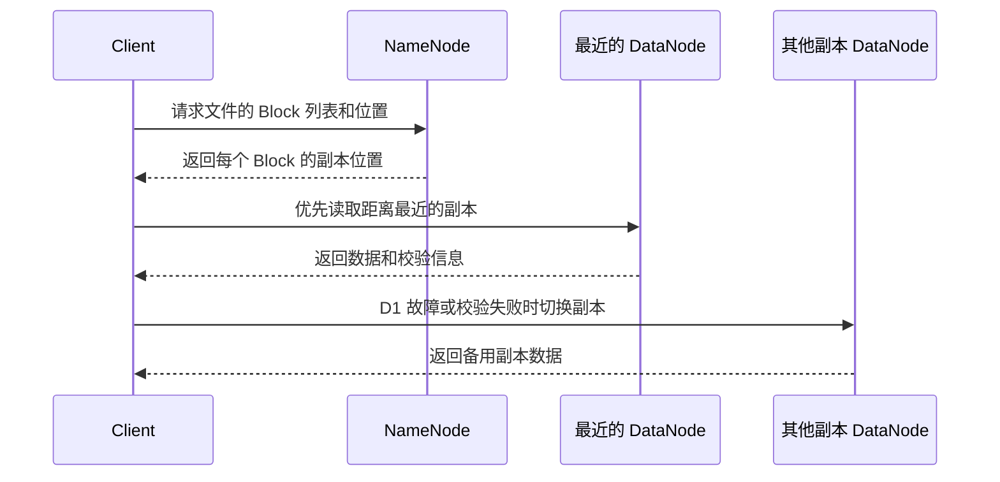

# HDFS 学习指南

> 面向希望系统掌握 Hadoop Distributed File System（HDFS）并准备大数据开发、平台开发或后端面试的读者。
>
> 本文以 Hadoop 3.x 的主流架构为背景。具体命令、默认值和配置项会随 Hadoop 版本、发行版以及部署方式变化，生产环境应以对应版本的官方文档和集群配置为准。

## 1. 先建立整体认识

HDFS 是 Hadoop 生态中的分布式文件系统，目标是为大规模数据提供：

- 跨多台机器的统一文件命名空间
- 面向大文件的高吞吐读写
- 通过副本或纠删码实现容错
- 节点故障时自动检测和恢复
- 与 Spark、Hive、HBase、Flink 等系统集成

HDFS 的基本取舍是：

> 以较高吞吐和容错能力为目标，但会牺牲低延迟随机写、频繁小文件和复杂事务能力。

它更像一个“分布式文件系统”，而不是数据库、消息队列或缓存。

### 1.1 一句话心智模型

```text
NameNode 管目录和元数据
DataNode 管文件内容对应的数据块
Client 先问 NameNode，再直接和 DataNode 传数据
```

### 1.2 HDFS 解决什么问题

单机文件系统会遇到容量、带宽、磁盘故障和扩展性限制。HDFS 把大文件切成 Block，分散到多个 DataNode，并为 Block 保存多个副本：

```text
一个大文件
    ↓ 切分
Block 0 / Block 1 / Block 2 / ...
    ↓ 分布与复制
多个 DataNode 上的 Block 副本
```

如果一台 DataNode 宕机，NameNode 可以让客户端读取其他副本，并安排重新复制，使副本数恢复到目标值。

## 2. 核心架构

### 2.1 逻辑架构图

以下图以使用 QJM、ZooKeeper 和自动故障转移的 NameNode HA 部署为例；手动故障转移、NFS 共享 EditLog 和不部署 Observer 的方案会减少或替换部分组件。



图中的“逻辑 nameservice + 客户端故障转移代理”不是独立的网络服务，而是客户端配置和客户端库中的路由逻辑。客户端应使用逻辑 nameservice 访问当前 Active；Standby 只有在切换后才接收原本由 Active 处理的元数据请求。

### 2.2 组件职责

| 组件 | 主要职责 | 不负责什么 |
| --- | --- | --- |
| NameNode | 管理命名空间、目录树、权限、文件到 Block 的映射、Block 副本位置 | 不保存用户文件的实际内容 |
| Active NameNode | 对外提供元数据写服务，处理 namespace 变更 | 不直接承载文件数据流 |
| Standby NameNode | 读取共享 EditLog，保持元数据状态，故障时接管 | 不是简单的冷备；但只有满足 HA 条件后才能安全接管 |
| Observer NameNode | 可选的元数据只读节点，分担读请求 | 不处理写请求，也不能替代 Active/Standby 的高可用职责 |
| DataNode | 保存 Block，处理数据读写、校验和、复制、心跳、Block Report | 不决定全局目录结构和副本布局 |
| JournalNode | 在使用 QJM 的 HA 模式下持久化共享 EditLog，提供多数派写入 | 不保存 HDFS 文件 Block，也不是通用文件存储 |
| ZooKeeper | 保存 HA 选主所需的少量协调状态 | 不保存 HDFS 数据和 EditLog |
| ZKFC | 监测 NameNode 健康状态、参与选主、触发故障转移 | 不负责存储用户文件 |
| HDFS Client | 访问命名空间，并按 NameNode 返回的位置直接访问 DataNode | 不需要让所有数据经过 NameNode |
| SecondaryNameNode | 定期合并 FsImage 和 EditLog，生成检查点 | 不是 Standby NameNode，不能直接接管故障 |

在标准 Hadoop 3.x HA 架构中，Standby NameNode 负责持续同步 EditLog 并定期执行 checkpoint，因此通常不需要部署 SecondaryNameNode。SecondaryNameNode 主要用于非 HA 架构；具体仍应以目标发行版的部署方案为准。

### 2.3 NameNode：元数据管理者

NameNode 在内存中维护关键元数据：

- 文件和目录树（namespace）
- 文件权限、所有者、组、时间等属性
- 文件由哪些 Block 组成
- 每个 Block 的副本分布在哪些 DataNode
- 副本数、存储类型、配额等信息

NameNode 保存的是“地图”，而不是“货物”：

```text
/data/orders/2026-08-20.parquet
    ↓
Block 1001, Block 1002, Block 1003
    ↓
Block 1001 在 DN1、DN4、DN7
Block 1002 在 DN2、DN5、DN8
Block 1003 在 DN3、DN6、DN9
```

NameNode 是 HDFS 的关键元数据服务，因此存在明显的内存和高可用要求。小文件很多时，文件对象、目录对象和 Block 元数据会大量占用 NameNode 堆内存，即使文件总字节数并不大。

### 2.4 DataNode：数据块服务者

DataNode 负责：

- 在本地磁盘保存 Block 文件和对应校验文件
- 响应客户端读请求
- 接收客户端或其他 DataNode 的写入
- 按 NameNode 指令复制或删除 Block
- 定期发送 Heartbeat
- 定期或增量发送 Block Report
- 检测磁盘和 Block 校验和异常

DataNode 通过多个本地目录存储数据。一个 DataNode 通常配置多块磁盘，以获得更大的容量和更好的并行 I/O；磁盘故障时，是否能隔离异常存储目录并继续服务取决于 `dfs.datanode.failed.volumes.tolerated` 等配置。

### 2.5 Block、Block Pool 与副本

HDFS 文件被切分为若干 Block。Block 大小是可配置的，Hadoop 3.x 常见集群会使用 128 MiB 或更大的值，但不存在适用于所有集群的固定最佳值。

Block 的几个要点：

- 文件的最后一个 Block 通常小于或等于配置的 Block 大小。
- Block 是存储和复制的基本单位。
- Block 大小不等于每次网络传输的数据包大小。
- 一个 Block 的多个副本通常放在不同 DataNode，并按机架感知策略分布（见“副本策略与机架感知”一节）。
- 在 HDFS Federation 中，不同 namespace 可能拥有不同 Block Pool。

副本因子（Replication Factor）表示一个 Block 的副本数量，例如副本因子为 3 表示通常保存三份副本。副本因子提供的是“副本级”的容错，并不是写入事务或跨系统一致性保证。

### 2.6 JournalNode 与共享 EditLog

在使用 Quorum Journal Manager（QJM）的 NameNode HA 中，Active NameNode 将 namespace 变更写入 JournalNode 集群。Standby NameNode 持续读取这些 EditLog，并异步把变更应用到自己的内存状态中，因此通常接近 Active 的最新状态，但不保证零延迟或始终完全一致。HDFS HA 也可以使用 NFS 等共享存储方案保存 EditLog，具体取决于部署配置。

常见部署是 3 个或更多 JournalNode，数量通常采用奇数，以便形成多数派。只要满足 QJM 配置要求的多数 JournalNode 可用，namespace EditLog 的提交通常就可以继续；这不等于 DataNode 文件数据写入一定成功，具体可用性还取决于版本和配置。

JournalNode 只保存 QJM 方案中的共享 EditLog，不保存用户文件的 Block 数据。DataNode 的 Block 仍然各自保存在 DataNode 本地存储上。

### 2.7 ZooKeeper 与 ZKFC

在配置自动故障转移的 HA 集群中，ZooKeeper 用于保存选主和锁定状态；每个 NameNode 通常配一个 ZKFC。只使用手动故障转移的部署可以不使用 ZooKeeper/ZKFC，但仍必须做好状态确认和 fencing：

1. ZKFC 检查本机 NameNode 是否健康。
2. 健康的 NameNode 竞争在 ZooKeeper 中创建 Active 状态。
3. Active 失效时，其他 ZKFC 发现锁释放并发起选主。
4. 新 Active 接管前，需要确保旧 Active 不再继续写入，这一步叫 fencing（隔离旧主）。

ZooKeeper 的作用是协调，不是数据持久化。即使 ZooKeeper 正常，也不能替代 JournalNode、DataNode 副本和备份。

## 3. HDFS 的数据模型

### 3.1 命名空间

HDFS 对外提供类似层级文件系统的路径：

```text
/user/alice/input/events.json
/warehouse/ods/orders/dt=2026-08-20/part-00000.parquet
```

目录和文件元数据由 NameNode 管理，文件内容由 Block 组成并存储在 DataNode。

### 3.2 写一次、读多次

HDFS 主要面向大文件和批处理：

- 适合文件写入完成后被重复读取
- 支持追加等有限形式的修改
- 不适合频繁随机覆盖文件中间位置
- 不适合把每一条业务记录都当成一个小文件

HDFS 对同一个文件通常采用单写者（single writer）模型，依靠租约和恢复机制管理写入者。它支持追加等有限形式的修改，但不支持像数据库一样对文件中间位置做频繁随机更新。数据湖和计算框架常用“先写临时目录，完成后原子 rename”的方式提交输出，避免读取者看到未完成文件。

业务系统需要随机更新、行级事务、唯一约束或复杂条件查询时，通常应使用数据库、KV 存储或 HBase，而不是直接使用 HDFS。

### 3.3 校验和

HDFS 为数据块维护校验和。写入时通常由客户端计算校验和，DataNode 校验数据包并保存 Block 及其校验信息；读取时客户端会校验收到的数据，发现损坏后可以尝试其他副本。校验和能够发现损坏，但不能替代副本和备份：如果所有副本都损坏，仍然需要恢复来源。

### 3.4 小文件问题

小文件是 HDFS 最常见的架构问题之一：

```text
大量小文件
    ↓
NameNode 保存大量文件和 Block 元数据
    ↓
NameNode 内存压力增大
    ↓
RPC、扫描、Spark/Hive 任务调度开销增大
```

解决思路：

- 通过上游批量写入合并文件
- 使用 Parquet、ORC 等列式格式
- 调整 Spark/Flink/Hive 的输出分区数量
- 采用 Compaction 或定期归并任务
- 让分区粒度与数据量匹配
- 不要为了“分区更细”无节制创建目录和文件

注意：把小文件简单压缩成一个大文件可能影响增量追加和并行度，需要根据读写模式设计。

## 4. 文件写入流程

### 4.1 写入流程图



### 4.2 详细步骤

1. Client 向 NameNode 发起创建文件请求。
2. NameNode 检查路径、权限、租约和文件是否已存在。
3. Client 请求当前 Block 的目标 DataNode 列表。
4. NameNode 根据机架感知、副本因子、节点可用性和存储策略选择 DataNode。
5. Client 与第一个 DataNode 建立 pipeline。
6. 数据被切成 packet，沿 pipeline 依次写入多个 DataNode。
7. ACK 沿相反方向返回。某个 DataNode 失败时，pipeline 可以重建，客户端重试未确认的数据。
8. Block 写完后，Client 请求下一个 Block，直到文件写完。
9. Client 关闭文件，NameNode 将文件标记为完成。

### 4.3 为什么数据不经过 NameNode

NameNode 只负责元数据和数据位置。如果文件内容也经由 NameNode 转发，NameNode 会成为带宽和吞吐瓶颈。

HDFS 的设计是：

```text
控制流：Client <-> NameNode
数据流：Client <-> DataNode
```

### 4.4 一致性和刷新

HDFS 不是关系数据库事务系统。写入过程中，文件可能处于正在创建或未完成状态。关闭文件后，文件才被视为完整完成。

对于需要让其他读取者看到已写入数据的场景，可使用客户端 API 提供的 `hflush` 或 `hsync` 语义：

- `hflush`：把客户端缓冲区中的数据刷新到写入链路，并使新读取者可以看到已刷新内容；它不等同于底层磁盘已经完成持久化。
- `hsync`：除刷新数据外，还请求将数据同步到持久化存储，语义更接近文件系统的 `fsync`。若希望其他读取者看到正在写入文件的最新长度，需在 HDFS 特定 API 中使用 `SyncFlag.UPDATE_LENGTH`；不能默认认为文件长度等 NameNode 元数据一定会同步。实际持久性仍受 Hadoop 版本、底层文件系统和存储设备影响。

二者都不是数据库事务，也不提供跨文件原子提交。不能把客户端收到普通写入响应简单理解为“数据已经永久落盘”。

## 5. 文件读取流程



读取过程通常是：

1. Client 向 NameNode 请求文件对应的 Block 列表。
2. NameNode 返回每个 Block 的副本位置。
3. Client 根据网络拓扑优先选择本机、同节点或同机架的副本。
4. Client 直接从 DataNode 读取，并校验数据。
5. 某个副本不可读或校验失败时，Client 尝试其他副本。

这种“数据本地性”可以减少网络传输，尤其适合计算框架在存储集群附近运行。

## 6. 副本策略与机架感知

### 6.1 为什么要跨机架

如果所有副本都在同一个机架，机架交换机或机架级故障可能同时影响所有副本。HDFS 会结合网络拓扑放置副本，尽量把副本分布到不同机架。

以副本因子 3 为例，常见策略会让副本分散到多个机架；具体位置由机架可用性、写入者位置、节点负载、存储类型和策略实现共同决定，不能简单硬编码为“必定每个副本都在不同机架”。

在经典默认 Block Placement Policy 下，副本因子为 3 时通常是：第一个副本优先放在写入客户端所在节点或附近节点，第二个副本放到不同机架，第三个副本放到第二个副本所在机架。节点数量、机架配置、存储策略和负载不足时，实际布局可能不同；面试时应把这条当作默认策略示例，而不是绝对保证。

### 6.2 机架感知配置

管理员通常通过 topology script 将 DataNode 映射到机架路径，例如：

```text
/dc1/rack1/dn01
/dc1/rack1/dn02
/dc1/rack2/dn03
```

如果没有正确配置机架感知，NameNode 可能把节点视为同一网络位置，容灾和网络流量规划都会受到影响。

### 6.3 副本不足和过多

- Under-replicated：实际副本数低于目标副本数，NameNode 会安排补充复制。
- Over-replicated：实际副本数高于目标副本数，NameNode 会选择合适副本删除。
- Corrupt：校验失败或状态异常的副本被标记为损坏，不应继续作为正常副本使用。

副本恢复会消耗网络、磁盘和 CPU，集群故障恢复期间应监控复制队列和 DataNode 负载。

## 7. 高可用 HA

### 7.1 为什么需要 HA

单 NameNode 架构中，NameNode 故障会导致元数据服务不可用，即使 DataNode 上的 Block 仍然存在。HA 通过 Active/Standby NameNode 降低元数据服务的单点风险。

### 7.2 HA 组件关系

```text
Active NameNode
        │ 写共享 EditLog
        ▼
JournalNode 多数派
        ▲
        │ 持续读取
Standby NameNode

ZooKeeper + ZKFC：选主、健康检查、故障转移协调
Fencing：阻止旧 Active 继续写入
```

### 7.3 故障转移的关键点

HA 不是“启动两个 NameNode 就完成”。可靠故障转移至少要考虑：

- Active 和 Standby 的 namespace 状态同步
- 共享 EditLog 的多数派可用性
- 客户端使用逻辑 nameservice 进行自动切换
- 旧 Active 的 fencing
- ZooKeeper 自身的多数派和网络连通性
- DataNode 与两台 NameNode 的状态汇报

### 7.4 Fencing 为什么重要

如果网络分区导致旧 Active 仍认为自己是主节点，而新 Active 也已经接管，就可能出现双主（split-brain）。两个 NameNode 同时接受写请求会破坏元数据一致性。

Fencing 的目标是让旧 Active 失去继续写入的能力，方式可以是基于 SSH、共享电源管理或环境支持的其他隔离机制。Fencing 必须经过演练，不能只停留在配置文件里。

### 7.5 Standby 和 SecondaryNameNode 的区别

| 项目 | Standby NameNode | SecondaryNameNode |
| --- | --- | --- |
| 主要目的 | HA 故障接管 | 非 HA 架构中合并 FsImage 与 EditLog，生成检查点 |
| 是否持续同步 namespace | 是，异步读取并应用共享 EditLog，可能存在追赶延迟 | 否，按周期做 checkpoint |
| 能否直接接管 Active | 在 HA 条件满足且完成切换时可以 | 不可以 |
| 是否等同于备份 | 不是完整灾备备份 | 也不是独立备份 |

## 8. Federation 与 Observer

### 8.1 HDFS Federation

Federation（联邦）允许多个相互独立的 NameNode 分别管理不同的 namespace，并共享同一组 DataNode。它的核心不是让多个 NameNode 共同管理同一个 namespace，而是把一个集群拆成多个相互独立的 namespace。

每个 namespace 对应一个由其 NameNode 管理的 Block Pool。Block Pool 是属于某个 namespace 的 Block 集合；Block ID 在 Block Pool 范围内标识具体 Block，Block Pool ID 用于区分不同的 Block Pool。共享 DataNode 会同时保存来自多个 Block Pool 的 Block，并分别向对应的 NameNode 发送心跳和 Block Report。

```text
Namespace A / NameNode A ─┐
Namespace B / NameNode B ─┼─ 共享 DataNode 集群
Namespace C / NameNode C ─┘
```

例如：

```text
Namespace A / NameNode A / Block Pool A ─┐
Namespace B / NameNode B / Block Pool B ─┼─ DataNode 1、DataNode 2、DataNode 3
```

每个 namespace 都有独立的目录树、文件元数据和 Block Pool，由对应的 NameNode 服务管理；非 HA 场景通常由一台 NameNode 管理，HA 场景则由同一 namespace 的 Active/Standby NameNode 对共同维护。不同 namespace 的元数据不会合并到同一个管理边界中。一个文件也只属于一个 namespace，由该 namespace 对应的 NameNode 服务管理；仅增加 Federation 节点，不能把同一个文件或同一个 namespace 的元数据自动拆到多个 NameNode 上。

### 8.1.1 Federation 如何访问

没有统一路由层时，客户端需要明确访问哪个 namespace，例如使用不同的逻辑 nameservice：

```text
hdfs://nsA/data/orders
hdfs://nsB/user/alice
```

也可以使用 ViewFs 在客户端侧建立虚拟目录树，把不同路径映射到不同 namespace。ViewFs 主要是客户端配置和路由能力，不会把多个 NameNode 的元数据真正合并。

如果希望对客户端提供统一入口，可以使用 Router-based Federation（RBF）。Router 根据 mount table 将路径解析到目标 namespace，再把元数据 RPC 转发给对应的 NameNode；客户端获得 Block 位置后，文件数据仍然直接在 Client 和 DataNode 之间传输，通常不会经过 Router。

### 8.1.2 Federation 的收益

- **扩展 namespace 元数据容量**：文件、目录和 Block 元数据分散到多个 NameNode，降低单个 NameNode 的内存压力。
- **扩展元数据处理能力**：将不同业务或目录路由到不同 namespace 后，可以分散元数据 RPC 请求；但集中在一个 namespace 的热点仍受该 namespace NameNode 的能力限制。
- **资源和管理隔离**：不同 namespace 可以按业务、团队或数据域划分权限、配额和运维边界。
- **共享存储集群**：多个 namespace 复用 DataNode 和磁盘资源，避免为每个 namespace 建立完全独立的存储集群。

### 8.1.3 Federation 的代价与边界

- Federation 不会自动提供高可用；每个需要高可用的 namespace 都要配置自己的 Active/Standby 关系、共享 EditLog 和 fencing。多个 namespace 可以共享 JournalNode 集群和 ZooKeeper 集群等基础设施，具体取决于部署方案。
- 多个 namespace 共享 DataNode 时，磁盘、网络和 DataNode 服务资源仍可能相互竞争，Federation 不是完全的物理资源隔离。
- 路由、权限、配额、监控、备份和故障排查复杂度会增加。使用 RBF 时，还需要考虑 Router、State Store 和 mount table 的高可用。
- 跨 namespace 的 rename 通常不支持；跨 mount point 的行为还取决于 ViewFs/RBF 及具体版本和配置，不能默认具备同一 namespace 内的原子 rename 语义。需要移动数据时，通常采用复制后删除，并由应用层负责协调。

Federation 与 HA 可以组合使用。常见做法是让每个需要高可用的 namespace 都配置自己的 Active/Standby NameNode 对，从而同时获得 namespace 扩展能力和单个 namespace 的高可用能力；多个 namespace 的 JournalNode、ZooKeeper 等基础设施可以共享，但 namespace 状态和故障转移关系仍彼此独立。

Federation 主要解决 NameNode 的 namespace、内存和元数据吞吐扩展问题；它和 HA 关注点不同：

- HA：同一个 namespace 的高可用
- Federation：多个 namespace 的横向扩展和隔离

两者可以组合使用。

### 8.2 Router-based Federation

Router-based Federation（RBF）在客户端和多个 namespace 之间增加 Router 层，为用户提供统一入口。Router 依赖 mount table 和 State Store 维护路径到 namespace 的映射，可以隐藏多个 namespace 的路由细节，但也引入 Router、State Store 的高可用、缓存一致性、权限和运维问题。RBF 主要统一访问入口，不会消除底层 namespace 之间的管理边界。

### 8.3 Observer NameNode

Observer NameNode 保存接近最新的 namespace 状态，并可在特定读语义下分担读请求，降低 Active NameNode 的元数据读压力。Observer 和 `ObserverReadProxyProvider` 是否可用取决于具体 Hadoop 版本和发行版，不能仅因为使用 Hadoop 3.x 就默认具备。普通客户端不会自动使用 Observer，需要配置相应的客户端路由；客户端状态 ID 可用于保证读请求不会落后于自身依赖的元数据进度，Observer 未追上时可能等待或按客户端策略回退到 Active。它不能接收写操作，也不应被误解为普通 DataNode 或独立存储节点。

## 9. 容错与故障处理

### 9.1 DataNode 故障

流程通常是：

```text
心跳超时
  ↓
NameNode 将 DataNode 标记为不可用
  ↓
相关副本数量下降
  ↓
从其他副本复制到健康 DataNode
  ↓
副本数恢复
```

写入中的 pipeline 需要重建；读取中的客户端可以切换到其他副本。

### 9.2 磁盘故障

DataNode 可以配置多个存储目录。单块磁盘损坏后，DataNode 是否继续服务取决于 `dfs.datanode.failed.volumes.tolerated`：默认值为 `0` 时，卷故障即可使 DataNode 停止服务；只有配置了可容忍的故障卷数且仍有可用卷时，DataNode 才能隔离故障目录并继续使用其他目录。损坏 Block 的副本由集群后续补齐。

### 9.3 NameNode 故障

- 非 HA：元数据服务中断，需要恢复原 NameNode，或根据 FsImage、EditLog 和备份元数据重建 NameNode；SecondaryNameNode 不能直接接管。若需要自动接管，应部署 HA。
- HA：Standby 在完成 fencing 和切换后接管 namespace 服务。

无论是否 HA，都应分层保护：备份 FsImage 和 EditLog 以恢复 NameNode 元数据；通过 DistCp、跨集群复制或其他备份方案保留关键用户数据副本。HA 主要解决在线可用性，不等于防误删、勒索、全站故障和长期归档。

### 9.4 数据损坏

读取校验和失败时，客户端会尝试其他副本。NameNode 记录损坏状态，并在条件允许时从健康副本重新复制。

### 9.5 Safe Mode

NameNode 启动或某些恢复阶段可能进入 Safe Mode。Safe Mode 是一种只读保护状态：NameNode 等待足够多的 Block 报告，确认副本状态达到安全阈值后再开放正常写操作。

Safe Mode 不是“修复数据”的命令，也不是遇到写失败就应该强制退出的状态。应先查看启动日志、Block 报告、DataNode 在线情况和损坏副本。

## 10. 纠删码 Erasure Coding

传统副本会保存多份完整数据。例如副本因子 3，存储开销约为原始数据的 3 倍。纠删码把数据切成数据块，并计算校验块，允许在一定数量的块丢失后恢复数据。

```text
数据块：D1 D2 D3 D4 D5 D6  （下图为示意）
校验块：P1 P2
```

> 上图仅用于说明“数据块 + 校验块”的概念关系，并不特指某个具体策略。Hadoop 默认的 Reed-Solomon 策略通常是 RS-6-3（6 个数据块 + 3 个校验块），实际使用的条带宽度和容错数以集群配置的 EC policy 为准。

优势：

- 冷数据或归档数据的存储开销更低
- 在满足容错条件时节省磁盘空间

代价：

- 编码和恢复需要 CPU
- 小文件、随机读取和更新可能更复杂
- 丢块恢复时网络和计算成本较高
- 需要合理设计 EC policy、条带大小和存储类型

经验上，热数据、频繁读取或频繁更新的数据常使用副本；大规模、读写相对稳定的冷数据可以评估纠删码。不能仅根据“节省空间”一个指标做决定。

## 11. HDFS 的优点

### 11.1 水平扩展

增加 DataNode 和磁盘通常可以扩展总容量及数据读写吞吐，计算框架也可以随节点增加而扩展并行度；但单个 namespace 的元数据吞吐仍受 NameNode 能力限制，需要通过 Observer 分担读请求或用 Federation 拆分 namespace。

### 11.2 高吞吐

通过大 Block、顺序 I/O、并行读取、数据本地性和批量处理，HDFS 适合海量文件扫描。

### 11.3 容错能力

Block 副本、校验和、故障检测和自动复制使单机、单盘故障不会轻易造成数据不可用。

### 11.4 生态兼容性

Hive、Spark、MapReduce、HBase、Flink 等系统都可以把 HDFS 作为数据层或中间存储使用。

### 11.5 数据本地性

计算任务可以尽量在保存数据的节点或附近节点执行，减少网络搬运。

## 12. HDFS 的缺点与边界

### 12.1 NameNode 元数据压力

大量小文件、深层目录和频繁 namespace 操作会增加 NameNode 内存与 RPC 压力。Federation 可以扩展 namespace，但会增加架构复杂度。

### 12.2 不适合低延迟随机访问

HDFS 面向吞吐和文件扫描，不是为毫秒级单行查询设计。小范围随机查询可以考虑 HBase、数据库、KV 存储或对象存储索引层。

### 12.3 不适合频繁随机更新

文件通常写完后读取，频繁修改文件中间内容会带来较大代价。数据湖表的更新、删除和合并通常由 Hive ACID、Iceberg、Hudi、Delta Lake 等上层表系统负责，底层数据文件常使用 Parquet 或 ORC 等列式格式。

### 12.4 运维复杂

需要关注 NameNode HA、JournalNode、ZooKeeper、DataNode 磁盘、机架拓扑、安全认证、容量、复制队列和备份恢复。

### 12.5 存储副本有成本

副本因子 3 会带来约三倍的原始空间占用，此外还要预留系统空间、恢复空间和操作余量。纠删码可以降低部分数据的存储成本，但会增加计算和运维复杂度。

### 12.6 不等于完整备份

副本主要用于在线容错，不能防止误删除、错误覆盖、恶意加密或应用逻辑错误。快照也不是自动生成的异地备份；需要独立的备份、保留策略和恢复演练。

## 13. 下游应用与典型数据链路

### 13.1 Hive：离线数仓

```text
业务库 / 日志
      ↓
Kafka / Sqoop / CDC 工具
      ↓
HDFS：ODS、DWD、DWS 数据文件
      ↓
Hive SQL
      ↓
报表、指标、数据服务
```

Hive 负责表的元数据和 SQL 执行语义，HDFS 负责底层文件存储。Hive 表不是 HDFS 本身，删除 Hive 表时还要注意 managed/external table 的数据生命周期差异。

### 13.2 Spark：批处理和大规模计算

```text
Spark Driver
      ↓ 调度
Executors 读取 HDFS Block
      ↓
Shuffle / 计算 / 写回 HDFS
```

Spark 的分区、并行度和 HDFS 文件 Block 没有简单的一一对应关系，但 HDFS Block 分布会影响数据本地性和读取效率。

### 13.3 HBase：随机读写

HBase 适合按 RowKey 的随机读写和在线数据访问；HDFS 作为其底层持久化文件系统之一，负责保存 HFile 等数据文件。HBase 的 Region、MemStore、WAL 等机制不属于 HDFS。

### 13.4 Flink：流批一体与状态存储

Flink 可以把检查点、Savepoint 或批处理结果写入 HDFS。检查点主要用于故障恢复，Savepoint 主要用于有计划的作业升级和迁移；两者的运维语义不同。

### 13.5 Kafka：实时数据进入 HDFS

```text
业务事件 → Kafka → Flink/Spark Streaming → HDFS
```

Kafka 负责实时消息传输和短中期保留，HDFS 负责文件化的长期存储和离线分析。Kafka 不是 HDFS 的替代品，HDFS 也不是消息队列。

### 13.6 湖格式：Iceberg、Hudi、Delta Lake

这些表格式把数据文件、元数据、快照、Schema 演进、分区和更新语义组织起来，可以运行在 HDFS 或对象存储之上。它们解决的是“表管理和数据湖事务语义”，不是替代 HDFS 的 DataNode 和 Block 管理。

### 13.7 DistCp：集群间复制

DistCp 使用 MapReduce 等并行能力进行大规模文件复制，常用于：

- 集群迁移
- 跨集群同步
- 灾备复制
- 冷数据归档

它不是实时同步系统，增量复制的边界、覆盖策略、权限和一致性需要单独设计。

## 14. 常用命令

以下命令以 HDFS CLI 为例，具体选项可能因版本不同而变化。

### 14.1 文件操作

```bash
# 查看根目录
hdfs dfs -ls /

# 创建目录
hdfs dfs -mkdir -p /data/input

# 上传本地文件
hdfs dfs -put local.csv /data/input/

# 下载文件
hdfs dfs -get /data/input/local.csv ./

# 查看文件内容（适合小文件或小范围排查）
hdfs dfs -cat /data/input/local.csv

# 查看文件大小和目录汇总
hdfs dfs -du -h /data/input

# 查看空间汇总
hdfs dfs -df -h

# 删除文件或目录
hdfs dfs -rm -r /data/tmp
```

删除、覆盖和递归操作应确认路径，生产环境要结合回收站、权限和审批流程。

### 14.2 集群检查

```bash
# 查看 DataNode、容量和使用情况
hdfs dfsadmin -report

# 检查文件、Block 位置和副本状态
hdfs fsck /path/to/file -files -blocks -locations

# 查看是否处于 Safe Mode
hdfs dfsadmin -safemode get
```

`fsck` 主要用于检查，不等同于文件系统修复工具；带有删除含义的选项应谨慎使用。

## 15. 关键配置概念

以下片段仅用于理解配置含义，不代表适用于生产环境的完整配置。

### 15.1 `core-site.xml`

```xml
<property>
  <name>fs.defaultFS</name>
  <value>hdfs://mycluster</value>
</property>
```

HA 场景通常使用逻辑 nameservice，例如 `hdfs://mycluster`，客户端通过 failover proxy provider 找到当前 Active NameNode。

### 15.2 `hdfs-site.xml`

```xml
<property>
  <name>dfs.replication</name>
  <value>3</value>
</property>

<property>
  <name>dfs.blocksize</name>
  <value>134217728</value>
</property>

<property>
  <name>dfs.namenode.name.dir</name>
  <value>file:///data/nn</value>
</property>

<property>
  <name>dfs.datanode.data.dir</name>
  <value>file:///data/dn1,file:///data/dn2</value>
</property>
```

说明：

- `dfs.replication` 是默认副本因子，可对目录或文件单独调整。
- `dfs.blocksize` 是默认 Block 大小，单位是字节。
- NameNode 元数据目录应有可靠存储并考虑多目录配置。
- DataNode 可以配置多个数据目录，但目录应位于实际可用的独立存储路径。

### 15.3 配置时不要只看单一指标

Block 大小、副本因子和压缩格式需要结合：

- 单文件平均大小
- 读写吞吐和并发
- NameNode 元数据容量
- 网络带宽
- 磁盘类型和 I/O 能力
- 计算框架的分区方式
- 数据冷热程度
- 容灾要求和可接受的数据丢失窗口

## 16. 生产设计与运维清单

### 16.1 容量规划

估算可用容量时不能直接用“所有磁盘之和”：

```text
原始容量
× 可用率
÷ 副本或纠删码开销
− 系统预留和恢复余量
≈ 业务可用容量
```

还要为副本重建、滚动升级、磁盘故障和临时文件预留空间。集群接近满盘时，写入、均衡和副本恢复都会变得困难。

HDFS Balancer 用于在 DataNode 之间重新分布 Block，使集群容量利用率更均衡。存储类型策略的迁移由 Mover 或 Storage Policy Satisfier 处理；单个 DataNode 内各磁盘卷的均衡由 DiskBalancer 处理。Balancer 通常会产生额外的网络和磁盘 I/O，应在业务低峰期执行，并设置合适的带宽、阈值和并发限制。它解决的是容量分布不均，不是小文件治理，也不是副本修复工具。

### 16.2 小文件治理

持续监控文件数、平均文件大小、目录分区数量和 NameNode 堆使用情况。数据湖中应尽量让文件大小达到适合计算引擎的范围，具体范围要通过实际任务基准测试决定，不能机械追求一个固定数字。

### 16.3 监控指标

重点监控：

- NameNode heap、GC、RPC 延迟、namespace 对象数量
- Active/Standby 同步延迟和 JournalNode 状态
- Observer 的 EditLog 追赶延迟、读请求回退到 Active 的次数和等待超时
- DataNode 在线数、磁盘使用率、坏盘目录
- Under-replicated、corrupt、missing Block 数量
- 写入吞吐、读取吞吐、客户端失败率
- 文件数量、小文件增长速度
- Safe Mode 状态
- 容量趋势和副本重建队列
- 机架分布与热点 DataNode

### 16.4 备份和恢复

建议至少具备：

- FsImage 和 EditLog 的受控备份
- 关键数据跨集群或跨地域复制
- 明确 RPO/RTO
- 定期恢复演练
- 防误删和保留策略
- 备份文件的完整性校验

HA 解决的是 NameNode 服务的连续性；它不能替代独立备份。

### 16.5 安全

生产环境常见安全能力包括：

- Kerberos 身份认证
- HDFS 文件和目录权限
- ACL 精细授权
- Delegation Token
- 传输加密
- Transparent Data Encryption（加密区域）
- 审计日志
- 代理用户和服务账号隔离

安全开启后，权限问题、票据过期、时钟偏差和服务间认证会成为常见故障来源。

## 17. 高频面试题与参考答案

### 17.1 HDFS 为什么适合大文件？

因为 HDFS 通过大 Block、顺序读写、并行读取、数据本地性和副本容错来优化吞吐。NameNode 只管理元数据，文件数据直接在 Client 和 DataNode 之间传输，避免中心节点成为数据带宽瓶颈。

### 17.2 NameNode 存什么，DataNode 存什么？

NameNode 存 namespace、文件到 Block 的映射、Block 副本位置、权限等元数据；DataNode 存 Block 文件和校验文件，并负责数据读写和副本复制。

### 17.3 一个文件如何存储？

文件被切成多个 Block，每个 Block 按副本因子存储在多个 DataNode。NameNode 记录文件由哪些 Block 组成以及副本位置，客户端先向 NameNode 查询位置，再直接访问 DataNode。

### 17.4 为什么 HDFS 的数据流不经过 NameNode？

NameNode 只处理控制流和元数据。如果数据也经过 NameNode，会使它成为网络、CPU 和吞吐瓶颈。数据直连 DataNode 可以实现并行传输和横向扩展。

### 17.5 副本因子为 3 时，三个副本一定在三台不同机器上吗？

正常策略会尽量把副本分散到不同 DataNode，并考虑机架感知，但实际放置受可用节点、机架配置、存储策略和负载影响。副本因子表示目标副本数量，不应简单理解为固定拓扑。

### 17.6 为什么需要机架感知？

机架感知让 HDFS 尽量跨机架放置副本，避免机架级故障同时影响所有副本，也可以帮助优化网络流量。机架信息配置错误会削弱容灾效果。

### 17.7 HDFS 如何保证数据可靠性？

依靠 Block 副本、校验和、DataNode 心跳、Block Report、失败副本替换、机架感知和故障恢复。它降低了单点故障影响，但不能保证应用逻辑错误、误删或所有副本同时损坏时的数据安全，因此仍需备份。

### 17.8 NameNode 宕机，数据会丢吗？

NameNode 宕机首先影响元数据服务和访问可用性，DataNode 上的 Block 通常仍在。非 HA 集群需要恢复 NameNode；HA 集群可由 Standby 在协调、同步和 fencing 满足后接管。是否丢数据还取决于元数据和文件数据是否有可靠持久化与备份。

### 17.9 SecondaryNameNode 是备用 NameNode 吗？

不是。SecondaryNameNode 的核心工作是定期合并 FsImage 和 EditLog，生成检查点，降低 NameNode 重启时的恢复成本。它不能像 Standby NameNode 一样直接完成 HA 接管。

### 17.10 FsImage 和 EditLog 分别是什么？

FsImage 是某一时刻的 namespace 快照；EditLog 记录快照之后发生的 namespace 变更。NameNode 启动时加载 FsImage，再回放 EditLog，恢复最新元数据状态。

### 17.11 HA 中为什么需要 JournalNode？

Active 和 Standby 需要共享连续的 EditLog。JournalNode 通过多数派保存共享 EditLog，使 Standby 可以追上 Active；它保存的是元数据变更日志，不是文件 Block。

### 17.12 自动故障转移的 HA 中为什么需要 ZooKeeper？

在自动故障转移的 HA 中，ZooKeeper 配合 ZKFC 协调 Active/Standby 的选主和状态；手动故障转移的 HA 不依赖 ZooKeeper 或 ZKFC。ZooKeeper 不保存用户数据，也不负责保存 HDFS 的 Block。为避免双主，还需要 fencing 机制隔离旧 Active。

### 17.13 什么是 split-brain？怎么避免？

网络分区时旧 Active 和新 Active 都认为自己是主节点并接受写请求，称为 split-brain。可以通过 ZooKeeper 选主、ZKFC 健康检查和可靠 fencing 机制避免；fencing 必须在真实故障场景中演练。

### 17.14 HDFS 为什么不适合小文件？

每个文件、目录和 Block 都会增加 NameNode 元数据，文件数量过多会消耗 NameNode 内存和 RPC 能力；计算任务还会产生大量调度和打开文件开销。应通过合并、列式格式、合理分区和 Compaction 治理。

### 17.15 HDFS 为什么不适合随机写？

HDFS 的设计目标是大文件、顺序写和写完后读取，文件内容不是为高频行级随机更新设计的。随机读写需求应考虑 HBase、数据库或 KV 存储；表格式的更新通常由上层数据湖系统实现。

### 17.16 HDFS 的写入 pipeline 是什么？

Client 根据 NameNode 返回的节点列表建立 DataNode 链路，数据包沿链路依次写入副本，ACK 反向返回。某个节点故障时，客户端可以重建 pipeline 并继续写入未确认数据。

### 17.17 HDFS 如何处理 DataNode 宕机？

NameNode 通过心跳超时发现 DataNode 不可用，再根据 Block Report 和副本信息识别受影响 Block，从健康副本复制到其他节点，使副本数量恢复。客户端读写期间也会切换或重建数据链路。

### 17.18 Safe Mode 是什么？

Safe Mode 是 NameNode 的只读保护状态。启动时 NameNode 等待足够的 Block Report，确认副本状态达到安全阈值后退出。它不是数据修复命令，强制退出前应排查 DataNode、Block 报告和损坏数据。

### 17.19 HDFS 的副本数越多越好吗？

不是。副本越多，容错和读取并行性可能越好，但会增加磁盘、网络、写入和恢复成本。应结合数据重要性、访问热度、容量、RPO/RTO 和机架故障模型选择；冷数据也可评估纠删码。

### 17.20 纠删码和副本有什么区别？

副本保存多份完整数据，读取和恢复简单、写入开销相对可预测，但空间开销较高。纠删码保存数据块和校验块，空间效率更高，但编码、恢复、小写入和随机读的成本更复杂。二者可按冷热数据混合使用。

### 17.21 HDFS 的 HA 和 Federation 有什么区别？

HA 关注同一 namespace 的服务连续性，通过 Active/Standby 降低 NameNode 单点风险；Federation 允许多个 NameNode 分别管理不同 namespace，并让它们共享 DataNode，主要解决 namespace、内存和元数据吞吐扩展问题。Federation 不能把同一个 namespace 的元数据自动拆到多个 NameNode，且本身不等于高可用；每个 namespace 可以继续独立配置 HA，多个 namespace 可以共享 JournalNode、ZooKeeper 等基础设施，二者可以组合。

### 17.22 HDFS 和对象存储有什么区别？

HDFS 依赖集群节点和 DataNode 管理 Block，强调计算集群内的数据本地性和高吞吐；对象存储通过对象和 Bucket 提供更强的存储解耦与弹性。现代计算引擎可同时支持二者，选型取决于部署环境、一致性语义、成本、运维和访问模式。

### 17.23 HDFS 是不是数据库？

不是。HDFS 提供文件、目录、权限、Block 和容错能力，不提供 SQL、行级事务、索引、唯一约束和复杂查询优化。Hive、HBase、Iceberg 等上层系统分别补充不同能力。

### 17.24 HDFS 是不是消息队列？

不是。HDFS 是持久化文件存储，Kafka 等消息队列负责实时事件传输、消费进度和流式解耦。常见链路是 Kafka 接收实时数据，Flink/Spark 消费后将结果写入 HDFS。

### 17.25 HDFS 的 Block 大小为什么通常较大？

较大的 Block 可以减少 Block 数量、NameNode 元数据以及大文件切分和调度开销。小文件不会因为 Block 较大就实际占满一个 Block，也不能靠调大 Block 解决小文件问题；过大的 Block 还可能降低细粒度并行效率，因此应结合文件大小、并行度和计算引擎基准测试决定。

### 17.26 如何定位 HDFS 文件读取慢？

检查文件是否过小或过多、Block 分布和数据本地性、DataNode 磁盘/网络负载、机架拓扑、客户端并发、压缩格式和上层任务分区。不要只看 HDFS 吞吐，还要看计算引擎是否因小文件、Shuffle 或下游处理成为瓶颈。

### 17.27 如何定位副本不足？

先用 `hdfs fsck` 和 NameNode 指标确认 Under-replicated、Missing、Corrupt Block，再检查 DataNode 在线状态、磁盘故障、容量、网络、复制队列和机架策略。盲目提高副本因子可能加重恢复压力。

### 17.28 HDFS Snapshot 是备份吗？

Snapshot 是 namespace 的只读时间点视图，通常通过共享 Block 和 Copy-on-Write 降低额外空间；它能帮助恢复误删或查看历史状态，但不等于跨集群、跨地域、隔离故障域的独立备份。重要数据仍要做独立复制和恢复演练。

### 17.29 为什么 NameNode 需要足够大的内存？

NameNode 要在内存中管理文件、目录、Block 和副本映射。文件数量和 Block 数量增长会直接增加元数据对象数量。容量规划不能只看数据字节数，还要看 namespace 对象和小文件比例。

### 17.30 HDFS 什么时候不应该使用？

当场景要求毫秒级随机读写、复杂事务、行级更新、强一致跨表操作、海量小对象管理或极低运维复杂度时，应优先评估数据库、KV、对象存储或其他专用系统。

## 18. 学习路线

### 第一阶段：掌握基本模型

1. 理解 NameNode、DataNode、Block、Replica、Client。
2. 手动演示文件上传、下载、目录和权限。
3. 用 `fsck` 查看一个文件的 Block 和副本位置。
4. 画出“控制流”和“数据流”的区别。

### 第二阶段：理解读写和容错

1. 画出写 pipeline 和读副本选择流程。
2. 理解 Heartbeat、Block Report 和副本恢复。
3. 模拟 DataNode 下线，观察副本不足和恢复。
4. 理解机架感知、数据本地性和校验和。

### 第三阶段：掌握 HA 与运维

1. 理解 FsImage、EditLog、Checkpoint。
2. 理解 Active、Standby、JournalNode、ZooKeeper、ZKFC 和 fencing。
3. 设计 NameNode、JournalNode、DataNode 的备份与恢复方案。
4. 观察 Safe Mode、GC、复制队列和容量告警。

### 第四阶段：连接生态

1. 用 Hive 建外部表并观察 HDFS 文件布局。
2. 用 Spark 读取、写入 Parquet，并观察文件数量。
3. 理解 HBase 为什么需要 HDFS。
4. 设计 Kafka 到 HDFS 的实时落盘链路。
5. 对比 HDFS、对象存储、HBase、数据库和 Kafka 的职责边界。

## 19. 复习速记

```text
NameNode：元数据、目录、Block 映射
DataNode：Block 数据、读写、复制、心跳
Block：存储和复制的基本单位
Replica：容错，但不是事务
JournalNode：HA 共享 EditLog
ZooKeeper：HA 协调，不存文件数据
ZKFC：健康检查、选主、故障转移
SecondaryNameNode：Checkpoint，不是备用主节点
HA：解决同一 namespace 的可用性
Federation：多个独立 namespace，各自拥有 NameNode 和 Block Pool，共享 DataNode
副本：简单、可靠、空间成本高
纠删码：省空间、恢复和小写入更复杂
HDFS：大文件、高吞吐、批处理
HDFS 不擅长：小文件、随机写、低延迟行级查询
```

## 20. 官方参考文档

以下链接指向 Apache Hadoop 官方文档；阅读时应优先选择与集群实际版本匹配的文档：

- [HDFS Architecture Guide](https://hadoop.apache.org/docs/current/hadoop-project-dist/hadoop-hdfs/HdfsDesign.html)
- [HDFS High Availability Using QJM](https://hadoop.apache.org/docs/current/hadoop-project-dist/hadoop-hdfs/HDFSHighAvailabilityWithQJM.html)
- [HDFS Federation](https://hadoop.apache.org/docs/current/hadoop-project-dist/hadoop-hdfs/Federation.html)
- [HDFS Commands Guide](https://hadoop.apache.org/docs/current/hadoop-project-dist/hadoop-hdfs/HDFSCommands.html)
- [HDFS Erasure Coding](https://hadoop.apache.org/docs/current/hadoop-project-dist/hadoop-hdfs/HDFSErasureCoding.html)
- [HDFS Snapshots](https://hadoop.apache.org/docs/current/hadoop-project-dist/hadoop-hdfs/HDFSSnapshots.html)
