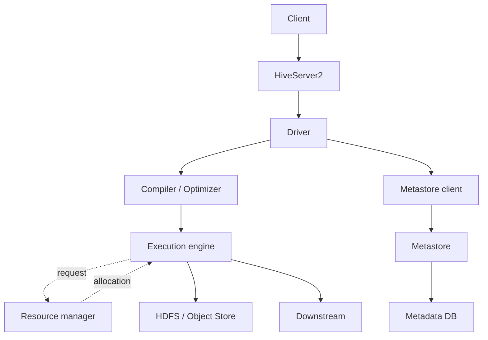
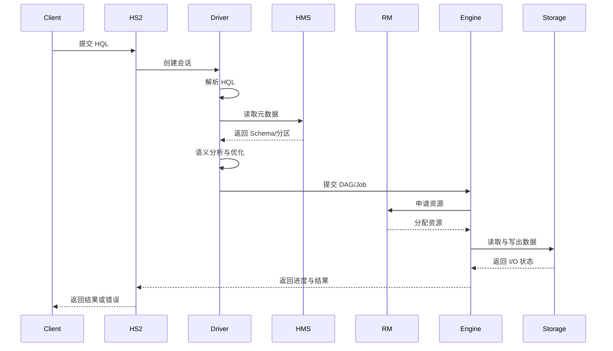
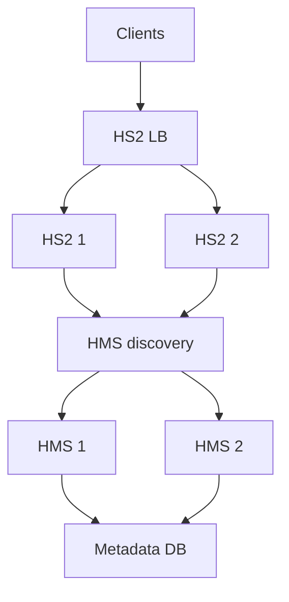
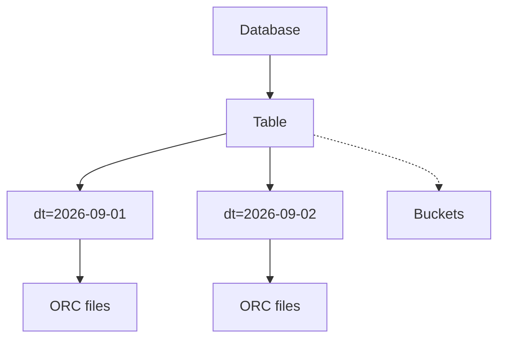
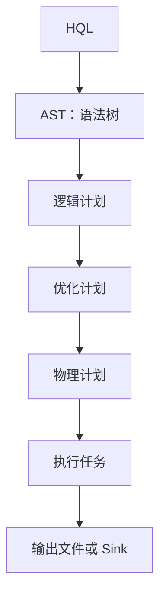
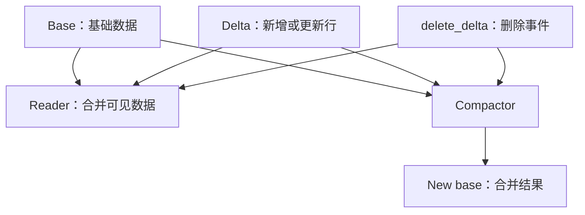
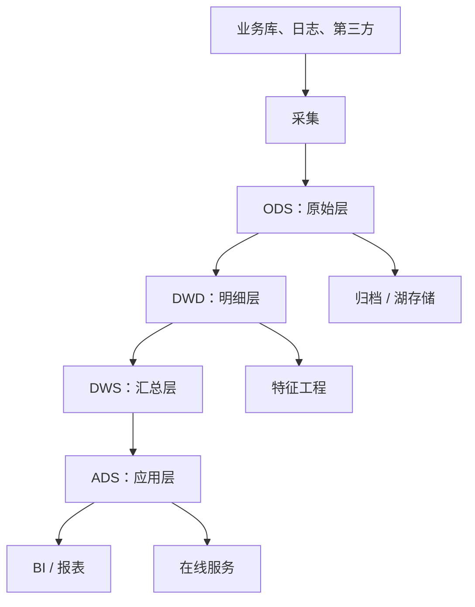
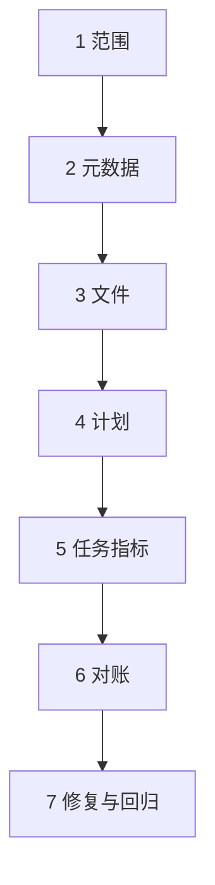

# Hive 学习指南

> 面向希望系统掌握 Apache Hive、离线数仓开发和大数据开发面试的读者。
>
> 本文以 Hive 3.x 及其常见 Hadoop 生态部署为背景。示例尽量使用 Hive 3.x 的通用写法；Hive 4.x、不同发行版以及使用 Tez、Spark、MapReduce、LLAP 或云对象存储时，默认值、命令和能力可能有所差异。生产环境应以对应版本的官方文档和集群配置为准。本文将 HiveQL 简称为 HQL；在其他技术语境中，HQL 也可能指 Hibernate Query Language。

## 目录

- [事实依据与版本边界](#事实依据与版本边界)
- [1. 学习路线与整体认识](#1-学习路线与整体认识)
  - [1.1 Hive 是什么](#11-hive-是什么)
  - [1.2 Hive 解决什么问题](#12-hive-解决什么问题)
  - [1.3 一句话心智模型](#13-一句话心智模型)
- [2. Hive 架构](#2-hive-架构)
  - [2.1 逻辑架构](#21-逻辑架构)
  - [2.2 核心组件](#22-核心组件)
  - [2.3 SQL 执行链路](#23-sql-执行链路)
  - [2.4 Metastore 与高可用](#24-metastore-与高可用)
- [3. 数据模型与表设计](#3-数据模型与表设计)
  - [3.1 数据库、表、分区与分桶](#31-数据库表分区与分桶)
  - [3.2 内部表与外部表](#32-内部表与外部表)
  - [3.3 Schema-on-Read、SerDe 与文件格式](#33-schema-on-readserde-与文件格式)
  - [3.4 分区和分桶的选择](#34-分区和分桶的选择)
  - [3.5 数据类型、复杂类型与 Schema 演进](#35-数据类型复杂类型与-schema-演进)
- [4. 常用 Hive SQL](#4-常用-hive-sql)
  - [4.1 环境与库表管理](#41-环境与库表管理)
  - [4.2 分区写入与数据装载](#42-分区写入与数据装载)
  - [4.3 Join、聚合与排序](#43-join聚合与排序)
  - [4.4 窗口函数与分析函数](#44-窗口函数与分析函数)
  - [4.5 常用函数与复杂数据展开](#45-常用函数与复杂数据展开)
- [5. 执行引擎与核心原理](#5-执行引擎与核心原理)
  - [5.1 MapReduce、Tez 与 Spark](#51-mapreduce-tez-与-spark)
  - [5.2 编译、优化与执行计划](#52-编译优化与执行计划)
  - [5.3 事务与 ACID](#53-事务与-acid)
  - [5.4 视图、物化视图与 UDF](#54-视图物化视图与-udf)
  - [5.5 Hive ACID 与湖表格式的边界](#55-hive-acid-与湖表格式的边界)
- [6. 性能优化](#6-性能优化)
  - [6.1 优化总原则](#61-优化总原则)
  - [6.2 分区裁剪与列裁剪](#62-分区裁剪与列裁剪)
  - [6.3 文件格式、压缩与小文件](#63-文件格式压缩与小文件)
  - [6.4 Join 与数据倾斜](#64-join-与数据倾斜)
  - [6.5 统计信息、CBO 与执行计划](#65-统计信息cbo-与执行计划)
  - [6.6 执行参数与资源管理](#66-执行参数与资源管理)
- [7. 优缺点与适用边界](#7-优缺点与适用边界)
- [8. 下游应用与数仓实践](#8-下游应用与数仓实践)
  - [8.1 典型数据链路](#81-典型数据链路)
  - [8.2 数仓分层中的 Hive](#82-数仓分层中的-hive)
  - [8.3 下游消费系统](#83-下游消费系统)
  - [8.4 数据治理与安全](#84-数据治理与安全)
- [9. 生产实践与排障](#9-生产实践与排障)
  - [9.1 生产任务的可靠性设计](#91-生产任务的可靠性设计)
  - [9.2 常见问题与定位方法](#92-常见问题与定位方法)
  - [9.3 一套通用排障流程](#93-一套通用排障流程)
- [10. 高频面试题与参考答案](#10-高频面试题与参考答案)
  - [10.1 基础与架构](#101-基础与架构)
  - [10.2 数据模型与 SQL](#102-数据模型与-sql)
  - [10.3 执行与性能](#103-执行与性能)
  - [10.4 项目、场景与 SQL 语义](#104-项目场景与-sql-语义)
  - [10.5 进阶边界与实战题](#105-进阶边界与实战题)
- [11. 学习检查清单](#11-学习检查清单)
  - [11.1 基础知识](#111-基础知识)
  - [11.2 SQL 与建模](#112-sql-与建模)
  - [11.3 性能与生产](#113-性能与生产)
  - [11.4 建议实操题](#114-建议实操题)
  - [11.5 最小实验闭环](#115-最小实验闭环)
  - [11.6 推荐学习顺序](#116-推荐学习顺序)
- [12. 参考资料](#12-参考资料)

## 事实依据与版本边界

本文把结论分为三类，避免把某个发行版或某次部署的行为写成 Hive 的永久规则：

- **标准语义**：Hive 官方语言手册、事务文档和组件文档明确描述的概念，例如表、分区、分区裁剪、窗口函数和 Metastore。
- **实现相关**：执行引擎、CBO、向量化、Map Join、文件合并和 ACID 的具体能力，可能受 Hive 版本、Tez/Spark 版本、配置和表格式影响。
- **工程建议**：数仓分层、幂等重跑、小文件治理、补数和服务化同步属于常见工程实践，不是 Hive 语法或协议本身保证的行为；文中会在相应章节说明，必要时用 `[工程实践说明]` 标记。

文中用 `[S1]` 形式标记的来源，统一在第 12 节列出。涉及默认值、删除、事务、对象存储提交和跨引擎读取时，应以实际环境的 `SHOW CREATE TABLE`、`DESCRIBE FORMATTED`、`EXPLAIN`、任务日志和对应版本官方文档为准。

第 12 节中带有 `/latest/` 的链接是 Apache 官方当前文档入口，可能对应比 Hive 3.x 更新的版本；它们用于定位主题，不代表其中的每个默认值都适用于 Hive 3.x。遇到版本敏感结论时，应切换到实际部署版本的文档或发行版配置。

以下内容尤其不能脱离版本和配置死记：

| 主题 | 需要核对的事实边界 |
| --- | --- |
| 执行引擎 | `hive.execution.engine` 可选值、默认值和发行版是否打包 Tez/Spark |
| 表删除 | 内部/外部表、`external.table.purge`、`PURGE` 和存储后端的实际行为 |
| 分桶 | 写入是否真正遵守桶数，查询引擎是否能够利用桶信息 |
| Map Join | 自动转换阈值、广播内存和最终物理计划 |
| ACID | 表类型、ORC 要求、事务管理器、锁、Compaction 和下游兼容性 |
| 文件提交 | HDFS rename 与对象存储 Committer 的一致性语义 |

## 1. 学习路线与整体认识

建议按以下顺序学习：先理解 Hive 的定位和架构，再掌握表设计与 SQL，之后学习执行计划、性能优化、事务和生产排障。只记命令而不了解数据文件、Metastore 和执行引擎，遇到慢 SQL 或数据异常时很难定位问题。

本文会按模块逐步补齐：

1. 基础定义、整体架构和 SQL 执行流程
2. 数据模型、表类型、分区分桶与存储格式
3. 常用 SQL、执行引擎和 ACID
4. 性能优化、数据仓库应用与生产实践
5. 高频面试题、学习检查清单和参考资料

### 1.1 Hive 是什么

Apache Hive 是构建在 Hadoop 生态之上的数据仓库基础设施，提供类似 SQL 的 HiveQL（通常简称 HQL）来查询和管理大规模数据。用户提交 HQL 后，Hive 会完成解析、语义分析、优化和执行计划生成，再把计划交给 MapReduce、Tez 或 Spark 等执行引擎执行，数据通常保存在 HDFS 或对象存储中。

> 事实依据：[S1][S2]

Hive 的几个关键定位：

- **数据仓库工具**：提供库表、分区、元数据、SQL 和数据装载能力。
- **SQL 到分布式任务的转换器**：HQL 不是直接在单机数据库内执行，而是编译为分布式执行计划。
- **计算与存储解耦**：Hive 本身不提供底层持久化存储，数据通常由 HDFS、对象存储或其他文件系统承载；内部表的数据生命周期仍可能由 Hive 管理。
- **Schema-on-Read**：很多表的列定义、SerDe 和文件位置记录在元数据中，数据在读取时按表定义解释。
- **面向批处理和分析**：适合大规模扫描、清洗、聚合、关联和数仓加工，不以毫秒级点查或高频事务为目标。

可以用下面这句话建立第一层心智模型：

> Hive = SQL 接口 + 元数据管理 + 分布式执行计划生成 + 文件型数据仓库能力。

Hive 不是以下系统的简单替代品：

| 系统 | 主要职责 | 与 Hive 的关系 |
| --- | --- | --- |
| HDFS / 对象存储 | 持久化文件和目录 | Hive 表通常把数据存放在这些系统中 |
| MySQL / PostgreSQL | OLTP、事务、索引和低延迟查询 | 可以作为 Hive Metastore 的元数据库，但不是 Hive 的数据文件存储 |
| YARN / Kubernetes | 资源调度和容器管理 | 为 Hive 使用的执行引擎提供资源 |
| Spark / Tez / MapReduce | 分布式计算执行 | Hive 可以把编译后的计划提交给它们 |
| Trino / Presto | 交互式分布式查询 | 可以读取 Hive Metastore 中的表，但不是 Hive 的执行引擎 |

### 1.2 Hive 解决什么问题

在数据量从 GB 增长到 TB、PB 后，单机数据库会受到存储容量、扫描吞吐和计算资源的限制。Hive 通过统一的 SQL 抽象，隐藏文件切分、任务并行、数据分区和节点故障恢复等细节，使开发者可以用接近 SQL 的方式完成离线数据处理。

典型问题包括：

- 将业务数据库、日志、埋点和消息数据汇总到数据湖或数据仓库。
- 对海量明细数据进行清洗、去重、关联和聚合。
- 按日期、地区、业务线等维度组织分区，支撑报表和指标计算。
- 把原始文本、JSON、Avro 等数据转换为 ORC/Parquet 等列式格式。
- 为 Spark、Trino、Flink、BI 工具和数据服务提供统一的表定义与元数据入口。

Hive 的基本取舍是：

> 用较高的吞吐和较低的存储成本换取更高的查询延迟，并接受文件型数仓在更新、事务和点查方面的限制。

### 1.3 一句话心智模型

```text
用户提交 HQL
    ↓
HiveServer2 接收请求，Driver 解析并生成执行计划
    ↓
Metastore 提供表结构、分区、位置和统计信息
    ↓
Tez / Spark / MapReduce 执行分布式任务
    ↓
从 HDFS / 对象存储读取文件，结果写回文件或下游系统
```

一个查询的“表”至少包含两部分：

```text
Hive 表
├── 元数据：列、类型、分区、位置、SerDe、文件格式、统计信息
└── 数据文件：HDFS / 对象存储上的 ORC、Parquet、TextFile 等文件
```

因此，排查 Hive 问题时要同时看两条线：

1. **元数据线**：表是否存在、分区是否注册、Location 是否正确、统计信息是否过期。
2. **数据线**：文件是否存在、格式是否匹配、文件数量是否合理、权限和数据内容是否正确。

## 2. Hive 架构

### 2.1 逻辑架构

下面的图展示一次通过 HiveServer2 提交查询的典型部署。HiveServer2 内部承载用户会话和 Driver 相关逻辑；为便于理解，图中把 Driver 单独画出。Hive 可以使用不同的执行引擎，实际生产部署通常选择其中一种作为主要引擎。



图中节点只保留短名称以减少窄屏渲染时的文字遮挡。Metastore 记录表和分区元数据及其数据位置，实际文件仍由底层存储保存；以 YARN 为例，ResourceManager 负责资源调度，ApplicationMaster、NodeManager 等组件协作完成容器申请和启动，其他平台的实现可能不同。[S2][S3][S20]

### 2.2 核心组件

| 组件 | 主要职责 | 关键边界 |
| --- | --- | --- |
| Client | 提交 HQL、传递参数、接收结果和日志 | 不负责在本地执行整个分布式查询 |
| HiveServer2 | 提供 JDBC/ODBC/Thrift 服务、会话管理、认证授权和并发控制 | 本身不是数据文件存储，也不等于执行集群 |
| Driver | 管理一次查询的生命周期，协调编译、执行和结果返回 | 不应让大规模结果集一次性汇聚到客户端或 Driver |
| Compiler | 解析 HQL，完成语法分析、语义分析、类型检查和执行计划生成 | 计划生成成功不代表任务已经成功执行 |
| Optimizer | 做谓词下推、列裁剪、分区裁剪、Join 重排等优化 | 优化效果依赖统计信息、文件格式和引擎能力 |
| Metastore Client | 向 Metastore 查询或写入元数据 | 应通过 Metastore 接口访问，不应让业务代码直接依赖底层元数据库表结构 |
| Metastore Service（HMS） | 管理数据库、表、列、分区、Location、SerDe、文件格式、统计信息等 | 不保存用户文件内容；可部署多实例水平扩展，状态主要依赖元数据库 |
| Metastore 元数据库 | 用 MySQL、PostgreSQL 等关系型数据库持久化 HMS 元数据 | 不是 Hive 表的业务数据仓库 |
| Execution Engine | 将计划拆成任务并读取、转换、写入数据 | Tez、Spark、MapReduce 的执行模型和性能特征不同 |
| Resource Manager | 分配 CPU、内存、容器等资源 | 例如 YARN；其他执行引擎可能由不同平台管理，资源平台不负责 HQL 语义优化 |
| Storage | 保存 ORC、Parquet、TextFile 等数据文件 | 文件存在不代表一定已被 Hive 注册为分区 |
| LLAP（可选） | 通过长期运行的守护进程、缓存和更低启动开销改善交互式查询 | 需要特定部署和版本支持，不是所有 Hive 集群的默认组件 |

#### Hive CLI、Beeline 与 HiveServer2

- **Hive CLI** 是较早的命令行方式，通常直接访问本地 Hive 配置和 Driver，兼容性和安全边界受版本影响。
- **Beeline** 通过 JDBC 连接 HiveServer2，是更常见的生产访问方式。
- **HiveServer2** 提供远程访问、会话隔离、认证授权和多用户并发能力。

生产环境应优先使用与集群版本匹配的 Beeline/JDBC 客户端，并通过 Kerberos、LDAP、Ranger 等实际启用的安全体系完成认证授权。Sentry 等组件在部分旧生态中仍会出现，但不应把某一种安全产品当成 Hive 固有能力。

### 2.3 SQL 执行链路

一次 HQL 查询大致经历以下阶段：



这是概念链路，不表示所有实现都以独立进程或相同 RPC 顺序完成。Hive 的 HQL 解析、语义分析和计划生成属于 Hive 层，任务的实际调度、Shuffle 和容错还取决于执行引擎与资源管理器。[S2][S4][S5]

把这条链路拆成面试中的标准回答：

1. **提交**：客户端通过 Beeline、JDBC、ODBC 或工具把 HQL 发给 HiveServer2。
2. **解析**：Driver 将 HQL 解析成抽象语法树，检查语法是否合法。
3. **编译与语义分析**：结合 Metastore 验证库表、列、类型、分区和函数，形成逻辑计划。
4. **优化**：应用分区裁剪、列裁剪、谓词下推、Join 策略、聚合优化等规则，必要时使用统计信息做 CBO。
5. **生成执行计划**：把逻辑计划转换为 Tez DAG、Spark Job 或 MapReduce Job 等执行计划。
6. **资源申请与执行**：执行引擎向资源管理器申请资源，在容器或 Executor 中并行读取和处理数据。
7. **结果提交**：结果写入目标表的目录或外部系统，Driver/HiveServer2 向客户端返回结果和状态。

需要区分两个时刻：

- **编译成功**：HQL 语法和语义基本正确，执行计划生成成功。
- **执行成功**：所有任务、数据写出、提交协议和元数据更新都成功完成。

### 2.4 Metastore 与高可用

Metastore 是 Hive 架构中最容易被忽略、但对所有库表操作都很关键的组件。它通常保存以下信息。[S4]

- 数据库名称、描述和默认 Location
- 表名、表类型、Owner、创建时间和参数
- 列名、数据类型、注释和列顺序
- 分区列及每个分区的值、Location 和参数
- SerDe、InputFormat、OutputFormat、压缩和存储格式
- 表级、分区级统计信息
- 部分事务、锁和 ACID 相关元数据

Metastore 不保存 ORC/Parquet 文件本身，只保存“如何解释这些文件以及文件位于哪里”的信息。对分区表来说，如果外部目录中新增加的目录没有对应的分区元数据，Hive 查询通常不会自动把它当成新分区，除非执行 `MSCK REPAIR TABLE`、`ALTER TABLE ADD PARTITION` 或使用相应的自动分区发现机制；非分区表则直接读取其表 Location 下符合读取规则的文件。

典型的高可用形态如下：



生产环境通常需要同时考虑：

1. **HiveServer2 多实例**：避免单实例故障影响所有客户端。
2. **Metastore 多实例**：HMS 通常可部署多个实例，通过负载均衡或服务发现分担请求；元数据和事务状态仍依赖共享元数据库。
3. **元数据库高可用**：HMS 多实例仍依赖底层关系型数据库，数据库故障会影响建表、分区注册和查询编译。
4. **认证与授权**：按集群实际方案配置 Kerberos、Ranger、LDAP、TLS 等。
5. **连接与超时**：设置合理的客户端重试、连接池、操作超时和并发限制。

元数据和数据文件还可能出现不一致：

```text
数据文件已写入，但分区未注册       → Hive 查不到数据
分区已注册，但 Location 文件缺失    → 查询报错或返回空结果
旧分区元数据未清理                  → 统计口径或扫描范围异常
```

因此，数据装载流程通常要把“文件写入、校验、分区注册、数据质量检查、成功标记”作为一个整体设计。

## 3. 数据模型与表设计

本模块重点：理解表的元数据与数据文件如何分离，以及分区、分桶、内部表、外部表和列式文件的取舍。核心语义依据 Hive DDL、存储格式以及 ORC/Parquet 官方资料整理。[S6][S7][S8][S9]

### 3.1 数据库、表、分区与分桶

Hive 的逻辑层次可以理解为：



分区通常体现为目录和元数据；分桶是表或分区内按指定列组织数据的逻辑约束。图示只表达层次关系，不承诺一次写入一定只产生一个桶文件。[S6]

#### 数据库（Database）

Hive Database 主要是库表的命名空间和默认存储位置，例如：

```text
ods    保存接近源系统的原始数据
dwd    保存清洗后的明细与事实数据
dws    保存按主题汇总的数据
ads    保存面向报表或应用的数据集
```

Database 不等于独立的物理数据库实例。不同 Database 的表仍然可以使用同一套 HDFS、对象存储和 Metastore。

#### 表（Table）

表元数据通常包括：列定义、分区列、文件格式、SerDe、Location、表属性、Owner 和统计信息。表的数据文件可以由 Hive 生成，也可以由其他系统生成后注册到 Hive。

#### 分区（Partition）

分区是按照一个或多个分区列对数据进行的物理组织方式。常见目录形式为：

```text
/warehouse/dwd.db/fact_order/
├── dt=2026-09-01/region=cn/
│   ├── 000000_0
│   └── 000001_0
└── dt=2026-09-02/region=cn/
    └── 000000_0
```

分区列的值一般来自目录名和 Metastore 元数据，查询时表现为表列。对分区表而言，分区最重要的收益是**分区裁剪**：查询带上分区过滤条件后，执行引擎可以减少需要扫描的目录和文件。

分区设计的原则：

- 选择经常出现在过滤条件中的列，例如 `dt`、业务日期、区域或租户。
- 分区基数要可控。按天通常比按秒、按用户 ID 更合理。
- 多级分区要有明确的查询和数据生命周期需求；分区层级过深会增加元数据和运维复杂度。
- 不要把高基数列机械地做成分区列，否则可能产生海量分区和小文件。

#### 分桶（Bucket）

分桶把表内数据按某个或多个列的哈希值分配到固定数量的逻辑桶中，例如：

```text
bucket_id = hash(bucket_columns) mod 16（概念示意；哈希实现、负数处理、桶文件命名和校验依版本及写入引擎而定）
```

分桶定义示例：

```sql
CREATE TABLE dwd.user_event_bucketed (
    user_id    STRING,
    event_type STRING,
    event_time TIMESTAMP
)
CLUSTERED BY (user_id) INTO 16 BUCKETS
STORED AS ORC;
```

分桶可能帮助抽样、桶级数据组织以及某些版本/引擎下的 Bucket Map Join，但它不是“自动加速所有 Join”的开关。只有写入路径真正按照分桶规则生成数据、桶数和 Join 条件合理、执行引擎能够利用这些信息时才有价值。不同 Hive 版本和执行引擎对分桶校验、强制写入和优化利用的行为不同，不能只凭表 DDL 认定数据已经正确分桶。

分区和分桶的区别：

| 维度 | 分区 | 分桶 |
| --- | --- | --- |
| 组织层级 | 通常形成目录层级 | 通常形成分区内的固定桶文件组织 |
| 主要依据 | 常用过滤列、时间或业务范围 | 哈希分布列，常见为 Join Key |
| 主要收益 | 减少扫描目录和文件 | 改善数据组织，特定场景支持抽样或 Join 优化 |
| 主要风险 | 分区过多、Metastore 压力、小文件 | 桶数不合理、写入不符合规则、引擎无法利用 |
| 使用优先级 | 大多数离线表首先考虑 | 有明确收益和稳定写入约束时再使用 |

### 3.2 内部表与外部表

#### 内部表（Managed Table）

内部表的数据目录通常由 Hive Warehouse 管理。创建、装载、删除表时，Hive 对元数据和数据目录拥有更强的管理责任。在常见 Hive 3.x 行为下，删除内部表会删除其数据（是否进入 Trash、是否永久清理还受配置和 `PURGE` 等选项影响）；具体行为还要结合版本和存储类型确认。

适合场景：

- 数据完全由当前 Hive 数仓生命周期管理。
- 表是临时加工结果或可重建的中间数据。
- 不需要多个系统共同拥有数据目录。

#### 外部表（External Table）

外部表的元数据由 Hive 管理，但数据目录通常由数据生产系统、数据湖或平台统一管理。删除外部表通常只删除表定义，不删除 Location 中的数据；如果配置了 `external.table.purge=true` 或使用特定版本/平台能力，删除时也可能清理数据，生产删除前必须核对配置。

适合场景：

- 数据由多个计算引擎共享，例如 Hive、Spark、Trino、Flink。
- 原始数据或数据湖目录不能随着某个表定义被删除。
- 需要先保留文件，再按独立生命周期清理元数据。

示例：

```sql
CREATE EXTERNAL TABLE IF NOT EXISTS ods.order_event (
    order_id    STRING,
    user_id     STRING,
    event_type  STRING,
    event_time  TIMESTAMP
)
PARTITIONED BY (dt STRING)
STORED AS PARQUET
LOCATION 'hdfs:///data/ods/order_event';
```

常见误区：

- 外部表不是“只读表”，仍然可以通过 Hive 写入，权限和写入语句决定实际行为。
- `DROP TABLE` 后文件是否存在，取决于表类型、版本、表属性和存储后端；不要在生产上靠记忆操作。
- 文件放到了正确目录，不代表分区已经注册；需要显式添加分区或使用修复命令。

内部表、外部表、Location、分区和表属性的语义以 Hive DDL 文档及实际版本为准。[S6]

### 3.3 Schema-on-Read、SerDe 与文件格式

#### Schema-on-Read

Hive 常见的读取过程是：

```text
文件字节流
    ↓ InputFormat 切分与读取
RecordReader / Reader
    ↓ SerDe 反序列化
Hive 表列定义与类型
    ↓
SQL 算子处理
```

这使得同一批原始文件可以在读取时使用表结构解释，但也带来约束：如果文件实际字段顺序、分隔符、编码、类型或嵌套结构与表定义不一致，可能出现列错位、隐式转换、空值或查询异常。

#### SerDe、InputFormat 和 OutputFormat

| 概念 | 作用 |
| --- | --- |
| InputFormat | 决定文件如何切分、如何创建读取任务以及如何读取记录 |
| SerDe（Serializer/Deserializer） | 把存储格式与 Hive 的行/列对象相互转换 |
| OutputFormat | 决定查询结果如何写成文件 |
| 文件格式 | 决定数据在磁盘上的组织、编码、压缩和读取特性 |

Hive 表并不只是“列名 + 数据类型”。处理 JSON、CSV、日志、嵌套数据时，还要确认 SerDe、字段分隔符、换行规则、转义字符、时间格式和字符编码。

#### 常见文件格式

| 格式 | 组织方式 | 优点 | 注意事项 |
| --- | --- | --- | --- |
| TextFile | 行式文本 | 简单、可读、接入方便 | 体积大，解析开销高，压缩和列裁剪能力有限 |
| ORC | 列式 | 对 Hive 友好，支持 Stripe、列裁剪、谓词下推、统计信息和多种压缩 | 跨生态使用前确认各引擎版本兼容性 |
| Parquet | 列式 | Spark、Trino、Flink 等生态广泛支持，适合分析型读取 | 不同引擎对类型、时间和嵌套结构的处理需验证 |
| Avro | 行式、带 Schema | Schema 演进和跨系统交换能力较好 | 大范围分析通常不如 ORC/Parquet 高效 |
| RCFile | 早期列式 | 历史 Hive 系统中可能存在 | 新建表通常优先评估 ORC/Parquet |

分析型数仓通常优先使用 ORC 或 Parquet。选择时同时考虑：查询引擎、压缩比、列裁剪、谓词下推、Schema 演进、生态兼容性和下游工具支持。[S7][S8][S9]

#### 压缩的层次

压缩可能发生在不同层次：

- 文件级压缩：例如 gzip 文件；压缩比高但某些格式不可切分，可能降低并行度。
- 块级/分片级压缩：结合 SequenceFile、ORC、Parquet 等容器格式，通常更适合并行读取。
- ORC/Parquet 内部压缩：按 Stripe、Row Group、Page 等结构压缩，通常可以配合列裁剪读取。

不要只看压缩比。应同时比较存储成本、CPU 解压成本、可切分性、扫描吞吐和下游兼容性。

### 3.4 分区和分桶的选择

可以用下面的判断顺序设计表：

1. 查询最常用的过滤条件是什么？优先考虑能产生分区裁剪的列。
2. 每个分区的数据量是否足够大？如果每天只产生几 KB，分区可能会制造小文件。
3. 分区数量是否会随时间或业务增长失控？评估保留周期和历史回溯需求。
4. 是否存在稳定的 Join Key、固定桶数和按规则写入的能力？只有同时满足时才考虑分桶。
5. 表是否会被多个引擎读取？优先选择跨生态兼容的存储格式和简单目录约定。

一个常见的事实表设计示例：

```text
dwd.fact_order_item
├── 业务列：order_id, user_id, category_id, sku_id, quantity, pay_amount, create_time
├── 分区列：dt（业务日期）
├── 可选分区：region（只有在查询和数据量确有需要时）
├── 文件格式：ORC 或 Parquet
└── 生命周期：按 dt 清理、归档或转冷存储
```

典型反模式：

```text
按 user_id 分区 + 每条数据一个文件
    ↓
分区数量爆炸、Metastore 请求变慢、NameNode/对象存储元数据压力增加
```

### 3.5 数据类型、复杂类型与 Schema 演进

Hive 类型分为基本类型和复杂类型。常见基本类型包括：

| 类型类别 | 常见类型 | 使用建议 |
| --- | --- | --- |
| 整数 | `TINYINT`、`SMALLINT`、`INT`、`BIGINT` | 按业务范围选择，主键和计数器常用 `BIGINT` |
| 浮点 | `FLOAT`、`DOUBLE` | 适合近似科学计算；金额不要默认使用浮点累计 |
| 精确数值 | `DECIMAL` | 金额、税率、比例等需要明确精度和小数位的字段优先评估 |
| 字符 | `STRING`、`VARCHAR`、`CHAR` | 根据长度约束、兼容性和下游引擎选择 |
| 时间 | `DATE`、`TIMESTAMP` | 统一时区和格式，区分事件时间、处理时间与分区日期 |
| 其他 | `BOOLEAN`、`BINARY` | 分别用于布尔值和二进制内容 |

常见复杂类型包括 `ARRAY<T>`、`MAP<K,V>` 和 `STRUCT<...>`。例如：

```sql
CREATE TABLE dwd.user_profile (
    user_id       STRING,
    attributes    MAP<STRING, STRING>,
    recent_items  ARRAY<STRUCT<sku_id:STRING, quantity:INT>>
)
STORED AS ORC;
```

可以使用 `LATERAL VIEW` 和 `explode` 将数组或 Map 展开为多行：

```sql
SELECT p.user_id,
       item.sku_id,
       item.quantity
FROM dwd.user_profile p
LATERAL VIEW explode(p.recent_items) e AS item;
```

类型设计要特别注意：

- `DECIMAL(precision, scale)` 的精度和小数位要按业务最大值、舍入规则和下游系统共同确定。
- `STRING`、`VARCHAR`、`CHAR` 的比较、填充、长度和跨引擎行为可能不同，不要只按数据库经验迁移。
- `TIMESTAMP` 的时区解释可能受 Hive 配置、JVM 时区、文件格式和下游引擎影响，数据链路要统一约定。
- 复杂类型会影响文件格式兼容性、列裁剪和下游 SQL 写法，应使用真实数据做读写回归。

Schema 演进建议：

1. 新增可空列通常比重排、删除和改类型更容易兼容，但仍需验证 ORC/Parquet Reader 和下游引擎。
2. 列重命名、删除和类型收窄可能导致旧文件读取异常或语义变化，应该采用新列、兼容视图或回填迁移。
3. 分区列、嵌套字段和表级属性的变更要单独评估，不能把“加了一列”与所有 Schema 变更等同。
4. 在元数据变更前保存旧 Schema，使用历史文件、空分区、非空分区和下游查询做兼容性测试。

文件格式对 Schema 演进的支持方式不同，最终结果还受 Hive、ORC/Parquet Reader 以及下游引擎版本影响。[S7][S8][S9]

## 4. 常用 Hive SQL

本模块重点：掌握数据库与表管理、分区装载、Join、聚合、排序、窗口函数和常见数据质量注意事项。SQL 语法和语义以目标版本语言手册为准。[S2][S6][S10][S11][S12][S13]

### 4.1 环境与库表管理

#### 常用检查命令

```sql
SHOW DATABASES;
USE dwd;
SHOW TABLES;
SHOW PARTITIONS dwd.fact_order_item;
DESCRIBE dwd.fact_order_item;
DESCRIBE FORMATTED dwd.fact_order_item;
SHOW CREATE TABLE dwd.fact_order_item;
```

`DESCRIBE` 适合快速看列定义，`DESCRIBE FORMATTED` 可以进一步查看表类型、Location、SerDe、分区信息和表属性。不同版本的输出字段会有差异。

#### 建库和建表

```sql
CREATE DATABASE IF NOT EXISTS dwd
COMMENT '明细数据层'
LOCATION 'hdfs:///warehouse/dwd.db';

CREATE TABLE IF NOT EXISTS dwd.fact_order_item (
    order_id       STRING,
    user_id        STRING,
    category_id    STRING,
    sku_id         STRING,
    quantity       INT,
    pay_amount     DECIMAL(18, 2),
    create_time    TIMESTAMP
)
PARTITIONED BY (dt STRING)
STORED AS ORC
TBLPROPERTIES (
    'orc.compress' = 'ZSTD'
);
```

建表时要把以下信息作为设计的一部分，而不是只写列名：

- 业务粒度：一行代表订单、订单明细、用户事件还是日汇总。
- 分区策略：分区列、分区值格式、是否允许动态分区。
- 文件格式和压缩：ORC/Parquet、压缩算法和下游兼容性。
- Location 和生命周期：数据在哪里、谁负责清理、保留多久。
- 空值、精度和时区：金额优先评估 `DECIMAL`，时间统一约定时区。
- Owner、注释、标签和权限：方便治理、审计和问题排查。

#### 修改表结构与分区

```sql
ALTER TABLE dwd.fact_order_item
ADD IF NOT EXISTS PARTITION (dt = '2026-09-01')
LOCATION 'hdfs:///warehouse/dwd.db/fact_order_item/dt=2026-09-01';

ALTER TABLE dwd.fact_order_item
DROP IF EXISTS PARTITION (dt = '2026-09-01');

ALTER TABLE dwd.fact_order_item
SET TBLPROPERTIES ('comment' = '订单明细事实表');
```

当外部系统已经按 Hive 分区目录写入数据时，可以使用：

```sql
MSCK REPAIR TABLE dwd.fact_order_item;
```

`MSCK REPAIR TABLE` 会扫描目录并尝试补充分区，适合分区规模可控的场景。分区很多或需要精确控制 Location 时，通常用 `ALTER TABLE ADD PARTITION` 或由数据任务显式注册更可控。[S6]

### 4.2 分区写入与数据装载

#### `LOAD DATA`

```sql
LOAD DATA INPATH 'hdfs:///landing/order_item/dt=2026-09-01'
OVERWRITE INTO TABLE ods.order_item
PARTITION (dt = '2026-09-01');

LOAD DATA LOCAL INPATH '/tmp/order_item.csv'
INTO TABLE ods.order_item
PARTITION (dt = '2026-09-01');
```

`LOCAL` 表示路径位于执行 Hive 命令的本地文件系统；通过 HiveServer2 提交时，通常指 HiveServer2 服务端进程可访问的本地路径，不一定是运行 Beeline 的客户端机器。不带 `LOCAL` 通常表示使用集群文件系统路径。`INTO` 与 `OVERWRITE` 对目标目录的影响不同，且具体移动/复制行为受表类型和版本影响，生产使用前应在测试库验证。

`LOAD DATA` 主要负责装载已有文件，不是通用的格式转换任务；例如把 CSV 文件 `LOAD DATA` 到 ORC 表，并不会自动把 CSV 编码为 ORC。需要格式转换时，通常使用 `INSERT ... SELECT` 或 CTAS，并确认源表 SerDe、目标文件格式和分区定义。

`LOAD DATA`、`INSERT`、动态分区和覆盖写入的语法及行为以目标版本 DML 文档为准。[S10]

#### `INSERT INTO` 与 `INSERT OVERWRITE`

```sql
INSERT INTO TABLE dwd.fact_order_item PARTITION (dt = '2026-09-01')
SELECT order_id, user_id, category_id, sku_id, quantity, pay_amount, create_time
FROM ods.order_item
WHERE dt = '2026-09-01';

INSERT OVERWRITE TABLE dwd.fact_order_item PARTITION (dt = '2026-09-01')
SELECT order_id, user_id, category_id, sku_id, quantity, pay_amount, create_time
FROM ods.order_item
WHERE dt = '2026-09-01';
```

两者的核心区别：

- `INSERT INTO`：向目标分区追加结果，重复执行可能产生重复数据。
- `INSERT OVERWRITE`：替换非事务表的目标表或目标分区结果，适合可重跑的全量分区加工，但要防止过滤条件错误造成覆盖空分区。常见 Hive ACID 实现通常不允许对事务表使用 `INSERT OVERWRITE`，需要按目标版本使用 `DELETE`、分区操作或其他受支持的事务写入方式；具体限制以 ACID 文档为准。

#### 动态分区

动态分区的分区值来自 `SELECT` 结果：

```sql
SET hive.exec.dynamic.partition = true;   -- 显式设置，避免依赖环境默认值
SET hive.exec.dynamic.partition.mode = nonstrict;  -- 示例：允许所有分区列动态生成
SET hive.exec.max.dynamic.partitions = 2000;
SET hive.exec.max.dynamic.partitions.pernode = 100;

INSERT OVERWRITE TABLE dwd.fact_order_item PARTITION (dt)
SELECT order_id,
       user_id,
       category_id,
       sku_id,
       quantity,
       pay_amount,
       create_time,
       dt
FROM ods.order_item
WHERE dt >= '2026-09-01'
  AND dt <= '2026-09-02';
```

以 Apache Hive 3.1.3 的默认配置为例，动态分区开关为 `true`、模式为 `strict`、总分区数上限为 `1000`、单节点上限为 `100`，默认分区名为 `__HIVE_DEFAULT_PARTITION__`；用户配置和发行版可能覆盖这些值。上面的 `nonstrict`、`2000` 是演示用的显式设置，不应直接当作生产默认值。[S26]

动态分区使用时要注意：

- `SELECT` 中的分区列通常放在非分区列之后，顺序必须和目标表定义一致。
- 先限制输入日期、业务范围和分区数量，防止一次任务创建数万分区。
- `nonstrict` 允许所有分区列都动态生成，风险高于至少指定一个静态分区列的模式。
- 配置名和默认值可能随版本变化，应同时检查 `hive.exec.max.dynamic.partitions`、单节点分区数和文件数量限制。
- 任务失败重跑时要明确追加还是覆盖，避免重复数据。

在 Apache Hive 3.1.3 中，动态分区值为 `NULL`、空字符串或无法转义时，会使用 `hive.exec.default.partition.name` 指定的默认分区名，默认值为 `__HIVE_DEFAULT_PARTITION__`。其他版本和发行版仍应核对实际配置。出现该目录通常意味着源数据存在空值或分区值处理问题，应纳入数据质量检查。[S26]

#### CTAS 与临时路径

```sql
CREATE TABLE dws.user_pay_day
STORED AS ORC
AS
SELECT user_id,
       dt,
       SUM(pay_amount) AS total_pay_amount,
       COUNT(*) AS order_item_count
FROM dwd.fact_order_item
WHERE dt = '2026-09-01'
GROUP BY user_id, dt;
```

生产任务常采用“写临时目录 -> 校验文件和记录数 -> 注册/切换分区 -> 标记成功”的流程。对 HDFS 来说，同一文件系统内的目录 rename 通常具有较好的提交特性；对象存储是否原子、是否需要专用 Committer，则取决于具体云厂商和计算引擎，不能简单照搬 HDFS 经验。

### 4.3 Join、聚合与排序

#### Join 类型

```sql
-- 内连接：只保留两侧匹配的记录
SELECT f.order_id, d.category_name, f.pay_amount
FROM dwd.fact_order_item f
JOIN dim.category d
  ON f.category_id = d.category_id;

-- 左连接：保留左表全部记录
SELECT f.order_id, d.category_name
FROM dwd.fact_order_item f
LEFT JOIN dim.category d
  ON f.category_id = d.category_id;

-- 左半连接：只判断右表是否存在匹配，不返回右表列
SELECT f.*
FROM dwd.fact_order_item f
LEFT SEMI JOIN dim.black_user b
  ON f.user_id = b.user_id;
```

Join 语法、连接类型、空值影响和 Map Join 行为应以目标版本 Join 文档及实际执行计划为准。[S11]

常见语义注意事项：

- `NULL = NULL` 的结果不是 `TRUE`，需要按业务决定是否使用空值归一化或空值安全比较运算符。
- 右表过滤条件放在 `WHERE` 中可能把 `LEFT JOIN` 的效果变成近似内连接；如果要保留左表记录，通常将右表条件放到 `ON` 中。
- Join Key 两侧类型要一致，避免隐式转换导致扫描和比较开销增加。
- 维表很小且稳定时，可以评估 Map Join；大表与大表 Join 要重点检查分区裁剪、数据倾斜和 Shuffle 规模。

```sql
SELECT /*+ MAPJOIN(d) */
       f.order_id,
       d.category_name,
       f.pay_amount
FROM dwd.fact_order_item f
JOIN dim.category d
  ON f.category_id = d.category_id;
```

Hive 也可能通过 `hive.auto.convert.join` 自动把满足条件的 Join 转为 Map Join。是否转换成功取决于表大小估计、统计信息、配置和执行引擎，不能只看 SQL 写法。

#### 聚合

```sql
SELECT dt,
       category_id,
       SUM(pay_amount) AS total_pay_amount,
       COUNT(*) AS item_count,
       COUNT(DISTINCT user_id) AS user_count
FROM dwd.fact_order_item
WHERE dt = '2026-09-01'
GROUP BY dt, category_id;
```

几个容易被问到的区别：

- `COUNT(*)` 统计行数，包括列值为 `NULL` 的行。
- `COUNT(col)` 只统计 `col` 非空的行。
- `COUNT(DISTINCT col)` 统计去重后的非空值，数据量大时可能产生较高的 Shuffle 和内存开销。
- `SUM`、`AVG` 等聚合要确认空值、精度和金额类型，避免 `DOUBLE` 累加造成精度风险。

#### `ORDER BY`、`SORT BY`、`DISTRIBUTE BY`、`CLUSTER BY`

| 语句 | 语义 |
| --- | --- |
| `ORDER BY` | 全局有序，通常需要集中汇总或额外的全局排序，容易形成单点瓶颈 |
| `SORT BY` | 每个 Reducer 内有序，整体不保证全局有序 |
| `DISTRIBUTE BY` | 按表达式把数据分发到 Reducer，不保证每个 Reducer 内部有序 |
| `CLUSTER BY` | 对同一列同时进行 `DISTRIBUTE BY` 和 `SORT BY` |

示例：

```sql
SELECT user_id, event_time, event_type
FROM dwd.user_event
WHERE dt = '2026-09-01'
DISTRIBUTE BY user_id
SORT BY user_id, event_time;
```

如果只需要每个用户内部有序，不要误用全局 `ORDER BY`。最终排序方式仍要结合数据量、Reducer 数量、下游消费方式和版本行为验证。

### 4.4 窗口函数与分析函数

窗口函数在不把多行压缩成一行的前提下，对窗口内数据做排序、排名或聚合。

```sql
WITH ranked AS (
    SELECT user_id,
           order_id,
           pay_amount,
           create_time,
           ROW_NUMBER() OVER (
               PARTITION BY user_id
               ORDER BY create_time DESC, order_id DESC
           ) AS rn,
           SUM(pay_amount) OVER (
               PARTITION BY user_id
               ORDER BY create_time, order_id
               ROWS BETWEEN UNBOUNDED PRECEDING AND CURRENT ROW
           ) AS cumulative_pay
    FROM dwd.fact_order_item
    WHERE dt = '2026-09-01'
)
SELECT user_id, order_id, pay_amount, cumulative_pay
FROM ranked
WHERE rn = 1;
```

常见函数：

| 函数 | 说明 |
| --- | --- |
| `ROW_NUMBER()` | 每行唯一编号，适合取 Top 1，但并列时需要补充稳定排序列 |
| `RANK()` | 并列排名会占用相同名次，后续名次会跳跃 |
| `DENSE_RANK()` | 并列排名相同，但后续名次不跳跃 |
| `LAG/LEAD` | 访问前一行或后一行，适合环比、状态变化分析 |
| `SUM/AVG OVER` | 窗口内累计或滑动聚合 |

窗口函数的三个关键部分：

```text
PARTITION BY：把数据划分成窗口组
ORDER BY：定义窗口内的顺序
ROWS / RANGE：定义当前行能看到的范围
```

注意：

- 本文按 Hive 3.x 的通用写法不使用 `QUALIFY`：先在子查询或 CTE 中计算排名，再在外层过滤。当前 Apache Hive 窗口函数文档也未列出该子句；其他版本或其他查询引擎是否支持 `QUALIFY`，必须以目标版本语法文档核实。[S13]
- `ROW_NUMBER` 的排序条件不唯一时，结果在不同执行中可能不稳定，应增加业务主键或其他确定性列。
- 窗口 `PARTITION BY` 的高基数分组和大范围排序可能引发大 Shuffle，需要结合分区过滤和数据规模评估。

窗口函数的语法、排名规则和窗口范围以 Hive Windowing and Analytics 文档为准。[S13]

### 4.5 常用函数与复杂数据展开

#### 空值、类型和条件表达式

```sql
SELECT COALESCE(user_name, 'unknown') AS user_name,
       NVL(region, 'unknown') AS region,
       CAST(pay_amount AS DECIMAL(18, 2)) AS pay_amount,
       CASE
           WHEN pay_amount >= 1000 THEN 'high'
           WHEN pay_amount >= 100 THEN 'medium'
           ELSE 'low'
       END AS pay_level
FROM dwd.fact_order_item;
```

要记住 SQL 的三值逻辑：比较结果可能是 `TRUE`、`FALSE` 或 `NULL/UNKNOWN`。`WHERE` 只保留结果为 `TRUE` 的行，因此 `WHERE col <> 'x'` 不会保留 `col IS NULL` 的记录。需要明确空值业务含义时，先使用 `COALESCE`、`IS NULL` 或适合版本的空值安全比较。

#### 日期和时间函数

常见函数包括 `current_date`、`current_timestamp`、`to_date`、`date_format`、`datediff`、`date_add`、`date_sub`、`unix_timestamp` 和 `from_unixtime`。不同版本对返回类型、时区和格式解析的细节可能不同，建议在项目中统一封装日期逻辑，并用边界日期、夏令时和空值样例测试。

```sql
SELECT dt,
       date_sub(dt, 1) AS previous_dt,
       datediff('2026-09-07', dt) AS day_gap,
       date_format(create_time, 'yyyy-MM-dd HH:mm:ss') AS create_time_text
FROM dwd.fact_order_item
WHERE dt BETWEEN '2026-09-01' AND '2026-09-07';
```

如果 `dt` 是字符串分区列，过滤时应尽量直接使用符合目录格式的常量；不要为了格式化展示而对扫描侧分区列套函数。

#### `UNION` 与 `UNION ALL`

- `UNION ALL` 直接拼接结果，保留重复行，通常成本更低。
- `UNION` 通常需要去重，可能引入额外的 Shuffle、排序或聚合。

两侧查询应保证列数一致，并确认对应位置的类型可以安全转换。是否需要去重应由业务主键和数据口径决定，不能为了“看起来干净”随意使用 `UNION` 或全局 `DISTINCT`。

#### JSON 与复杂列

对文本 JSON，可以评估 `get_json_object`、`json_tuple` 或专用 JsonSerDe；对数组和结构体，优先使用文件格式原生复杂类型，再使用 `LATERAL VIEW explode`、`inline` 等方式展开。复杂数据解析通常有 CPU 成本，重复解析同一 JSON 字段时，可以在明细层一次性标准化为列。

Hive 内置函数、UDTF、JsonSerDe 和复杂类型的具体支持范围应以目标版本语言手册为准。[S2][S12]

## 5. 执行引擎与核心原理

本模块重点：理解 Hive SQL 如何转为执行计划，MapReduce、Tez 以及不同版本中可用执行后端的差异，并理解 Hive 原生 ACID 与其他表格式事务能力的边界。执行引擎、Explain 和事务部分分别受实现与版本影响。[S14][S15][S17][S18]

### 5.1 MapReduce、Tez 与 Spark

Hive 的 SQL 层和执行引擎层可以分开理解：Hive 负责理解 HQL、生成计划和协调元数据；执行引擎负责真正运行扫描、Shuffle、Join、聚合和写出任务。

常见配置形式为：

```sql
SET hive.execution.engine=tez;
```

`hive.execution.engine` 的可选值、默认值和发行版支持情况取决于版本与集群部署。Hive 3.x 官方配置常见默认值为 `mr`，但许多生产发行版会改为 Tez；较新的 Hive 版本可能弃用或移除 MapReduce。执行 `SET hive.execution.engine=tez` 前，必须确认 Tez 组件和相关配置已经部署。

| 执行引擎 | 组织方式 | 优点 | 局限 |
| --- | --- | --- | --- |
| MapReduce | 多个 Map/Reduce Job 串联 | 历史上成熟、故障恢复逻辑清晰 | 中间结果和任务启动开销较高；在较新的 Hive 版本中已弃用，实际可用性取决于发行版 |
| Tez | DAG 方式组织 Vertex 和 Edge | 减少不必要的任务启动与落盘，适合 Hive 批处理 | 依赖 Tez 集群和 YARN 配置，问题排查需要理解 DAG；`hive.execution.engine=tez` 只有在相关组件和配置已部署时才有效 |
| Spark | Spark Job、Stage、Task 执行 | 计算引擎能力强，适合与 Spark 生态协同 | Hive-on-Spark 与 Spark SQL 不是同一件事，资源和版本兼容需要验证 |

Hive 与 Tez/Spark 的接口和支持范围应以对应版本的 Hive、Tez 和 Spark 文档为准。[S14][S15][S16]

#### Hive-on-Spark 与 Spark SQL 的区别

- **Hive-on-Spark（Hive 3.x 及部分发行版）**：Hive 解析 HQL 并生成面向 Spark 执行的计划，入口仍然是 Hive 的语义和配置体系；Hive 4.x 已移除该执行后端。
- **Spark SQL 读取 Hive 表**：Spark 自己解析 SQL、优化并执行，但可以通过 Hive Catalog/Metastore 读取 Hive 表元数据；这不等同于 Hive-on-Spark。

两者都可能使用 Spark 集群资源，但优化器、计划结构、函数兼容性、事务支持和配置项不完全相同；在 Hive 4.x 中应将 Spark SQL 视为独立的计算引擎，而不是 Hive 的 Spark 后端。面试中不要简单回答“Hive SQL 就是 Spark SQL”。

### 5.2 编译、优化与执行计划

Hive 处理 SQL 的主要层次如下：



图中的英文是执行计划中常见的算子或概念缩写，详细含义以正文和 `EXPLAIN FORMATTED` 输出为准。[S17]

#### 解析与语义分析

语法解析解决“SQL 是否符合语法”；语义分析解决“表、列、类型、函数和权限是否合理”。例如：

- 表名是否存在于当前 Database 或指定的全限定名中。
- 查询列是否存在、是否歧义、是否符合别名作用域。
- Join 两侧的类型是否可以比较。
- 分区列是否按目标表要求提供。
- 函数、UDF、SerDe 和文件格式是否在当前环境可用。

#### 常见优化

- **分区裁剪（Partition Pruning）**：根据分区过滤条件减少扫描分区。
- **谓词下推（Predicate Pushdown）**：尽量在读取端或更早的算子阶段过滤数据。
- **列裁剪（Column Pruning）**：只读取查询需要的列。
- **Map-side Join / Map Join**：将小表广播到执行节点，避免大规模 Reduce 端 Shuffle。
- **Map-side Aggregation**：先在 Map 端做局部聚合，减少发送到 Reduce 的数据量。
- **向量化执行（Vectorization）**：按批次处理列数据，减少逐行对象创建开销。
- **CBO（Cost-Based Optimizer）**：利用行数、文件大小、列基数等统计信息选择 Join 顺序和执行策略。
- **谓词与表达式简化**：常量折叠、无用列消除、部分表达式重写等。

优化能否生效取决于表格式、引擎、统计信息和表达式写法。例如，对分区列包裹函数、使用不易推断的 UDF、隐式类型转换，都可能影响分区裁剪或谓词下推。

#### 查看执行计划

```sql
EXPLAIN
SELECT category_id, SUM(pay_amount)
FROM dwd.fact_order_item
WHERE dt = '2026-09-01'
GROUP BY category_id;

EXPLAIN FORMATTED
SELECT /*+ MAPJOIN(d) */ f.order_id, d.category_name
FROM dwd.fact_order_item f
JOIN dim.category d
  ON f.category_id = d.category_id
WHERE f.dt = '2026-09-01';
```

不同版本支持的 `EXPLAIN` 扩展项不同，部分版本还提供成本、向量化、依赖和授权信息。阅读计划时重点检查：

1. 是否出现目标分区过滤，是否只扫描预期分区。
2. 是否只读取需要的列和文件格式。
3. Join 使用了普通 Shuffle Join 还是 Map Join。
4. 是否存在多个不必要的 Stage、重复扫描或大规模排序。
5. GroupBy、OrderBy、窗口函数后预计产生多少 Reduce 端工作。
6. FileSink 写入的目标表、分区和输出格式是否正确。

`EXPLAIN` 的语法和可显示的扩展信息随版本变化，计划解读以目标版本文档和实际输出为准。[S17]

### 5.3 事务与 ACID

Hive ACID 为事务表提供事务语义；完整 ACID 表可以支持批量插入、更新、删除和合并，insert-only 事务表主要提供事务一致的追加写入，不能据此推断支持 `UPDATE`/`DELETE`/`MERGE`。它解决的是分析型数仓中的可管理变更，不是把 Hive 变成适合高并发点写的 OLTP 数据库。[S18]

常见的 ACID 设计概念：

- **事务 ID**：每次写入、更新或删除由事务标识，读取时使用有效事务列表判断可见数据。
- **Base 文件**：某个时间点合并后的基础数据。
- **Delta 文件**：保存新增行，以及更新后产生的新行版本。
- **Delete delta 文件**：保存删除事件；更新通常还会为旧行写入删除标记。[S27]
- **Compaction**：把 Base 和多个 Delta 合并，减少读取时需要合并的文件和删除标记。
- **锁与并发控制**：协调并发写入和读取，具体策略取决于配置与版本。

在常见 Hive 部署中，Metastore 内的 compactor 组件或线程负责发现需要压缩的表/分区、执行 Minor/Major Compaction，并清理已经不再需要的旧文件；具体线程、服务划分、触发阈值和保留策略由版本与配置决定，不能把 Compaction 当成自动且无成本的后台操作。[S18]

典型数据布局可以抽象为：



真实目录名、事务编号和 Delta 类型由 Hive 版本及写入方式决定，图示只表达 Base、Delta、delete_delta、Reader 和 Compaction 的关系。[S18]

Hive 版本和发行版对 ACID 的要求不同，但生产中常见的前置条件包括：

- 完整 CRUD ACID 与 insert-only transactional table 不是同一能力：前者在受支持的版本和配置下可执行批量 `UPDATE`、`DELETE`、`MERGE`，后者主要提供事务一致的追加写入，不能据此推断支持这些修改语句。Hive 3.x 的常见 CRUD ACID 前置条件包括托管表、ORC、事务管理器和相应配置；Hive 4.x、不同发行版及其他表格式的要求可能不同。
- 配置事务管理器、锁管理、事务保留和 Compactor 服务。
- 确认 `INSERT`、`UPDATE`、`DELETE`、`MERGE` 的语法和引擎支持范围。
- 监控 Delta 文件数量、Compaction 延迟、失败事务和元数据膨胀。
- 确认下游引擎是否正确理解 Hive ACID 表，而不是只看到目录中的普通文件。

ACID 适合的场景：

- 需要对分析表进行批量修正、撤回或合并。
- 需要可见性和并发控制，但写入频率和延迟要求不高。
- 需要 Hive 事务的可见性与批量变更语义；审计、血缘和操作留痕仍需另行建设。

不适合的场景：

- 每秒大量单行更新和毫秒级提交。
- 需要高并发点查、唯一索引和复杂约束。
- 把 ACID 当作不需要 Compaction 的普通文件写入。

Hive 事务、事务表类型、锁、Valid Transaction List 和 Compaction 的具体要求以目标版本事务文档为准。[S18]

### 5.4 视图、物化视图与 UDF

#### 普通视图

普通视图保存一段查询定义，查询时通常重新展开并执行底层 SQL，本身不等于一份独立的数据副本。它适合统一指标口径、封装复杂 Join、提供稳定查询接口；在底层表权限受控、使用方只被授权访问视图列时，也可作为数据暴露边界的一部分，但视图本身不是完整的安全机制。不能仅因为创建了视图就认为已经预计算或降低了扫描量。

```sql
CREATE VIEW dws.valid_order_item AS
SELECT order_id, user_id, sku_id, pay_amount, dt
FROM dwd.fact_order_item
WHERE pay_amount > 0;
```

#### 物化视图

物化视图保存查询结果，可以在重复聚合或固定报表场景减少运行时计算。是否支持自动刷新、增量刷新和查询重写，取决于 Hive 版本、配置、存储格式和执行引擎；刷新失败或源表变化时，还要处理结果过期问题。

物化视图适合：

- 查询模式稳定、重复访问频率高的汇总结果。
- 能接受明确刷新延迟和重建成本的报表数据。
- 已有依赖关系、质量校验和失效处理机制的数仓链路。

#### UDF、UDAF 和 UDTF

| 类型 | 输入/输出形态 | 示例用途 |
| --- | --- | --- |
| UDF | 一行输入，一行输出 | 字符串清洗、脱敏、格式转换 |
| UDAF | 多行输入，一行输出 | 自定义聚合、指标计算 |
| UDTF | 一行输入，多行输出 | 数组/Map 展开、复杂文本拆分 |

注册自定义函数时需要管理 JAR 版本、类路径、函数名、权限和序列化兼容性。函数应尽量确定性、可测试、可观测；对大数据量查询，逐行 UDF 可能成为 CPU 瓶颈，也可能阻断谓词下推或列式读取优化，应在执行计划和压测中验证。

视图、物化视图和 UDF 都属于 Hive 能力或扩展点，但具体语法、刷新与跨引擎兼容性必须按版本验证。[S6][S12][S19]

### 5.5 Hive ACID 与湖表格式的边界

Hive ACID 和 Iceberg、Hudi、Delta Lake 都可以出现在数据湖或湖仓架构中，但它们不是同一个层次的概念，也不能只凭“支持事务”四个字互相替换：

| 方案 | 主要抽象 | 需要重点核对 |
| --- | --- | --- |
| Hive ACID | Hive 事务表、事务 ID、Base/Delta、`delete_delta` 和 Compaction | Hive 版本、表类型、事务管理器、Compactor 和读取引擎 |
| Apache Iceberg | 表元数据、Snapshot、Manifest 和 Manifest List | Catalog、快照提交、Schema/分区演进和各引擎集成 |
| Apache Hudi | Timeline、Copy-on-Write 或 Merge-on-Read 表 | 写入模式、索引、Compaction/Cleaner 和查询引擎 |
| Delta Lake | Transaction Log 与 Parquet 数据文件 | 协议版本、日志保留、并发提交和引擎支持 |

Hive ACID 的目录布局和事务可见性不能直接等同于湖表格式的 Snapshot、Timeline 或 Transaction Log。实际项目要明确表格式的所有者、提交协议、读写引擎和元数据目录；某个引擎“能读 Parquet”也不代表它能正确读取另一种格式的事务语义。[S18][S23][S24][S25]

面试中可以先回答：Hive ACID 是 Hive 事务表的一套实现和运维体系；Iceberg、Hudi、Delta Lake 是各自的湖表格式/事务元数据体系。然后再说明目标平台对读写、更新、删除、快照和 Schema 演进的具体支持。

## 6. 性能优化

本模块重点：形成从数据量、分区、文件、Join、倾斜、统计信息到资源参数的系统调优方法。优化建议必须通过目标环境的执行计划和运行指标验证。[S8][S9][S11][S17][S20]

### 6.1 优化总原则

Hive 调优不要先从“把所有参数调大”开始。建议按照以下顺序定位：

```text
确认业务结果和扫描范围
    ↓
查看表、分区、文件格式和文件数量
    ↓
EXPLAIN 检查计划与分区裁剪
    ↓
检查 Join、聚合、排序和数据倾斜
    ↓
检查统计信息、任务日志、Shuffle 和资源使用
    ↓
最后再调整并发、内存、Reducer 或执行引擎参数
```

一条慢 SQL 通常同时受以下因素影响：

- 扫描了多少数据和多少文件。
- 是否进行了有效的分区/列裁剪。
- Join 两侧大小、Join Key 分布和是否发生 Shuffle。
- GroupBy、OrderBy、窗口函数的排序与聚合压力。
- 中间数据是否产生大量 Spill 或网络传输。
- 资源池是否拥堵、容器是否频繁重试。
- 输出文件数量、文件格式和下游提交协议。

### 6.2 分区裁剪与列裁剪

优先保证查询只扫描必要的分区：

```sql
-- 推荐：直接过滤分区列，便于优化器识别
SELECT user_id, SUM(pay_amount)
FROM dwd.fact_order_item
WHERE dt >= '2026-09-01'
  AND dt <= '2026-09-07'
GROUP BY user_id;
```

下面的写法可能削弱分区裁剪，具体效果依赖版本和优化器能力：

```sql
-- 对分区列包裹函数，优化器未必能推导出目录范围
WHERE date_format(dt, 'yyyy-MM-dd') = '2026-09-01'

-- 使用不易静态推导的表达式或 UDF
WHERE custom_udf(dt) = '2026-09-01'
```

改写时优先把边界计算放到 SQL 外部或常量侧：

```sql
WHERE dt = '2026-09-01'
```

列裁剪方面：

- 不要在宽表上无目的使用 `SELECT *`。
- 只选择后续需要的列，尤其是 ORC/Parquet 等列式格式。
- 将必要过滤条件尽早表达出来，但以执行计划和实际扫描量验证是否生效。
- `LIMIT` 只限制返回行数，不等于一定只读取少量输入；聚合、排序和复杂 Join 仍可能扫描大量数据。

### 6.3 文件格式、压缩与小文件

#### 文件格式优化

对于长期保存和反复分析的明细表，通常采用：

```text
原始层：TextFile / JSON / Avro 等，便于接入和保留原貌
明细层：ORC 或 Parquet，便于列裁剪、压缩和谓词下推
汇总层：ORC 或 Parquet，按查询粒度组织
```

不要把“文件越小，查询越快”当成原则。分析系统更需要合理数量、合理大小的可切分文件。目标大小应结合数据量、对象存储、执行引擎和集群并行度压测确定，避免使用脱离环境的固定数值。[S8][S9]

#### 小文件问题

小文件可能来自：

- 分区粒度过细，导致每个分区只有少量数据。
- 上游 Task 数过多，输出 Task 直接生成大量文件。
- 高频 `INSERT INTO` 追加，每次只写很少数据。
- 动态分区数量太多，一个 Task 同时写多个小分区。
- 失败重试、临时文件或重复写入未清理。

小文件的影响：

- NameNode 或对象存储的元数据和列举请求增多。
- 文件系统列举、InputSplit 生成和任务调度需要处理更多文件；如果小文件同时伴随分区爆炸，Metastore 的分区元数据请求也会增加。
- 任务启动和文件打开成本超过真正的数据处理成本。
- 产生更多 InputSplit、Task 和调度开销。
- 对象存储上可能出现列举延迟、请求费用和提交一致性问题。

常用治理方法：

1. 合理设计分区，避免高基数分区。
2. 调整上游输出并行度，使每个分区形成较少的合理大小文件。
3. 定期用 `INSERT OVERWRITE`、CTAS 或专用 Compaction 任务合并文件。
4. 检查 `hive.merge.mapfiles`、`hive.merge.mapredfiles`、`hive.merge.size.per.task` 等配置是否适用于当前版本。
5. 对对象存储使用与引擎匹配的输出提交器和文件整理方案。
6. 将文件数量、平均文件大小纳入数据质量和平台监控。

### 6.4 Join 与数据倾斜

#### Join 优化顺序

1. 先过滤分区和无关列，减少两侧输入。
2. 确认 Join Key 数据类型一致，避免隐式转换。
3. 维表足够小时，评估 Map Join 或自动 Map Join。
4. 检查是否存在重复维表 Key，避免一对多 Join 意外放大数据。
5. 检查 Join Key 的分布和空值比例。
6. 最后再评估执行引擎、Reducer 数量和内存配置。

#### Map Join

Map Join 把小表或小表分片广播到各个执行节点，使大表可以在 Map 端完成匹配，通常能避免大表之间的 Reduce 端 Shuffle。风险包括：

- 小表估计错误，广播数据超出容器内存。
- 小表本身存在重复 Key，导致结果膨胀。
- 广播对象过大，增加每个执行节点的内存和网络压力。
- Hint 只是请求优化方向，最终是否采用还要看版本和计划。

#### 数据倾斜

数据倾斜是指部分 Key 的数据量远大于其他 Key，导致某个 Map/Reduce Task 处理时间远超平均值。常见原因：

- `NULL`、空字符串或默认值集中在少数 Key。
- 热门用户、热门商品或热门类目访问量极高。
- Join Key 质量差，多个业务实体错误映射到同一 Key。
- 大表与重复维表 Join 造成热点 Key 结果倍增。

先用数据检查定位热点：

```sql
SELECT join_key, COUNT(*) AS cnt
FROM dwd.fact_event
WHERE dt = '2026-09-01'
GROUP BY join_key
ORDER BY cnt DESC
LIMIT 20;
```

常见处理方案：

- 对空值或无效 Key 单独处理，不让它们集中进入同一个分区或 Reducer。
- 小表广播，避免热点 Join 走大 Shuffle。
- 对热点 Key 做拆分或加盐：大表 Key 加随机 Salt，小表复制为对应 Salt，再在结果侧二次聚合。
- 将热点 Key 与普通 Key 分开处理后 `UNION ALL`。
- 评估 `hive.optimize.skewjoin`、`hive.groupby.skewindata` 等能力，但必须结合版本和额外 Stage 成本。
- 修复上游数据模型，而不是长期依赖参数掩盖业务 Key 质量问题。

### 6.5 统计信息、CBO 与执行计划

统计信息可以帮助优化器判断表大小、分区大小、行数和列基数，从而选择更合理的 Join 顺序、Join 策略和部分并行计划。

示例：

```sql
ANALYZE TABLE dwd.fact_order_item
PARTITION (dt = '2026-09-01')
COMPUTE STATISTICS;

ANALYZE TABLE dwd.fact_order_item
PARTITION (dt = '2026-09-01')
COMPUTE STATISTICS FOR COLUMNS;
```

不同版本对自动收集、列级统计和 CBO 开关的支持不同。常见检查项包括：

- 表级和分区级行数、文件大小是否存在。
- 列的 NDV、最大最小值和空值情况是否可信。
- 数据重载、回填或大规模更新后统计信息是否需要刷新。
- `hive.cbo.enable`、`hive.stats.autogather` 等实际配置是否开启。
- 执行计划中的表大小估计是否明显偏离真实数据。

统计信息不是越旧越好，也不是收集一次永久有效。对大表全量收集统计可能本身需要成本，应结合分区增量、任务频率和查询收益设计。[S20]

资源相关参数只能在理解计划后调整。例如 Reducer 数量常受数据量、`hive.exec.reducers.bytes.per.reducer`、最大 Reducer 数和执行引擎策略共同影响；盲目增加 Reducer 可能让小任务产生更多小文件，盲目减少又可能造成单任务数据过大。

### 6.6 执行参数与资源管理

Hive 参数通常分为三类：

1. **SQL/优化参数**：例如自动 Map Join、CBO、分区裁剪和向量化开关。
2. **输出与文件参数**：例如动态分区限制、文件合并和输出格式。
3. **执行/资源参数**：例如 Reducer 估算、Tez 容器和 Java 堆配置，最终还受 YARN 队列或其他资源管理器约束。

先查看当前环境，而不是背诵某个网上集群的默认值：

```sql
SET hive.execution.engine;
SET hive.auto.convert.join;
SET hive.vectorized.execution.enabled;
SET hive.exec.reducers.bytes.per.reducer;
SET -v;
```

可以在会话级调整参数进行验证：

```sql
SET hive.auto.convert.join = true;
SET hive.vectorized.execution.enabled = true;
```

注意事项：

- 会话级 `SET` 不等于集群永久配置，任务调度器、HiveServer2 和平台默认配置可能覆盖或追加参数。
- Tez 容器内存、Java 堆、并发 Vertex 和 YARN 队列容量要一起看；调大堆不一定能解决 Shuffle、广播或数据倾斜问题。
- Hive 的资源参数不能直接套用 Spark 的 Executor 参数，也不能把 YARN 队列资源当成 Hive SQL 优化器能力。
- 参数修改要保留 SQL、数据范围、版本、配置快照和前后指标，避免只能“感觉变快”而无法复现。
- 生产环境应通过队列、并发限制、超时、杀任务权限和审计控制大查询，不应只依赖开发者自觉。

参数名称、默认值和可用范围是版本及执行引擎相关内容，最终以 `SET -v`、发行版配置和实际执行计划为准。[S14][S20]

## 7. 优缺点与适用边界

本模块重点：知道 Hive 适合什么、不适合什么，并能和 Spark SQL、Trino、Flink、数据库等系统做合理区分。

### 7.1 Hive 的优点

- **SQL 门槛较低**：熟悉 SQL 的开发者可以参与大规模离线数据处理。
- **生态成熟**：能与 HDFS、YARN、ORC、Parquet、Spark、Tez、Flink、Trino 和大量数据治理工具协作。
- **适合大规模批处理**：对海量文件进行扫描、清洗、Join、聚合和分区写入。
- **计算与存储解耦**：数据可由多个计算引擎共享，存储成本和计算资源可以相对独立扩展。
- **元数据统一**：库表、分区、Schema 和 Location 可被多个下游系统复用。
- **可扩展性强**：支持 UDF、SerDe、自定义文件格式和多种执行引擎。
- **适合数仓工程化**：便于配合分层、调度、权限、血缘、质量和生命周期治理。

### 7.2 Hive 的缺点

- **查询延迟较高**：任务启动、资源申请和分布式 Shuffle 对小查询不友好。
- **不适合高频行级更新**：普通 Hive 表写入和覆盖更多是文件级操作；ACID 也需要 Compaction 和运维。
- **不适合高并发点查**：缺少传统 OLTP 数据库那样的索引、约束和低延迟事务模型。
- **小文件和分区爆炸敏感**：会增加元数据、调度和存储系统压力。
- **SQL 方言存在差异**：HQL 与 MySQL、PostgreSQL、Spark SQL、Trino SQL 不完全兼容。
- **性能依赖数据建模**：分区、格式、统计信息、Join Key 和输出文件设计不合理时，SQL 很容易变慢。
- **实时能力有限**：持续低延迟事件处理通常由 Flink、Kafka Streams 或专用流计算系统承担。
- **运维组件较多**：HiveServer2、Metastore、元数据库、执行引擎、资源管理器、存储和权限系统需要协同运维。

### 7.3 适用与不适用场景

| 场景 | Hive 适配度 | 说明 |
| --- | --- | --- |
| 日级/小时级离线 ETL | 高 | 分区扫描、清洗、聚合和写入是典型用途 |
| TB/PB 级历史数据分析 | 高 | 适合批量扫描和列式存储 |
| 数仓 ODS/DWD/DWS/ADS 加工 | 高 | 可作为 SQL 计算和元数据入口 |
| Ad hoc 大查询 | 中到高 | 取决于 Tez/LLAP/交互式引擎和资源隔离 |
| 秒级交互式分析 | 中 | 可能需要 LLAP、Trino、Doris、ClickHouse 等配合 |
| 毫秒级单行点查 | 低 | 评估 MySQL、Redis、HBase、KV 或 OLAP 服务 |
| 高频行级事务 | 低 | 评估 OLTP 数据库或事务型湖表方案 |
| 实时事件处理 | 低到中 | Hive 可存储结果或做离线回流，核心流计算通常由 Flink 等承担 |

## 8. 下游应用与数仓实践

本模块重点：把 Hive 放回 ODS、DWD、DWS、ADS 以及 BI、画像、推荐等实际链路中理解。

### 8.1 典型数据链路



这张图是常见数仓工程链路，不是 Hive 官方规定的唯一分层方式；实际项目可能合并层次，或使用湖表格式、流批一体平台和专用 OLAP 引擎。[工程实践说明]

Hive 可以出现在多个位置：

- 作为 ODS 到 DWD、DWD 到 DWS 的批量转换工具。
- 作为数仓表的元数据入口，供其他计算引擎读取。
- 作为历史数据查询、数据质量检查和补数任务的 SQL 入口。
- 作为离线结果写出到 HDFS、对象存储或下游服务化数据库的计算层。

### 8.2 数仓分层中的 Hive

| 分层 | 主要内容 | Hive 中常见做法 |
| --- | --- | --- |
| ODS | 接近源系统的原始数据，尽量保留原貌 | 外部表、分区表、TextFile/JSON/Avro，按接入日期组织 |
| DWD | 清洗、去重、标准化后的明细和事实 | ORC/Parquet，统一类型、时间和业务主键 |
| DIM | 用户、商品、门店、地区等维度 | 全量或拉链表，处理维度历史和生效时间 |
| DWS | 按主题、实体和时间粒度汇总 | 以查询频率和指标粒度设计分区，减少重复计算 |
| ADS | 面向报表、接口和应用的数据集 | 结果集尽量贴近消费方，必要时同步到低延迟存储 |

#### 以订单商品主题为例

```text
ODS
├── ods_order_detail
├── ods_payment_detail
└── ods_product_sku
    ↓ Hive 清洗、去重、关联
DWD
├── dwd_fact_order_item
├── dwd_fact_payment
└── dim_sku
    ↓ Hive 聚合
DWS
├── dws_sku_sales_day
├── dws_spu_sales_day
└── dws_category_sales_day
    ↓
ADS
├── ads_product_dashboard
├── ads_category_rank
└── ads_user_product_preference
```

设计每层时都要明确粒度：

```text
一行是一个订单？一个订单明细？一个用户一天？一个商品一天？
```

粒度没有定义清楚时，Join、去重、聚合和指标口径都会出现问题。Hive 能执行 SQL，但不能替业务自动判断指标口径是否正确。

### 8.3 下游消费系统

| 下游系统 | 典型用法 | 需要关注 |
| --- | --- | --- |
| Spark / Spark SQL | 读取 Hive 表做复杂 ETL、机器学习和回填 | Catalog、Schema、分区和事务表兼容性 |
| Trino / Presto | 交互式查询 Hive Metastore 中的 ORC/Parquet | 查询并发、权限、文件格式和对象存储访问 |
| Flink | 读取历史 Hive 数据或将结果写入湖表/数仓 | 批流边界、Checkpoint、分区提交和 Schema 兼容 |
| BI 工具 | 通过 JDBC/ODBC 或中间查询服务访问 | 并发、结果集大小、超时和资源隔离 |
| Doris / ClickHouse | 接收 Hive 汇总结果，提供较低延迟分析 | 增量同步、主键/聚合模型、数据重跑和一致性 |
| HBase / MySQL / Redis | 接收需要点查或在线服务的结果 | Key 设计、幂等写入、延迟和容量 |
| Elasticsearch / OpenSearch | 接收搜索和日志检索数据 | 索引映射、批量写入、更新语义和容量 |
| 对象存储 / 数据湖 | 作为 Hive 表的长期数据底座 | 路径规范、提交协议、权限和生命周期 |

一个常见架构原则是：

> Hive 负责大规模离线加工和数据沉淀；需要低延迟服务时，把适合的结果同步到专门的服务化系统。

### 8.4 数据治理与安全

Hive 表进入生产后，质量和权限往往比 SQL 本身更决定系统是否可用。建议为每张表建立最小治理信息：

| 治理项 | 建议内容 |
| --- | --- |
| 业务定义 | 一行粒度、统计口径、时间口径、主键/去重键 |
| 元数据 | Owner、负责人、字段注释、敏感级别、更新频率、生命周期 |
| 存储规范 | Database、表名、分区格式、Location、文件格式、压缩策略 |
| 数据质量 | 行数、空值率、唯一性、范围、重复、分区完整性、上下游对账 |
| 血缘影响 | 上游来源、下游表/报表/服务、变更影响范围 |
| 权限审计 | 库表/列/行权限、脱敏、访问日志、导出审批和最小权限 |

推荐把质量校验放在“文件写入”和“分区发布”之间：

```text
写入临时路径
    ↓
检查文件可读性、Schema、行数、主键、金额和分区
    ↓
与源数据或上游结果对账
    ↓
注册/发布分区
    ↓
通知下游并记录血缘、批次和质量结果
```

安全边界要分清：Hive 的表权限不能自动覆盖 HDFS/对象存储权限，也不能自动解决导出、临时目录、日志和下游副本中的敏感数据泄漏。Hive SQL 标准授权的范围见 [S21]；Kerberos、文件系统身份与访问控制等还涉及 Hadoop 安全配置 [S22]。Ranger、LDAP、TLS、列脱敏和审计通常需要平台组合配置，具体产品能力不是 Hive 核心语义的一部分。

## 9. 生产实践与排障

本模块重点：覆盖权限、幂等、补数、数据倾斜、小文件、分区缺失、Metastore 和任务失败等常见问题。本模块中关于任务发布、补数、对账和观测的内容属于工程建议，应结合实际调度平台落地。

### 9.1 生产任务的可靠性设计

#### 幂等与重跑

离线任务必须明确重跑语义：

- 日分区全量重算：优先使用 `INSERT OVERWRITE PARTITION`，避免追加重复。
- 增量事件：使用稳定业务主键、去重逻辑或 ACID/湖表能力控制重复。
- 多表链路：记录批次号、处理日期、输入版本和成功状态。
- 输出提交：写临时目录，校验成功后再切换或注册目标分区。
- 失败清理：区分临时文件、已提交文件和孤儿文件，避免重跑时误读。

#### 分区与补数

补数任务要同时考虑：

1. 目标日期和业务事件日期是否相同。
2. 是否需要回溯前后关联日期的数据。
3. 下游汇总是否需要级联重算。
4. 分区是覆盖还是追加，重跑是否幂等。
5. 统计信息和数据质量结果是否同步更新。

#### 时间、空值与类型

- 统一约定存储时区、业务时区和调度时区。
- 日期分区 `dt` 的格式要固定，避免 `2026-9-1` 与 `2026-09-01` 并存。
- 金额、数量和比例选择合适类型，避免浮点累计误差。
- 处理空字符串、`NULL`、默认值和 `__HIVE_DEFAULT_PARTITION__`。
- Schema 演进时评估新增列、删除列、类型扩大、字段重排和下游兼容性。

### 9.2 常见问题与定位方法

| 现象 | 常见原因 | 优先检查 |
| --- | --- | --- |
| 查询结果为空 | 分区未注册、Location 错误、过滤条件不匹配、文件格式不兼容 | `SHOW PARTITIONS`、`DESCRIBE FORMATTED`、存储目录和样例文件 |
| 表存在但找不到新数据 | 文件已写入但 Metastore 未注册分区 | `ALTER TABLE ADD PARTITION`、`MSCK REPAIR TABLE`、数据任务日志 |
| 查询很慢 | 扫描过多分区/文件、Shuffle 大、Join 倾斜、统计信息过期 | `EXPLAIN`、分区数量、文件大小、Stage/Task 指标 |
| 某个 Reduce Task 长时间不结束 | 热点 Key、全局排序、窗口排序、单分区过大 | 数据分布、Reducer 输入大小、Join/GroupBy Key |
| Container OOM | Map Join 广播过大、单分区过大、窗口/排序内存不足、UDF 泄漏 | 容器日志、广播表大小、Spill、峰值内存 |
| 产生大量小文件 | Task 数过多、分区过细、频繁追加、失败重试残留 | 目标目录文件数、平均大小、上游并行度 |
| 重跑后数据翻倍 | 使用 `INSERT INTO` 追加、去重键不完整、任务无批次控制 | 写入语句、分区内容、业务主键和运行记录 |
| 编译阶段失败 | Metastore 不可用、表列不存在、权限/函数/类型问题 | HiveServer2 日志、Metastore 健康、SQL 和权限 |
| 任务排队很久 | YARN 队列拥堵、资源池限制、并发过高 | Resource Manager、队列配额、应用优先级 |
| ACID 表读取变慢 | Delta 文件多、Compaction 延迟、事务未清理 | Compactor 状态、Delta 数量、事务和锁 |

### 9.3 一套通用排障流程



排障顺序遵循“先确认输入和元数据，再确认计划和执行，再核对结果”的原则，具体命令和监控指标取决于部署平台。[S2][S17]

建议形成固定的任务观测面板：

- 运行状态、开始/结束时间、输入分区和输出分区。
- 扫描字节数、输入行数、输出行数、过滤率。
- Map/Reduce 或 Tez Vertex 的任务数、最大/平均耗时。
- Shuffle 写入/读取、Spill、失败重试和容器 OOM。
- 输出文件数、平均大小、分区数和数据质量结果。
- HiveServer2、Metastore、元数据库、YARN 队列的健康状态。

## 10. 高频面试题与参考答案

本模块重点：按基础、架构、SQL、优化、事务和项目实践组织高频问题，并给出答题思路。

> **答题顺序**：先给出一句话结论，再解释机制，最后主动说明版本、配置、执行引擎和数据口径边界。涉及执行计划、事务、删除、分桶和文件提交时，最好补一句“用 `EXPLAIN`、表属性、任务日志或目标版本官方文档验证”，不要把某个发行版的默认行为说成 Hive 的固定语义。

### 10.1 基础与架构

本组答案依据 Hive 项目定位、Metastore、HiveServer2 和通用语言文档整理。[S1][S2][S4][S5]

#### Q1：Hive 是什么？它和数据库有什么本质区别？

Hive 是面向大规模数据的数仓基础设施，提供 HQL、Metastore 和分布式执行计划生成能力，数据通常存放在 HDFS 或对象存储。传统数据库通常把存储、索引、事务和执行引擎整合在一起，强调低延迟和高并发；Hive 更强调海量文件上的批量扫描和分析。Hive 不是 HDFS 的替代品，也不是 MySQL 的放大版。

#### Q2：Hive 的核心架构有哪些组件？

客户端通过 HiveServer2 提交 HQL，Driver 负责单次查询的生命周期、编译和执行协调，Compiler/Optimizer 生成逻辑和物理计划，Metastore 提供表结构、分区、Location 和统计信息，Tez/Spark/MapReduce 负责执行，YARN 或实际执行引擎对应的资源平台负责资源调度，HDFS/对象存储负责保存数据文件。回答时要明确“元数据”和“数据文件”是两套东西。[S2][S4][S5]

#### Q3：HiveServer2 和 Metastore 有什么区别？

HiveServer2 是面向用户查询的服务入口，提供 JDBC/ODBC/Thrift、会话和操作管理，并接入实际部署的认证授权体系。Metastore 是库表元数据服务，负责表、列、分区、SerDe、Location 和统计信息。查询编译通常需要访问 Metastore，但 Metastore 不执行用户的 Join 或聚合，也不保存 ORC/Parquet 文件内容。[S4][S5]

#### Q4：Metastore 中保存什么？为什么文件存在但 Hive 查不到？

Metastore 保存库表定义、列类型、分区值、Location、文件格式、SerDe、统计信息和部分事务元数据。文件存在但 Hive 查不到，常见原因是目录对应的分区没有注册、Location 不正确、过滤条件不匹配或文件格式/Schema 不兼容。应检查 `SHOW PARTITIONS`、`DESCRIBE FORMATTED`、实际目录和文件内容。

#### Q5：Hive 的一次 SQL 查询大致如何执行？

客户端提交 HQL 后，HiveServer2 创建会话，Driver 进行解析、语义分析和优化，并从 Metastore 获取元数据。随后 Hive 生成 Tez DAG、Spark Job 或 MapReduce Job，由执行引擎通过相应资源平台申请并使用资源，读取底层文件、进行 Shuffle/Join/聚合并写出结果。编译成功只代表计划生成成功，不代表数据任务执行成功。

#### Q6：内部表和外部表有什么区别？

内部表的数据生命周期通常由 Hive Warehouse 管理，删除表在常见配置下会删除其数据（可能先进入 Trash，是否永久清理还受配置和 `PURGE` 等选项影响）；外部表主要由 Hive 管理元数据，数据目录通常由其他系统或平台管理，删除表一般保留文件。实际删除行为受 Hive 版本、`external.table.purge`、表属性和存储后端影响，生产操作前要核对配置。外部表并不等于只读表。

#### Q7：什么是 Schema-on-Read？

Schema-on-Read 是在读取数据时根据表定义、SerDe 和文件格式解释文件内容，写入原始文件时不一定要求像传统数据库一样先满足完整 Schema。它提升了原始数据接入的灵活性，但如果分隔符、字段顺序、类型、编码或嵌套结构不一致，就会出现空值、列错位或解析错误。因此原始层灵活不等于可以忽略数据契约。

#### Q8：Hive 为什么适合离线数仓？

Hive 的 SQL 门槛较低，能在 Hadoop 生态中对海量文件进行并行扫描、清洗、Join 和聚合，并通过分区、列式存储和元数据服务支撑工程化数仓。它的弱点是任务启动和 Shuffle 延迟较高、更新与点查能力有限，所以常用于小时级、天级或更长周期的批量加工和历史分析，而不是在线事务服务。

### 10.2 数据模型与 SQL

本组答案依据 Hive DDL、DML、Join、UDF 和 Windowing 文档整理；具体版本差异仍以实际环境为准。[S2][S6][S10][S11][S12][S13]

#### Q9：分区和分桶有什么区别？如何选择？

分区通常按日期、区域等过滤列形成目录和分区元数据，主要收益是分区裁剪；分桶按指定列把表或分区内的数据组织成固定数量的逻辑桶，可能帮助抽样或某些引擎下的 Bucket Map Join。`CLUSTERED BY` 只是表设计的一部分，任意外部写入路径不一定会自动生成符合桶规则的文件；还要确认写入方式、桶数、Join 条件和执行计划。设计时先保证分区字段常用于过滤且基数可控，再在有稳定 Join Key、固定桶数和规范写入流程时考虑分桶。分桶不是自动加速开关。[S6]

#### Q10：什么是分区裁剪？如何判断是否生效？

分区裁剪是根据分区过滤条件只读取命中的分区，减少文件扫描。应在 `EXPLAIN` 中确认计划包含分区谓词，再结合实际扫描字节数、输入量和分区枚举结果确认范围。直接过滤分区列通常更容易生效；对分区列包裹函数、使用复杂 UDF 或隐式转换可能使优化器难以推导目录范围。

#### Q11：静态分区和动态分区有什么区别？

静态分区在 SQL 中直接给出分区值，适合单个或少量已知分区，风险较低；动态分区的值来自 `SELECT` 结果，适合批量生成多个分区，但容易创建过多分区和小文件。动态分区任务必须限制输入范围、分区数量和每个节点分区数，并明确失败重跑时是覆盖还是追加。

#### Q12：`LOAD DATA`、`INSERT INTO` 和 `INSERT OVERWRITE` 有什么区别？

`LOAD DATA` 主要是把已有文件装载到表或分区；`INSERT INTO` 写入查询结果并追加到目标；`INSERT OVERWRITE` 用查询结果替换目标表或指定分区。对非事务表，可重算的日分区通常使用 `INSERT OVERWRITE PARTITION`，增量追加才使用 `INSERT INTO`，否则很容易重跑后数据翻倍；事务表的覆盖写入限制和语义需要单独按目标版本确认。`LOAD DATA` 的移动/复制细节也要结合版本和表类型验证。[S10][S18]

#### Q13：`ORDER BY`、`SORT BY`、`DISTRIBUTE BY` 和 `CLUSTER BY` 有什么区别？

`ORDER BY` 表达全局有序，物理计划可能需要单个 Reducer 或其他全局排序协调，容易形成瓶颈；`SORT BY` 只保证每个 Reducer 内有序；`DISTRIBUTE BY` 控制数据按表达式分发到 Reducer；`CLUSTER BY` 通常等价于对同一列做 `DISTRIBUTE BY` 加 `SORT BY`。如果只需每个用户内部有序，应避免使用全局 `ORDER BY`，并以执行计划确认实际并行方式。[S2][S17]

#### Q14：为什么 `LEFT JOIN` 后在 `WHERE` 中过滤右表字段可能变成内连接？

左连接先保留左表未匹配行，右表字段在这些行中为 `NULL`。如果写 `WHERE right.status = 'valid'`，这些 `NULL` 行会被过滤掉，结果就不再保留左表全部记录。若业务要求保留左表行，通常把右表过滤条件放进 `ON` 子句，并确认过滤语义。

#### Q15：`GROUP BY` 和窗口函数有什么区别？

`GROUP BY` 把多行压缩成每个分组一行，适合生成汇总结果；窗口函数在保留明细行的同时，对窗口内数据进行排名、累计或前后行计算。比如求每个用户总金额可用 `GROUP BY`，求每个用户最新一笔订单或累计金额通常使用窗口函数。

#### Q16：`ROW_NUMBER`、`RANK` 和 `DENSE_RANK` 如何选择？

`ROW_NUMBER` 为每行生成唯一序号，适合去重和取 Top 1，但并列时需要额外的确定性排序列；`RANK` 允许并列且后续名次跳跃；`DENSE_RANK` 允许并列但名次连续。Top N 的业务定义是“取 N 行”还是“取前 N 个名次”决定函数选择。

#### Q17：`COUNT(*)`、`COUNT(col)` 和 `COUNT(DISTINCT col)` 有什么区别？

`COUNT(*)` 统计行数，包含列值为空的行；`COUNT(col)` 只统计 `col` 非空的行；`COUNT(DISTINCT col)` 统计非空去重值，通常需要更高的聚合和 Shuffle 成本。面试时还要说明金额精度、空值口径和大数据量下近似去重的取舍。

#### Q18：为什么会出现 `__HIVE_DEFAULT_PARTITION__`？

在 Apache Hive 3.1.3 中，动态分区值为 `NULL`、空字符串或无法转义时，Hive 会使用默认分区目录名；默认配置为 `__HIVE_DEFAULT_PARTITION__`，也可由 `hive.exec.default.partition.name` 修改。它通常是数据质量信号，不应当被当作正常业务分区长期保留。应检查源字段、转换逻辑和实际配置，并决定修复、隔离还是回收这些数据。其他版本和发行版要单独核对。[S6][S10][S26]

#### Q19：ORC 和 Parquet 如何选择？

两者都是适合分析的列式格式，都支持压缩、列裁剪和谓词下推。ORC 与 Hive 生态结合紧密，Parquet 在 Spark、Trino、Flink 等跨引擎场景中使用广泛。选择不能只看格式名称，还要验证目标引擎版本、嵌套类型、Schema 演进、时间类型和压缩算法的兼容性。

### 10.3 执行与性能

本组答案依据 Hive Explain、Tez、配置、CBO、Transactions、ORC 和 Parquet 资料整理；调优结论需要用实际执行计划和指标验证。[S8][S9][S14][S17][S18][S20]

#### Q20：Hive 为什么会产生很多小文件？如何治理？

常见原因是分区过细、Task 并行度过高、频繁追加、动态分区过多和失败重试残留。小文件会增加文件列举、打开、InputSplit、任务调度和对象存储请求成本；如果同时产生大量分区，还会增加 Metastore 压力。治理要从分区设计和输出并行度入手，再通过 CTAS、分区覆盖或专用重写/合并任务整理文件；这里的文件整理不要与 Hive ACID 的事务 Compaction 混为一谈。最后持续监控文件数量和平均大小。[S8][S9][S18]

#### Q21：Map Join 是什么？什么时候适合使用？

Map Join 把小表广播到执行节点，使大表在 Map 端直接完成匹配，通常可以避免大表之间的 Reduce 端 Shuffle。它适合小表稳定、可放入执行节点内存的场景；广播表过大或估计错误会导致内存溢出。可以使用自动转换或 `MAPJOIN` Hint，但必须通过执行计划确认最终是否采用。

#### Q22：什么是数据倾斜？如何处理？

数据倾斜是部分 Key 的数据量远大于其他 Key，导致少数任务长时间运行。处理流程是先统计 Key 分布和空值比例，再根据原因选择小表广播、空值单独处理、热点 Key 拆分、加盐、分开计算后合并，或评估 Hive 的 skew join/group by 能力。单纯增加 Reducer 通常不能解决单个热点 Key 被集中到一个分区的问题。

#### Q23：Hive 的 Map 端聚合有什么作用？

Map 端先对本地数据做局部聚合，再把较少的数据发送给 Reduce 端，可以降低网络传输和 Reduce 压力。它对可局部合并的聚合函数更有价值，但需要额外的 Map 端内存；数据基数很高或局部聚合收益小的场景不一定更快。应结合执行计划和 Shuffle 数据量验证效果。

#### Q24：如何查看和分析 Hive 执行计划？

使用 `EXPLAIN` 或 `EXPLAIN FORMATTED`，重点看 TableScan 是否发生分区裁剪、是否读取了多余列、Join 是否变成 Map Join、是否出现不必要的 Stage、聚合/排序是否产生巨大 Reduce，以及 FileSink 是否写入正确分区。计划用于定位方向，最终还要结合任务日志、输入输出字节数、Shuffle、Spill、倾斜和重试指标验证。

#### Q25：统计信息和 CBO 的作用是什么？

统计信息包含表、分区和列的行数、文件大小、基数等信息，CBO 根据这些信息选择 Join 顺序、Join 算法和其他执行策略。数据回填、重载或大量更新后，旧统计信息可能误导优化器。应在合适的分区范围收集表级和列级统计，并检查计划中的估计值是否接近实际值。

#### Q26：为什么“把 Reducer 数量调大”不一定能提速？

Reducer 数量增加可能降低单任务数据量，但也会增加任务启动、Shuffle 连接和输出文件数量；如果瓶颈是数据倾斜、单个热点 Key、全局排序、输入小文件或资源池排队，增加 Reducer 不能解决根因。应先看计划、分区数据量、Reducer 输入分布和实际资源利用率，再调整相关参数。

#### Q27：如何排查一条 Hive SQL 很慢？

先确认是否误扫了全表或过多分区，再用 `EXPLAIN` 检查分区/列裁剪、Join 和 Stage；然后查看任务的输入量、Shuffle、Spill、最大任务耗时、失败重试和容器内存。若只有一个或少数任务明显慢，优先排查倾斜；若大量任务都慢，检查文件格式、文件数量、资源队列和整体扫描量。最后再做有针对性的 SQL、数据布局或参数调整。

#### Q28：Hive、Tez 和 Spark 是什么关系？

Hive 是 SQL、元数据和计划生成层，Tez、Spark、MapReduce 是可选的分布式执行引擎。Tez 用 DAG 减少复杂 SQL 的中间落盘和任务启动开销，Spark 有更广泛的计算生态；Hive-on-Spark 与 Spark SQL 可以共用 Spark 资源，但语义、优化器和配置体系不完全相同。回答时要把“SQL 层”和“执行层”分开。

#### Q29：Hive 为什么不适合毫秒级点查和高频更新？

普通 Hive 查询需要编译、申请资源、扫描文件和执行分布式任务，存在明显固定开销；文件型表也缺少 OLTP 数据库的索引、唯一约束和低延迟随机更新模型。Hive ACID 可以支持部分批量更新和删除，但需要事务、锁和 Compaction，仍不是高并发在线数据库。点查通常应同步到 MySQL、Redis、HBase 或专门的 OLAP/服务化系统。

#### Q30：Hive ACID 的 Base、Delta 和 Compaction 是什么？

Base 是某个时间点的基础数据；在常见 ACID 目录布局中，`delta` 保存后续事务写入或更新后的新行版本，`delete_delta` 保存删除事件，读取时还要结合 Valid Transaction List 判断可见数据。Compaction 会把 Base、Delta 和 delete delta 应用后的可见结果合并为新的 Base，并清理不再需要的旧文件，从而减少读取时的合并成本。ACID 表生产上必须监控 Compaction 延迟、Delta 数量、失败事务和下游兼容性，真实目录名称仍以目标版本为准。[S18][S27]

### 10.4 项目、场景与 SQL 语义

本组答案把官方语义与常见数据工程实践结合，包含部分 SQL 语义题；工程流程不是 Hive 唯一规定的实现方式，应按平台的提交协议、调度器和下游系统落地。

#### Q31：设计一张日增 TB 级事实表时，分区字段怎么选？

先明确业务粒度和最常见的查询过滤条件，通常选择业务日期或事件日期作为一级分区；再评估每个分区的数据量、保留周期、回溯频率和文件数量。区域或租户只有在查询频繁、基数可控且每个子分区仍有足够数据时才作为二级分区。不会把用户 ID、订单 ID 这类高基数列直接做分区。

#### Q32：如何保证离线任务重跑不重复？

对可重算的日期分区使用 `INSERT OVERWRITE PARTITION`，输入限定到明确批次和日期；对增量数据使用批次号、业务主键去重或具备事务语义的表格式。任务写临时目录，成功校验后再提交目标分区，并记录运行批次、输入版本、输出分区和质量结果。回答要同时覆盖 SQL、文件提交和调度记录，而不是只说“加 DISTINCT”。

#### Q33：如果 Hive 表数据已经写入 HDFS，但查询不到，怎么处理？

先用 `DESCRIBE FORMATTED` 确认表 Location、文件格式和列定义，再检查实际目录、文件权限和文件是否能被读取；如果是分区表，检查目录对应的分区是否出现在 `SHOW PARTITIONS` 中。分区未注册时可以显式 `ALTER TABLE ADD PARTITION`，分区规模可控时也可以评估 `MSCK REPAIR TABLE`；非分区表不需要做分区注册，应直接检查表 Location 下的文件是否符合读取规则。最后用小范围样例查询验证 Schema 和数据内容。[S4][S6]

#### Q34：Hive 数仓如何处理迟到数据和历史补数？

明确事件时间与处理时间，按业务日期回溯受影响的分区；如果汇总指标依赖多个日期或维度版本，必须级联重算相关 DWS/ADS 分区。补数任务应使用与日常任务一致的幂等提交和质量校验，并记录补数范围、原因、输入版本和下游影响，避免只修明细不修汇总。

#### Q35：为什么 Hive 结果通常还要同步到 Doris、ClickHouse 或 Redis？

Hive 擅长海量数据的离线加工和低成本沉淀，但报表接口、搜索和在线服务需要更低延迟、更高并发或索引能力。常见做法是 Hive 负责生成稳定的明细/汇总结果，再通过批量同步、消息或 CDC 链路、数据导出等方式写入服务化系统；CDC 并不是 Hive 普通表自动提供的能力。同步方案要设计幂等、延迟、失败重试、分区覆盖和源目标对账。

#### Q36：面试中如何回答“你做过哪些 Hive 优化”？

按“现象 -> 定位 -> 原因 -> 方案 -> 指标”回答：例如某日分区任务耗时升高，先通过执行计划发现误扫历史分区，再检查文件数发现上游频繁追加产生小文件，最后通过严格分区过滤、分区覆盖和文件合并把扫描量、文件数、Shuffle 和任务耗时降下来。尽量给出优化前后可验证的指标，并说明是否影响结果口径、资源成本和下游时效。

#### Q37：`WHERE` 和 `HAVING` 有什么区别？

`WHERE` 通常在分组和聚合前过滤明细行，`HAVING` 用于对分组后的聚合结果过滤。例如先按 `category_id` 汇总，再使用 `HAVING SUM(pay_amount) > 10000` 保留满足指标条件的分组。能在 `WHERE` 阶段过滤的条件不要放到 `HAVING`，否则可能增加扫描和聚合数据量。

#### Q38：`LEFT SEMI JOIN` 和 `IN/EXISTS` 有什么关系？

`LEFT SEMI JOIN` 只返回左表列，用于判断右表是否存在匹配，右表重复 Key 不会像普通 Join 一样直接复制左表行。在很多场景中它可以表达与 `EXISTS` 类似的存在性过滤，但 `IN`、`NOT IN`、`EXISTS` 的 `NULL` 语义并不完全相同，不能只按字符串替换。最终应按执行计划和数据口径验证。

#### Q39：`LATERAL VIEW explode` 解决什么问题？

当一行中包含数组、Map 或需要拆分的复杂字段时，`explode` 等 UDTF 可以把一行展开成多行，`LATERAL VIEW` 负责把展开结果与原行关联。数组为空或为 `NULL` 时是否保留原行，取决于是否使用 `OUTER` 形式及版本支持；设计数据口径时要明确空数组和空值的区别。

#### Q40：Hive 查询结果默认有序吗？

没有。分布式执行中的文件读取顺序、Task 完成顺序、分区顺序和多个输出文件顺序都不应被当作业务排序保证。只有显式的 `ORDER BY` 才能表达全局排序需求，而大结果集的全局排序通常需要付出较高代价。

### 10.5 进阶边界与实战题

本组答案补充 SQL 三值逻辑、元数据修复、存储读写和结果校验等容易拉开差距的题目。语法以目标版本语言手册为准，工程题还要结合执行计划和任务指标验证。[S2][S6][S7][S17][S18][S20]

#### Q41：`UNION` 和 `UNION ALL` 如何选择？

`UNION ALL` 直接拼接结果并保留重复行，通常不需要额外的全局去重；`UNION` 需要对结果去重，可能引入排序、聚合或 Shuffle。两侧查询应保证列数一致，并确认对应位置的类型可以安全转换。是否去重取决于业务口径和主键定义，不要为了“看起来干净”随意使用 `UNION`。[S2]

#### Q42：为什么 `NOT IN` 遇到 `NULL` 容易出错？

SQL 使用三值逻辑，左值为 `NULL`，或右侧集合含有 `NULL` 时，`x NOT IN (...)` 的比较结果可能是 `UNKNOWN`，从而被 `WHERE` 过滤掉，结果可能少于预期甚至为空。处理前要明确 `NULL` 是否代表未知或无效值，通常考虑在子查询中显式排除 `NULL`，或改用语义更清晰的 `NOT EXISTS`，并用包含空值、匹配值和不匹配值的样例验证。[S2]

#### Q43：`MSCK REPAIR TABLE` 和 `ALTER TABLE ADD PARTITION` 如何选择？

`ALTER TABLE ADD PARTITION` 可以显式指定分区值和 Location，适合任务已知分区、需要精确控制或分区规模较大的场景；针对分区表，`MSCK REPAIR TABLE` 会扫描表目录并尝试补充分区，适合目录约定稳定且待发现范围可控的场景。两者都只解决元数据注册问题，不会修复错误的文件格式、Schema、权限或业务数据。[S6]

#### Q44：为什么文件在目录里，查询仍可能报错或读出空值？

Hive 读取文件时要同时匹配表的列定义、分隔符或 SerDe、InputFormat、文件格式、编码和实际数据布局。文本文件的字段分隔符、转义规则或列顺序不匹配时，可能出现列错位和空值；ORC/Parquet 也可能因类型、嵌套字段、时间类型或下游 Reader 兼容性不一致而出错。排查时先看 `DESCRIBE FORMATTED` 和表属性，再用目标引擎读取少量样例文件，不要只看文件扩展名。[S7]

#### Q45：什么是向量化执行？为什么开启后不一定变快？

向量化执行以批次处理列数据，目标是减少逐行对象创建和函数调用开销。它是否生效取决于版本、执行引擎、数据类型、算子和 UDF 是否支持；复杂表达式、非向量化 UDF、数据倾斜、I/O 或资源排队也可能成为主瓶颈。应结合目标版本支持的 `EXPLAIN VECTORIZATION` 或其他计划信息、CPU/扫描指标和端到端耗时判断，而不是只看开关值。[S17][S20]

#### Q46：`COUNT(DISTINCT)` 为什么可能很慢？

精确去重需要维护去重状态，并常常需要按去重列进行 Shuffle；数据量和基数很大时，网络、内存、排序和 Spill 成本都会上升。可以先做分区过滤和列裁剪，再根据业务口径评估预聚合、分段去重、维度建模或目标版本/执行引擎提供的近似去重函数；任何改写都要证明不会改变跨分区、跨批次和 `NULL` 的统计口径。不能把 `DISTINCT` 简单删除来换取速度。[S2][S17]

#### Q47：Join 后数据量突然变大，如何定位？

先检查 Join 两侧的业务粒度和 Join Key 唯一性。维表存在重复 Key，或事实表与维表本来就是一对多关系时，一条左表记录可能匹配多条右表记录，结果会被放大；多对多 Join 还会产生乘法效应。应先用 `GROUP BY join_key HAVING COUNT(*) > 1` 检查重复，再依据业务规则去重、选择有效记录或接受一对多结果，不能用全局 `DISTINCT` 掩盖口径问题。[S2]

#### Q48：如何写“每个用户最新一条记录”并保证结果稳定？

先明确“最新”的时间列、同一时间的并列规则和删除/撤回数据的处理方式，再使用 `ROW_NUMBER() OVER (PARTITION BY user_id ORDER BY event_time DESC, tie_breaker DESC)`，外层过滤 `rn = 1`。`ORDER BY` 中必须有足够的确定性排序列，否则同一用户的并列记录可能在不同执行中返回不同结果。去重后还要检查输入批次、分区范围和业务主键，避免把缺失数据误判为最新数据。[S13]

#### Q49：Hive ACID 和普通 Hive 表的更新语义有什么区别？

普通非事务表的 `INSERT`、覆盖和外部文件写入更多是文件/目录级数据管理，不自动提供行级事务一致性；ACID 表需要事务管理、锁、有效事务列表和 Compaction，才可按支持范围处理更新、删除或合并。ACID 也不等于高并发 OLTP，仍要核对表类型、ORC、执行引擎和下游读取兼容性。回答时先区分“是否开启事务”和“是否支持某条 DML”，不能只看表名或目录。[S18]

#### Q50：面试中如何证明一次 Hive 优化有效？

用同一版本、同一数据范围和可比资源记录优化前后指标：扫描字节数和分区数、输入/输出行数、Shuffle 与 Spill、Task 数和长尾、容器峰值内存、文件数量、运行时长及结果校验。先说明瓶颈证据，再说明改动、风险和回滚方式；如果只是把资源调大但没有解释计划和指标变化，不能证明 SQL 或数据布局真的优化了。[S17][S20]

## 11. 学习检查清单

本模块重点：用可验证的任务检查是否真正掌握 Hive，而不是只完成概念阅读。

### 11.1 基础知识

- [ ] 能解释 Hive、HDFS、Metastore、HiveServer2、YARN、Tez/Spark 的职责边界。
- [ ] 能画出“客户端 -> HiveServer2 -> Driver -> Metastore/执行引擎 -> 存储”的链路。
- [ ] 能区分 Hive-on-Spark、Spark SQL、Trino/Presto 的关系。
- [ ] 能说明 Hive 适合离线分析而不适合在线事务的原因。

### 11.2 SQL 与建模

- [ ] 能创建内部表、外部表、分区表和 ORC/Parquet 表。
- [ ] 能使用 `SHOW PARTITIONS`、`DESCRIBE FORMATTED` 和 `SHOW CREATE TABLE` 排查元数据。
- [ ] 能分别写静态分区、动态分区、追加写入和分区覆盖。
- [ ] 能解释分区、分桶、分区裁剪和小文件的关系。
- [ ] 能正确使用 Join、`LEFT SEMI JOIN`、聚合、窗口函数和 Top N。
- [ ] 能说明 `ORDER BY`、`SORT BY`、`DISTRIBUTE BY`、`CLUSTER BY` 的语义。

### 11.3 性能与生产

- [ ] 能通过 `EXPLAIN` 找出未发生分区裁剪、错误 Join 策略和多余 Stage。
- [ ] 能定位小文件、数据倾斜、广播表过大和 Reducer 长尾。
- [ ] 能收集表/分区/列统计信息，并解释 CBO 的收益和风险。
- [ ] 能设计可重跑、可补数、可对账的日分区任务。
- [ ] 能处理 `__HIVE_DEFAULT_PARTITION__`、空值、类型转换和时间时区问题。
- [ ] 能说明 ACID、Delta、Compaction 和事务表的运维要求。

### 11.4 建议实操题

1. 创建一个按 `dt` 分区的订单明细外部表，写入两天 ORC 数据并验证分区裁剪。
2. 用窗口函数取每个用户最近一笔订单、连续累计金额和每类商品 Top 3。
3. 构造一个小表与大表 Join，分别测试普通 Join、自动 Map Join 和 Hint Map Join。
4. 构造热点 Key 和大量小文件，观察执行计划、Task 长尾、文件数量和查询时间。
5. 对历史分区做一次补数，证明任务重跑不会重复，并完成输入输出行数、主键和金额对账。
6. 将 TextFile 转换为 ORC 或 Parquet，比较扫描字节数、运行时间、文件数量和存储大小。
7. 通过 JDBC/Beeline 查询 HiveServer2，检查权限、超时、日志和失败重试行为。

### 11.5 最小实验闭环

本指南不固化某个 Docker 镜像或发行版启动脚本，因为本地 Hive 环境通常还依赖 Hadoop、Metastore 元数据库、执行引擎和对象存储配置。可以使用公司测试集群、课程实验环境或与目标版本匹配的发行版；重点是让实验可重复、可观测、可对账。[工程实践说明]

建议准备一个很小但覆盖边界的数据集：

- 至少两个 `dt` 分区，验证分区裁剪和分区注册。
- 重复 Join Key、空 Join Key 和热点 Key，验证结果放大与数据倾斜。
- 可重算的日分区，分别测试 `INSERT INTO` 和 `INSERT OVERWRITE` 的重跑差异。
- 一个数组或 Map 列，验证 `LATERAL VIEW explode` 对空值和空集合的处理。
- 一份 TextFile 和一份 ORC/Parquet 结果，比较扫描列、文件数量和数据大小。

每次实验至少记录以下证据：

| 记录项 | 示例内容 |
| --- | --- |
| 版本与环境 | Hive、执行引擎、发行版、存储后端和客户端版本 |
| 表与数据 | `SHOW CREATE TABLE`、分区范围、行数、文件数和文件大小 |
| 执行计划 | `EXPLAIN`/`EXPLAIN FORMATTED`、分区裁剪、Join 策略和 Stage |
| 运行指标 | 扫描字节数、Shuffle、Spill、Task 长尾、重试和运行时长 |
| 结果校验 | 行数、主键唯一性、金额汇总、空值率和上下游对账 |

实验的验收标准不是“SQL 能运行”，而是能解释观察到的计划和指标，并证明改动没有改变结果口径。涉及 ACID、对象存储提交或跨引擎读取时，还要保存表属性、事务/Compaction 状态和目标引擎读取结果。

### 11.6 推荐学习顺序

```text
第 1 阶段：定义、架构、Metastore、表类型
    ↓
第 2 阶段：分区/分桶、文件格式、DDL/DML、Join/窗口函数
    ↓
第 3 阶段：EXPLAIN、Tez/Spark、分区裁剪、Join 优化、倾斜和小文件
    ↓
第 4 阶段：ACID、Compaction、数仓分层、权限、补数和可观测性
    ↓
第 5 阶段：结合真实项目准备“问题-定位-方案-指标”面试案例
```

## 12. 参考资料

建议优先阅读与实际部署版本匹配的官方文档。文中的 `[Sx]` 对应以下来源：

| 标记 | 官方资料 | 主要用于核对 |
| --- | --- | --- |
| [S1] | [Apache Hive 官方网站](https://hive.apache.org/) | 项目定位、组件入口和版本信息 |
| [S2] | [Hive Language Manual](https://hive.apache.org/docs/latest/language/) | HQL 语言、表查询和通用语义 |
| [S3] | [Hive Design（Apache Wiki）](https://cwiki.apache.org/confluence/display/Hive/Design) | Hive 逻辑架构与执行模型背景 |
| [S4] | [Metastore Administration](https://hive.apache.org/docs/latest/admin/adminmanual-metastore-administration/) | Metastore 服务与元数据管理 |
| [S5] | [Setting up HiveServer2（Apache Wiki）](https://cwiki.apache.org/confluence/display/Hive/Setting+up+HiveServer2) | HiveServer2 访问与部署背景 |
| [S6] | [LanguageManual DDL](https://hive.apache.org/docs/latest/language/languagemanual-ddl/) | 数据库、表、分区、外部表、视图和分桶语法 |
| [S7] | [LanguageManual Storage Formats](https://hive.apache.org/docs/latest/language/languagemanual-storageformats/) | SerDe、Input/OutputFormat 和存储格式 |
| [S8] | [Apache ORC Specification](https://orc.apache.org/specification/) | ORC 的 Stripe、索引、类型和压缩结构 |
| [S9] | [Apache Parquet Documentation](https://parquet.apache.org/docs/) | Parquet 的列式布局和 Schema 相关能力 |
| [S10] | [LanguageManual DML](https://hive.apache.org/docs/latest/language/languagemanual-dml/) | `LOAD DATA`、`INSERT`、动态分区和数据写入 |
| [S11] | [LanguageManual Joins](https://hive.apache.org/docs/latest/language/languagemanual-joins/) | Join、Map Join 和 Join 语义 |
| [S12] | [LanguageManual UDF](https://hive.apache.org/docs/latest/language/languagemanual-udf/) | 内置函数、UDF、UDTF 和复杂数据处理 |
| [S13] | [LanguageManual Windowing and Analytics](https://hive.apache.org/docs/latest/language/languagemanual-windowingandanalytics/) | 窗口函数和分析函数 |
| [S14] | [Apache Tez 官方网站](https://tez.apache.org/) | Tez DAG 执行引擎背景 |
| [S15] | [Hive on Spark（Apache Wiki）](https://cwiki.apache.org/confluence/display/Hive/Hive+on+Spark) | Hive 使用 Spark 作为执行引擎的背景 |
| [S16] | [Apache Spark SQL 官方文档](https://spark.apache.org/docs/latest/sql-programming-guide.html) | Spark SQL 与 Hive 表/Metastore 的边界 |
| [S17] | [LanguageManual Explain](https://hive.apache.org/docs/latest/language/languagemanual-explain/) | `EXPLAIN` 与执行计划 |
| [S18] | [Hive Transactions](https://hive.apache.org/docs/latest/user/hive-transactions/) | ACID、事务、Delta 和 Compaction |
| [S19] | [Materialized Views（Apache Wiki）](https://cwiki.apache.org/confluence/display/Hive/Materialized+views) | 物化视图与查询重写背景 |
| [S20] | [Hive Configuration](https://hive.apache.org/docs/latest/admin/adminmanual-configuration/)、[Cost-Based Optimization（Apache Wiki）](https://cwiki.apache.org/confluence/display/Hive/Cost-based+optimization) 与 [Apache Hadoop YARN 官方文档](https://hadoop.apache.org/docs/stable/hadoop-yarn/hadoop-yarn-site/YARN.html) | 配置、统计信息、CBO 和资源管理背景 |
| [S21] | [SQL Standard Based Hive Authorization（Apache Wiki）](https://cwiki.apache.org/confluence/display/Hive/SQL+Standard+Based+Hive+Authorization) | Hive 授权与安全边界背景 |
| [S22] | [Apache Hadoop Secure Mode](https://hadoop.apache.org/docs/stable/hadoop-project-dist/hadoop-common/SecureMode.html) | Kerberos、服务身份和 Hadoop 文件/资源访问安全背景 |
| [S23] | [Apache Iceberg Documentation](https://iceberg.apache.org/docs/latest/) | Iceberg 表元数据、Snapshot、Manifest 和 Schema/分区演进背景 |
| [S24] | [Apache Hudi Documentation](https://hudi.apache.org/docs/overview) | Hudi Timeline、Copy-on-Write 和 Merge-on-Read 背景 |
| [S25] | [Delta Lake Documentation](https://docs.delta.io/latest/) | Delta Lake Transaction Log、Parquet 和协议背景 |
| [S26] | [Apache Hive 3.1.3 HiveConf 源码](https://github.com/apache/hive/blob/rel/release-3.1.3/common/src/java/org/apache/hadoop/hive/conf/HiveConf.java) | Hive 3.1.3 动态分区和默认分区配置 |
| [S27] | [Apache Hive 3.1.3 OrcRecordUpdater 源码](https://github.com/apache/hive/blob/rel/release-3.1.3/ql/src/java/org/apache/hadoop/hive/ql/io/orc/OrcRecordUpdater.java) | Hive ACID 更新/删除事件与 `delete_delta` 实现细节 |

Hive 官方文档的页面路径和内容会随网站版本调整；如果某个深链接发生迁移，应从 [Apache Hive 官方文档首页](https://hive.apache.org/docs/latest/) 进入对应版本的 Language、Admin 或 User 文档。Iceberg、Hudi 和 Delta Lake 的实现、协议及引擎集成也会演进，表格式官方文档优先于泛化的“湖表”说法。

阅读文档时重点核对：Hive 版本、执行引擎、存储后端、认证授权方案、ACID 支持范围、默认配置和云厂商发行版差异。面试资料可以帮助建立框架，但生产问题最终应以实际版本的执行计划、日志、指标和官方文档为准。
