# Spark 学习指南

> 本文以 Apache Spark 3.5.x 的开源实现为主要背景，覆盖 Spark Core、Spark SQL、Structured Streaming、部署运维和常见生态。Spark 2.x、Spark 4.x、Databricks Runtime 以及云厂商发行版的行为和配置可能不同，正文会在相关位置注明边界。
>
> 文中的 `[Sx]` 是出处标记，文末“官方参考文档”给出链接。配置默认值、支持的 Join 策略和流处理语义应以实际 Spark 版本的官方文档及运行环境为准。

## 1. Spark 概览

### 1.1 Spark 的定义与定位

Apache Spark 是面向大规模数据处理的统一分析引擎。它提供分布式计算运行时，以及 RDD、DataFrame、Dataset、Spark SQL、Structured Streaming、MLlib 和 GraphX 等 API 或组件，用于批处理、SQL 分析、流处理、机器学习和图计算。[S1]

Spark 是计算引擎，不是 HDFS 这类持久化文件系统，也不是数据库或消息队列。它通常从 HDFS、对象存储、Kafka、JDBC 等外部系统读取数据，在 Executor 上执行计算，再把结果写回外部存储或下游系统。

### 1.2 Spark 的发展背景

Spark 起源于加州大学伯克利 AMPLab，最初用于解决迭代计算和交互式分析中反复读写磁盘的问题。项目随后进入 Apache 软件基金会，逐步从以 RDD 为中心的计算框架发展为以 DataFrame、Spark SQL 和统一结构化 API 为主的分析平台。[S1]

需要避免一个常见误解：Spark 的核心优势不是“所有数据都放在内存中”。当内存不足或数据不适合缓存时，Spark 会使用磁盘 Spill、外部 Shuffle 文件和输入数据源；它的本质是 DAG 调度、算子融合、缓存能力和统一执行引擎的组合。

### 1.3 Spark 的核心特性

- **分布式执行**：把数据划分为分区，由多个 Executor 并行处理。
- **DAG 调度**：根据依赖关系把计算拆成 Job、Stage 和 Task，并在 Shuffle 边界切分 Stage。[S4]
- **惰性求值**：Transformation 通常只构建计划，Action 才触发执行，便于合并计算和整体优化。
- **结构化优化**：Spark SQL 使用 Catalyst 优化逻辑计划，并结合物理计划选择、代码生成和运行时统计进行优化。[S7][S8]
- **容错**：RDD 通过 Lineage 重算丢失分区；Shuffle、缓存和流状态还依赖各自的持久化与恢复机制。
- **统一 API**：同一应用可以组合 SQL、DataFrame、RDD、批处理和 Structured Streaming，但不同 API 的优化能力和语义并不完全相同。

### 1.4 Spark 解决的问题

Spark 适合把大量数据的扫描、过滤、连接、聚合、排序、特征生成和文件写入拆成并行任务执行。它解决的是“如何在一组机器上可靠地完成大规模数据计算”，而不是“如何替代所有数据系统”。

典型边界如下：

| 需求 | Spark 的定位 |
| --- | --- |
| TB/PB 级离线转换、聚合和写入 | 适合 |
| 需要 SQL 优化和列式文件扫描 | 适合 |
| 秒级到分钟级的流处理 | 可以评估 Structured Streaming |
| 毫秒级单条查询 | 通常不适合，应评估数据库、KV 或专用 OLAP 引擎 |
| 高频行级事务和随机更新 | 通常由数据库、KV/HBase 等 OLTP 系统承担；湖表格式更适合批量更新和分析型事务 |
| 长期保存原始文件 | 由 HDFS、对象存储或其他存储系统承担 |

### 1.5 Spark 的典型应用场景

- 离线 ETL：读取日志、业务库快照或湖表，清洗、关联、聚合后写入数仓或数据湖。
- 交互式 SQL：对 Parquet、ORC、Iceberg、Hudi、Delta Lake 等数据进行分析。
- 流式计算：消费 Kafka 等消息源，按事件时间聚合并写入下游 Sink。
- 机器学习：构造分布式特征、训练部分可分布式的模型并进行批量预测。
- 图计算：使用 GraphX 或其他图生态做 PageRank、连通分量等计算。
- 数据迁移和回填：对历史分区进行重算、补数、格式转换和跨存储复制。

### 1.6 Spark 与 Hadoop MapReduce 的区别

MapReduce 以 Map、Shuffle、Reduce 的批处理模型为核心，中间结果通常通过文件系统或本地磁盘持久化；Spark 用 DAG 表示更复杂的多阶段计算，可以在有收益时缓存中间数据，并把多个窄依赖算子在同一 Stage 内连续执行。[S3][S4]

| 维度 | Hadoop MapReduce | Spark |
| --- | --- | --- |
| 计算组织 | Map/Reduce 任务链 | DAG、Job、Stage、Task |
| 中间数据 | 通常落盘 | 内存、本地磁盘和 Shuffle 文件均可能使用 |
| 迭代计算 | 重复启动任务并读写中间结果 | 可缓存复用，仍受内存和重新计算影响 |
| API | 以 MapReduce 编程模型为主 | RDD、DataFrame、SQL、Streaming 等 |
| 适用性 | 稳定的离线批处理 | 批处理、SQL、迭代、部分流处理和机器学习 |

“Spark 一定比 MapReduce 快”是不准确的。若任务只执行一次简单扫描、内存不足导致大量 Spill，或者 Shuffle 和输入输出占主要成本，Spark 的优势可能很小；性能取决于数据格式、计划、分区、资源和下游存储。

### 1.7 Spark 与 Flink 的区别

Spark Structured Streaming 默认采用 Micro-Batch 模型，每个 Trigger 处理一批到达的数据；Flink 的核心模型是持续流处理。两者都支持事件时间、状态和 checkpoint，但延迟、状态后端、运维生态和批处理能力侧重点不同。[S9]

| 维度 | Spark Structured Streaming | Apache Flink |
| --- | --- | --- |
| 默认执行模型 | Micro-Batch | 持续流处理 |
| 常见延迟取向 | 秒级或更高，取决于 Trigger 和作业 | 更强调低延迟持续处理 |
| 批处理与 SQL | 批流 API 统一，Spark SQL 生态成熟 | 也支持批处理和 SQL，但运行模型不同 |
| 状态与恢复 | State Store、checkpoint、Watermark | 状态后端、checkpoint、Watermark |
| 选型 | 离线批处理占主导、需要统一 SQL/湖表生态时常见 | 低延迟复杂流、长时间运行状态任务时常见 |

不存在脱离场景的“谁一定更好”。应按延迟、吞吐、状态规模、Sink 语义、团队运维能力和已有数据平台选择。

### 1.8 Spark 与数据库、数据仓库、数据湖的关系

Spark 是计算层，可以读取和写入数据库、数仓、HDFS、对象存储以及湖表格式。数据库通常提供索引、事务、约束和低延迟点查；数据仓库强调面向分析的模型和治理；数据湖提供低成本的大规模文件存储；Iceberg、Hudi、Delta Lake 等湖表格式在数据文件之上提供快照、Schema 演进和更新语义。Spark 可以作为这些系统的计算引擎，但不自动继承它们的全部事务和一致性能力。

## 2. Spark 整体架构

### 2.1 Spark 逻辑架构图

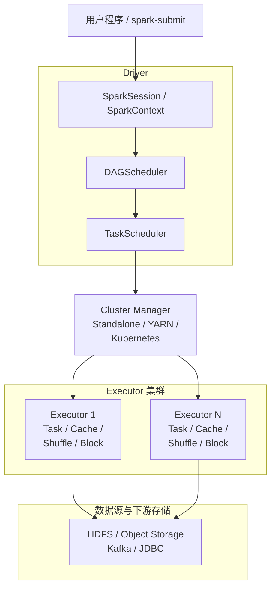

Driver 负责规划和协调，Cluster Manager 负责分配容器或进程资源，Executor 负责执行 Task。文件数据通常由 Executor 直接从数据源读写，不经过 Driver。[S2]

### 2.2 Application、Job、Stage、Task 的关系

- **Application**：一次 `spark-submit` 启动的应用，包含一个 Driver 和它申请的 Executor。
- **Job**：一个 Action 触发的一次计算作业。一个 Application 可以产生多个 Job。
- **Stage**：DAGScheduler 在 Shuffle 依赖处切分出的执行阶段。一个 Stage 内通常是可以流水执行的窄依赖链。
- **Task**：处理一个 Stage 的一个目标分区的最小执行单元。一个 Stage 通常按其目标 RDD 或物理算子的分区数生成 Task；输入分区、Shuffle 分区和 AQE 调整后的分区数可能不同。

SQL 的物理算子和 RDD Stage 并不是简单的一一对应；学习时要区分“用户可见的 SQL 计划”和“底层调度器执行的 Task”。

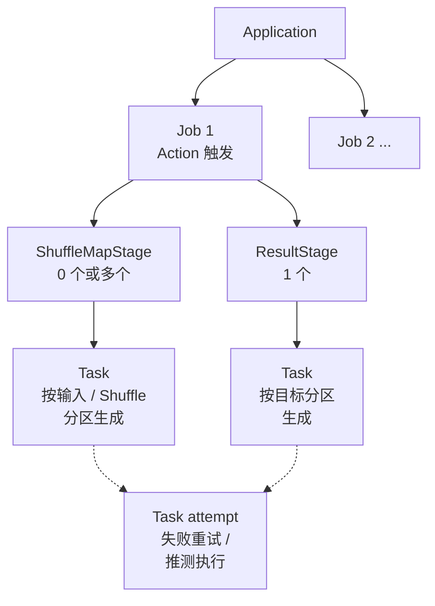

### 2.3 Driver 的职责

Driver 运行用户主程序，创建 SparkSession/SparkContext，构建 RDD 或 SQL 计划，向 Cluster Manager 申请资源，并由 DAGScheduler、TaskScheduler 将任务发给 Executor。Driver 还维护应用级调度状态、监听任务结果和处理失败重试。[S2][S4]

Driver 不是数据通道。把大量数据 `collect()`、`toPandas()` 或 `show()` 拉回 Driver，可能造成 Driver 内存溢出和网络瓶颈。

### 2.4 SparkSession 与 SparkContext

`SparkSession` 是 Spark SQL 应用的统一入口，包含 DataFrame/SQL 读写、Catalog、配置和对底层 SparkContext 的访问。`SparkContext` 是较底层的集群连接和 RDD 运行时入口，负责与 Cluster Manager 和调度器交互。[S7]

通常一个 JVM 内一个应用使用一个活跃的 SparkContext；SparkSession 可以通过 `newSession()` 创建隔离 SQL 会话，但这些会话仍共享底层 SparkContext 和计算资源。不要在业务循环中反复创建 SparkSession。

### 2.5 DAGScheduler

DAGScheduler 把 RDD 依赖图转换为 Stage，识别 Shuffle 边界，提交可执行的 TaskSet，并处理 Stage 级失败、重试和结果回调。它不直接负责把每个 Task 发送到具体 Executor，那是 TaskScheduler 和后端的职责。[S4]

### 2.6 TaskScheduler

TaskScheduler 接收 DAGScheduler 的 TaskSet，根据调度池、优先级、数据本地性和可用资源选择执行位置，并通过 SchedulerBackend 与 Executor 通信。不同 Cluster Manager 主要通过不同的 SchedulerBackend 对接资源管理系统。

### 2.7 Executor

Executor 是运行在工作节点或容器中的进程，负责执行 Task、缓存分区、参与 Shuffle、与 Driver/其他 Executor 通信并上报指标。一个 Executor 通常包含多个执行线程；`spark.executor.cores` 提供 CPU 并发能力，但实际任务槽位还受 `spark.task.cpus`、ResourceProfile、GPU 等自定义资源、分区数和资源调度限制。对于 CPU 任务，可以近似理解为 `floor(executor cores / task cpus)`。

Executor 进程丢失后，已缓存的分区可能需要重算或重新读取，已生成的 Shuffle 输出也可能需要重新计算，除非使用了相应的外部 Shuffle、Shuffle Tracking 或迁移机制。

### 2.8 Cluster Manager

Cluster Manager 负责向 Spark Application 分配 Executor 所需的 CPU、内存和其他资源。Spark 自带 Standalone，也可以运行在 YARN、Kubernetes 等外部资源管理器上。[S2]

Cluster Manager 不等于 Spark 的 DAGScheduler：前者负责“给多少机器/容器”，后者负责“作业如何拆分和执行”。

### 2.9 SparkEnv、RpcEnv 与 Spark 内部服务

`SparkEnv` 是 Driver 或 Executor 的运行时环境容器，集中装配 RPC、序列化、BlockManager、ShuffleManager、广播和指标等服务。`RpcEnv` 提供基于 Endpoint 的异步消息通信，Driver 和 Executor 通过它交换注册、任务、状态和心跳信息。具体类名和内部调用会随版本变化，不应把源码内部实现当成稳定公共 API。[S4]

### 2.10 BlockManager 与 MapOutputTracker

`BlockManager` 管理 RDD 缓存、广播块、Shuffle 相关块以及本地/远程块传输。它负责根据 StorageLevel 将数据存放在内存、磁盘或堆外区域，并提供块的读写接口。

`MapOutputTracker` 维护 Shuffle Map Task 产出的分区位置。Driver 侧保存全局映射，Executor 侧缓存查询结果；Reduce Task 根据这些位置拉取对应的 Shuffle 数据。Map 输出位置丢失时，Spark 可能重新运行对应的 Map Stage。

### 2.11 ShuffleManager 与 BroadcastManager

`ShuffleManager` 为 Shuffle 注册 Handle，并创建 Map 端写器和 Reduce 端读取器。Spark 3.5.x 默认实现是 Sort-based Shuffle；其他实现或 Push-Based Shuffle 需要满足版本和部署条件，不能只凭旧版面试资料判断。[S4][S5]

`BroadcastManager` 负责创建和管理广播变量，把只读对象拆分、传输并在 Executor 侧缓存。广播变量适合小型、稳定、只读的维表或模型参数，不适合替代大表 Join 或共享可变状态。

### 2.12 OutputCommitCoordinator

OutputCommitCoordinator 用于协调同一分区的多个 Task 尝试，避免多个尝试同时获得“提交输出”的许可。它只能解决 Spark 任务尝试之间的提交协调，最终结果是否安全还依赖 Hadoop OutputCommitter、文件系统或对象存储的提交协议以及 Sink 本身的幂等性。[S26][S27][S28]

### 2.13 LiveListenerBus 与 Spark Metrics

`LiveListenerBus` 将 Job、Stage、Task、SQL 和 Executor 等事件分发给监听器，Spark UI、History Server 的事件记录和自定义监听器都依赖事件体系。Metrics System 则按配置输出 Driver、Executor、Shuffle、JVM 等指标；事件日志和指标不是同一个东西，前者描述生命周期事件，后者用于时间序列监控。[S10]

### 2.14 Worker、NodeManager 与 Kubernetes Pod

Standalone 中 Worker 管理本机 Executor；YARN 中 NodeManager 管理 Container；Kubernetes 中 Driver 和 Executor 通常以 Pod 运行。它们是资源管理平台的运行单元，Executor 才是 Spark 任务执行进程。不同平台的网络、日志、身份和动态资源能力不同。[S12][S13]

### 2.15 Spark 的部署模式

- **local**：Driver 在本机，Executor 以本地线程运行，适合开发和单元测试，不代表生产集群行为。
- **Standalone**：使用 Spark 自带 Worker/Master 管理资源。
- **YARN**：由 YARN ResourceManager/NodeManager 管理容器，适合已有 Hadoop 平台。
- **Kubernetes**：使用 Pod 和 Kubernetes API 管理 Driver/Executor，适合容器化平台。

部署模式只改变资源和进程管理方式，不改变 Spark SQL、RDD 和大部分调度抽象。

### 2.16 Client 模式与 Cluster 模式

Client 模式下 Driver 运行在提交命令的客户端机器上，客户端需要持续在线并保持网络可达；Cluster 模式下 Driver 由集群管理器放入集群容器中，提交端可以退出，日志需要从集群平台或 History Server 查看。YARN 和 Kubernetes 对两种模式的参数名称和支持细节不同。[S2][S12][S13]

### 2.17 Standalone、YARN、Kubernetes 的对比

| 维度 | Standalone | YARN | Kubernetes |
| --- | --- | --- | --- |
| 资源管理 | Spark 自带 | Hadoop 资源管理 | Kubernetes 调度 |
| 适合环境 | Spark 专用集群 | Hadoop 生态集群 | 云原生/容器平台 |
| 队列与多租户 | 能力相对简单 | 队列、容量和权限体系成熟 | 依赖 Namespace、Quota、RBAC 等 |
| 运行单元 | Worker/Executor | NodeManager/Container | Pod |
| 运维重点 | Master/Worker 与节点 | YARN 队列、Kerberos、Container | 镜像、ServiceAccount、网络和存储 |

选型应根据已有平台、资源隔离、认证、数据访问、镜像体系和运维团队决定，不宜只按性能比较。

## 3. Spark 编程模型

### 3.1 RDD、DataFrame 与 Dataset

RDD 是带有分区、依赖和计算函数的不可变分布式数据集；DataFrame 是带 Schema 的分布式表结构，能被 Spark SQL 优化；Dataset 是带编译期类型的结构化 API，主要用于 Scala/Java。PySpark 的主流结构化接口是 DataFrame，不提供 Scala/Java 意义上完全相同的 Dataset 类型安全能力。[S3][S7]

实践中优先使用 DataFrame/SQL；只有需要细粒度自定义分区、非结构化对象或 RDD 特有算子时才退回 RDD。

### 3.2 Transformation 与 Action

Transformation（如 `map`、`filter`、`select`、`join`）生成新的 RDD/DataFrame 或逻辑计划，通常不立即执行；Action（如 `count`、`collect`、`write`、`save`）需要结果，才触发 Job。一个 Action 只代表一次触发，不代表所有上游数据已经永久缓存。

### 3.3 Lazy Evaluation

惰性求值让 Spark 可以在 Action 到来前观察完整的算子链，合并窄依赖、下推过滤、裁剪列并选择 Join 策略。它也意味着调用 `df.cache()` 不会立即把数据装入内存，通常需要后续 Action materialize；重复执行多个 Action 时，应确认是否真的需要缓存。

### 3.4 DAG 与执行计划

RDD API 通过依赖关系形成 DAG；Spark SQL 还会经历解析、分析、逻辑优化、物理计划选择和执行代码生成。DAG 是计算依赖图，不等于线程图，也不等于最终会生成一个 Task；真正的 Task 数量受 Stage 分区数、过滤、AQE 和资源情况影响。[S7][S8]

### 3.5 分区与并行度

分区是 Spark 并行处理数据的基本单位，一个分区通常对应一个 Task。分区过少会导致并行度不足和单 Task 数据过大；分区过多会增加调度、网络和文件开销。输入分区数、Shuffle 分区数、输出文件数和 Executor 核数是不同概念，不能简单设置成同一个值。

### 3.6 Partitioner

Partitioner 定义键值数据如何映射到分区，常见实现有 HashPartitioner 和 RangePartitioner。它主要存在于 Pair RDD；DataFrame/SQL 的分布通常由物理算子和 Shuffle Exchange 管理。相同分区器可以减少部分键值操作的重复 Shuffle，但不能保证所有后续操作都不发生 Shuffle。

### 3.7 数据本地性

Spark 会优先把 Task 调度到数据所在节点、同机架或更近的网络位置，降低输入读取成本。对远程对象存储、缓存未命中和 Shuffle Read 来说，传统的“数据本地性”收益可能不同；本地性是调度偏好，不是绝对保证。[S4]

### 3.8 序列化机制

Java/Scala 对象在网络传输、缓存和 Shuffle 中需要序列化。JavaSerializer 兼容性好但通常较大，KryoSerializer 通常更快更紧凑，但自定义类型可能需要注册以获得更稳定的大小和性能。Spark SQL 的 UnsafeRow、二进制格式和代码生成是结构化执行路径的另一套表示方式。[S6][S7]

### 3.9 广播变量

广播变量把只读数据分发到各 Executor，任务通过本地副本访问，避免每个 Task 重复携带同一对象。广播变量不能在 Task 中修改来实现全局共享状态；修改只会影响本地副本，且可能因重试产生不确定结果。使用后可调用 `unpersist` 或 `destroy`，具体生命周期取决于使用方式。

### 3.10 累加器

累加器适合计数器、运行统计和调试指标。Executor 端只能累加，Driver 端读取；在 Transformation 中更新时，Task 重试、推测执行或重新计算可能导致更新重复或不稳定，因此不能用累加器更新业务数据库、实现精确业务计费或作为控制流条件。[S3]

### 3.11 共享变量的使用边界

广播变量解决“只读数据如何高效分发”，累加器解决“任务如何向 Driver 汇报运行统计”。累加器不应被当作精确业务事实，二者都不是通用分布式锁、事务变量或一致性数据库。需要跨任务共享可变状态时，应使用外部存储、幂等 Sink 或专门的状态计算机制。

## 4. RDD 核心原理

### 4.1 RDD 的定义

RDD（Resilient Distributed Dataset）是不可变、可分区、可并行操作并可从故障中恢复的分布式数据集抽象。它不保存数据副本的全局数据库式目录，而是保存如何从输入或父 RDD 计算出当前分区的关系。[S3]

### 4.2 RDD 的五大特性

RDD 通常包含：分区列表、每个分区的计算函数、父依赖关系、可选的优选位置，以及键值 RDD 可选的 Partitioner。这些信息共同支持调度、数据本地性、Shuffle 和 Lineage 重算。

### 4.3 RDD 的分区机制

文本文件通常按输入分片生成分区，Pair RDD 的 `partitionBy` 或 Shuffle 算子会重新分区。`getNumPartitions()` 只能反映当前 RDD 的分区数，不能直接推导输出文件数、Executor 数量或最终数据大小。

### 4.4 RDD 的依赖关系

依赖描述子 RDD 如何从父 RDD 读取数据。窄依赖下，每个父分区至多被一个子分区使用，常见为一对一或按固定规则映射；宽依赖下，一个父分区可能被多个子分区使用，子分区通常需要跨多个父分区重新分布数据，对应 Shuffle。依赖关系决定 Stage 边界和故障恢复成本。

### 4.5 窄依赖与宽依赖

| 维度 | 窄依赖 | 宽依赖 |
| --- | --- | --- |
| 数据关系 | 每个父分区至多被一个子分区使用 | 一个父分区可能被多个子分区使用，通常需要跨多个父分区取数 |
| 是否通常 Shuffle | 否 | 是 |
| Stage 影响 | 可在同一 Stage 连续执行 | 通常形成 Stage 边界 |
| 示例 | `map`、`filter`、部分 `union` | `groupByKey`、`reduceByKey`、`join`、`sortByKey` |

“一对一”只是窄依赖的常见形式；判断标准是每个子分区是否只依赖有限的父分区，而不是只看算子名称。

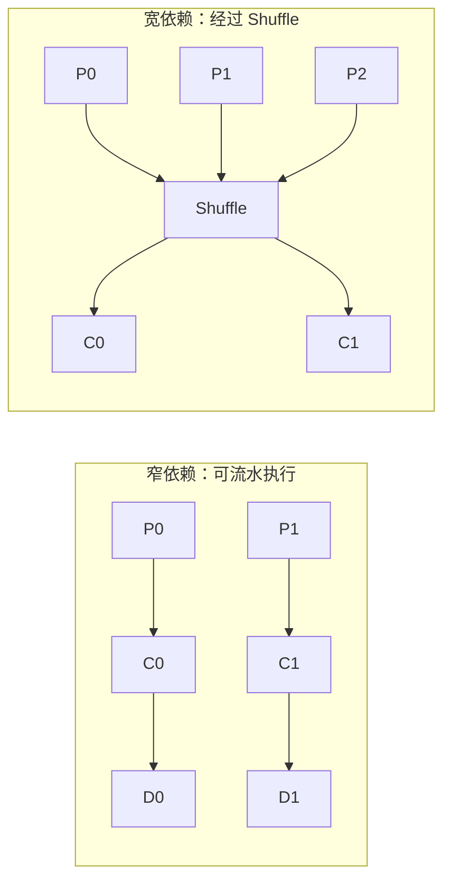

### 4.6 RDD Lineage

Lineage 是 RDD 从输入到当前结果的依赖链。某个分区丢失时，Spark 可以根据 Lineage 重新运行必要的上游分区，而不必把所有中间结果都复制到可靠存储。Lineage 很长、重复计算昂贵或状态迭代频繁时，应考虑 Checkpoint。[S3]

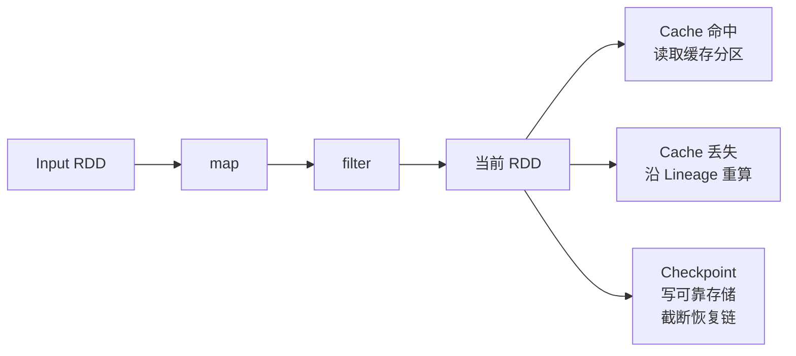

### 4.7 RDD 的容错机制

Task 失败通常由调度器重试；缓存分区丢失时可以通过 Lineage 重算；Shuffle 输出丢失时可能重新运行对应的 Map Stage；Checkpoint 则把数据或状态写入可靠存储并截断 Lineage。副本、缓存和 Checkpoint 的可靠性与成本不同，不能把“缓存成功”当作灾备备份。

### 4.8 RDD 常用 Transformation

常见算子包括 `map`、`filter`、`flatMap`、`mapPartitions`、`union`、`distinct`、`sample`、`sortByKey`、`partitionBy` 和键值聚合。要关注返回类型、是否触发 Shuffle、分区数是否变化以及闭包是否捕获了不可序列化对象。

### 4.9 RDD 常用 Action

常见 Action 包括 `count`、`collect`、`take`、`first`、`reduce`、`foreach`、`saveAsTextFile` 和 `saveAsObjectFile`。`collect` 会把全部结果拉回 Driver，只适合结果规模已知且很小的场景；生产代码通常写入分布式 Sink。

### 4.10 Pair RDD 与键值操作

Pair RDD 以 `(K, V)` 为元素，支持 `reduceByKey`、`aggregateByKey`、`combineByKey`、`join`、`cogroup`、`sortByKey` 等操作。键值算子通常会按照 Partitioner 重新分布数据，需从 Shuffle 数据量和聚合能力判断成本。

### 4.11 map、mapPartitions 与 mapPartitionsWithIndex

`map` 逐元素调用函数；`mapPartitions` 以分区迭代器为单位调用一次，适合复用数据库连接、模型或客户端，但必须正确关闭资源；`mapPartitionsWithIndex` 额外提供分区编号，适合分区级调试或分片逻辑。分区级资源不能无限持有，否则会压垮外部系统。

### 4.12 reduceByKey、groupByKey 与 aggregateByKey

`reduceByKey` 和 `aggregateByKey` 可以在 Map 端预聚合，通常比先把全部值 `groupByKey` 更省网络和内存；`groupByKey` 适合确实需要完整值集合的场景。聚合函数应满足相应的结合性/交换性要求，否则并行计算结果可能不稳定或不符合预期。

### 4.13 join、cogroup 与 combineByKey

`join` 按键连接两个 Pair RDD，通常需要共同的分区策略；`cogroup` 把同一键的两侧值分别聚合成迭代器；`combineByKey` 是构造带有本地聚合和跨分区合并逻辑的底层工具。大表 Join 前应评估数据倾斜、广播可能性和 Shuffle 规模。

### 4.14 RDD 持久化与缓存级别

`persist` 通过 StorageLevel 指定内存、磁盘、序列化和副本等策略；`cache` 是默认持久化级别的便捷调用。缓存是可丢弃的中间结果，内存不足时可能被逐出，丢失后可以重算。序列化缓存通常节省内存，但读取时可能增加反序列化成本。[S3][S6]

### 4.15 Cache、Persist 与 Checkpoint

Cache/Persist 主要优化重复计算，数据仍可通过 Lineage 重算；Checkpoint 把结果写入可靠存储，主要用于截断过长 Lineage 和提高恢复边界。RDD `checkpoint()` 通常需要先设置可靠的 checkpoint 目录，并在 Action 中物化；`localCheckpoint()` 速度更快但不保证节点故障后的恢复，不能替代可靠 Checkpoint。[S3]

## 5. Spark 作业执行流程

### 5.1 从提交应用到任务执行的完整流程

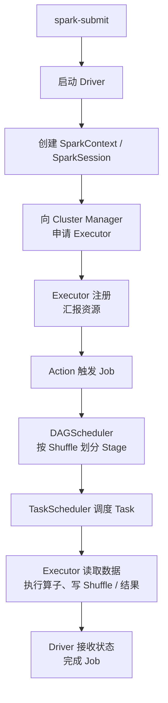

Driver 只发送任务和控制信息，实际数据通常在 Executor 与数据源、Shuffle 服务之间流动。[S2][S4]

### 5.2 用户代码如何生成执行计划

RDD API 直接构建 RDD 依赖图；SQL/DataFrame API 先构建未解析的逻辑计划，再经过 Analyzer、优化规则、物理计划选择和代码生成。真正执行前，`explain()` 可以查看部分计划，但物理计划和运行时分区可能受统计信息、AQE 和数据规模影响。

### 5.3 Job 的触发过程

Action 调用 DAGScheduler 的 Job 提交入口，DAGScheduler 根据目标分区反向遍历依赖，创建需要执行的 Stage，优先提交上游 Shuffle Stage，待其成功后再提交下游 Stage。一个应用中多个 Action 会形成多个 Job，除非显式缓存，否则它们可能重复读取和计算相同上游数据。

### 5.4 Stage 的划分过程

SQL 物理计划先由执行层转换为可执行算子及其 RDD；DAGScheduler 再依据 RDD 的依赖关系，在宽依赖/Shuffle 处切分 Stage。窄依赖链可以在一个 Stage 内流水执行；ShuffleMapStage 产生可供下游读取的中间分区，ResultStage 产生最终 Action 结果。SQL 物理计划中的 Exchange 通常代表数据重新分布，但不应把每个 Exchange 机械等同为一条固定 Stage，实际执行还受版本和 AQE 影响。

### 5.5 Task 的生成与提交

一个 Stage 按其分区生成 Task。Task 会携带序列化后的闭包、依赖信息和分区编号，由 TaskScheduler 根据数据本地性和资源安排到 Executor。Task 不是永久绑定某个节点的对象，失败后可能在其他 Executor 上重新执行。

### 5.6 Task 的调度与执行

Executor 获取 Task 后反序列化闭包，读取输入分区，逐步执行算子，并汇报状态、指标和结果。Task 的运行时间包含计算、输入读取、Shuffle、序列化、GC 和输出等部分，不能只看用户函数耗时。

### 5.7 ShuffleMapStage 与 ResultStage

ShuffleMapStage 的输出按下游分区写入 Shuffle 文件并记录 MapStatus；ResultStage 的 Task 读取上游结果并完成 Action，例如把结果返回 Driver 或写入文件。一个 Job 通常包含一个 ResultStage，以及为它准备数据的零个或多个 ShuffleMapStage；一个 Application 才可能包含多个 Job 和多个 ResultStage。[S4]

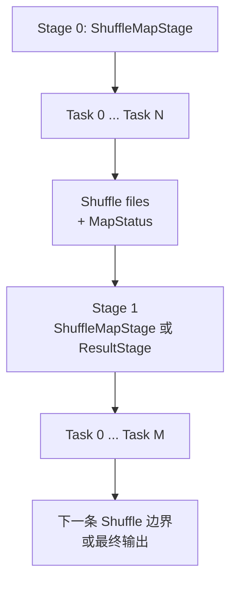

### 5.8 Stage 重试与 Task 重试

单个 Task 因偶发网络、Executor 或数据问题失败时，Spark 会按配置重试；若一个 Stage 反复失败，Job 最终会失败。Shuffle 文件丢失可能导致下游 Fetch 失败并触发上游重算。重试并不保证业务副作用安全，因此外部写入必须设计幂等或使用合适的提交协议。

### 5.9 Executor 注册与心跳

Executor 启动后向 Driver 注册，定期发送心跳和任务指标。Driver 通过心跳判断 Executor 是否活跃；心跳超时可能触发 Executor Lost、Task 重试和 Shuffle 重算。Executor 心跳超时不等价于机器已经永久宕机，也可能由长时间 GC、网络拥塞或资源耗尽引起。

### 5.10 任务取消与作业失败

用户可以取消 Job 或整个应用，调度器会向相关 Executor 发送中断请求；正在执行的用户代码不一定能立即停止。失败排查要区分用户异常、数据格式异常、资源不足、节点故障、Shuffle Fetch 失败和外部 Sink 错误。

### 5.11 Task Locality 与 Delay Scheduling

任务位置通常按 PROCESS_LOCAL、NODE_LOCAL、NO_PREF、RACK_LOCAL、ANY 等层级选择。Spark 可以短暂等待更好的本地性，也可以在等待超时后选择较远节点；这就是 Delay Scheduling。对象存储读取、远程 Shuffle 和缓存未命中时，本地性等级不一定是主要性能因素。[S4]

### 5.12 Barrier Execution Mode

Barrier 模式要求同一 Stage 的一组 Task 协同启动，适合需要并行任务共同初始化的算法，例如部分分布式训练。它对可用资源、Task 数量和失败恢复有更严格要求；若不能同时启动全部任务，Stage 可能长时间等待或失败，不应作为普通 RDD 算子的默认模式。

### 5.13 Executor 黑名单与失败排除

现代 Spark 使用 `spark.excludeOnFailure.*` 等机制记录反复失败的 Executor、节点或任务位置，减少把任务继续派发到有问题的资源上。旧资料中的 `spark.blacklist.*` 可能属于历史版本术语，具体参数应以目标版本配置文档为准。[S5]

## 6. Spark SQL 与 DataFrame

### 6.1 Spark SQL 的定位

Spark SQL 是 Spark 的结构化数据处理模块，提供 SQL、DataFrame 和 Dataset API，并结合 Catalyst、物理算子、UnsafeRow 和代码生成等机制执行结构化计算。它可以读取文件、Hive 表、JDBC、Kafka 和 Data Source V2 表，但元数据、事务和数据文件生命周期仍由外部系统或表格式决定。[S7]

### 6.2 DataFrame 的核心概念

DataFrame 可以理解为带 Schema 的分布式数据集，逻辑上类似关系表，但物理上仍由多个分区和 Task 执行。DataFrame 的列表达式可以被 Spark 分析和优化，通常比把每条记录转换为普通 JVM 对象的 RDD 更容易获得列裁剪、谓词下推、代码生成和高效内存表示。

### 6.3 Dataset 的核心概念

Dataset 在 Scala/Java 中把结构化行与静态类型结合起来，使用 Encoder 在 JVM 对象与 Spark 内部表示之间转换。它不是“比 DataFrame 永远更快”的 API；一旦频繁转换为用户自定义对象，可能增加序列化和对象开销。PySpark 主要使用 DataFrame API，不具备 Scala/Java Dataset 的编译期类型检查。

### 6.4 SQL、DataFrame 与 RDD 的关系

SQL 和 DataFrame 通常共享 Spark SQL 的逻辑/物理优化器；RDD 更接近底层计算抽象，表达能力灵活但优化器无法理解任意用户函数内部逻辑。可以通过 `rdd` 和 `createDataFrame` 转换，但转换会带来 Schema、序列化和优化边界，不能把三者视为零成本互换。

### 6.5 Schema 推断与显式 Schema

读取 JSON、CSV 等半结构化数据时，Spark 可以推断 Schema，但推断需要扫描或采样数据，且可能受脏数据、空值和类型混合影响。生产作业优先定义显式 Schema，并明确坏记录处理策略；Parquet/ORC 等列式格式通常携带 Schema，但跨版本演进仍需治理。

### 6.6 Row 与 UnsafeRow

DataFrame 的一行通常以 `Row` 形式暴露给用户；物理执行中常使用 Spark 内部的二进制行表示 `UnsafeRow`，以减少对象创建、支持高效排序和代码生成。UnsafeRow 是内部表示，用户不应依赖其未公开的字节布局。

### 6.7 Spark SQL 执行流程

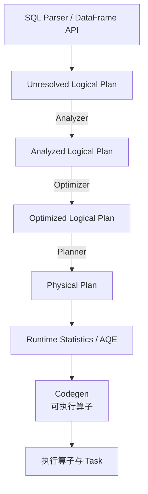

实际执行计划可用 `df.explain("extended")`、`formatted` 或 `cost` 等模式查看。计划是诊断起点，最终性能还要结合 Spark UI 的输入、Shuffle、Spill、Task 分布和运行时指标。

### 6.8 Catalyst 优化器

Catalyst 是 Spark SQL 的查询优化框架。Analyzer、逻辑优化规则，以及物理规划和代码生成中使用的部分 Catalyst 规则与组件都属于 Catalyst 体系；在学习流程中通常把 SQL Parser 作为生成 Unresolved Logical Plan 的前置阶段，把 SparkPlan 的实际执行归入运行时阶段。因此，Catalyst 不等于整个 SQL 执行引擎。常见规则包括常量折叠、谓词下推、列裁剪、表达式简化和子查询重写。Catalyst 不会理解任意 UDF 内部逻辑，因此把大量业务逻辑包在 UDF 中可能阻断优化。

### 6.9 Parser 与 Unresolved Logical Plan

Parser 把 SQL 文本或 API 表达式转换为未解析逻辑计划。此时表、列和函数可能还没有绑定到具体 Catalog、Schema 或数据类型，因此计划中可能出现 UnresolvedRelation、UnresolvedAttribute 等节点。语法正确不代表列名、类型和表权限一定正确。

### 6.10 Analyzer 与 Logical Plan

Analyzer 根据 Catalog、Session 状态和函数注册表解析表、列、别名、数据类型和函数，生成 analyzed logical plan。常见失败包括表不存在、列歧义、类型不匹配、函数未注册和权限不足。分析阶段主要解决“这条语句指向什么”，不等于已经决定“如何最快执行”。

### 6.11 Logical Plan 优化

逻辑优化不改变结果语义，而是重写计算表达式。例如把过滤条件尽量下推到数据源、删除不需要的列、折叠常量、简化布尔表达式、消除不必要的 Project。优化能否真正减少读取量，还取决于数据源是否支持对应的过滤/列读取接口。

### 6.12 Physical Plan 选择

物理规划器根据逻辑计划和统计信息选择具体算子，例如 BroadcastHashJoin、SortMergeJoin、ShuffledHashJoin、FileScan、Exchange 和 WindowExec。`EXPLAIN` 中看到的算子是计划选择结果，不保证运行时不会被 AQE 重新优化；Join 策略还会受到广播阈值、统计信息和内存的影响。[S8]

### 6.13 Cost-Based Optimizer

Cost-Based Optimizer 使用表或列统计信息估算行数、大小和 Join 成本，帮助选择 Join 顺序和物理策略。统计信息过期、缺失或与真实数据分布差异很大时，CBO 可能做出错误选择；应结合 `ANALYZE TABLE`、数据源统计和实际执行计划验证，不要把 CBO 当作无条件正确的黑盒。

### 6.14 Tungsten 执行引擎

Tungsten 是 Spark 2.x 时代对一组执行优化方向的统称，包括内存管理、二进制表示和代码生成。学习时可把它理解为 Spark SQL 高效执行的历史概念，而不是一个可以单独启停的服务。当前 Spark 的性能还取决于具体物理算子、UnsafeRow、Whole-Stage Codegen、列式读取和 AQE。

### 6.15 Whole-Stage Code Generation

Whole-Stage Codegen 把一段可融合的物理算子生成更紧凑的 Java 代码，减少虚函数调用和中间对象。并非所有算子都能融合；Python UDF、某些复杂表达式、外部数据源和代码生成失败都会形成边界。过度复杂的表达式还可能导致生成代码过大或编译开销增加。

### 6.16 用户自定义函数 UDF

UDF 可以表达 Spark 内置函数无法覆盖的逻辑，但 UDF 会对 Catalyst 隐藏函数内部语义，可能阻断 UDF 内部的谓词下推并削弱部分代码生成和其他优化；如果 UDF 参数显式引用列，Spark 仍可识别这些外部列依赖并进行一定程度的列裁剪。Python UDF 还需要跨 JVM 与 Python Worker 传输数据。优先使用内置表达式；必须使用 UDF 时，显式限定输入列、控制数据量并评估序列化成本。

### 6.17 Pandas UDF 与向量化执行

Pandas UDF 通过 Arrow 在 JVM 与 Python 之间按批传递列式数据，通常比逐行 Python UDF 更高效，但仍有 Python 执行成本、批大小、内存和 Arrow 兼容性要求。Pandas UDF 不等于自动向量化所有逻辑，数据类型、空值、时区和批边界仍需测试。[S16][S21]

### 6.18 Catalog、Database 与 Namespace

Catalog/SessionCatalog 是 Spark SQL 用于解析和管理表、视图、函数及数据库/Namespace 的元数据抽象，具体支持的对象类型和能力取决于 Catalog 实现及其 Plugin。Spark SQL 的多级名称通常形如 `catalog.namespace.table`；未写全限定名时，会按照当前 Catalog 和当前 Database/Namespace 解析。Catalog 和相关 Plugin 可以把表映射到 Hive Metastore、内置 SessionCatalog 或 Iceberg 等外部表格式；其中 `SessionCatalog` 是 Spark 内部的目录实现，不应与外部 Catalog Plugin 混为一谈。

### 6.19 Hive Metastore

Hive Metastore 是常见的表元数据服务，保存表名、Schema、分区、位置、SerDe 和表属性等信息。Spark 可以通过 Hive 支持连接它，但 Spark SQL 的临时视图和部分 Data Source 表不一定需要 Hive Metastore。Metastore 可用性、Schema 缓存和权限配置会直接影响 SQL 作业启动和分析阶段。[S7]

### 6.20 Managed Table 与 External Table

Managed Table 的数据位置和生命周期通常由 Catalog/SQL 层管理，删除表可能同时删除数据；External Table 的元数据指向外部已有位置，删除表通常只删除元数据，数据文件仍由外部流程负责。具体行为受 Spark、Hive 版本、表格式和建表方式影响，生产环境应显式指定位置和删除策略，不能只依赖“managed/external”名称推断所有行为。

### 6.21 临时视图、全局临时视图与永久视图

临时视图绑定当前 SparkSession；全局临时视图绑定应用内的 `global_temp` 数据库，可被同一应用的其他 Session 访问；永久视图需要持久化 Catalog/Metastore 元数据。视图保存的是查询定义，不等于物化数据；底层表 Schema 或权限变化可能影响后续查询。

### 6.22 DDL、DML、CTAS 与 INSERT

DDL 用于创建和修改数据库、表、视图、函数；DML 通常指插入、更新或删除数据，查询则通常单独称为 DQL 或查询语句。CTAS（Create Table As Select）用查询结果创建表，`INSERT INTO` 通常追加，`INSERT OVERWRITE` 通常覆盖目标分区或表。是否支持 UPDATE/DELETE/MERGE 以及它们的事务语义，取决于目标表格式和 Catalog，不是 Spark 文件写入本身自动提供的能力。

### 6.23 Data Source Table 与 Table Provider

Data Source API 让 Spark 通过格式或 Connector 读取/写入数据。Parquet、ORC、JDBC、Kafka 和湖表格式都可能以不同的 Provider 暴露表能力；读取格式不等于拥有表事务，`format("parquet")` 与 Iceberg/Hudi/Delta 表的元数据和提交语义不能混为一谈。

### 6.24 SQL Extension 与 Catalog Plugin

SQL Extension 可以注册自定义解析、分析、优化或规划规则；Catalog 相关扩展可以把表、Namespace 以及部分读写/事务能力接入外部表格式，函数扩展则由相应的 FunctionCatalog 或注册机制负责。它们是扩展点，不是默认开启的 Spark 功能。使用扩展时必须锁定 Spark、Scala、表格式和 Connector 版本，否则可能出现类加载、计划兼容或提交协议错误。

### 6.25 NULL 与三值逻辑

SQL 中条件结果可能是 TRUE、FALSE 或 UNKNOWN。普通 `WHERE` 只保留 TRUE，因此 `NULL = NULL` 不是 TRUE；应使用 `IS NULL`、`IS NOT NULL` 或结合 null-safe equality `<=>`。聚合、Join、排序和 `NOT IN` 对 NULL 的行为都应按 SQL 语义测试，不能套用 Java/Scala 的布尔判断。

### 6.26 类型转换、日期时间与时区

隐式类型转换可能导致精度丢失、字符串解析差异或 Join 条件不符合预期。日期时间处理还涉及 Session 时区、数据源时区、夏令时和字符串格式；生产数据应统一时区和格式，显式 cast，并通过边界日期、NULL 和跨时区样例测试。

### 6.27 Window Function

Window Function 在分区内按排序和窗口范围计算排名、累计值、偏移值或聚合，例如 `row_number`、`rank`、`lag` 和窗口 `sum`。它通常需要按分区键重分布并排序，数据倾斜和窗口过大时成本很高；窗口的 `partitionBy`、`orderBy` 和 frame 定义必须明确。

### 6.28 UDAF 与 UDTF

UDAF 将多行聚合为一个值，适合自定义统计；UDTF 将一行或一组输入展开为多行。优先使用内置聚合和表函数；自定义函数的注册 API、Python 支持和优化边界随 Spark 版本变化，尤其是 UDTF 应以目标版本文档为准。

### 6.29 Join 语义与 NULL Join

Inner、Left、Right、Full、Semi、Anti Join 的保留行规则不同；普通等值 Join 不会把两个 NULL 视为相等，若需要 null-safe Join 应显式使用相应表达式。Join 结果还可能因一对多关系发生行数膨胀，性能优化不能改变业务语义。

### 6.30 EXPLAIN 与执行计划查看

`df.explain()` 可查看物理计划，`extended` 可同时查看多个计划阶段，`formatted` 便于阅读，`cost` 显示统计估算，`codegen` 查看代码生成信息（具体模式以版本为准）。诊断时应关注 Scan 是否裁剪、是否出现 Exchange、Join 策略、分区数和是否发生 AQE 重写。

### 6.31 表缓存、元数据刷新与缓存失效

`cacheTable`/`CACHE TABLE` 缓存表或查询结果；`REFRESH TABLE`、`refreshByPath` 等操作用于刷新文件列表或元数据缓存。外部系统直接新增文件、改变 Schema 或替换目录后，Spark Session 可能仍持有旧元数据；缓存只能提高读取速度，不能替代表格式的事务快照和并发控制。

## 7. Spark Shuffle 机制

### 7.1 Shuffle 的定义与触发条件

Shuffle 是为了让具有相同分区键或目标分区的数据跨节点重新分布。`groupByKey`、`reduceByKey`、`join`、`sort`、SQL 的 `Exchange` 和很多窗口操作都可能触发 Shuffle。Shuffle 通常包含序列化、分区、排序/聚合、本地落盘、网络拉取和反序列化，是 Spark 中最常见的高成本边界。

### 7.2 Shuffle 的整体流程

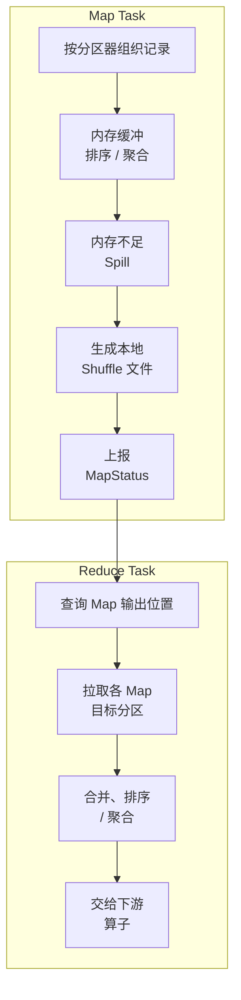

### 7.3 Map 端 Shuffle Write

Map Task 根据 Partitioner 计算目标分区，把记录写入 Shuffle writer。Sort-based Shuffle 通常按分区和排序需求组织数据，在内存不足时把中间数据 Spill 到本地磁盘并在结束时合并。Map Task 完成后向 Driver 汇报各分区输出的位置和大小等 MapStatus 元数据，而不是把所有数据直接放到 Driver。

### 7.4 Shuffle 数据分区与排序

分区器决定记录属于哪个 Reduce 分区；排序可能用于满足下游排序要求，也可能只是 Shuffle 实现为了高效组织文件。`reduceByKey` 的 map-side combine 可以减少相同键的网络数据，但不是所有算子都能安全预聚合。分区数应结合数据量、Key 分布、Task 并行度和输出文件目标设置。

### 7.5 Spill 与磁盘文件合并

当执行内存不足时，Spark 会把部分 Shuffle 数据 Spill 到本地磁盘。多个 Spill 文件随后可能被合并，压缩和序列化会影响 CPU、磁盘和网络。监控 Spark UI 中的 memory spill、disk spill、Shuffle Read/Write 和 Task 时间，才能判断是内存不足、分区过大还是数据倾斜。

### 7.6 Reduce 端 Shuffle Read

Reduce Task 从多个 Map 输出位置拉取自己负责的分区，可能同时进行本地读取和远程网络读取，然后按下游要求合并、排序或聚合。单个 Reduce 分区过大可能导致长尾、Executor OOM 或 Fetch 失败；Reduce 分区过多则会增加调度和小文件开销。

### 7.7 Sort-Based Shuffle

Sort-based Shuffle 是现代 Spark 的主流实现方向。它通过内存排序、Spill 和合并减少文件数量，相比早期为每个 Map/Reduce 对生成大量文件的 Hash Shuffle 更适合大规模任务。实现细节和文件组织属于内部行为，应用代码不应依赖具体临时文件名。

### 7.8 Hash-Based Shuffle 的历史演进

早期 Hash Shuffle 可能为每个目标分区生成单独文件，文件数量容易达到 Map 数乘以 Reduce 数，造成文件句柄和元数据压力。后续 Sort-based Shuffle 通过排序和合并改善了这一问题。面试中应说明这是历史实现对比，不要把 Spark 3.5.x 默认行为描述成旧版 Hash Shuffle。

### 7.9 Shuffle 文件管理

Shuffle 文件通常保存在 Executor 本地磁盘，由 BlockManager/ShuffleManager 和资源管理机制维护。Executor 被回收、磁盘损坏或本地目录清理后，输出位置可能失效并触发上游重算。External Shuffle Service、Push-Based Shuffle、Shuffle Tracking 和 Executor Decommission 都是在不同场景下减少重算或保护 Shuffle 的机制，不能混为一个开关。[S5]

### 7.10 Shuffle Fetch Failed

Fetch Failed 表示 Reduce 端无法从 Map 输出位置读取数据，常见原因包括 Executor 丢失、本地 Shuffle 文件损坏、网络超时、磁盘空间不足、版本/协议不兼容和数据过大。排查顺序通常是看失败 Map/Reduce、Executor 日志、节点磁盘、网络和重算情况；盲目增加重试次数可能掩盖根因。

### 7.11 Shuffle 数据可靠性

Shuffle 通常是可重建的中间结果，不等同于持久化业务数据。Map 输出丢失时，Spark 可以重新执行上游 Stage；若作业依赖外部副作用或上游数据已不可读，重算仍可能失败。需要长期保留或跨应用复用的数据，应写入可靠存储或表格式，而不是依赖临时 Shuffle 文件。

### 7.12 Shuffle 对性能的影响

Shuffle 成本主要来自数据跨网络搬运、排序/聚合、磁盘 Spill、序列化和下游拉取。优化重点包括减少输入列和行数、使用 map-side combine、合理设置分区、避免不必要的全局排序、处理数据倾斜和选择合适 Join 策略。提高 `spark.sql.shuffle.partitions` 不能消除单个倾斜 Key。

### 7.13 Push-Based Shuffle

Push-Based Shuffle 允许 Map 端把部分 Shuffle 数据主动推送到外部 Shuffle 服务的合并位置，使 Reduce 端读取更大的合并块，目标是降低大量小块远程读取的开销。它依赖特定 Spark 版本、资源管理器和外部 Shuffle 服务；在 Spark 3.5.x 官方支持范围中主要面向 YARN 配合 External Shuffle Service，通常需要显式配置并验证。它不是所有部署都支持，也不能替代数据倾斜治理。[S5]

## 8. Spark 内存管理

### 8.1 Driver 内存与 Executor 内存

Driver 内存用于用户主程序、逻辑/物理计划、调度状态和结果收集；Executor 内存用于 Task 执行、缓存、Shuffle 和用户代码。Driver 和 Executor 的内存问题成因不同：`collect`/`toPandas` 更容易造成 Driver 压力，单个大分区、广播表、聚合状态和 Python Worker 更容易造成 Executor 或容器压力。[S5]

### 8.2 JVM 堆内存与堆外内存

JVM 堆由 `spark.executor.memory` 或 `spark.driver.memory` 等参数控制；容器还需要为 JVM 非堆、Python 进程、Native 库和其他开销预留 memory overhead。启用 Spark off-heap 时，相关内存不属于普通 JVM heap，但仍要计入可用容器资源。调大 heap 而不增加 overhead 可能导致 YARN/Kubernetes 容器被杀。

### 8.3 Executor Memory Layout

一个 Executor 的资源预算通常包含 JVM Heap、Memory Overhead、可选的 Off-Heap，以及 Python Worker 等进程开销。Unified Memory Manager 在 Spark 管理的 Execution/Storage 区域中管理执行内存和存储内存，默认主要使用 Heap；启用 off-heap 后还会使用配置的堆外区域。用户对象、Python 数据、Native 库、Netty 缓冲等不一定落在这个统一池里。具体容器计算方式由 Spark 和 Cluster Manager 版本决定。[S5]

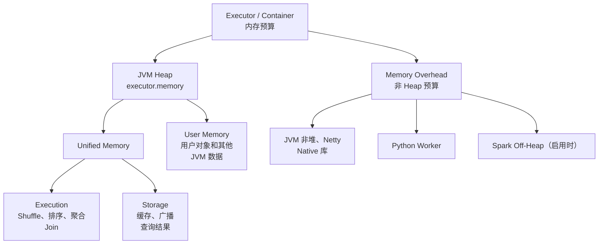

### 8.4 Unified Memory Manager

Unified Memory Manager 把用于 Spark 执行的区域划分为 Execution Memory 和 Storage Memory，两者在一定规则下共享资源。默认 `spark.memory.fraction` 在 Spark 3.5.x 配置中为 0.6，`spark.memory.storageFraction` 为 0.5；这些是内存计算参数，不是“Executor 总内存的直接百分比”，且实际可用空间还受保留内存和对象开销影响。[S5]

### 8.5 Storage Memory 与 Execution Memory

Execution Memory 用于 Shuffle、排序、聚合和 Join 等计算；Storage Memory 用于缓存 RDD、广播和部分查询结果。执行内存不足时可以驱逐一部分缓存，缓存通常不能驱逐正在使用的执行内存。缓存被驱逐后可以重算，因此缓存策略应基于重复读取收益，而不是把全部数据都缓存。

### 8.6 User Memory 与 Reserved Memory

统一内存池之外还存在用户代码、用户对象和 Spark 内部保留空间。不同 Spark 版本对 Reserved Memory、可用堆范围和容器 overhead 的描述不同；不要使用旧版博客中的固定公式替代目标版本官方配置。遇到 OOM 时，应先根据异常类型判断是 heap、overhead、off-heap、Python 或外部容器限制。[S5]

### 8.7 Memory Fraction 相关配置

常见参数包括 `spark.memory.fraction`、`spark.memory.storageFraction`、`spark.memory.offHeap.enabled`、`spark.memory.offHeap.size`、`spark.executor.memoryOverhead` 和 `spark.driver.memoryOverhead`。这些参数有强耦合关系，不能只把某个 fraction 调大就解决 OOM；应先减少单分区数据、控制广播、处理倾斜和降低对象数量。

### 8.8 内存溢出类型

- Java heap OOM：对象、聚合、广播或单分区数据超出 JVM heap。
- Container killed：YARN/Kubernetes 发现进程总内存超过容器限制，可能包含 overhead/Python/Native 开销。
- Direct/off-heap OOM：堆外缓冲或 Spark off-heap 不足。
- Driver OOM：结果收集、计划过大、广播构建或元数据过多。
- Python worker OOM：Pandas、Arrow 或 Python 对象占用超出预期。

日志中的异常类型比“把 executor memory 调大”更能指导排查。

### 8.9 Driver OOM 与 Executor OOM

Driver OOM 优先检查 `collect`、`toPandas`、`show`、广播构建、过大的 SQL 计划和过多小文件元数据；Executor OOM 优先检查单个分区大小、Join/聚合、广播、缓存、倾斜、Python 批大小和 overhead。增加节点数不能直接解决单个分区或单个倾斜 Key 超大。

### 8.10 GC 问题与对象数量

大量 JVM 对象、未序列化缓存、宽 Row、频繁 UDF 对象创建和过大的 Executor 都可能造成 GC 长尾。Spark UI 可观察 GC Time、Executor 内存和 Spill；优化通常包括使用结构化列式 API、Kryo/序列化缓存、降低每个 Executor 的并发任务数、减少对象创建和合理设置 heap，而不是只更换 GC 算法。

### 8.11 序列化对内存的影响

序列化能降低缓存和 Shuffle 的对象开销，也会引入编码/解码 CPU。Kryo 需要关注自定义类注册和兼容性；Python 端还涉及 Pickle/Arrow。应以实际数据类型和作业基准选择，不能把“启用 Kryo”当作所有作业的固定性能开关。[S6]

### 8.12 内存管理常见误区

- Spark 不是把所有输入都缓存到内存。
- Executor memory 不是容器总内存。
- 增加 `spark.sql.shuffle.partitions` 不一定减少单个倾斜 Key。
- `cache()` 不会立即物化数据，也不是备份。
- 加大 Driver 内存不能替代避免 `collect()`。
- 增加 Executor 数量不能解决每个 Task 本身就超大或广播表超大的问题。

## 9. Spark 性能优化

### 9.1 性能优化的分析方法

先建立基线，再通过 Spark UI、SQL 执行计划、事件日志、Executor 日志和数据统计定位瓶颈。重点区分：输入读取慢、计划不优、Shuffle 大、数据倾斜、GC/内存、节点/网络、输出提交和下游 Sink 慢。每次只改变少量参数，并用相同数据和业务结果对比。[S6][S8]

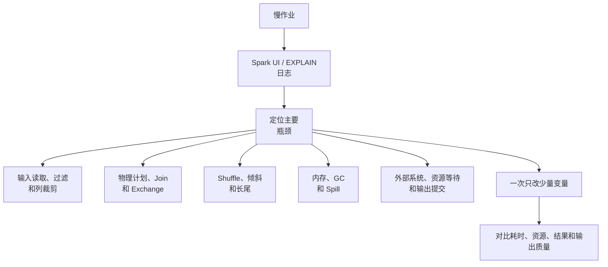

### 9.2 读取数据量优化

只读取需要的列和分区，避免无条件 `select *`、全表扫描和过早把数据转换为宽对象。优先使用 Parquet/ORC 等支持列式读取和统计的格式，合理设置文件大小，利用数据源的过滤下推。对 JDBC 读取要设置并行分片，但不能让并发连接压垮数据库。

### 9.3 谓词下推

谓词下推把过滤条件尽量交给数据源执行，减少扫描和网络传输。对列式文件，文件级统计和 Row Group 过滤可能跳过不满足条件的数据；但复杂 UDF、类型转换、非数据源支持的表达式可能阻断下推。用 `explain` 和数据源日志验证，而不要仅凭 SQL 文本推断。

### 9.4 列裁剪

列裁剪只读取后续算子需要的列，尤其适合宽表和 Parquet/ORC。避免在早期把 DataFrame 转成包含所有字段的对象；`select *` 本身不一定阻断列裁剪，如果后续列选择仍对 Catalyst 可见，优化器通常可以删除无用列。真正需要谨慎的是 UDF、普通对象转换等不透明边界：Spark 能识别 UDF 显式传入的列，但无法理解其内部逻辑。

### 9.5 分区裁剪

分区裁剪根据分区目录列过滤，跳过不相关目录。过滤条件要直接作用在分区列或可被优化器识别的表达式上；对分区列套复杂函数、隐式类型转换或缺少分区元数据可能降低裁剪效果。分区过细会造成大量小目录、小文件和 Task 调度开销。

### 9.6 合理设置分区数量

分区数量应综合输入数据量、目标 Task 数据大小、Executor 并行度、Shuffle 规模和输出文件目标。分区太少会造成长尾和资源闲置，太多会增加调度、序列化和文件开销。`spark.default.parallelism`、`spark.sql.shuffle.partitions` 和 AQE 的分区调整作用范围不同，不能混用。

### 9.7 repartition 与 coalesce

`repartition` 通常通过 Shuffle 重新均衡分区，可增加或减少分区；`coalesce` 主要合并分区，通常不触发完整 Shuffle，适合减少分区但可能造成数据不均。带列的 `repartition` 会按列重新分布，不能把它当作简单修改数字的元数据操作。

### 9.8 避免不必要的 Shuffle

减少重复 `distinct`、全局 `sort`、无必要的 `repartition` 和多次相同 Join；尽量让相同分区策略的数据复用分布。`groupByKey` 改为可预聚合的 `reduceByKey`/聚合表达式通常更好，但只有在业务聚合可结合时才适用。

### 9.9 Cache 与 Persist 的合理使用

缓存适合一个昂贵且会被多个 Action/分支重复使用的中间结果。缓存前估算分区大小和复用次数，缓存后确认 Spark UI 中已物化并命中；单次使用、数据量巨大或重算成本低的数据不应盲目缓存。使用完成后及时 `unpersist`，避免挤压其他作业。

### 9.10 广播 Join

Broadcast Hash Join 把小表广播到 Executor，让大表各分区在本地完成匹配，通常避免大表 Shuffle。自动广播由 `spark.sql.autoBroadcastJoinThreshold` 等配置和统计信息影响，默认值不能脱离版本引用；强制 broadcast 前必须确认每个 Executor 可用内存和小表实际大小，而不是只看压缩文件大小。[S8]

### 9.11 Sort-Merge Join

Sort-Merge Join 通常对两侧按 Join Key Shuffle、排序后合并，适合大表等值 Join，但会产生较大的网络、排序和 Spill 成本。数据已经按相同分区排序、统计信息准确且分区合理时，性能会更稳定；数据倾斜仍可能造成长尾。

### 9.12 Shuffle Hash Join

Shuffle Hash Join 先按 Join Key 重分区，在每个分区内构建一侧哈希表。它适合分区后单侧数据足够小且内存可控的场景；如果构建侧过大，可能出现内存压力，Spark 可能改选其他策略。具体是否选择该策略由版本、配置、统计和运行时计划决定。

### 9.13 Broadcast Nested Loop Join

Broadcast Nested Loop Join 不要求等值 Join Key，通常广播一侧后进行嵌套匹配，复杂度和内存代价可能很高。它适用于小表、非等值条件或特殊 Join 类型，不能把它当作普通广播等值 Join 的替代品。

### 9.14 数据倾斜识别

数据倾斜表现为少数 Task 的输入、Shuffle Read、运行时间或 Spill 远高于中位数，常见根因是热点 Key、空值 Key、分区分布不均、Join 一对多膨胀或极端文件。应结合业务 Key 频次、SQL 计划和 Spark UI 统计确认，不要只看 Stage 总耗时。

### 9.15 数据倾斜解决方案

- 过滤、拆分或单独处理热点 Key。
- 对可结合聚合使用 map-side combine。
- 对热点 Key 加盐并进行二次聚合。
- 小表足够小时使用广播 Join。
- 使用 AQE skew join（需满足版本和配置条件）。
- 调整分区器或业务分桶，但不能靠单纯增加分区拆开同一个 Key。

加盐会增加逻辑复杂度，必须验证重复、NULL、聚合结合性和最终结果。

### 9.16 小文件问题

小文件会增加文件列表、任务启动、对象存储请求、NameNode/Metastore 压力和下游扫描开销。解决方式包括控制上游并行度、批量写入、定期 compaction、合理分区和表格式维护；不能只把 `spark.sql.shuffle.partitions` 调大或调小。目标文件大小应通过实际引擎和存储基准确定。

### 9.17 AQE 自适应查询执行

AQE 在运行过程中利用 Shuffle 统计重新优化计划，Spark 3.x 常见能力包括合并小 Shuffle 分区、处理倾斜 Join，以及在条件满足时调整 Join 策略。AQE 不是所有 SQL 都能显著加速；初始计划、统计信息、分区边界和版本配置仍然重要。[S8]

### 9.18 Dynamic Partition Pruning（DPP）

DPP 在 Join 的一侧得到过滤值后，动态过滤另一侧按分区列组织的数据，减少无关分区扫描。它要求 Join 形态、分区列和计划满足优化条件，广播复用、分区数量和配置也会影响是否生效；应从物理计划和 Scan 指标确认，不要把 DPP 当作普通过滤的同义词。

### 9.19 动态合并 Shuffle 分区

AQE 可以根据运行时 Shuffle 数据量合并过小的 Reduce 分区，减少空 Task 和小输出文件。合并后的分区数不应与初始 `spark.sql.shuffle.partitions` 混为一谈；后者是初始 Shuffle 分区目标，最终数量可能由运行时统计及其他 AQE 规则决定。

### 9.20 Speculative Execution

推测执行会为运行明显落后的 Task 启动副本，以降低单节点或单 Task 长尾。它可能增加资源和输入读取，且对有外部副作用的 `foreach`、非幂等写入存在风险；输出提交协议需要确保只有一个合法尝试提交结果。[S5]

### 9.21 序列化与压缩优化

Kryo、压缩 Shuffle、压缩缓存和列式编码可以降低网络/磁盘量，但会增加 CPU。应结合 CPU、网络、磁盘和内存指标选择，不要在没有基线的情况下同时修改多个序列化和压缩开关。

### 9.22 文件格式与压缩格式选择

分析型数据通常优先 Parquet/ORC 等列式格式，便于列裁剪、谓词下推和压缩；JSON/CSV 便于交换但解析和体积成本较高。压缩格式要在压缩率、解压 CPU、Splittable 能力和下游兼容性之间取舍，不能只按压缩率排名。

### 9.23 并行度与资源配置

并行度应与数据规模和可用 CPU 匹配：Task 太少会闲置资源，Task 太多会放大调度和 Shuffle 元数据开销。Executor 数量、每个 Executor 的核数、内存和分区数应一起调优；过大的 Executor 可能带来 GC 和单点失败风险，过小则增加网络和调度开销。

### 9.24 性能优化的常见误区

- 只调参数，不看 SQL 计划和 Spark UI。
- 把 Spark 说成纯内存计算。
- 盲目广播大表或缓存全量数据。
- 用增加分区数解决所有倾斜问题。
- 用 `collect()` 验证大结果。
- 只追求单个 Job 的耗时，忽略集群资源、公平性和输出文件质量。

## 10. 数据源与文件格式

### 10.1 Data Source API

Data Source API 把读取和写入抽象为 Schema、分区、Reader、Writer 和提交协议。V1 和 V2 的接口、能力和扩展点不同，外部 Connector 需要与 Spark、Scala/Java、表格式和存储 SDK 版本兼容。数据源“能读”不代表支持谓词下推、列裁剪、并行写和事务提交。

### 10.2 HDFS、对象存储与本地文件

HDFS 适合计算集群内的块存储和数据本地性；对象存储提供独立的对象持久化和弹性，但通常没有 HDFS 的本地磁盘语义，列表、重命名、删除和一致性行为也不同；本地文件只适合节点本地或测试场景。Spark 的提交器和缓存策略必须匹配底层存储，不能把 HDFS 的 rename 假设直接套到对象存储。

### 10.3 Parquet

Parquet 是列式文件格式，支持 Schema、列裁剪、谓词下推、Row Group 统计和压缩。Spark 写 Parquet 时会按分区生成多个文件，文件大小取决于输入分区、压缩和任务提交。Schema 演进、字段大小写、时间类型和跨引擎兼容性需要在表治理层明确。[S7]

### 10.4 ORC

ORC 也是列式格式，提供索引、统计、压缩和类型支持，在 Hive 生态中常见。Parquet 与 ORC 都能被 Spark 高效读取，选型要看下游引擎、Schema、压缩、读取模式和生态兼容性，而不是声称某一格式绝对更快。

### 10.5 JSON、CSV 与文本文件

文本格式易读、适合交换和落地原始数据，但解析成本高、Schema 不稳定、嵌套和转义容易出错，通常不适合作为大规模分析的最终格式。读取时应显式指定编码、分隔符、Header、坏记录策略和 Schema；写出时控制分区和文件数。

### 10.6 Avro

Avro 是行式、Schema 驱动的序列化格式，常用于消息和跨系统交换，也可以作为 Spark 数据源。它与 Parquet/ORC 的列式分析优势不同，适合写入、Schema 管理和事件传输等场景。Schema Registry、兼容规则和字段默认值要由上下游共同约定。

### 10.7 JDBC 数据源

JDBC 适合读取中小规模关系库数据或写入结果，但不要把 Spark 的并行 Task 直接映射成无限数据库连接。读取可用 `partitionColumn`、上下界和并行度分片；分片条件必须均匀且可索引。写入要控制 batch、事务、重试和幂等，避免任务重试造成重复数据或锁竞争。

### 10.8 Kafka 数据源

Structured Streaming 的 Kafka Source 按 topic/partition 读取记录和 offset，应用 checkpoint 保存查询恢复所需的进度。Kafka 的保留策略、起始 offset、分区扩展、消息反序列化和 Sink 提交语义会影响结果。Kafka source 的 offset 进度不等于下游数据库已成功提交。[S9][S19][S20]

### 10.9 分区表与分区目录

分区表把常用过滤列编码进目录或表元数据，帮助跳过无关数据。分区列不应选择基数极高且写入频繁变化的字段，否则会产生大量目录和小文件。分区设计应结合查询条件、数据量、更新模式和下游表格式，而不是按字段数量越多越好。

### 10.10 数据源分区读取

输入分区决定初始并行度，受文件切分、文件数量、文件大小和数据源实现影响。JDBC 分区、Kafka 分区和文件分区语义不同；调整 `spark.sql.files.maxPartitionBytes`、`spark.sql.files.openCostInBytes` 等参数时要通过读取任务数、单 Task 输入和实际吞吐验证。[S5]

### 10.11 Schema 管理与演进

Schema 需要明确新增列、删除列、类型变更、默认值、兼容性和回滚策略。Parquet/ORC 文件的 Schema 合并可能增加元数据读取和类型冲突风险；湖表格式通常提供更明确的 Schema 演进规则，但仍需确认 Spark 版本、Catalog 和表格式能力。

### 10.12 Data Source V1 与 Data Source V2

Data Source V2 提供更细粒度的 Table、Scan、Write、Catalog 和能力声明，便于支持列裁剪、过滤、分区、事务提交和流读写；V1 仍广泛存在。不同 Provider 的 V2 支持程度不一致，不能仅凭“使用 V2”推断所有优化和事务能力都可用。

## 11. Spark Structured Streaming

### 11.1 Structured Streaming 的定位

Structured Streaming 是基于 Spark SQL/DataFrame 的流处理引擎。它把不断到达的数据抽象成一个不断增长的表，用户描述对表的查询，Spark 负责按 Trigger 增量执行并维护必要的 offset、状态和提交信息。[S9]

### 11.2 流处理模型

输入 Source 产生带 offset 的数据，查询定义 Transformation，输出 Sink 写出结果。无状态算子可以按批次独立处理；聚合、去重、流流 Join 等有状态算子需要 State Store 和 checkpoint。流查询不是普通批查询的无限 `collect`，必须明确输出模式、状态生命周期和故障恢复位置。

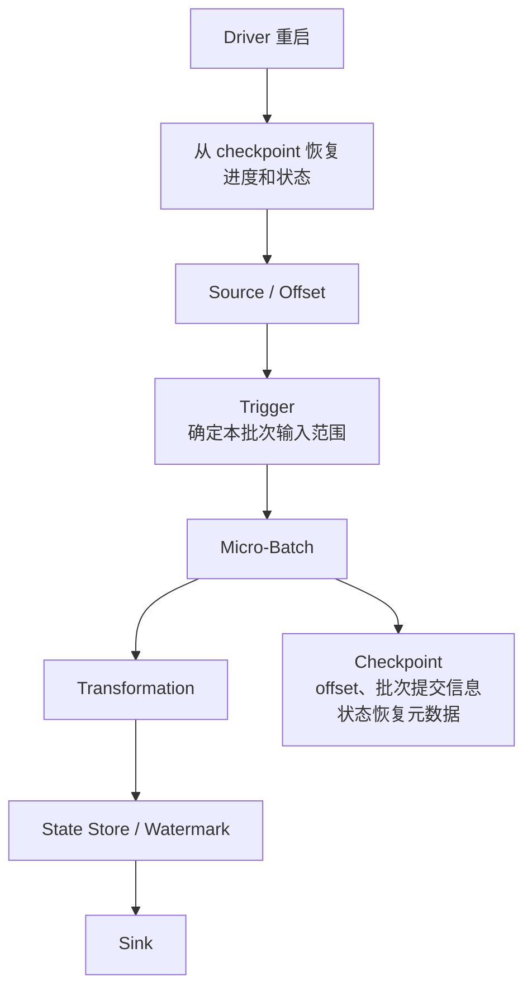

上图表示概念关系；不同 Source/Sink 的 offset log、commit log 和状态文件写入时序可能不同。

### 11.3 Micro-Batch 与 Continuous Processing

Micro-Batch 在每个触发周期确定可处理的输入范围，运行一个微批次；这个微批次内部可能包含多个 Spark Job，全部完成后再提交进度。这是 Structured Streaming 的主流生产模型。Continuous Processing 试图降低延迟，但支持的算子、Sink 和语义范围有限，不能默认适用于任意查询；选择前应以目标版本文档和实际 Sink 测试为准。[S9]

### 11.4 Streaming DataFrame 与 Streaming Query

`readStream` 得到 Streaming DataFrame，转换仍然是惰性的；`writeStream.start()` 才创建 Streaming Query 并持续运行。Query 有名称、状态、最近进度、异常和停止生命周期，可通过 `StreamingQuery` API 或 UI 监控。一个查询应使用独立且稳定的 checkpoint 目录，不能让多个并发查询随意共享同一目录。

### 11.5 Source、Transformation 与 Sink

常见 Source 包括 Kafka、文件目录、Rate 和表格式流源；Transformation 包括过滤、投影、窗口、聚合、Join 和去重；Sink 包括文件、Kafka、控制台、Foreach/ForeachBatch 和表格式。每个 Source/Sink 对输出模式、事务、幂等和故障恢复的支持不同，不能只根据 API 名称判断端到端语义。

### 11.6 Output Mode

- **Append**：只输出自上次输出后确定为新增的行，适合不再变化的结果或带 Watermark 的状态结果。
- **Update**：只输出本批次发生变化的结果行，具体支持范围取决于查询算子和 Sink。
- **Complete**：每次输出完整结果表，适合小规模聚合结果，但输出和状态成本可能随结果增长。

Output Mode 是结果输出语义，不等于 Kafka offset 提交语义，也不自动保证 Sink 的原子性。[S9]

### 11.7 Event Time 与 Processing Time

Event Time 是事件本身携带的发生时间，Processing Time 是 Spark 实际处理数据的时间。使用 Event Time 聚合可以按业务时间处理乱序数据，但需要 Watermark 和状态清理策略；Processing Time 延迟低、实现简单，却可能无法表达事件晚到和业务时间窗口。

### 11.8 Window 操作

窗口把时间轴切成固定、滑动或会话范围，常见有滚动窗口、滑动窗口和 Session Window。窗口聚合需要按时间和 Key 维护状态；窗口长度、滑动间隔、Watermark、迟到数据处理和输出模式共同决定结果何时产生以及状态何时清理。

### 11.9 Watermark

Watermark 是引擎根据已观察到的事件时间推进的“足够旧”边界，常见表达为最大事件时间减去允许迟到时长。对支持的有状态操作，过早于 Watermark 的数据可能被丢弃，旧状态可以清理；Watermark 不是全局精确时钟，也不保证网络恢复后所有迟到数据都能补回。单个输入的推进取决于已观察到的事件时间和查询进度；多输入查询通常使用各输入 Watermark 中较小的值，因此较慢的输入可能拖慢全局状态清理。[S9]

### 11.10 State Store

State Store 为流聚合、去重和流流 Join 保存跨批次状态，状态按算子和分区管理，并通过 checkpoint 恢复。状态规模取决于 Key 基数、窗口、Watermark 和去重范围；没有清理边界的状态查询可能持续增长。State Store 的具体后端和增量能力随 Spark 版本及配置变化。

### 11.11 Checkpoint Location

Structured Streaming checkpoint 通常保存源 offset、批次提交信息、状态快照/增量和查询恢复所需元数据。它不是普通业务数据备份，也不应在查询运行中随意删除、移动或被多个不兼容查询共享。更换查询逻辑、Source 结构或 Sink 时，是否能复用 checkpoint 必须经过版本和语义验证。

### 11.12 Kafka 与 Structured Streaming

Kafka Source 按 topic 分区读取记录，并把处理进度写入 Spark checkpoint。Kafka 的 topic 分区、保留期、起始 offset、最大每批读取量和异常消息策略都会影响吞吐和延迟。Kafka Sink 的重复、事务和幂等语义需要单独验证；Source 读取成功不代表下游业务提交成功。[S9][S19][S20]

### 11.13 Exactly-Once 语义

Structured Streaming 的 exactly-once 不是一个无条件全局承诺。引擎可以通过 checkpoint 和可重放 Source 恢复批次进度；要实现端到端 exactly-once，还需要 Sink 支持事务提交、幂等写入或按 batch ID 去重。`foreachBatch` 默认更接近至少一次调用，需要应用使用 `batchId` 设计幂等；普通外部 API 写入不能因为查询有 checkpoint 就自动获得 exactly-once。[S9]

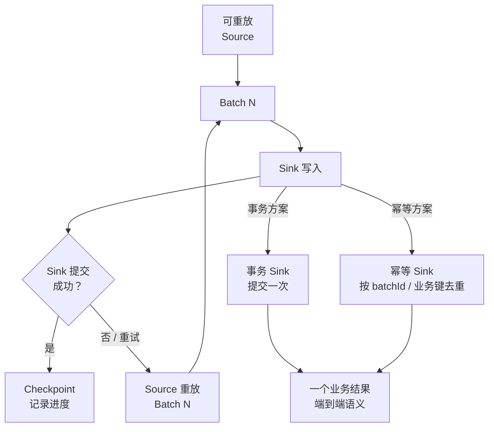

### 11.14 幂等写入与事务 Sink

幂等写入可以通过业务主键、批次 ID、版本号、MERGE/Upsert 或目标表格式的事务提交实现。设计时要考虑 Task 重试、Batch 重试、Driver 重启、部分写成功和 Sink 超时。对不支持事务的外部系统，应把“写入记录”和“记录已处理批次”设计成可重试且原子或可补偿的流程。

### 11.15 流任务故障恢复

Driver 重启后，Spark 从 checkpoint 恢复源 offset 和状态；Executor 丢失时，相关 Task/状态分区可以重试或从 checkpoint/上游重建。若 checkpoint 损坏、Source 数据已过保留期、Schema 不兼容或外部 Sink 已产生不可去重的副作用，恢复仍可能失败。恢复演练必须使用真实的存储权限、保留策略和 Sink 行为。

### 11.16 流任务背压与延迟控制

Structured Streaming 通常通过 Trigger、`maxOffsetsPerTrigger`、文件输入上限、Kafka 每批读取上限、状态和资源配置控制单批数据量。应同时观察输入速率、处理速率、批次持续时间、积压、State Store 和 Sink 延迟。单个查询的微批不会因为缩短 Trigger 间隔而安全并行；如果处理时间超过触发间隔，后续触发会延迟，调度压力和持续积压仍可能增加。

### 11.17 Streaming 监控与运维

重点监控 query 状态、批次 ID、输入行数、处理速率、批次耗时、输入积压、Watermark、State Store 行数/内存、Sink 延迟和异常。对长期运行任务应设置 checkpoint 可写性、Kafka lag、数据新鲜度、状态增长和无进度告警。日志和指标要能关联到 query name、application ID、batch ID。

### 11.18 Trigger：ProcessingTime、Once 与 AvailableNow

`ProcessingTime` 按固定时间间隔触发；`Once` 尝试在一个微批中处理当时可见的数据后结束，在 Spark 3.5.x 中已标记为 deprecated，通常应改用 `AvailableNow`；`AvailableNow` 处理启动时可见的全部数据，可以拆成多个批次完成后退出，适合增量回填。Trigger 的支持范围与 Source 版本有关，使用前查目标 Spark 版本文档。[S9]

### 11.19 Stream-Static Join 与 Stream-Stream Join

Stream-Static Join 使用静态表参与流查询，通常不需要像流流 Join 那样保存两侧历史状态，但静态表的快照和更新可见性必须明确，不能假设历史结果会自动重算。Stream-Stream Join 需要保存两侧历史数据，通常要求时间范围约束和 Watermark 才能清理状态；没有边界的流流 Join 可能导致状态无限增长，且支持的 Join 类型受版本限制。

### 11.20 流式去重与迟到数据处理

流式去重按业务唯一键和可选事件时间维护已见记录，Watermark 决定何时可以清理旧键。去重键必须稳定且足以表达业务唯一性；迟到超过边界的数据可能被丢弃，迟到未超过边界的数据可能更新窗口结果。重复消息、重放消息和业务修订消息要分别建模。

### 11.21 foreachBatch 与 foreach

`foreachBatch` 把每个微批作为普通 DataFrame 交给用户函数，适合复用批处理 Sink、写多个目标和执行批次级 Upsert；它的调用可能因重试重复，因此应利用 `batchId` 幂等。`foreach` 逐条处理，控制粒度更细但更难获得批量吞吐和事务边界。两者都不会自动让外部副作用具备 exactly-once。

### 11.22 Kafka Offset、startingOffsets 与消费进度

`startingOffsets` 只在没有可恢复 checkpoint 时决定初始位置；已有 checkpoint 时，恢复通常从 checkpoint 记录的进度继续。Structured Streaming 主要把 offset 进度保存在自己的 checkpoint，不应把它理解成传统 Kafka Consumer Group 已提交 offset。Kafka 的 retention 可能导致 checkpoint 指向的旧数据已不可读，需要设计重置和补数流程。

### 11.23 State Store 状态增长与清理

状态清理依赖算子语义、事件时间、Watermark、窗口和版本实现。监控状态行数、内存、checkpoint 体积和每批处理时间；必要时降低 Key 基数、增加清理边界、拆分查询或选择合适的 State Store 后端。任意删除状态文件会破坏查询恢复，不应作为常规清理手段。

### 11.24 Structured Streaming 与 DStream 的区别

DStream 是早期 Spark Streaming 的离散化流 API，以 RDD 和批次间隔为主要抽象；Structured Streaming 基于 DataFrame/Spark SQL，提供事件时间、Watermark、结构化状态和统一查询 API。DStream 仍可能存在于旧系统，但新项目通常优先评估 Structured Streaming，并核对已有 Connector 和 Sink 的迁移差异。

## 12. Spark 生态组件

### 12.1 Spark Core

Spark Core 提供 RDD、任务调度、序列化、缓存、广播、累加器、Shuffle 和与 Cluster Manager 的连接，是 Spark SQL、Streaming 等模块的运行基础。[S1]

### 12.2 Spark SQL

Spark SQL 提供结构化 API、SQL 解析、Catalog、优化器、列式执行和数据源接口，是当前 Spark 最常用的批处理入口。

### 12.3 Structured Streaming

Structured Streaming 在 Spark SQL 之上提供增量执行、状态、Watermark、checkpoint 和流 Source/Sink，适合与批处理共享数据模型，但 Sink 和状态语义必须单独验证。

### 12.4 MLlib

MLlib 是 Spark 的机器学习组件。Spark 3.5.x 中基于 DataFrame 的 `spark.ml` API 是主要使用路径，基于 RDD 的 `spark.mllib` API 处于维护状态；两者的模型、Pipeline 和参数接口不能直接混用。[S14]

### 12.5 GraphX

GraphX 是基于 RDD 的图和图并行计算 API，主要面向 Scala 生态，支持顶点、边、消息传递以及 PageRank、连通分量等算法。它适合大规模离线图计算，不等同于图数据库的低延迟事务查询。[S15]

### 12.6 GraphFrames

GraphFrames 是建立在 DataFrame 之上的图分析项目，提供顶点/边表和部分图算法。它是独立项目，版本兼容和维护节奏不完全等同于 Apache Spark，使用前应核对项目文档和 Spark/Scala 版本。[S29]

### 12.7 PySpark

PySpark 是 Spark 的 Python API，覆盖 RDD、DataFrame、SQL、Structured Streaming 和部分 MLlib。DataFrame 的大部分计划执行在 JVM/Executor 侧；使用 Python RDD、Python UDF 或 Pandas UDF 时会引入 Python Worker、序列化和跨语言通信成本。[S16]

### 12.8 SparkR

SparkR 为 R 用户提供 Spark DataFrame 和 SQL 接口，适合 R 生态中的分布式分析。其 API 覆盖范围、性能和版本支持应以对应 Spark 发行版文档为准，生产选型通常还要考虑团队的 Python/Scala 生态。[S30]

### 12.9 Spark Connect

Spark Connect 自 Spark 3.4.0 引入，将客户端 API 与远程 Spark Driver/服务器解耦，客户端发送协议化的逻辑计划，服务器负责执行。它适合远程交互式开发和多语言客户端，但并非所有旧版 API、依赖和 Driver 级行为都与传统嵌入式 SparkSession 相同，需按版本核对。[S17]

### 12.10 Spark 与 Hive

Spark 可以读取 Hive Metastore 中的表并执行 SQL，也可以使用 Hive SerDe/兼容能力。Spark SQL 的执行引擎与 Hive MapReduce 执行引擎不同；“使用 Hive 表”不等于“使用 Hive 执行”。表事务和 ACID 能力还取决于 Hive 版本、表格式和 Catalog。

### 12.11 Spark 与 HDFS

HDFS 提供文件、Block、副本和数据持久化，Spark 负责在 Executor 上计算。Spark 可以利用 HDFS 输入分片和数据本地性，但计算结果的输出提交、文件数量和 Schema 仍需由 Spark 作业设计。

### 12.12 Spark 与 Kafka

Kafka 提供分区日志、消息保留和消费位置，Spark Structured Streaming 提供批流查询和状态计算。二者之间的 exactly-once 取决于 Source replay、checkpoint、Kafka/外部 Sink 的提交和幂等设计，不是“Kafka + Spark”四个字自动保证。

### 12.13 Spark 与 Iceberg、Hudi、Delta Lake

这些湖表格式在 Parquet/ORC 等文件之上提供快照、Schema 演进、分区管理、并发提交和更新/删除能力，Spark 通过 Catalog 和 Connector 访问它们。不同表格式的事务、索引、Compaction、增量读取和 Spark 版本支持不同，应以各项目官方文档为准。[S22][S23][S24]

### 12.14 MLlib 与 `spark.ml`、`spark.mllib`

`spark.ml` 使用 DataFrame、Transformer、Estimator 和 Pipeline，便于与 Spark SQL 和特征工程组合；`spark.mllib` 使用 RDD API，历史算法和模型仍可使用但处于维护状态。新项目通常优先 `spark.ml`，迁移旧模型时要检查模型持久化格式和算法实现差异。

### 12.15 Transformer、Estimator 与 Pipeline

Transformer 接受 DataFrame 并返回转换后的 DataFrame；Estimator 通过 `fit` 学习数据并生成 Transformer；Pipeline 按阶段串联多个 Transformer/Estimator。Pipeline 把特征处理和模型训练绑定起来，有助于避免训练/预测特征逻辑不一致。

### 12.16 Param、Evaluator 与模型选择

Param 保存算法配置，Evaluator 定义评估指标，CrossValidator 或 TrainValidationSplit 用于参数搜索。交叉验证会放大数据扫描和训练成本，必须控制并行度、数据缓存和搜索空间，避免把验证集信息泄漏到特征工程。

### 12.17 特征工程

常见特征处理包括数值缩放、缺失值填充、类别编码、分词、向量拼接、降维和特征选择。特征转换应放进 Pipeline，训练阶段拟合的统计量不能用全量数据计算，否则会产生数据泄漏。高基数类别、稀疏向量和特征维度会显著影响内存与 Shuffle。

### 12.18 分类、回归、聚类与推荐

MLlib 提供部分分类、回归、聚类、降维、频繁模式和推荐算法。算法是否适合分布式训练取决于数据规模、迭代方式、特征稀疏性和通信成本；Spark 不是所有深度学习训练场景的最佳选择，模型训练前要做单机/分布式基准和效果验证。

### 12.19 CrossValidator 与 TrainValidationSplit

CrossValidator 将训练集划分为多折进行评估，结果更稳健但计算成本更高；TrainValidationSplit 只做一次训练/验证划分，成本较低但方差更大。随机划分不一定适合时间序列或有用户泄漏风险的数据，应按业务时间和实体边界设计切分。

### 12.20 模型保存、加载与版本管理

PipelineModel 和模型参数可以保存到文件系统或对象存储，但模型格式通常与 Spark、Scala、Python 和算法版本相关。生产环境应记录训练数据版本、Schema、特征代码、Spark 版本、依赖包和评估指标，并测试升级后的加载兼容性。

### 12.21 PySpark 执行机制

传统 PySpark 客户端通过 Py4J 调用 JVM 中的 Spark API；普通 DataFrame 计划主要由 JVM 侧生成和执行，Python UDF/Pandas UDF/部分 RDD 操作会启动 Python Worker 并跨语言传输数据。Spark Connect 使用客户端-服务器协议，不应把所有 PySpark 连接都简化为 Py4J。理解这条边界有助于判断“只是 Python 写法”还是“确实引入了 Python 执行瓶颈”。

### 12.22 Py4J、Python Worker 与 JVM 交互

在传统 PySpark 模式下，Driver 端 Python 程序与 JVM Driver 通过 Py4J 交互，Executor 端 Python Worker 执行 Python 函数或 UDF。任务闭包、数据批次和异常需要跨进程传输，Python Worker 数量、进程内存和复用方式会影响资源预算。不要在闭包中捕获大型 Driver 对象。

### 12.23 Pickle、Arrow 与 Pandas UDF

Pickle 常用于 Python 对象和 RDD/UDF 数据序列化，通用但开销可能较高；Arrow 采用列式批量格式，常用于 Pandas UDF、`toPandas` 和部分跨语言交换。Arrow 需要版本、数据类型、时区和内存兼容，启用 Arrow 并不会自动让所有 Python API 变快。[S16][S21]

### 12.24 Python UDF 的性能边界

Python UDF 适合无法用内置表达式表达的逻辑，但逐批/逐行跨 JVM 传输会降低性能，且可能阻断 Catalyst 优化。优先使用原生 SQL 函数，其次考虑 Pandas UDF 或 SQL UDTF，最后再使用普通 Python UDF，并对 NULL、异常和批边界进行测试。

### 12.25 Pandas API on Spark

Pandas API on Spark 为熟悉 pandas 的用户提供分布式 DataFrame 风格 API，但底层仍由 Spark 执行，不能把它当成单机 pandas 的无限扩展。部分操作会触发 Shuffle、全局排序或收集数据，使用前应查看执行计划和数据规模。

### 12.26 Scala/Java Spark 与 PySpark 的对比

Scala/Java 可以直接使用 JVM 类型和 Dataset，通常减少跨语言开销；PySpark 开发效率和生态更好，但 Python UDF、对象序列化和 Worker 资源需要额外关注。对 DataFrame/SQL 原生表达式而言，两者最终可能生成相近的 JVM 物理计划，性能差异不应只按语言判断。

## 13. Spark 部署与资源管理

### 13.1 Standalone 部署

Standalone 由 Master 管理 Worker 和 Executor，配置简单，适合 Spark 专用集群。生产环境仍需考虑 Master 高可用、节点故障、日志、认证、资源隔离和升级；它不是天然的多租户资源平台。[S2]

### 13.2 YARN 部署

YARN 模式下 ResourceManager 负责资源调度，NodeManager 启动和监管 Container；Cluster 模式的 Driver 与 Executor 运行在 YARN 容器中，Client 模式的 Driver 仍在提交端。Spark 通过 YARN 调度后端接入资源与日志体系。企业 Hadoop 集群常使用 YARN，但 Kerberos、队列、HDFS 权限和 Hadoop/Spark 版本兼容是主要运维重点。[S12]

### 13.3 Kubernetes 部署

Kubernetes 模式下 Driver 和 Executor 运行在 Pod 中，镜像、ServiceAccount、RBAC、网络、临时盘、PVC、动态资源和 Pod 生命周期都会影响作业。需要为 Driver 到 Executor、Executor 到数据源以及外部 Shuffle/存储设计网络和权限。[S13]

### 13.4 Driver 部署模式

Driver 可以在提交端运行，也可以作为集群容器运行。生产作业通常倾向 Cluster 模式以减少提交端网络和进程依赖，但交互式开发、调试和需要本地 UI 的场景可能使用 Client 模式。具体参数由 `spark-submit` 和资源管理器决定。

### 13.5 Executor 资源配置

核心资源包括 Executor 数量、每个 Executor 的 CPU、Heap、Memory Overhead、磁盘、GPU/自定义资源和并行 Task 数。过大的 Executor 可能带来 GC、单点丢失和资源碎片；过小会增加 Executor 数量、网络连接和管理开销。资源配置应按 Task 峰值内存、Shuffle、Python Worker 和节点容量反推。

### 13.6 Executor 数量与并行度

Executor 数量决定可用计算槽位和缓存容量，分区数决定可生成的 Task 数。为了利用集群，通常需要让可运行 Task 数高于总并发槽位并留出一定余量，但不是简单地设置“每个核一个固定分区”。数据倾斜、IO 等待和 Stage 间依赖会改变最佳配置。

### 13.7 Dynamic Resource Allocation

动态资源分配根据待处理 Task 和空闲时间增减 Executor，适合共享集群和作业负载波动场景。它需要 Shuffle 输出在 Executor 释放后仍可被访问，例如 External Shuffle Service、Shuffle Tracking 或可靠的迁移机制，具体支持条件取决于 Spark 版本和集群平台。[S5]

### 13.8 External Shuffle Service

External Shuffle Service 在 Executor 之外提供 Shuffle 文件访问，使 Executor 被动态释放后下游仍可能读取已完成的 Shuffle。它需要在集群节点部署和配置服务，参数、兼容性和安全边界由 Spark/资源管理器决定；它不是通用的业务文件服务，也不保证所有 Executor 数据都永久存在。

### 13.9 Resource Profile

Resource Profile 允许不同 Stage 请求不同的 Executor 资源，例如 GPU 或更大的内存。它适合异构计算，但会增加调度、资源碎片和平台配置复杂度；不是所有算子和 Cluster Manager 对自定义资源的支持一致。

### 13.10 队列、资源池与 Fair Scheduler

Spark 调度池可以在一个 Application 内组织 Job 的优先级和资源分配；YARN 队列、Kubernetes Namespace/Quota 和平台调度器负责更高层的多租户隔离。FIFO、FAIR 和资源池配置不能替代资源管理器的配额，也不能保证跨 Application 的业务公平。

### 13.11 多租户资源隔离

多租户需要同时控制 CPU、内存、队列、并发、网络、文件权限和数据访问。仅限制 Executor 数量不足以防止一个应用压垮 Metastore、Kafka、JDBC 或对象存储；应结合提交权限、Quota、动态资源上限和外部系统限流。

### 13.12 依赖包与运行时环境

Driver 与 Executor 必须使用兼容的 Spark/Scala/Java/Python/Connector 版本。依赖冲突、重复 Guava、Jackson/Netty 版本、Python 包缺失和 native 库不一致是常见故障。应固定镜像或发布包、记录依赖清单并在目标 Cluster Manager 上做冒烟测试。

### 13.13 版本兼容性

Spark 应用至少涉及 Spark、Scala、Java、Python、Hadoop、Kafka Connector、表格式和存储 SDK 多层版本。Spark 3.5.x 与 4.x 在 Java/Scala 支持、API、默认配置和第三方 Connector 兼容性上可能不同；升级前要阅读目标 Spark 版本对应的迁移指南，并运行计划、Schema、提交、恢复和性能回归。本文的 [S25] 仅对应 Spark 3.5.7。

### 13.14 安全认证与权限

生产环境常见 Kerberos、Delegation Token、HDFS/对象存储权限、YARN/Kubernetes 身份、Secret、ACL 和审计。Spark 的网络认证不等于数据访问授权；应用既要能启动，也要只拥有完成任务所需的最小权限。[S11]

### 13.15 网络加密与数据加密

Spark 可以配置 RPC、Shuffle、Web UI 和网络通信的认证/加密；数据存储加密通常由 HDFS、对象存储、KMS 或表格式所在平台提供。加密会增加 CPU 和运维成本，证书、Token、密钥轮换和日志脱敏必须纳入发布流程。[S11]

### 13.16 GPU、FPGA 与自定义资源调度

Spark 可以通过资源发现和自定义资源配置向 Task 暴露 GPU 等资源，但 Spark 本身不替代深度学习框架的 GPU 调度和显存管理。需要明确每个 Executor/Task 的资源量、节点标签、驱动库、容器设备权限和资源释放策略。

### 13.17 Resource Profile 与异构资源

异构资源作业应把 CPU、内存、GPU、磁盘和网络一起规划。不同 Stage 使用不同 Resource Profile 时，可能产生资源等待和调度碎片；应在低负载测试中验证 Stage 切换、失败重试、动态资源和容器回收。

### 13.18 Executor Decommission 与 Shuffle 数据迁移

Executor Decommission 允许在节点下线或资源回收前通知 Spark，使缓存、Shuffle 和任务相关数据有机会迁移或采取保护措施。它不能替代外部持久化，也不能保证所有数据在硬故障中保留；需要 Cluster Manager、Shuffle 服务、存储和 Spark 版本共同支持。[S5]

## 14. Spark 监控、调试与故障排查

### 14.1 Spark Web UI

Spark Web UI 用于查看 Jobs、Stages、SQL、Storage、Executors、Environment 等页面。排查慢作业时先定位最慢 Stage，再看 Task 时间分布、Input、Shuffle Read/Write、Spill、GC 和输出；不要只看总耗时。UI 展示的是运行时观测，需结合业务数据和日志解释原因。

### 14.2 History Server

History Server 读取 Event Log，提供已结束应用的 UI。生产环境要配置可靠的 Event Log 目录、压缩/滚动策略、保留周期和权限；Event Log 过大、损坏或版本不兼容会影响打开和查询。[S10]

### 14.3 Event Log

Event Log 记录应用生命周期、Job/Stage/Task、SQL 和 Executor 等事件，适合离线复盘和自动化分析，不是完整的业务数据审计。事件日志可能包含路径、SQL、用户或参数信息，应控制权限和脱敏。

### 14.4 Executor 日志

Executor 日志用于判断 Task 异常、GC、Python Worker、网络、Shuffle、文件系统和外部 Sink 错误。排查时需要把 application ID、stage ID、task attempt、executor ID、节点和 batch ID 关联起来，避免只看 Driver 日志。

### 14.5 SQL UI 与执行计划

SQL 页面可查看查询耗时、物理算子、输入输出和运行阶段；`explain` 适合在提交前理解计划，SQL UI 适合验证实际运行。重点检查 FileScan、过滤/列裁剪、Exchange、Join、Aggregate、Window、AQE 变化和异常长尾。

### 14.6 任务运行缓慢的排查流程

1. 确认作业范围、输入数据量、版本和资源配置。
2. 在 UI 中定位最慢 Job/Stage/Task。
3. 区分输入读取、Shuffle、Spill、GC、数据倾斜、外部 Sink 和资源等待。
4. 对照 SQL 计划确认过滤、列裁剪、Join 策略和分区。
5. 用小规模或单一分区复现实验，再修改一个变量。
6. 校验优化后的结果、文件数量和下游延迟。

### 14.7 Driver OOM 的排查流程

检查 `collect`/`toPandas`、过大的 `show`、广播构建、过多小文件元数据、超大逻辑计划、Listener 缓存和 Driver 端用户对象。优先改为分布式写出或聚合，限制结果规模，再考虑增加 Driver heap/overhead。

### 14.8 Executor OOM 的排查流程

检查失败 Task 的输入分区、Join/聚合构建侧、广播大小、缓存、数据倾斜、Spill、GC、Python Worker 和容器内存。要区分 heap OOM、overhead 超限、off-heap OOM 和下游进程被杀；增加 Executor 数量不能解决单分区过大的问题。

### 14.9 数据倾斜的排查流程

比较 Task 的输入记录、Shuffle Read、运行时长、内存和 Spill 的最大值与中位数；再统计热点 Key、NULL Key、文件大小和 Join 关系。确认倾斜后选择广播、加盐、拆分热点、AQE skew join 或数据模型调整，并验证聚合结果和重复语义。

### 14.10 Shuffle Fetch Failed 的排查流程

定位失败的 Shuffle ID、Map 输出、Reduce Task 和 Executor；检查源 Executor 是否丢失、磁盘是否满、网络是否超时、Shuffle 服务是否可用、文件是否被清理，以及是否存在超大分区。修复节点/服务后再调整重试和超时参数，不能只增加 `spark.shuffle.io.maxRetries`。

### 14.11 Executor Lost 的排查流程

查看 Cluster Manager 的容器退出原因、Executor stderr、GC、OOM、节点内核日志、磁盘、网络和抢占记录。Executor Lost 可能来自进程崩溃、容器超限、节点故障、主动缩容、Decommission 或网络隔离，不同原因对应的修复完全不同。

### 14.12 长尾 Task 的排查流程

比较 Task 的输入、Shuffle、GC、执行时间和节点分布。常见原因是数据倾斜、少数坏节点、远程存储慢、文件极大、外部系统限流和推测执行未覆盖。Speculation 只能缓解部分节点长尾，不能解决单个 Key 或外部副作用问题。

### 14.13 结果不一致与重复计算问题

先区分 Spark 重试造成的重复执行与业务结果真正重复。检查非确定性函数、随机数、时间函数、Task/Batch 重试、foreach 外部副作用、输出提交和上游数据变化。结果表应使用幂等键、事务提交、版本快照或去重策略，不应依赖 Task 只执行一次。

### 14.14 Streaming Query 卡住的排查流程

检查 Query 状态、最近进度、Trigger 时间、输入速率、处理速率、Kafka lag、Watermark、State Store、Sink 阻塞、checkpoint 权限和 Driver/Executor 日志。没有新数据与查询卡住是两种不同状态，应看 batch 是否持续完成。

### 14.15 常用日志与命令

常用工具包括 `spark-submit`、Spark UI/History Server、`df.explain("formatted")`、Cluster Manager 日志、Executor 日志和事件日志。命令选项会随版本变化，生产排查应记录 application ID、配置快照、输入版本和执行时间。

### 14.16 Metrics System、JMX 与 Prometheus

Metrics System 可通过配置输出到 CSV、JMX、Servlet、Graphite、Prometheus 等 Sink，具体支持方式取决于 Spark 版本和部署。Prometheus 采集应关注 Driver/Executor、任务耗时、Shuffle、JVM、Streaming 进度和资源使用，并设置应用维度标签，避免高基数标签造成监控系统压力。[S10]

### 14.17 自定义 Listener 与 REST API

Spark Listener 通常由异步事件总线交给 Listener 线程处理，可以消费应用事件并生成审计、成本或告警信息。监听器回调不应长时间阻塞或执行重 IO，否则可能造成事件队列积压，延迟监控和事件记录；也不要把 Listener 当作同步事务钩子。History Server 和部分 Cluster Manager 提供 REST API，接口字段和权限应按版本验证，不要把内部 UI 接口当成长期稳定 API。[S10]

### 14.18 Event Log 滚动、压缩与存储

长期运行应用和大型 SQL 作业可能产生很大的 Event Log。可以配置滚动、压缩和清理，但必须确保 History Server 支持对应格式，且保留策略满足故障复盘和审计要求。事件日志目录应有访问控制和容量告警。

### 14.19 监控指标与告警设计

建议按四层设计：应用层（成功率、耗时、批次新鲜度）、调度层（Pending Task、Stage 重试、Executor Lost）、计算层（Shuffle、Spill、GC、内存、倾斜）和数据层（输入量、输出量、文件数、质量校验）。告警需要包含 application ID、作业版本、输入分区和最近一次成功时间，避免只有一个“作业失败”标题。

## 15. Spark 应用场景

### 15.1 离线 ETL

Spark 适合把多源数据清洗、关联、聚合并写入分区表或湖表。作业应明确输入快照、补数范围、输出提交、幂等键、Schema 和数据质量指标，避免重跑产生重复分区或覆盖错误。

### 15.2 数据仓库建设

Spark SQL 常用于 ODS/DWD/DWS 等批量加工、宽表构建和指标汇总。性能依赖列式格式、分区设计、统计信息、Join 策略和小文件治理；数仓的口径、权限、调度和血缘需要由上层平台治理。

### 15.3 数据湖处理

Spark 可以作为 Iceberg、Hudi、Delta Lake 等表格式的主要计算引擎，完成快照读取、追加、Upsert、Compaction 和历史数据重算。表格式的事务和并发提交由其自身协议提供，Spark 仅通过 Connector/Catalog 使用这些能力。

### 15.4 批量数据清洗与转换

对日志、JSON、CSV 和业务快照进行 Schema 解析、脏数据隔离、标准化和写出是 Spark 的常见任务。应记录坏记录、输入输出计数、Schema 版本和数据质量结果，避免把解析失败静默丢弃。

### 15.5 交互式 SQL 分析

Spark SQL 可以通过 Thrift Server、Notebook、Spark Connect 或平台服务提供交互式查询。交互体验取决于文件布局、元数据、缓存、资源队列和查询并发；它不天然等同于低延迟 OLAP 数据库。

### 15.6 实时数据处理

Structured Streaming 适合 Kafka 到湖表、实时指标、清洗和事件聚合等场景。需要按延迟、吞吐、状态规模和 Sink 一致性选择 Trigger 与架构；毫秒级、极低延迟或复杂在线状态场景应评估 Flink、专用流处理或服务化系统。

### 15.7 流批一体数据链路

批处理和流处理可以共享 DataFrame、Schema、表格式和业务逻辑，但批与流的触发、状态、迟到、回填和提交语义不同。复用代码时要明确哪些表达式支持流执行，哪些只能在批模式运行。

### 15.8 机器学习特征处理

Spark 适合大规模特征抽取、聚合、编码、离线训练集构建和批量预测。在线特征低延迟读取、模型服务和实时反馈通常由专用特征平台或在线服务承担，Spark 不是在线推理服务的替代品。

### 15.9 图计算

GraphX/GraphFrames 可处理离线图算法和关系分析，但图数据需要迭代和通信，内存、Shuffle 和收敛成本可能很高。低延迟邻居查询、事务写入和图遍历应评估图数据库或专用图引擎。

### 15.10 日志分析

Spark 能批量解析和聚合日志，适合历史分析、异常统计和指标回填。实时检索和全文搜索通常由日志检索系统承担，Spark 结果可写入湖表、数仓或搜索系统。

### 15.11 推荐、风控与监控场景

Spark 常用于离线样本、特征、规则统计、风险名单和指标计算。实时决策链路还需要在线 KV、规则服务、模型服务、消息系统和监控，不能仅用一个 Spark Job 覆盖完整在线链路。

### 15.12 Spark 不适合的场景

毫秒级单条读写、高频事务更新、严格在线请求响应、无限小对象、强交互 OLTP、需要精细行级锁的场景通常不适合直接使用 Spark。Spark 也不应被当成长期数据存储、消息队列或通用工作流系统。

## 16. Spark 的优点与缺点

### 16.1 Spark 的主要优点

- DAG 调度和多阶段计算表达能力强。
- DataFrame/SQL 提供结构化优化和丰富数据源接口。
- 批处理、SQL、流处理、机器学习和图计算生态统一。
- 可运行在 Standalone、YARN、Kubernetes 等资源平台。
- RDD Lineage、Task 重试和 Shuffle 重算提供计算容错。
- 能与 HDFS、对象存储、Kafka、Hive 和湖表格式集成。

### 16.2 Spark 的主要缺点

- Shuffle、排序、序列化和网络传输成本高。
- JVM、Python、内存和 GC 使资源调优复杂。
- 小文件、数据倾斜和外部 Sink 容易形成长尾。
- Structured Streaming 默认微批，极低延迟场景有边界。
- Spark 是计算引擎，事务、索引、在线查询和数据治理要依赖其他系统。
- 版本、Connector、表格式和 Cluster Manager 组合复杂。

### 16.3 Spark 的适用边界

可以把 Spark 视为“面向大规模数据的分布式计算层”。当任务能拆成批量分区计算，且可以接受任务调度、Shuffle 和文件/消息存储的延迟时，Spark 更有优势；当请求是单条、强事务、低延迟或状态高度在线化时，应优先评估专用系统。

### 16.4 Spark 与其他计算引擎的选型

选型维度包括延迟、吞吐、状态、批流模型、SQL 能力、数据源/Sink、资源平台、运维、成本和团队经验。Spark 与 Flink、Trino/Presto、MapReduce、数据库和湖表引擎可能组合使用，不应把引擎选择简化为单一性能数字。

### 16.5 Spark 的成本与运维复杂度

成本来自计算节点、对象存储/HDFS、Shuffle 磁盘、网络、Metastore、Kafka、日志指标和人工运维。合理的文件布局、资源队列、动态资源、缓存生命周期、作业并发和失败重试可以降低成本；错误的广播、缓存和分区配置会放大资源消耗。

## 17. Spark 生产实践

### 17.1 作业提交规范

提交参数、代码版本、依赖、输入输出、配置和运行身份应可追踪。生产作业使用稳定的主类、明确的部署模式、合理的资源上限和唯一的 application/job 标识，禁止把临时调试参数直接带入长期调度。

### 17.2 配置管理

将代码默认值、环境配置、机密信息和作业参数分离。记录 Spark、Hadoop、JDK、Python、Connector、表格式和 Cluster Manager 版本；对关键参数设置允许范围，避免业务代码任意覆盖平台安全和资源限制。

### 17.3 数据质量校验

至少校验输入行数、输出行数、关键列非空、主键重复、分区范围、Schema、数值分布和坏记录数。质量失败应阻止错误结果提交或进入隔离区，并保留可重跑的输入版本和检查结果。

### 17.4 作业幂等性

幂等作业在相同输入版本和参数下重复运行不会产生错误重复或不一致结果。常用手段包括临时目录、原子/事务提交、分区覆盖、业务主键 Upsert、批次版本和输出清理。任务重试和 Driver 重启必须纳入幂等设计。

### 17.5 失败重试与补数

平台重试适合暂时性节点和网络故障，不适合掩盖数据格式错误、权限错误或确定性代码异常。补数要明确输入快照、时间范围、依赖分区、输出覆盖规则、下游通知和回滚方案。

### 17.6 输出提交与临时目录

对文件和部分表格式写出，Task 通常先写临时输出，成功后由提交协议把结果提交到目标目录；JDBC、HTTP 或自定义 Sink 不一定遵循这套流程。输出提交要处理 Task 重试、Speculative Execution、部分文件、Driver 失败和对象存储 rename 非原子等问题。不要在目标目录直接混写临时文件和最终文件。

### 17.7 Checkpoint 与备份恢复

RDD checkpoint、Structured Streaming checkpoint、表格式 Transaction Log 和业务备份是不同概念。Checkpoint 主要帮助计算恢复或截断状态，不等于数据灾备；关键输入、输出、模型和元数据仍需独立备份与恢复演练。

### 17.8 小文件治理

控制写出分区数、合并小文件、优化表分区、定期 Compaction，并关注对象存储请求和 Metastore 压力。不能通过单纯提高并行度追求吞吐而忽视输出文件质量。

### 17.9 资源隔离与配额

按队列、项目、用户和优先级设置 CPU、内存、Executor、并发 Job、动态资源上限和外部系统 QPS。生产环境要防止单一应用同时压垮计算平台、Metastore、Kafka、数据库和对象存储。

### 17.10 作业依赖与发布流程

使用版本化代码、依赖锁定、配置审查、静态检查、单元/集成测试、灰度运行和回滚策略。发布前验证 SQL 计划、Schema、表格式、提交协议、权限和恢复行为，而不只是验证本地能运行。

### 17.11 监控告警体系

建立作业成功率、耗时、输入输出、资源、Shuffle、倾斜、Executor、Streaming lag、Watermark、State Store、Sink 和数据质量告警。告警应包含可执行的排查链接和最近成功版本，避免告警只描述症状。

### 17.12 成本优化

通过列裁剪、分区裁剪、文件合并、合理压缩、减少 Shuffle、控制缓存、动态资源、Spot/弹性节点和作业合并降低成本。优化前后要同时比较总计算时间、峰值资源、存储、网络和结果质量。

### 17.13 高可用与灾备

Spark Driver/Executor 的故障重试不等于数据平台灾备。要准备 Event Log、Checkpoint、输入快照、表格式日志、关键输出、依赖包、配置和权限的恢复方案，并验证 Cluster Manager、存储、Kafka 和外部 Sink 的联合恢复。

### 17.14 OutputCommitCoordinator、OutputCommitter 与 Commit Protocol

OutputCommitCoordinator 负责 Spark Task 尝试之间的协调；Hadoop OutputCommitter/Commit Protocol 负责任务和作业输出的提交、清理和最终可见性；表格式还可能有自己的事务提交。三者职责相关但不相同，不能因为开启一个 Coordinator 就认为所有输出具备事务性。[S26][S27][S28]

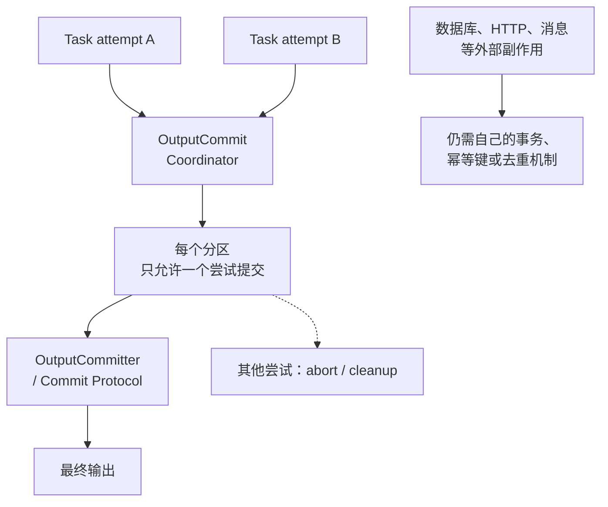

### 17.15 对象存储上的提交机制

对象存储通常不具备 HDFS 本地 rename 的成本和原子语义，直接使用传统 FileOutputCommitter 可能产生大量复制、临时对象和并发可见性问题。S3A 等具体 Connector 可能提供专用 Committer；其他对象存储应查其 Connector 文档，或使用表格式事务提交。所有方案都必须按存储、Hadoop 和 Spark 版本配置并测试。[S18]

### 17.16 `_temporary` 目录与重复提交

任务输出常先落在 `_temporary` 等临时路径，作业提交成功后才成为最终结果。失败、取消或权限异常可能留下临时文件；清理临时目录前要确认没有运行中的作业。重复提交可能产生重复文件或覆盖，需要依赖作业幂等和提交协议治理。

### 17.17 Speculative Execution 与输出一致性

推测执行可能让同一分区存在多个 Task attempt，因此输出 Sink 必须能识别或安全处理多个尝试。文件输出通常依赖提交协议选择一个成功尝试；数据库、HTTP、消息发送等外部副作用必须使用幂等键、事务或去重，否则可能重复写入。

### 17.18 Spark 作业测试策略

测试应从纯函数和 SQL 逻辑逐步扩展到本地 Spark、Mini Cluster/容器、真实表格式和端到端数据链路。测试数据要覆盖空值、重复、倾斜、迟到、Schema 演进、重试和部分失败，而不只是 happy path。

### 17.19 RDD/DataFrame 单元测试

验证 Schema、行数、关键结果、分区/排序假设和异常输入。测试尽量使用小而确定的本地数据，不依赖 `collect` 大结果；对计划和配置有要求时，可同时断言关键物理算子，但要为 Spark 版本差异保留弹性。

### 17.20 Structured Streaming 测试

使用 Rate Source、可控文件/Kafka Source 和 Memory Sink 测试 Trigger、Watermark、迟到、去重、窗口、State Store、checkpoint 恢复和 Sink 幂等。Memory Sink 适合测试观测，不适合作为生产持久化 Sink。流查询测试必须验证停止/重启和同一 batch 重试，而不是只验证首次输出。

### 17.21 集成测试与端到端测试

集成测试验证 Spark 与 HDFS、对象存储、Metastore、Kafka、JDBC、表格式和权限的真实交互；端到端测试验证提交、资源、数据、输出、告警和恢复。可用容器或临时测试集群隔离依赖，避免只在 local 模式验证生产特性。

### 17.22 Schema、数据质量与结果断言

测试应断言 Schema 类型、nullable、分区、主键唯一性、数值边界、坏记录策略和输出文件/表快照。对浮点、时间、随机抽样和非确定性排序要使用适当的误差、固定种子或集合比较。

### 17.23 作业重试、幂等性与确定性测试

主动模拟 Task 重试、Executor 丢失、Driver 重启、Sink 超时、重复 Batch 和部分输出，确认结果不会重复或损坏。对使用随机数、当前时间、外部 API 和非确定性聚合的作业，要显式记录或隔离这些因素。

## 18. 常用命令与配置

### 18.1 `spark-submit`

基本形式为：

```bash
spark-submit \
  --master <master> \
  --deploy-mode <client|cluster> \
  --class <main-class> \
  --conf key=value \
  app.jar [application-args]
```

Python、YARN、Kubernetes 和不同 Spark 版本的参数略有差异，生产提交应固定 `--master`、部署模式、资源、依赖和配置来源。不要把密码、Token 等机密直接写在命令行。

### 18.2 本地模式运行

`local[*]` 使用本机可见 CPU 线程运行，适合逻辑测试；它不能模拟真实网络、Shuffle 服务、容器限制、节点故障和多租户调度。可用 `local[2]` 等固定并行度提高测试确定性。

### 18.3 YARN 模式运行

典型参数包括 `--master yarn`、`--deploy-mode client|cluster`、Executor 数量/核数/内存、队列、主类和依赖。还要关注 YARN Container memory overhead、HDFS/Kerberos 权限、队列配额和日志聚合。具体参数以 Spark 3.5.x YARN 文档为准。[S12]

### 18.4 Kubernetes 模式运行

需要配置镜像、ServiceAccount、Namespace、Driver/Executor 资源、网络、依赖包和数据访问权限。Kubernetes 模式的镜像和 Pod 规格是运行时环境的一部分，不能只在本地 Python 环境验证。[S13]

### 18.5 常用 Spark 配置项

常见配置类别包括应用名、Master、部署模式、Executor/Driver 资源、序列化、网络超时、Shuffle、SQL、文件读取、动态资源、Event Log、Streaming 和安全。默认值会变更，配置应按版本文档查证，不建议复制未经验证的“万能参数表”。[S5]

### 18.6 内存相关配置

重点关注 `spark.driver.memory`、`spark.executor.memory`、`spark.driver.memoryOverhead`、`spark.executor.memoryOverhead`、`spark.memory.fraction`、`spark.memory.storageFraction`、off-heap、Python Worker 和容器资源。调参顺序通常是先降低单 Task 数据和对象开销，再调整 Executor 形态，最后调整内存参数。

### 18.7 Shuffle 相关配置

包括 Shuffle 分区数、压缩、文件缓冲、网络超时、重试、最大块大小、External Shuffle Service/Tracking、Push-Based Shuffle 和 Decommission。不同配置之间有资源和版本依赖，修改后要观察 Fetch、Spill、GC、网络和重算。

### 18.8 动态资源相关配置

包括动态资源开关、初始/最小/最大 Executor、空闲释放、待处理 Task、Shuffle 保护和 Executor Decommission。动态资源需要与 Cluster Manager、External Shuffle/Tracking 和队列配额配套，否则可能出现 Executor 频繁伸缩或 Shuffle 丢失。

### 18.9 SQL 与 AQE 相关配置

包括 `spark.sql.shuffle.partitions`、自动广播阈值、AQE、动态合并分区、倾斜 Join、DPP、文件读取分区、CBO 和压缩格式。配置应结合统计信息和 `explain` 验证，不能仅用默认值或经验值覆盖所有数据集。

### 18.10 Streaming 相关配置

包括 Trigger、checkpoint、Kafka 起始/读取限制、文件 Source 速率、Watermark、状态存储、输出模式、Sink 参数和查询名称。流配置必须与 Source retention、Sink 幂等、状态规模和恢复演练一起设计。

### 18.11 运行参数与环境变量

业务参数通过应用参数或配置文件传入，平台参数通过 `--conf`、Spark properties、环境和资源平台配置传入。应避免把环境差异硬编码在代码里，并记录最终生效配置。注意命令行和环境变量可能出现在日志或进程列表中，机密应使用 Secret/Token 管理。

### 18.12 不同 Spark 版本的配置差异

Spark 3.x 的默认值和配置名可能与 Spark 2.x、4.x 或发行版不同；黑名单、动态资源、Shuffle、AQE、Python、Java 和安全参数都可能发生变化。升级前应使用目标版本的 Configuration、Migration Guide 和 Cluster Manager 文档逐项核对；本文的 [S25] 仅对应 Spark 3.5.7。[S5][S25]

## 19. 高频面试题与参考答案

### 19.1 Spark 是什么？为什么比 MapReduce 更快？

Spark 是统一的大规模数据计算引擎。它在合适场景下可能比 MapReduce 快，原因包括 DAG 多阶段执行、缓存复用、算子融合、结构化优化和更灵活的 Shuffle；但“内存计算所以一定快”不准确，输入输出、Shuffle、数据倾斜、资源和存储才是实际决定因素。

### 19.2 Spark 的核心组件有哪些？

Application 由 Driver 和 Executor 组成，Driver 中包含 SparkContext/SparkSession、DAGScheduler、TaskScheduler 等，Cluster Manager 分配资源，Executor 执行 Task、管理缓存和 Shuffle。Spark SQL 还包含 Catalog、Catalyst、物理计划和数据源接口。

### 19.3 Driver 和 Executor 的区别是什么？

Driver 运行主程序并负责计划、调度、状态和结果协调；Executor 运行 Task、读取/写入数据、缓存和 Shuffle。Driver 不应承载全量业务数据，Executor 丢失会导致任务/缓存/Shuffle 重试。

### 19.4 Application、Job、Stage、Task 如何区分？

Application 是一次应用；Action 触发 Job；Job 按 Shuffle 边界拆成 Stage；Stage 按分区生成 Task。一个 Application 可以有多个 Job，一个 Job 可以有多个 Stage，一个 Stage 包含多个 Task；每个 Task 在失败重试或推测执行时可能产生多个 Task attempt。

### 19.5 Spark 的 Job 是如何被划分为 Stage 的？

SQL 物理计划先转换为可执行算子及其 RDD，DAGScheduler 再沿 RDD 依赖关系分析，在宽依赖/Shuffle 边界切分 Stage。Exchange 通常是 SQL 层的数据重分布算子，但不应理解为 DAGScheduler 直接按物理计划节点切 Stage；窄依赖可以在同一 Stage 内连续计算，ShuffleMapStage 产生中间结果，ResultStage 产生 Action 结果。AQE 可能在运行时调整部分 SQL 执行计划。

### 19.6 什么是宽依赖和窄依赖？

窄依赖中每个父分区至多被一个子分区使用，通常不需要 Shuffle；宽依赖中一个父分区可能被多个子分区使用，通常需要跨分区重分布并触发 Shuffle 和 Stage 边界。不要只按算子名称判断，要看依赖和物理计划。

### 19.7 Spark 为什么采用惰性求值？

惰性求值让 Spark 在 Action 前看到完整转换链，从而合并窄依赖、下推过滤、裁剪列、选择 Join 和避免不必要中间结果。代价是错误可能延迟到 Action 才暴露，且不执行 Action 时缓存也不会物化。

### 19.8 RDD 为什么可以容错？

RDD 保存分区、依赖和计算函数，分区丢失时可以根据 Lineage 重算；Task/Stage 失败由调度器重试，Shuffle 丢失可能重做上游。长 Lineage 或恢复成本高时用可靠 Checkpoint 打断依赖。

### 19.9 RDD、DataFrame 和 Dataset 有什么区别？

RDD 灵活但优化器无法理解任意对象逻辑；DataFrame 带 Schema，能使用 Catalyst、列式表示和代码生成；Dataset 在 Scala/Java 中提供类型安全。PySpark 主要使用 DataFrame，不应把 Scala Dataset 的类型安全描述直接套到 Python。

### 19.10 Cache、Persist 和 Checkpoint 有什么区别？

Cache 是默认 Persist 的便捷调用，主要优化重复计算；Persist 可以选择内存/磁盘/序列化/副本级别；Checkpoint 把数据写到可靠存储并截断 Lineage。Local checkpoint 更快但故障恢复能力弱，三者都不是自动的业务备份。

### 19.11 repartition 和 coalesce 有什么区别？

Repartition 通常触发 Shuffle，可增减分区并重新均衡；coalesce 通常合并分区，适合减少分区但可能不均衡。是否触发 Shuffle 还要看具体 API 和参数，不能把 coalesce 当作绝对无 Shuffle 的所有场景。

### 19.12 groupByKey 和 reduceByKey 有什么区别？

reduceByKey 可以在 Map 端预聚合，通常减少 Shuffle；groupByKey 将同键值聚合后再交给下游，适合确实需要完整值集合的逻辑。聚合函数必须满足并行合并的语义。

### 19.13 map、mapPartitions 和 foreachPartition 有什么区别？

map 逐元素转换，mapPartitions 按分区处理，foreachPartition 是按分区执行的 Action，常用于批量写外部系统。分区级连接要复用并正确关闭，且必须处理 Task 重试导致的重复副作用。

### 19.14 Spark Shuffle 是什么？为什么代价高？

Shuffle 是跨分区重分布数据，涉及分区、序列化、排序/聚合、磁盘 Spill、网络传输和 Reduce 拉取。它通常是计算瓶颈，优化重点是减少数据、预聚合、合理分区、处理倾斜和避免不必要的全局排序。

### 19.15 Shuffle 的 Map 端和 Reduce 端分别做什么？

Map 端按分区器组织并写出各目标分区，完成后上报 MapStatus；Reduce 端查询位置、拉取对应分区、合并/排序/聚合并交给下游。Map 输出位置丢失时可重算 Map Stage。

### 19.16 Spark 如何处理 Shuffle 文件丢失？

Shuffle 是可重建中间结果，Spark 通常重新执行产生该输出的上游 Map Task/Stage；如果 Executor、节点、输入或外部依赖持续故障，重算也会失败。External Shuffle、Tracking、Push-Based Shuffle 和 Decommission 的保护能力要按版本和部署区分。

### 19.17 Catalyst 是什么？包含哪些阶段？

Catalyst 是 Spark SQL 的查询优化框架。典型流程是 Parser 生成 Unresolved Logical Plan，Analyzer 完成解析，Catalyst 规则进行逻辑优化，并通过 Catalyst 相关的规划与代码生成组件参与物理计划选择和执行代码生成；最终由 SparkPlan 在运行时执行。AQE 还可能根据运行时统计重新优化部分物理计划。UDF 会隐藏内部逻辑，可能阻断部分优化。

### 19.18 Tungsten 和 Whole-Stage Codegen 解决什么问题？

它们代表 Spark SQL 的高效执行方向：减少 JVM 对象和 GC、使用二进制行表示、生成融合代码并降低算子调用开销。并非所有算子都能代码生成，Python UDF、外部算子和复杂表达式可能形成边界。

### 19.19 谓词下推和列裁剪是什么？

谓词下推尽量让数据源提前过滤，列裁剪只读取后续需要的列。它们能否生效取决于表达式和数据源能力，应通过物理计划和 Scan 指标验证。

### 19.20 AQE 是什么？解决了哪些问题？

AQE 在运行时读取 Shuffle 统计，可合并小分区、处理倾斜 Join，并在条件满足时调整 Join 策略。它不是万能优化器，仍依赖正确的初始计划、统计、配置和数据分布。

### 19.21 Spark Join 有哪些实现方式？

常见有 Broadcast Hash Join、Sort-Merge Join、Shuffled Hash Join、Broadcast Nested Loop Join 和 Cartesian/特殊 Join。选择取决于等值条件、表大小、统计、广播阈值、内存和数据倾斜。

### 19.22 什么是广播 Join？什么时候不能使用？

广播 Join 将小表发送到各 Executor，避免大表 Shuffle。小表必须在 Executor 可用内存和广播传输范围内，统计不准、压缩文件大小与内存大小差异、并发广播过多时都可能导致 OOM 或变慢。

### 19.23 Spark 如何解决数据倾斜？

先识别热点 Key 和长尾 Task，再选择广播、加盐二次聚合、拆分热点、AQE skew join、过滤异常 Key 或调整数据模型。增加分区数不能拆开同一个 Key，且加盐必须保持业务结果正确。

### 19.24 Spark 如何设置合理的分区数？

根据数据量、单 Task 目标大小、Executor 并发、Shuffle、倾斜和输出文件目标压测。输入分区、Shuffle 分区、输出文件数不是同一个指标；AQE 可能动态调整最终分区。

### 19.25 Spark 的内存模型是怎样的？

Executor 资源包含 JVM heap、overhead、可选 off-heap 和 Python/Native 开销；统一内存池主要管理 Execution Memory 与 Storage Memory。遇到 OOM 先区分 heap、overhead、off-heap、Python 和容器限制，再针对单分区、广播、缓存、倾斜或对象数量处理。

### 19.26 Driver OOM 和 Executor OOM 如何排查？

Driver 重点检查 collect/toPandas、计划和广播；Executor 重点检查单分区、Join/聚合、缓存、倾斜、Python Worker、GC 和 overhead。增加总节点数不能解决单个任务或单个 Key 超大。

### 19.27 Executor 数量、核数和内存如何配置？

结合节点容量、Task 峰值内存、Shuffle、GC、Python Worker 和并发配置。大 Executor 减少连接和管理开销但可能增加 GC/单点损失，小 Executor 更灵活但会增加管理和网络开销；应基准测试而非套固定数字。

### 19.28 什么是数据本地性？

调度器优先选择本地、同节点、同机架或任意节点运行 Task，以减少输入网络开销；这是优先级而非保证。对象存储和远程 Shuffle 场景中，本地性收益可能较弱。

### 19.29 广播变量和累加器有什么区别？

广播变量把只读数据分发到 Executor；累加器允许 Task 向 Driver 汇报聚合统计。累加器在重试中可能重复累加，广播变量不能作为可变共享状态，二者都不是分布式事务工具。

### 19.30 Spark 如何实现任务级容错？

Task 失败按配置重试，Executor 丢失会重新调度任务，RDD 分区通过 Lineage 重算，Shuffle 输出丢失会重做上游。外部副作用必须额外实现幂等，否则计算层重试会造成重复写。

### 19.31 Spark 的 Speculative Execution 是什么？

对明显落后的 Task 启动副本，取先成功的尝试，以缓解坏节点或偶发长尾。它会增加资源和读取，且外部副作用必须依赖输出提交/幂等机制。

### 19.32 Spark SQL 为什么通常比 RDD 更快？

Spark SQL 能理解 Schema 和表达式，使用谓词下推、列裁剪、列式读取、物理计划选择、UnsafeRow 和代码生成；RDD 中的任意对象和 UDF 逻辑通常无法被这些优化理解。但复杂 SQL、错误统计、数据倾斜和外部 Sink 仍可能很慢。

### 19.33 Structured Streaming 的执行模型是什么？

Structured Streaming 把流抽象为增量表查询，默认按 Micro-Batch Trigger 执行，维护 Source offset、状态和 checkpoint，结果通过 Output Mode 写入 Sink。实际端到端语义由 Source、查询、checkpoint 和 Sink 共同决定。

### 19.34 Watermark 和 Window 有什么区别？

Window 定义如何按时间分组数据；Watermark 定义系统允许事件时间推进到哪里以及何时清理旧状态。窗口不自动处理无限迟到，Watermark 也不是窗口本身。

### 19.35 Structured Streaming 如何保证 Exactly-Once？

引擎通过可重放 Source、checkpoint 和状态恢复提供处理级保障；端到端 exactly-once 还需要 Sink 的事务、幂等或批次去重。foreachBatch 默认可能重复调用，必须基于 batchId 设计幂等。

### 19.36 Streaming Checkpoint 保存什么？

通常包括 Source offset、批次提交信息、状态和查询恢复元数据。它不是业务数据备份，不能随意共享、移动或删除；修改查询逻辑时能否复用要经过验证。

### 19.37 Spark 如何消费 Kafka 数据？

Kafka Source 按 topic/partition 和 offset 读取。以 Micro-Batch 为例，checkpoint 中的 `offsets/` 日志记录各批次的 Source 端点，通常在批次执行前写入；`commits/` 日志记录已经成功提交的批次，并可保存与提交相关的元数据，通常在 Sink 提交成功后写入。查询重启时会结合这两类日志恢复进度和判断已完成批次；这不是向 Kafka Consumer Group 提交 offset。起始 offset 通常只影响无 checkpoint 的首次启动；Kafka retention 和下游 Sink 语义需要单独处理。[S9][S20][S31]

### 19.38 Spark 的 Client 模式和 Cluster 模式有什么区别？

Client 模式 Driver 在提交端，提交端必须持续在线并可达；Cluster 模式 Driver 在集群容器中，提交端可退出但日志从集群平台查看。选型还受 YARN/Kubernetes 参数和网络限制影响。

### 19.39 Spark 在 YARN 和 Kubernetes 上如何运行？

YARN 使用 ResourceManager/NodeManager/Container，Kubernetes 使用 API、Driver Pod 和 Executor Pod。两者在资源、身份、镜像/依赖、日志、网络和动态资源方面不同，应用代码大多可复用但部署配置不能直接照搬。

### 19.40 Spark 作业运行缓慢如何定位？

从 UI/SQL 计划定位最慢 Stage 和长尾 Task，检查输入、Exchange/Shuffle、Spill、GC、倾斜、资源等待、外部系统和输出提交；修改后用相同数据验证耗时、资源和结果。

### 19.41 Shuffle Fetch Failed 如何排查？

检查失败 Shuffle/Map 输出、Executor 是否丢失、节点磁盘、网络超时、Shuffle 服务、文件清理和超大分区。修复根因后再调整重试/超时，不要只增加重试掩盖问题。

### 19.42 Executor Lost 的常见原因有哪些？

容器内存超限、JVM/Python OOM、长 GC、节点/磁盘/网络故障、资源抢占、主动缩容、Decommission 或进程崩溃。应结合 Cluster Manager 退出码和 Executor 日志判断。

### 19.43 Spark 如何处理小文件问题？

控制输出分区、合并文件、调整表分区、Compaction 和合理的上游批次。小文件不仅是 Spark Task 问题，还会影响对象存储请求、Metastore、HDFS NameNode 和下游扫描。

### 19.44 Spark 如何保证作业幂等？

使用输入快照、业务主键/批次 ID、临时目录、原子/事务提交、分区覆盖、Upsert 和去重。必须考虑 Task 重试、Speculation、Driver 重启、部分输出和 Sink 超时。

### 19.45 Spark 适合什么场景，不适合什么场景？

适合大规模批量计算、SQL、ETL、特征处理和秒级到分钟级流处理；不适合毫秒级单条查询、高频事务更新、行级锁、无限小对象和强在线请求链路。

### 19.46 SparkEnv、BlockManager 与 MapOutputTracker 分别负责什么？

SparkEnv 装配 Driver/Executor 运行时服务；BlockManager 管理缓存、广播和块传输；MapOutputTracker 维护 Shuffle Map 输出位置，帮助 Reduce Task 找到应拉取的数据。

### 19.47 Spark SQL 的 Catalog、Metastore、Managed Table 和 External Table 有什么区别？

Catalog 是 Spark 解析表、视图、函数和 Namespace 的元数据抽象；Hive Metastore 是一种外部元数据服务；Managed Table 通常由 Catalog 管理数据生命周期，External Table 通常只管理外部位置的元数据。具体删除和事务行为要看版本、建表方式和表格式。

### 19.48 Spark SQL 如何处理 NULL、类型转换和时间时区？

NULL 遵循三值逻辑，普通等值比较不把 NULL 当作相等；类型转换应显式并测试溢出/精度；日期时间要统一 Session 时区、输入格式和业务时区。不要依赖隐式 cast 或本机时区。

### 19.49 Window Function、UDAF 和 UDTF 分别解决什么问题？

Window Function 在分组窗口内计算排名/累计/偏移，UDAF 把多行聚合为一个值，UDTF 把输入展开为多行。三者都可能引入排序、状态或计算成本，支持范围要按目标 Spark 版本核对。

### 19.50 Structured Streaming 的 Trigger 有哪些？

常见有 ProcessingTime、Once 和 AvailableNow；Continuous Processing 支持范围有限。Spark 3.5.x 中 `Once` 已 deprecated，`AvailableNow` 更适合处理当前可见数据后退出；Trigger 不会自动解决 Sink 幂等和状态增长。

### 19.51 foreachBatch、State Store 和 Watermark 如何配合？

State Store 保存跨批状态，Watermark 提供迟到和清理边界，foreachBatch 接收每个微批结果并写外部系统。foreachBatch 的 batchId 应用于去重/幂等，Watermark 只对支持的状态算子生效。

### 19.52 Spark Structured Streaming 如何管理 Kafka Offset？

首次无 checkpoint 时使用 `startingOffsets`，恢复时优先读取 checkpoint；Spark 记录查询恢复所需进度，不应简单等同 Kafka Consumer Group commit。Kafka retention 过期会导致 checkpoint 指向的数据不可重放。

### 19.53 PySpark 的 Python Worker、Py4J 和 Arrow 如何协作？

在传统 PySpark 模式下，Py4J 连接 Python Driver 与 JVM Driver；Executor 上 Python Worker 执行 Python 函数；Pickle 或 Arrow 在 JVM 与 Python 间传输数据。原生 DataFrame 表达式通常保留在 JVM，Python UDF 会跨语言；Spark Connect 则使用客户端-服务器协议。

### 19.54 Python UDF、Pandas UDF 和原生 Spark SQL 表达式如何选择？

优先原生表达式以保留优化和代码生成；无法表达时考虑 Pandas UDF 的批量 Arrow 路径；普通 Python UDF 灵活但跨语言和逐行成本较高。三者都要测试 NULL、异常、时区和内存。

### 19.55 MLlib 中 Transformer、Estimator 和 Pipeline 的区别是什么？

Transformer 直接转换 DataFrame，Estimator 通过 fit 生成 Transformer，Pipeline 串联多个阶段。把特征拟合和模型训练放进 Pipeline 有助于避免数据泄漏和训练/预测不一致。

### 19.56 Spark 如何保证输出提交的一致性？

Coordinator 只协调 Task 尝试，OutputCommitter/Commit Protocol 负责任务和作业提交；最终一致性还依赖文件系统/对象存储和表格式。外部数据库、HTTP、消息发送需要自己的事务/幂等机制。

### 19.57 对象存储上的 Spark 输出为什么需要专用 Committer？

对象存储的 rename 可能不是原子元数据操作，传统提交器可能产生复制成本和中间可见性问题。专用 Committer 或湖表事务协议可以减少这些风险，但必须匹配存储、Hadoop、Spark 和表格式版本。

### 19.58 Spark Metrics、Event Log 和 Spark UI 的关系是什么？

Event Log 记录生命周期事件，Spark UI 实时/历史展示这些事件和运行统计，Metrics System 输出时间序列指标。三者互补：UI 适合单作业诊断，Event Log 适合复盘，Metrics 适合长期监控和告警。

### 19.59 Spark 作业如何进行单元测试、集成测试和流式测试？

单元测试验证纯逻辑和小 DataFrame，集成测试连接真实/容器化数据源和表格式，流测试验证 Trigger、Watermark、状态、checkpoint、重启和重复 Batch。要覆盖失败和幂等，不只测试首次成功。

### 19.60 Spark 2.x、3.x、4.x 的主要差异有哪些？

差异可能涉及 Java/Scala/Python 支持、默认配置、SQL 语义、AQE/Shuffle/Streaming 能力、数据源 API 和 Connector 兼容。回答时先说明目标版本，再引用迁移指南，不要把某个版本的默认值当作 Spark 永久规律。

### 19.61 AQE、DPP、Push-Based Shuffle 和 Executor Decommission 分别解决什么问题？

AQE 用运行时统计调整 SQL 计划；DPP 动态跳过 Join 相关的无关分区；Push-Based Shuffle 通过合并 Shuffle 数据降低 Reduce 拉取小块开销；Executor Decommission 在资源下线前保护缓存/Shuffle/任务数据。四者都受版本、部署和配置约束，不能互相替代。

## 20. 学习路线

### 20.1 第一阶段：掌握 Spark 基本模型

学习 Application、Driver、Executor、Cluster Manager、RDD、DataFrame、Action、Transformation、Partition 和 Task，并用 local 模式完成一个小型读写作业。

### 20.2 第二阶段：理解 RDD 与执行流程

练习宽窄依赖、Stage、Task、Shuffle、Lineage、Cache、Checkpoint、广播和累加器；通过 Spark UI 观察一个包含 Join/聚合的作业。

### 20.3 第三阶段：掌握 Spark SQL 与性能优化

学习 Schema、Catalog、Parquet/ORC、Catalyst、Join、谓词/列/分区裁剪、AQE、倾斜、内存和小文件治理；使用 explain 和 UI 做基准测试。

### 20.4 第四阶段：掌握 Structured Streaming

完成 Kafka/文件 Source 到表或文件 Sink 的作业，观察 offset、Trigger、Watermark、状态、checkpoint、迟到数据和重启恢复，并验证 Sink 幂等。

### 20.5 第五阶段：学习部署、监控与生产实践

在 YARN 或 Kubernetes 上提交作业，掌握资源、日志、Event Log、History Server、Metrics、权限、对象存储提交、失败重试和补数。

### 20.6 第六阶段：源码阅读与项目实践

按 SparkContext、DAGScheduler、TaskScheduler、Executor、Shuffle、Catalyst、State Store 和提交协议阅读源码，结合真实数据倾斜、OOM、Fetch Failed 和流恢复案例验证理解。

## 21. 复习速记

### 21.1 核心组件速记

Driver 负责规划和协调；Cluster Manager 分配资源；Executor 执行 Task、缓存和 Shuffle；DAGScheduler 划 Stage；TaskScheduler 调度 Task；Spark SQL 负责结构化计划和优化。

### 21.2 执行流程速记

提交应用 -> 启动 Driver -> 申请 Executor -> Action 触发 Job -> Shuffle 划 Stage -> TaskScheduler 调度 -> Executor 执行 -> 结果提交。

### 21.3 RDD 与 Shuffle 速记

RDD 不可变、可分区、有依赖和 Lineage；窄依赖通常不 Shuffle，宽依赖通常触发 Shuffle；Shuffle 可重建但不是业务备份；重试要求外部副作用幂等。

### 21.4 SQL 优化速记

先过滤和裁剪列，再检查分区裁剪、文件格式、Join 策略、Exchange、AQE、倾斜、Spill 和输出文件；内置表达式通常优于 UDF。

### 21.5 Streaming 速记

Source + Query + Trigger + State/Watermark + Checkpoint + Sink；offset 恢复不等于业务写入 exactly-once，Sink 必须事务或幂等。

### 21.6 性能排查速记

先看 UI 和计划，区分输入、Shuffle、倾斜、内存/GC、资源、外部系统和提交；每次改一个变量，并验证结果和成本。

### 21.7 Spark Core 内部组件速记

SparkEnv 装配运行时；RpcEnv 通信；BlockManager 管块；MapOutputTracker 管 Shuffle 位置；ShuffleManager 管 Shuffle；OutputCommitCoordinator 协调 Task 提交。

### 21.8 SQL Catalog 与语义速记

Catalog/Metastore 管元数据；DataFrame/SQL 进入 Catalyst；NULL 使用三值逻辑；表格式决定事务/更新能力；EXPLAIN 看计划，UI 看实际运行。

### 21.9 Structured Streaming 运行语义速记

Watermark 是状态清理边界，Window 是时间分组，Trigger 是执行节奏，State Store 保存跨批状态，checkpoint 保存恢复信息，Sink 决定端到端提交语义。

### 21.10 PySpark 与 MLlib 速记

PySpark 原生 DataFrame 多在 JVM 执行；Python UDF 经过 Python Worker；Arrow/Pandas UDF 按批传输；`spark.ml` 是主流 DataFrame 机器学习 API。

### 21.11 输出提交、监控与测试速记

Task 重试/推测执行要求输出提交和 Sink 幂等；Event Log 复盘，Metrics 告警，UI 定位；测试必须覆盖 Schema、质量、重试、恢复和重复写。

### 21.12 版本边界速记

正文主要按 Spark 3.5.x；Spark 2.x/4.x、Databricks Runtime、Connector、表格式和 Cluster Manager 的默认值/能力要查对应迁移指南和官方文档。

## 22. 官方参考文档

- [S1] [Apache Spark Overview](https://spark.apache.org/docs/3.5.7/)
- [S2] [Cluster Mode Overview](https://spark.apache.org/docs/3.5.7/cluster-overview.html)
- [S3] [RDD Programming Guide](https://spark.apache.org/docs/3.5.7/rdd-programming-guide.html)
- [S4] [Job Scheduling](https://spark.apache.org/docs/3.5.7/job-scheduling.html)
- [S5] [Spark Configuration](https://spark.apache.org/docs/3.5.7/configuration.html)
- [S6] [Tuning Spark](https://spark.apache.org/docs/3.5.7/tuning.html)
- [S7] [Spark SQL, DataFrames and Datasets Guide](https://spark.apache.org/docs/3.5.7/sql-programming-guide.html)
- [S8] [SQL Performance Tuning](https://spark.apache.org/docs/3.5.7/sql-performance-tuning.html)
- [S9] [Structured Streaming Programming Guide](https://spark.apache.org/docs/3.5.7/structured-streaming-programming-guide.html)
- [S10] [Monitoring and Instrumentation](https://spark.apache.org/docs/3.5.7/monitoring.html)
- [S11] [Security](https://spark.apache.org/docs/3.5.7/security.html)
- [S12] [Running Spark on YARN](https://spark.apache.org/docs/3.5.7/running-on-yarn.html)
- [S13] [Running Spark on Kubernetes](https://spark.apache.org/docs/3.5.7/running-on-kubernetes.html)
- [S14] [MLlib Main Guide](https://spark.apache.org/docs/3.5.7/ml-guide.html)
- [S15] [GraphX Programming Guide](https://spark.apache.org/docs/3.5.7/graphx-programming-guide.html)
- [S16] [PySpark Documentation](https://spark.apache.org/docs/3.5.7/api/python/)
- [S17] [Spark Connect Overview](https://spark.apache.org/docs/3.5.7/spark-connect-overview.html)
- [S18] [Hadoop S3A Committers](https://hadoop.apache.org/docs/stable/hadoop-aws/tools/hadoop-aws/committers.html)
- [S19] [Apache Kafka Documentation](https://kafka.apache.org/documentation/)
- [S20] [Spark Kafka Integration Guide](https://spark.apache.org/docs/3.5.7/structured-streaming-kafka-integration.html)
- [S21] [Apache Arrow Documentation](https://arrow.apache.org/docs/)
- [S22] [Apache Iceberg Spark Quickstart](https://iceberg.apache.org/docs/latest/spark-getting-started/)
- [S23] [Apache Hudi Documentation](https://hudi.apache.org/docs/overview/)
- [S24] [Delta Lake Documentation](https://docs.delta.io/)
- [S25] [Apache Spark Migration Guide](https://spark.apache.org/docs/3.5.7/migration-guide.html)
- [S26] [Apache Spark 3.5.7 OutputCommitCoordinator source](https://github.com/apache/spark/blob/v3.5.7/core/src/main/scala/org/apache/spark/scheduler/OutputCommitCoordinator.scala)
- [S27] [Apache Spark 3.5.7 FileCommitProtocol source](https://github.com/apache/spark/blob/v3.5.7/core/src/main/scala/org/apache/spark/internal/io/FileCommitProtocol.scala)
- [S28] [Hadoop OutputCommitter API](https://hadoop.apache.org/docs/stable/api/org/apache/hadoop/mapreduce/OutputCommitter.html)
- [S29] [GraphFrames Documentation](https://graphframes.io/)
- [S30] [SparkR Programming Guide](https://spark.apache.org/docs/3.5.7/sparkr.html)
- [S31] [Apache Spark 3.5.7 MicroBatchExecution source](https://github.com/apache/spark/blob/v3.5.7/sql/core/src/main/scala/org/apache/spark/sql/execution/streaming/MicroBatchExecution.scala)
