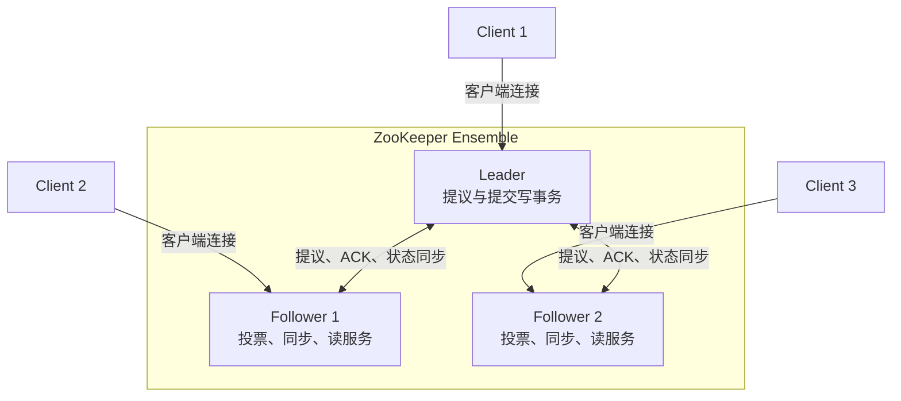

# ZooKeeper 学习指南

> 面向希望系统掌握 Apache ZooKeeper，并准备分布式系统、大数据平台或后端面试的读者。
>
> 本文以 ZooKeeper 3.x 的通用架构和 API 语义为背景。具体配置项、命令选项、TLS/SASL 能力和发行版默认值可能随版本变化，生产环境应以目标版本官方文档和实际配置为准。

## 1. 先建立整体认识

### 1.1 ZooKeeper 是什么

ZooKeeper 是一个为分布式系统提供**协调服务**的开源组件。它帮助多个进程在不可靠网络和节点故障环境中完成：

- 命名和服务发现
- 主节点选举
- 集群成员管理
- 分布式锁和互斥
- 配置管理
- 屏障、队列等协调模式

ZooKeeper 的核心不是保存大量业务数据，而是维护一份较小的、需要多个进程共同观察和修改的协调状态，并通过集群协议保证这份状态的一致性和容错性。

### 1.2 一句话心智模型

```text
ZooKeeper = 小数据状态树 + 会话 + Watch + 多数派一致性
```

客户端可以连接 ZooKeeper 集群中的任意服务端：

```text
Client
  |
  +--> ZooKeeper Server 1
  +--> ZooKeeper Server 2
  +--> ZooKeeper Server 3

写请求：由服务端转发给 Leader，并由多数派确认
普通读请求：通常由当前连接的服务端本地响应
```

### 1.3 ZooKeeper 解决什么问题

假设有多个应用实例：

```text
App 1       App 2       App 3
   \          |          /
    \         |         /
       需要共享协调状态
              |
          ZooKeeper
```

应用可能需要知道：

- 当前谁是主节点
- 哪些实例在线
- 某个资源是否已经被占用
- 配置发生变化后哪些实例需要刷新
- 某个任务是否可以开始

如果每个应用自行用数据库、文件或 Redis 实现这些逻辑，容易出现选主冲突、死锁、状态过期和故障恢复不一致。ZooKeeper 提供了统一的数据模型、会话模型和有序更新机制，但具体的锁、选主和注册中心语义仍需要应用或客户端框架正确实现。

### 1.4 ZooKeeper 不是什么

ZooKeeper 不是：

- 通用关系型数据库
- 大对象或文件存储系统
- Kafka 这类消息队列
- 只提供缓存的高性能 KV 服务
- 自动解决所有分布式事务的组件
- 仅仅是一个“永久在线的服务注册表”

它更适合保存少量、结构化、需要协调的数据；不适合把业务表、日志正文、图片、批量消息或大规模时序数据直接放进去。

### 1.5 主要取舍

ZooKeeper 通过多数派和有序提交获得一致性与容错能力，因此也会付出代价：

> ZooKeeper 适合少量协调状态和状态变化通知，不适合大数据量、超高频写入或必须在多数派不可用时继续写入的场景。

## 2. 核心架构

### 2.1 Ensemble 架构

ZooKeeper 集群通常称为 **Ensemble**。一个典型的三节点集群如下：



服务端角色：

| 角色 | 主要职责 | 是否参与投票 | 是否可以服务客户端读请求 |
| --- | --- | ---: | ---: |
| Leader | 接收或协调写请求、生成提议、等待多数派确认、提交事务 | 是 | 是 |
| Follower | 参与选举和写事务投票、同步 Leader 状态、处理本地读请求 | 是 | 是 |
| Observer | 接收状态同步、服务读请求、降低投票节点压力 | 否 | 是 |

Leader 和 Follower 是**投票服务器**，也常被称为 participant。Observer 不参与 quorum 投票，因此增加 Observer 通常不会增加写事务的法定人数，但它也不能替代投票节点提供写可用性。

### 2.2 客户端连接模型

客户端通常配置多个服务端地址：

```text
zk1:2181,zk2:2181,zk3:2181
```

客户端可以先连接其中任意一个节点：

- 连接 Follower 或 Observer 时，普通读请求通常由该节点本地处理。
- 写请求通常由当前服务端转发给 Leader；在连接切换、选举或错误恢复时，客户端也可能重新选择服务端，具体行为取决于客户端实现和版本。
- 当前服务端故障时，客户端会尝试连接其他地址，并使用原有 session 继续工作。
- 只要在 session timeout 内恢复连接，临时节点通常不会被删除。

客户端连接到某台机器，不代表它绑定了固定的 Leader。Leader 选举后，客户端连接仍可由任意可用服务端承载。

### 2.3 ZooKeeper 的三条通信路径

```text
客户端连接：Client <-> Server
投票与状态同步：Leader <-> Follower
Leader 选举：投票服务器之间
```

常见配置中的端口含义：

| 配置端口 | 用途 |
| --- | --- |
| `clientPort` | 客户端连接服务端的端口 |
| quorum communication port | Leader 与 Follower/Observer 之间同步和投票通信 |
| leader election port | 投票服务器进行 Leader 选举时使用 |

传统配置常写为：

```text
server.1=zk1:2888:3888
```

其中 `2888` 通常用于 quorum 通信，`3888` 通常用于选举通信。启用 TLS 或使用版本特定配置时，端口和属性可能不同。

### 2.4 ZooKeeper 与磁盘

ZooKeeper 的状态不会只放在 JVM 内存中。服务端通常维护：

- **Transaction Log**：按顺序追加的事务日志
- **Snapshot**：某一时刻的内存状态快照
- **内存状态树**：服务运行时用于快速读写

恢复时大致是：

```text
加载 Snapshot
    +
重放 Snapshot 之后的 Transaction Log
    ↓
恢复内存中的 znode 树和元数据
```

`dataDir` 用于快照等持久化数据；如果没有配置 `dataLogDir`，事务日志通常也会写入 `dataDir`。配置 `dataLogDir` 后，可以把事务日志放到独立磁盘。事务日志的同步延迟会直接影响写入延迟，因此日志目录不能与高负载业务 I/O 随意共享。

### 2.5 ZooKeeper 与数据库的区别

ZooKeeper 也有日志、快照、事务和一致性，但它的目标不是关系数据管理：

| 对比项 | ZooKeeper | 关系型数据库 |
| --- | --- | --- |
| 数据模型 | 层级 znode 树和少量字节数据 | 表、行、列、索引 |
| 访问方式 | 路径 API、版本、Watch | SQL、事务、查询优化 |
| 主要用途 | 集群协调和状态观察 | 业务数据持久化和查询 |
| 扩展方式 | 小规模 Ensemble，读可用 Observer | 按数据库产品进行分片、复制或集群扩展 |
| 数据规模 | 应保持较小 | 可面向更大业务数据量设计 |

## 3. 数据模型：Namespace 与 Znode

### 3.1 Namespace 是一棵路径树

ZooKeeper 的数据模型类似一个简化的文件系统，但 znode 不是普通文件：

```text
/
├── app
│   ├── config
│   │   └── database
│   ├── instances
│   │   ├── node-0000000001
│   │   └── node-0000000002
│   └── leader
└── locks
    ├── lock-0000000001
    └── lock-0000000002
```

路径规则通常包括：

- 使用 `/` 分隔层级
- 路径必须是绝对路径
- 不能使用空路径组件，例如 `//app`
- 父节点一般需要先存在；ZooKeeper 不会自动创建中间目录
- 单个 znode 的数据应保持较小，默认最大协议缓冲区和实际限制受版本/配置影响，常见默认量级约为 1 MiB，不应把它当作大文件存储

### 3.2 Znode 的组成

一个 znode 包含：

```text
路径
├── data：字节数组
├── children：子节点集合
├── ACL：访问控制列表
└── Stat：版本、时间、事务 ID 等元数据
```

znode 本身可以存数据，也可以拥有子节点。父子关系是 ZooKeeper 触发 children watch 和实现许多协调模式的基础。

### 3.3 Stat 元数据

常见 `Stat` 字段及含义：

| 字段 | 含义 |
| --- | --- |
| `czxid` | 创建该 znode 的事务 ID |
| `mzxid` | 最近一次修改该 znode 数据的事务 ID |
| `ctime` | 创建时间 |
| `mtime` | 最近一次修改时间 |
| `version` | 数据版本，每次数据修改通常递增 |
| `cversion` | 子节点版本，子节点变化时递增 |
| `aversion` | ACL 版本 |
| `ephemeralOwner` | 临时节点所属 session 的 ID；持久节点通常为 0 |
| `dataLength` | 数据长度 |
| `numChildren` | 子节点数量 |
| `pzxid` | 最近一次导致子节点列表变化的事务 ID |

`zxid` 是 ZooKeeper 对事务排序的重要标识，通常由 epoch 和事务计数器组成。应用可以使用 `version` 做乐观并发控制，但不应把所有内部字段都当成跨版本稳定的业务协议。

### 3.4 四类常用 znode

#### Persistent：持久节点

持久节点不会因为创建它的客户端 session 结束而自动删除：

```text
create /config "v1"  // 普通持久节点
```

适合保存配置、命名空间和长期存在的协调状态。

#### Ephemeral：临时节点

临时节点绑定创建它的 session：

- session 正常关闭或过期后，节点会被删除
- 客户端短暂断开但在 session timeout 内重新连接时，节点通常仍然存在
- 临时节点不能拥有子节点
- 临时节点适合表示“当前实例仍然存活”或“当前 session 持有某个角色”

临时节点的删除是异步过程，应用不应假设网络断开瞬间其他客户端就已经观察到删除事件。

#### Persistent Sequential：持久顺序节点

创建时由 ZooKeeper 在名称末尾追加递增序号：

```text
/locks/lock-0000000001
/locks/lock-0000000002
```

序号只在给定父路径和服务端维护的顺序规则下有意义。应用应按 ZooKeeper 返回的完整节点名和数值顺序处理，不要自行猜测下一个序号。

#### Ephemeral Sequential：临时顺序节点

同时具备临时节点和顺序节点的特点，常用于：

- 分布式锁
- 排队获取资源
- 选主候选排序

### 3.5 Container 和 TTL 节点

较新版本提供 Container、TTL 等扩展节点类型，用于特定的协调和自动清理场景，但它们不是所有客户端和发行版都默认支持。使用前应确认服务端、客户端和 Curator 等框架版本，并明确自动清理的时机不是精确的业务定时器。

### 3.6 Znode 与文件的区别

ZooKeeper 的路径树看起来像文件系统，但有明显区别：

| 特性 | ZooKeeper znode | 普通文件系统文件 |
| --- | --- | --- |
| 数据大小 | 应保持很小 | 可面向大文件设计 |
| 修改方式 | 版本化的整块数据更新 | 可按文件语义读写 |
| 监听机制 | 原生 Watch | 通常不具备同等一致性通知语义 |
| 会话绑定 | 支持临时节点 | 一般没有 |
| ACL | 每个 znode 独立设置 | 由文件系统权限模型决定 |
| 父节点行为 | 不自动递归创建 | 由具体文件系统决定 |

ZooKeeper ACL 默认不是递归继承机制。父节点设置了 ACL，不代表后来创建的子节点自动继承相同 ACL；应用创建子节点时要明确设置权限。

## 4. ZAB、一致性与 Quorum

### 4.1 ZAB 是什么

ZAB（ZooKeeper Atomic Broadcast）是 ZooKeeper 用于 Leader 协调、事务广播和状态恢复的核心协议。它与 Paxos、Raft 都属于分布式一致性协议家族，但 ZAB 是 ZooKeeper 自己的协议，不应直接称为 Raft 实现。

ZAB 关注几个核心问题：

- 同一时刻由谁负责产生事务顺序
- 事务如何广播给其他投票服务器
- 多数派如何确认并提交事务
- Leader 故障后新 Leader 如何恢复一致状态
- 旧 Leader 如何被排除在新的任期之外

### 4.2 zxid：事务顺序标识

每个状态变更事务通常有一个全局有序的 `zxid`。可以把它抽象为：

```text
zxid = epoch + transaction counter
```

- `epoch` 可以理解为 Leader 任期或逻辑周期
- `counter` 用于标识该任期内的事务顺序

具体二进制布局和显示形式属于实现细节，但应用理解 `zxid` 的核心是：它帮助服务端比较状态新旧并按全局顺序重放事务。

### 4.3 Leader 选举、同步、广播

ZooKeeper 集群启动或 Leader 故障后，投票服务器会进入选举流程：

```text
LOOKING
   ↓
Leader Election
   ↓
新的 Leader 形成
   ↓
Discovery / Synchronization
   ↓
Broadcast
```

概念上可分为：

1. **Leader Election**：选出能够代表最新合法状态的候选 Leader。
2. **Discovery / Recovery**：新 Leader 与 Follower 比较事务进度，使集群回到一致的历史状态，并建立新的 epoch。
3. **Broadcast**：新 Leader 接收写请求，向投票服务器提议事务并等待 quorum 确认。

不同版本的内部状态机和选举实现可能有差异，但“选主、恢复同步、广播提交”是理解 ZAB 的稳定主线。

### 4.4 写请求路径

以 `setData` 为例：

```text
Client
  ↓ 写请求
连接的 Server
  ↓ 转发
Leader
  ↓ 提议 Proposal
Followers / 其他投票服务器
  ↓ ACK
达到 quorum
  ↓ COMMIT
各服务端按自身同步进度应用事务
```

关键点：

- 写事务需要 Leader 协调。
- Leader 需要多数派确认后才能提交。
- Follower 或 Observer 可能在稍后应用已提交事务；各服务端按自身同步进度应用，而不是所有节点同时完成。
- 事务日志通常先写入磁盘，具体持久化强度受配置、操作系统和存储设备影响。
- 写请求成功表示 ZooKeeper 已接受并提交该事务，不表示业务系统中的其他外部系统也已完成同一操作。

### 4.5 Quorum 如何计算

投票服务器数量为 `N` 时，quorum 通常为：

```text
quorum = floor(N / 2) + 1
```

| 投票服务器数 | 最少多数派 | 通常可容忍的投票服务器故障数 |
| ---: | ---: | ---: |
| 1 | 1 | 0 |
| 3 | 2 | 1 |
| 5 | 3 | 2 |
| 7 | 4 | 3 |

Observer 不计入上述投票数。节点数通常使用奇数，是因为在相同故障容忍能力下，偶数节点不会带来额外容错，却可能增加选举和通信成本。

### 4.6 读请求路径与一致性

ZooKeeper 的普通读请求通常可以由客户端连接的服务端本地处理：

```text
Client -> Follower：getData / getChildren / exists
Follower -> Client：返回本地状态
```

这带来较好的读吞吐，但要注意：

- Follower 或 Observer 可能暂时落后于 Leader。
- 普通读不应被简单理解为每次都从 Leader 读取最新全局状态。
- 写事务有全局提交顺序；同一客户端的更新按发送顺序应用，客户端视图具有单调性，但普通读仍可能暂时滞后。
- 如果业务需要当前连接的服务端先追上 `sync()` 请求对应的已提交状态，可以调用 `sync()`，待其完成后再读取；`sync()` 本身不返回业务数据，也不保证之后不会有新的事务提交。

可以用下面的方式理解：

```text
写入成功：事务已经按 ZooKeeper 的 quorum 规则提交
立即普通读取：可能从一个暂时落后的服务端读取
sync 完成后读取：要求当前服务端先追赶到 sync 请求对应的状态
```

具体一致性保证要结合 API、客户端版本和读写时序判断，不能用“所有操作都强一致”一句话概括。

### 4.7 ZooKeeper 更接近哪种 CAP 取舍

ZooKeeper 的写路径依赖投票节点多数派，因此它更接近 **CP**：网络分区时，拥有多数派的一侧可以继续提交，失去多数派的一侧不能安全提交写事务。

但是，不能把 CAP 标签当作全部语义：

- 默认读请求可能由本地服务端返回，存在短暂滞后。
- Observer 主要服务读，不参与写 quorum。
- session、watch、ACL 和客户端重试会影响应用看到的行为。

更准确的表述是：

> ZooKeeper 优先保证协调状态的有序提交和多数派一致性，必要时牺牲分区期间的写可用性。

### 4.8 需要记住的保证

面试和设计时可以用下面几类保证概括 ZooKeeper 的行为：

| 保证 | 含义 |
| --- | --- |
| Sequential Consistency | 来自同一个客户端的更新按发送顺序应用 |
| Atomicity | 一个更新要么成功，要么失败，不产生半成功状态 |
| Single System Image | 客户端迁移到其他服务端后，仍处于同一份逻辑服务状态；在同步完成前可能暂时滞后，但不会形成另一套独立历史 |
| Reliability | 已经提交的更新不会因为普通服务端故障而被回滚 |
| Timeliness | 服务端在正常恢复和同步条件下会在一定时间内追上最新状态；具体延迟取决于网络、磁盘、负载和超时配置 |

这些保证不等于“所有读请求都强制访问 Leader”。普通读仍可能先从本地服务端返回较旧状态；需要更强读时序时，应结合 `sync()`、客户端版本和业务重试策略。

## 5. Client、Session 与连接状态

### 5.1 Connection 与 Session 的区别

这是使用 ZooKeeper 时最容易混淆的概念之一：

| 概念 | 含义 |
| --- | --- |
| TCP Connection | 客户端与某个 ZooKeeper 服务端之间的一条网络连接 |
| Session | 客户端在 Ensemble 中注册的逻辑会话，带有 session ID 和超时 |

一个 session 可以在不同服务端之间迁移：

```text
Session S
   ├── 连接 zk1
   ├── zk1 故障，进入重连
   └── 连接 zk2，继续使用 Session S
```

因此，单次 TCP 断开不等于 session 立即失效。

### 5.2 Session 建立与超时

客户端请求一个 session timeout，但服务端会按照配置的最小/最大超时范围协商实际值。客户端通过心跳和协议通信维持 session。

造成 session 过期的常见原因：

- 网络长时间不可达
- 客户端进程暂停时间超过超时，例如长时间 Stop-The-World GC
- 客户端线程池或事件循环长期阻塞
- ZooKeeper 集群无法在超时时间内接受并处理心跳

session 过期后：

- 临时节点会被服务端删除
- 旧 session 的 watch 和认证状态不能继续当作有效；应用通常需要创建新 session，并重新认证、注册 watch 和恢复业务状态
- 原 session 不能简单当作仍然有效
- 业务必须重新注册实例、重新竞争锁或重新参与选主

### 5.3 Session 状态

不同客户端库的枚举名称可能不同，但概念上通常包括：

```text
CONNECTING   正在建立连接
CONNECTED    已连接并维持 session
RECONNECTING 连接断开，尝试迁移到其他服务端
EXPIRED      session 已过期
CLOSED       客户端主动关闭
```

业务代码不能把 `RECONNECTING` 直接等同于“实例已经死亡”，也不能把 `CONNECTED` 之外的短暂状态直接当成 session 已过期。真正决定临时节点生命周期的是服务端是否判定 session expired。

### 5.4 Session 与临时节点

```text
客户端 A --持有 Session A--> /services/order/instance-1
```

当 Session A 过期时：

```text
/services/order/instance-1 被删除
其他已注册 watch 的客户端可能收到 NodeDeleted 事件
```

但删除通知是异步的，不能把它当作实时、精确到毫秒的故障检测。服务发现或锁逻辑应该为通知延迟、重复注册和重连竞态设计。

## 6. API 与操作语义

### 6.1 常用 API

| API | 作用 | 典型场景 |
| --- | --- | --- |
| `create` | 创建 znode | 注册配置、实例、锁候选 |
| `delete` | 删除 znode | 释放锁、下线实例、清理状态 |
| `exists` | 判断节点是否存在并可设置 watch | 等待节点创建/删除 |
| `getData` | 读取节点数据并可设置 data watch | 读取配置 |
| `setData` | 修改节点数据 | 配置更新、状态更新 |
| `getChildren` | 获取子节点列表并可设置 children watch | 服务发现、选主、锁排序 |
| `getACL` / `setACL` | 查询或修改 ACL | 权限管理 |
| `sync` | 要求当前服务端追赶到指定同步点 | 需要更强读取时序时使用 |
| `multi` | 原子执行一组 ZooKeeper 操作 | 多个 znode 的协调更新 |

### 6.2 `create` 的几个维度

```text
节点类型：PERSISTENT / EPHEMERAL
是否追加序号：SEQUENTIAL / 非 SEQUENTIAL
ACL：谁可以读、写、创建子节点、删除和管理权限
```

例如概念上：

```text
/config/app                  Persistent
/services/api/instance-xxx   Ephemeral
/locks/lock-0000000001       Ephemeral Sequential
```

父节点必须存在。创建同一路径通常会返回 `NodeExists`，应用可以据此判断竞争结果，而不是先 `exists` 再 `create`，因为“先检查再创建”存在竞态。

### 6.3 版本号与乐观并发控制

`setData(path, data, version)` 可以携带期望版本：

```text
读取：version = 7
修改：setData(path, newData, expectedVersion = 7)
```

如果其他客户端已经把版本改成 8，当前操作会失败，应用需要重新读取并决定是否合并或重试。

这是一种基于版本的 Compare-And-Set 思路：

```text
只有状态仍然是我读取到的版本，才允许更新
```

使用通配版本值或无版本约束时，要确认是否会覆盖其他客户端的修改。配置中心尤其应避免无条件覆盖。

### 6.4 `multi` 的语义

`multi` 可以把多个 ZooKeeper 操作作为一个原子事务提交：

```text
创建节点 A
修改节点 B
删除节点 C
```

在 ZooKeeper 内部，这组操作要么整体提交，要么整体失败回滚。它不能把数据库、Redis、文件系统等外部系统的操作也纳入同一个原子事务，也不能自动解决外部副作用的幂等问题。

### 6.5 ACL

ZooKeeper ACL 通常可以抽象为：

```text
scheme:id:permissions
```

权限字符包括：

| 权限 | 含义 |
| --- | --- |
| `c` | create，创建子节点 |
| `d` | delete，删除当前节点下的子节点 |
| `r` | read，读取数据和子节点信息 |
| `w` | write，修改当前节点数据 |
| `a` | admin，修改 ACL |

常见 scheme：

- `world`：例如 `world:anyone`
- `auth`：当前已认证身份
- `digest`：用户名和密码摘要
- `ip`：按客户端 IP 匹配
- `sasl`：SASL/Kerberos 等身份
- `x509`：证书身份，取决于 TLS/证书配置

重要边界：

- ACL 通常作用于当前 znode，不自动递归到子节点。
- 有 `read` 权限不代表有 `create` 权限。
- 有 `create` 权限也不等于可以读父节点数据。
- 删除 `/parent/child` 时，通常需要父节点 `/parent` 上的 `d` 权限，而不是子节点自身的 `d` 权限。
- 生产环境不要直接使用公开读写的测试 ACL。
- 密钥、Token 等敏感数据不应因为放进 ZooKeeper 就自动变安全，还需要 TLS、认证、合理 ACL 和必要的加密。

### 6.6 Watch 的基本类型

常见 watch 来源：

| API | 可能关注的事件 |
| --- | --- |
| `exists(path, watcher)` | 节点创建、删除、数据变化 |
| `getData(path, watcher)` | 节点删除、数据变化 |
| `getChildren(path, watcher)` | 子节点增加、删除或列表变化 |

事件类型通常包括：

```text
NodeCreated
NodeDeleted
NodeDataChanged
NodeChildrenChanged
```

此外还有连接状态事件，例如连接建立、断开、重连和 session 过期。

### 6.7 Watch 的准确理解

标准 watch 通常具有以下语义：

- **一次性触发**：触发后通常需要重新注册。
- **通知是信号，不是消息队列**：事件本身通常不携带完整业务数据。
- **收到事件后要重新读取**：用 `getData` 或 `getChildren` 获取当前真实状态。
- **不能依赖每个中间状态都被逐条观察**：业务应以最终状态为准。
- **必须处理连接事件和 session 过期**：重连时要按客户端库语义恢复 watch、重新加载状态。
- **多个客户端同时监听同一热点节点会产生惊群**：大量客户端同时被唤醒并访问服务端。

较新版本还支持持久 watch、递归 watch 等扩展，但需要服务端和客户端都支持，且不能把扩展语义误用于不兼容的旧集群。

推荐的配置监听模式：

```text
1. 读取当前配置并注册 data watch
2. 收到 NodeDataChanged 后再次读取完整配置
3. 校验版本、格式和业务有效性
4. 成功应用后重新注册一次性 watch
5. 连接重建或 session 变化时重新加载配置
```

## 7. 常见协调模式

### 7.1 分布式锁

典型的 ZooKeeper 锁算法使用临时顺序节点：

```text
/locks/
  lock-0000000001
  lock-0000000002
  lock-0000000003
```

流程：

1. 客户端在 `/locks` 下创建 `EPHEMERAL_SEQUENTIAL` 节点。
2. 获取所有候选节点并按序号排序。
3. 如果自己是最小节点，获得锁。
4. 否则只监听自己的前驱节点。
5. 前驱删除后重新检查排序并竞争锁。
6. 业务完成后删除自己的节点；session 过期时节点也会被删除。

只监听前驱节点很重要：

```text
错误：所有等待者监听锁根节点
结果：一个锁释放，所有客户端同时被唤醒，产生惊群

较好：每个等待者只监听自己的前驱
结果：一次只唤醒可能获得锁的下一个客户端
```

锁实现还要考虑：

- 创建节点成功但客户端在收到响应前断开
- session 过期后旧客户端恢复并继续执行
- 业务执行时间超过 session timeout
- 锁释放与业务提交之间的外部副作用
- 是否需要 fencing token 防止旧持有者继续写共享资源

Curator 的 `InterProcessMutex` 等 recipe 可以减少重复实现，但仍要理解 session、超时和 fencing 的限制。

### 7.2 Leader Election

一种简单模式是所有候选者竞争创建同一个临时节点：

```text
create /election/leader EPHEMERAL
成功者成为 Leader
失败者监听该节点删除
```

如果 Leader session 过期，节点会被删除，其他候选者重新竞争。实现时要处理“创建失败后、注册删除 watch 前节点已经被删除”的竞态，不能简单地先 `exists` 再无保护地等待；应在注册 watch 后重新检查状态，或直接使用经过验证的客户端 recipe。

当需要顺序和公平性时，可以使用临时顺序节点，按序号选出最小者。选主逻辑必须处理旧 Leader 网络隔离但尚未被 ZooKeeper 判定 session 过期的窗口；对于有副作用的主节点，应使用版本或 fencing token 防止旧主继续写外部系统。

### 7.3 服务注册与发现

常见目录：

```text
/services/
└── payment/
    ├── instance-1   -> "10.0.0.1:8080"
    ├── instance-2   -> "10.0.0.2:8080"
    └── instance-3   -> "10.0.0.3:8080"
```

服务实例启动时创建临时节点，消费者读取子节点并监听 children 变化。

需要注意：

- 临时节点表示 session 存活，不是应用业务一定健康。
- consumer 收到事件后应重新获取完整实例列表。
- 不要让所有消费者对同一个根节点频繁全量刷新。
- 节点数据中应包含版本、协议、权重或元数据的明确格式。
- ZooKeeper 不负责健康检查业务接口；应用可以结合主动探活和注册状态。

### 7.4 配置管理

典型目录：

```text
/config/my-service/prod/database
/config/my-service/prod/feature-flags
```

配置中心模式通常是：

1. 配置发布端使用 `setData` 写入新版本。
2. 服务实例读取配置并设置 watch。
3. 配置变化后重新读取、校验、加载。
4. 加载失败时保留旧配置或进入明确的降级状态。

ZooKeeper 更适合小型配置和协调参数，不适合直接承载大规模配置文件、审计历史或复杂查询。配置更新应使用版本、发布人、校验和、回滚策略。

### 7.5 Barrier

Barrier 用于让一组进程等待某个条件：

```text
/barrier/job-42/
  worker-1
  worker-2
  worker-3
```

每个参与者创建临时节点，协调者观察子节点数量达到阈值后释放等待者。退出 barrier 也可以用另一个路径记录完成状态。

实现时要处理：

- 参与者中途崩溃导致节点删除
- 重复加入和重复退出
- 计数阈值变化
- barrier 是否绑定 session 生命周期

### 7.6 队列与任务协调

可以用顺序节点表示任务顺序，但 ZooKeeper 队列只适合小量协调任务，不适合高吞吐消息流：

- 任务正文应放在业务存储或消息系统中
- ZooKeeper 节点只保存任务 ID、状态或指针
- 消费者需要处理重复执行和幂等
- 删除节点不等于业务任务已经成功完成

## 8. 故障、选举与可用性

### 8.1 单节点故障

以三台投票服务器为例：

```text
zk1、zk2、zk3
quorum = 2
```

当一台故障时：

- 剩余两台仍可以形成多数派
- 如果 Leader 故障，剩余投票节点会重新选举 Leader
- 选举和状态同步期间，写请求会出现短暂暂停或失败
- 客户端会尝试重连，session 是否保留取决于是否在 timeout 内恢复

### 8.2 多数派丢失

如果三台投票服务器只剩一台可用：

- 无法形成 quorum
- 新写事务不能安全提交
- 不能把该节点的本地读结果当成全局最新事实
- 客户端可能收到连接、超时或会话相关错误

恢复多数派后，集群会按故障状态进行重新选举或状态同步，具体行为取决于故障类型和版本。

### 8.3 网络分区

网络分区会把投票节点拆成不同区域：

```text
分区 A：2 个投票节点 -> 可以形成多数派，继续提供写服务
分区 B：1 个投票节点 -> 不能提交新写事务
```

如果分区刚好把集群拆成相等两半，则任何一侧都不能形成多数派。ZooKeeper 的 quorum 机制可以避免同一个 Ensemble 同时形成两个合法 Leader，但它不会自动隔离业务系统中已经拿到旧 Leader 权限的外部资源。

### 8.4 Fencing 与旧主问题

ZooKeeper 能帮助应用判断“当前谁持有锁或谁是 Leader”，但旧进程可能因为网络隔离暂时不知道自己已经失去资格：

```text
旧主仍在运行
    ↓ 网络无法访问 ZooKeeper
新主已经选出
    ↓
两个进程都可能尝试写外部资源
```

对文件、数据库、云资源等外部系统，应用应使用 fencing token、租约校验、版本条件写或真正的隔离机制。仅仅在 ZooKeeper 中删除一个节点，不一定能阻止旧进程继续执行本地代码。

### 8.5 Leader 切换期间会发生什么

```text
旧 Leader 故障
    ↓
投票节点重新选举
    ↓
新 Leader 与其他节点同步历史事务
    ↓
恢复新的 epoch
    ↓
开始接受并广播新写事务
```

期间：

- 写请求通常会暂停、超时或返回连接错误
- 已经提交的数据不会因为普通 Leader 故障而自动丢失
- 客户端可能先进入重连状态，再恢复到另一个服务端
- session 是否过期由 session timeout 和重连时机决定
- 依赖临时节点的选主、锁和服务发现会受到事件延迟影响

ZooKeeper HA 提供的是服务层故障恢复，不是零延迟、零错误的无缝切换。

## 9. 性能、容量与扩展

### 9.1 写性能

所有写事务需要 Leader 协调并复制到多数派，因此写性能主要受以下因素影响：

- Leader CPU 和请求队列
- 事务日志顺序写和 fsync 延迟
- Leader 与投票节点之间的网络延迟
- 写事务大小和批量程度
- watch 数量和事件分发压力
- 客户端连接数和重试行为

增加投票节点不会简单地线性提升写 QPS；节点越多，达到多数派所需的通信参与者也更多。高写入场景应先减少无效写、合并状态变化，并通过压测确定瓶颈。

### 9.2 读性能

普通读请求通常由客户端连接的 Server 本地响应，Follower 和 Observer 可以分担读连接和读请求。但读扩展不是无限的：

- 每个 Server 仍需要内存维护 namespace
- watch 数量会增加事件分发和网络压力
- 热点路径会导致大量客户端集中监听
- Observer 只提高读侧扩展能力，不提供写 quorum
- 普通读的最新性要结合 Server 同步进度和 `sync()` 语义判断

### 9.3 数据大小与节点数量

实践原则：

- znode 数据尽量保持小，避免存放大 JSON、日志、二进制文件
- 子节点数量过大时，`getChildren` 全量返回会增加内存和网络压力
- 高频变化的状态不要每次变化都写 ZooKeeper
- watch 适合通知“状态可能变了”，不适合传输事件正文
- 典型生产 Ensemble 使用 3 或 5 个投票节点
- 可以增加 Observer 承担跨地域或读密集场景的读请求，但要评估网络延迟

### 9.4 磁盘与日志

ZooKeeper 对事务日志的顺序写和同步延迟比较敏感：

- `dataLogDir` 可放到低延迟、独立的磁盘
- 不要让日志目录与容易突发高 I/O 的目录竞争
- 监控磁盘空间、写延迟、fsync 延迟和日志增长
- 旧快照和日志要按版本支持的自动清理策略管理
- 磁盘满可能导致事务无法落盘，最终影响整个写路径

### 9.5 GC、CPU 与网络

长时间 Stop-The-World GC 可能让客户端心跳或服务端 quorum 通信超时，进而导致 session 过期或 Leader 失联。需要：

- 控制 znode 和 watch 总量
- 避免把大量数据存入内存树
- 选择适合版本和堆大小的 JVM 参数
- 监控 GC pause、CPU、连接数和 outstanding requests
- 保证投票节点之间网络稳定、低延迟

## 10. 配置与部署

### 10.1 最小配置示例

下面是理解配置含义的示例，不是直接用于生产的完整配置：

```properties
# Leader 与 Follower 心跳节拍，单位通常为毫秒
tickTime=2000

# Follower 初次同步或加入 Leader 的最大 tick 数
initLimit=10

# Follower 与 Leader 保持同步的最大 tick 数
syncLimit=5

# 快照和运行数据目录
dataDir=/var/lib/zookeeper

# 可选：独立事务日志目录
dataLogDir=/var/lib/zookeeper-log

# 非 TLS 客户端端口
clientPort=2181

# server.id=quorum通信地址:leader选举地址
server.1=zk1.example.com:2888:3888
server.2=zk2.example.com:2888:3888
server.3=zk3.example.com:2888:3888

# 自动清理策略示例：保留快照数，清理周期单位为小时
autopurge.snapRetainCount=3
autopurge.purgeInterval=24
```

配置说明：

- `tickTime` 是 ZooKeeper 内部时间单位的基础。
- `initLimit` 和 `syncLimit` 通常以 tick 数表示，不是直接的毫秒数。
- `server.X` 的 `X` 必须与每台机器数据目录中的 `myid` 对应。
- `dataDir` 和 `dataLogDir` 必须是服务进程可读写的可靠目录。
- `autopurge.snapRetainCount` 表示至少保留的快照数量，`autopurge.purgeInterval` 通常以小时为单位；具体默认值和边界以目标版本为准。
- `autopurge` 只负责按策略清理旧快照和日志，不等同于业务备份。
- TLS 客户端、TLS quorum、SASL/Kerberos 和认证配置需要额外属性，不能由这个最小示例推导出来。

### 10.2 `myid`

每个参与 Ensemble 的服务端通常在数据目录中有一个 `myid` 文件：

```text
# zk1 的 myid
1
```

它必须与 `server.1=...` 中的编号匹配。编号不匹配会导致服务端以错误身份参与 quorum，启动或选举失败。

### 10.3 部署拓扑

生产部署应考虑：

- 投票节点分布在不同物理机、机架或故障域
- 3 节点或 5 节点形成明确多数派
- 不要把多数投票节点放在同一故障域
- quorum 网络与客户端网络要有明确的防火墙规则
- 事务日志使用可靠、低延迟的存储
- 服务端主机时间、DNS、证书和主机名解析保持稳定
- 不把多个投票节点伪装成同一主机上的多个进程来获得“高可用”

### 10.4 动态配置

ZooKeeper 支持某些版本和配置下的动态重新配置，可以在不完全停止整个 Ensemble 的情况下调整成员。动态重配置涉及 quorum 安全、配置版本和滚动操作，生产变更前必须确认版本支持、备份当前配置并制定回滚方案。

### 10.5 超时如何取值

超时过小：

- 普通网络抖动可能造成频繁重连
- Leader 可能误判 Follower 落后
- session 容易过期

超时过大：

- 故障发现和临时节点清理变慢
- 锁和服务发现的失效感知延迟增加

应根据网络延迟、GC pause、磁盘延迟和业务故障恢复目标压测确定，而不是直接套用某个固定值。

## 11. 运维、监控与安全

### 11.1 常用 CLI 操作

示例命令以 `zkCli.sh` 为例，具体语法可能随客户端版本变化：

```bash
# 连接集群
zkCli.sh -server zk1:2181,zk2:2181,zk3:2181

# 查看根节点
ls /

# 创建示例目录（父节点必须先存在）
create /services ""
create /services/app ""
create /locks ""

# 创建持久节点
create /app "hello"

# 创建带数据的临时节点
create -e /services/app/instance-1 "10.0.0.1:8080"

# 创建顺序节点
create -s /locks/lock- "owner-a"

# 读取数据和 Stat
get /app

# 查看子节点
ls /services/app

# 修改数据
set /app "hello-v2"

# 删除叶子节点
delete /app
```

生产环境执行 `delete`、批量修改 ACL 或覆盖配置前，应确认路径、权限和回滚方案。CLI 没有替代应用层发布流程。

### 11.2 健康检查

可以结合 AdminServer、四字命令、JMX 或监控系统观察服务状态。常见检查方向包括：

- 当前角色：Leader、Follower、Observer 或其他状态
- quorum 是否形成
- Leader 是否稳定
- 客户端连接数和 session 数
- outstanding requests 是否持续堆积
- 事务日志同步和 fsync 延迟
- watch 数量、znode 数量、数据量
- session 过期数和重连次数
- 磁盘使用率、磁盘写延迟、GC pause

`ruok` 之类的轻量命令通常只说明进程能够响应，不等于整个 Ensemble 已形成健康 quorum；健康检查应结合 `mntr`、角色、同步状态和应用探针判断。四字命令可用范围受白名单配置影响，不应默认对所有来源开放。

### 11.3 监控指标类别

建议至少监控：

| 类别 | 指标示例 |
| --- | --- |
| 角色与 quorum | server state、当前 Leader、同步 Follower 数 |
| 请求 | outstanding requests、请求延迟、失败和超时 |
| 连接 | 活跃连接数、连接创建/关闭速率、session 数 |
| 数据模型 | znode 数量、watch 数量、近似数据量、子节点热点 |
| 持久化 | txn log sync 延迟、磁盘空间、磁盘 I/O 等待 |
| JVM | heap、GC 次数、GC pause、线程数 |
| 故障 | Leader 选举次数、session expiration、重连次数 |

指标名称会随版本和监控采集器变化，使用时应以目标版本暴露的指标为准。

### 11.4 备份与恢复

ZooKeeper 的 snapshot 和 transaction log 是恢复状态的重要材料，但它们不等于业务备份：

- 需要按官方支持方式保留一致的快照和日志
- 备份文件要放在独立故障域，并验证可读性
- 恢复前确认 Ensemble 成员、事务进度和配置版本
- 不要只备份某个正在变化的目录副本就假设一定可恢复
- 备份能够恢复 ZooKeeper 状态，但不能回滚已经发生的外部业务副作用
- 重要的配置、服务注册和锁状态要定义恢复后的重建策略

ZooKeeper 不是审计系统。需要历史变更记录时，应由发布系统或业务系统单独记录。

### 11.5 安全

生产环境常见安全能力包括：

- SASL/Kerberos 身份认证
- TLS 客户端连接加密
- quorum 通信加密和认证
- znode ACL
- AdminServer、四字命令和 JMX 的访问控制
- 网络隔离、防火墙和最小权限
- 敏感配置的加密、轮换和审计

常见风险：

- 使用公开 ACL，任何客户端都能修改协调状态
- 将 digest 密码、Token 或证书材料明文放进 znode
- 把 AdminServer 或四字命令端口暴露到不可信网络
- 只配置客户端认证，却忽略 quorum 节点之间的身份和加密

## 12. ZooKeeper 的优点与缺点

### 12.1 优点

#### 一致的协调状态

写事务经过 Leader 和 quorum 顺序提交，适合多实例共同维护少量协调信息。

#### 临时节点与 Session

临时节点可以自然表达实例存活、锁持有和 Leader 资格，session 迁移也比单条 TCP 连接更适合故障恢复。

#### Watch 机制

客户端可以在状态变化时收到通知，减少持续轮询，但应用仍需把 watch 当作状态变化信号处理。

#### 数据模型简单

层级路径、字节数据、版本和 ACL 足以构建多种协调 recipe。

#### 生态成熟

Java、C、Python、Go 等客户端以及 Curator 等框架提供了丰富的封装，HBase、HDFS HA、SolrCloud 等系统也有成熟集成经验。

#### 故障模型明确

多数派、Leader、Follower、Observer 和 session 过期机制使故障行为相对可解释，适合做集群协调基础设施。

### 12.2 缺点

#### 写路径受 Leader 和 quorum 限制

所有写事务需要 Leader 协调，无法像无中心写入系统一样无限扩展。跨地域部署会明显增加 quorum 延迟。

#### 多数派丢失时写不可用

这是保证一致性的代价。若业务要求分区期间继续接受写入，ZooKeeper 可能不是合适的基础组件。

#### 不适合大数据和大对象

大量 znode、超大节点数据和高频子节点变化会增加内存、GC、日志、网络和 watch 压力。

#### Watch 容易被误用

Watch 是一次性通知，不是可靠事件流；热点 watch 还可能产生惊群。

#### 不提供跨系统事务

ZooKeeper 内的 `multi` 不能把数据库写入、文件写入或业务 RPC 变成同一个原子事务。

#### 运维有一定复杂度

需要管理 quorum、选举、磁盘、日志、JVM、认证、ACL、版本升级和恢复演练。

#### 临时节点不等于业务健康

session 存活只能说明客户端与 ZooKeeper 的会话仍有效，不能证明业务接口、线程池、数据库连接和任务处理都正常。

## 13. 下游应用与典型数据链路

### 13.1 HDFS NameNode HA

HDFS HA 中，ZooKeeper 主要承担自动故障转移的协调角色：

```text
NameNode 1 + ZKFC ─┐
                    ├── ZooKeeper：选主/锁/状态协调
NameNode 2 + ZKFC ─┘

Active/Standby 的 EditLog 同步：通常由 JournalNode/QJM 负责
```

要点：

- ZKFC 监测 NameNode 健康状态并参与 Active 选举。
- ZooKeeper 保存少量选主和锁定状态。
- JournalNode 保存共享 EditLog，不能把 JournalNode 的职责归给 ZooKeeper。
- fencing 用于阻止旧 Active 继续写入，不能只依赖 ZooKeeper 锁存在。

### 13.2 HBase

HBase 的一些版本和部署模式使用 ZooKeeper 做集群协调，例如：

- Master/RegionServer 的发现
- 集群活跃状态和部分分配协调
- 客户端获取集群入口信息

HBase 的数据文件、WAL 和 Region 业务数据不存放在 ZooKeeper 中；ZooKeeper 只保存协调所需的小量状态。具体使用范围取决于 HBase 版本和部署模式。

### 13.3 Kafka

较早及部分历史 Kafka 架构使用 ZooKeeper 管理 broker 注册、Controller 选举和集群元数据协调。Kafka 近代版本提供 KRaft 模式，用自身的 Raft 元数据 quorum 替代 ZooKeeper，因此不能笼统地说“Kafka 一定依赖 ZooKeeper”。

无论哪种模式，Kafka 的消息日志都不存储在 ZooKeeper 中。

### 13.4 SolrCloud

SolrCloud 可以使用 ZooKeeper 管理：

- 集群状态
- 节点发现和角色选举
- 配置集合
- 分片和副本相关协调

索引数据仍然保存在 Solr 节点的本地存储或配置的底层存储中，而不是 ZooKeeper。

### 13.5 服务注册中心

一些 RPC 框架和微服务系统使用 ZooKeeper 作为注册中心：

```text
服务提供者 -> 创建临时实例节点
服务消费者 -> 读取实例列表并监听变化
```

但 ZooKeeper 只提供目录、session、watch 和一致性状态，不负责完整的流量治理、健康检查、负载均衡、熔断和指标体系。新系统也应比较 Nacos、Consul、etcd、Kubernetes Service 等方案。

### 13.6 Flink 等计算平台

Flink 的部分 HA 和 Leader 选举模式可以使用 ZooKeeper，其他部署模式也可以使用 Kubernetes 等协调服务。Flink 的文件系统目录可用于保存 HA 元数据或恢复材料；ZooKeeper 只承担协调，不保存 Flink 的计算数据和完整状态快照。

### 13.7 Curator

Curator 不是 ZooKeeper 服务端，而是 Apache 基金会维护的 ZooKeeper 客户端框架，提供：

- 重试和连接管理
- 分布式锁 recipe
- Leader election recipe
- Service discovery recipe
- 配置和缓存封装

Curator 能减少重复代码，但不能改变 ZooKeeper 的 session、quorum、watch、ACL 和一致性边界。

### 13.8 与 etcd、Consul、Redis 的对比

| 组件 | 主要定位 | 典型特点 |
| --- | --- | --- |
| ZooKeeper | 分布式协调和层级状态 | ZAB、session、临时节点、watch、成熟生态 |
| etcd | 强一致 KV 和配置/协调 | Raft、gRPC、MVCC、云原生生态常见 |
| Consul | 服务发现与配置 | 健康检查、服务目录、Raft、多数据中心能力 |
| Redis | 内存数据结构和缓存 | 高吞吐数据操作，但不应直接等同于协调一致性服务 |

选型要看客户端生态、运维环境、数据模型、跨地域需求、读写模式、认证和恢复要求，不能只按“谁的 QPS 更高”决定。

### 13.9 Kubernetes 与 ZooKeeper

Kubernetes 的核心集群状态通常保存在 etcd，而不是 ZooKeeper。某些 Kubernetes 周边系统仍可能使用 ZooKeeper，但不能把两者的默认架构混为一谈。

## 14. 生产设计与使用原则

### 14.1 把 ZooKeeper 当协调层

建议保存：

- 当前 Leader 标识
- 服务实例地址和少量元数据
- 配置版本或小型配置
- 锁候选节点
- 任务指针和协调状态

不建议保存：

- 大型业务对象
- 访问日志和审计全量内容
- 高频消息正文
- 大型批处理结果
- 需要复杂条件查询的业务表

### 14.2 设计状态而不是设计事件

Watch 通知的是“状态可能发生变化”，不是可靠消息队列。推荐：

```text
写入当前状态
    ↓
Watch 通知变化
    ↓
客户端重新读取当前状态
    ↓
根据版本应用状态
```

如果必须处理每个事件，应该使用 Kafka、Pulsar、数据库 CDC 或专门的任务系统，并在 ZooKeeper 中只保存消费者协调所需的小状态。

### 14.3 处理 session 过期

业务代码至少要明确：

- 重连时是否可以继续使用原状态
- session 过期后如何重新注册实例
- 锁失效后是否必须停止工作
- 旧客户端恢复后如何避免继续写共享资源
- 配置 watch 是否需要完整重建

对于持有锁的进程，session expired 通常应被视为失去锁，优先停止对受保护资源的写操作并重新竞争。

### 14.4 正确使用版本和 fencing

ZooKeeper 的版本号适合防止并发覆盖：

```text
读取 version = 10
只有 version 仍为 10 时才更新
```

对于外部资源，还需要资源侧能够识别 fencing token：

```text
旧 token = 41
新 token = 42
资源维护当前有效 token：收到更大的 token 时更新并接受，收到相同 token 时按业务幂等规则继续处理，收到更小的旧 token 时拒绝
```

仅在 ZooKeeper 中写一个“owner=xxx”字段，不能自动阻止旧进程对外部系统执行写入。

### 14.5 避免惊群

常见错误：

- 所有客户端监听同一个 `/leader` 并在删除时同时重试
- 所有客户端监听服务根节点并在每次实例变化时全量刷新
- 高频更新一个配置节点，让大量客户端重复加载

改进方向：

- 锁等待者只监听自己的前驱节点
- 服务发现使用分片、缓存和退避
- watch 触发后先比较版本，再决定是否刷新
- 重试使用指数退避和随机抖动
- 对热点配置采用发布批次或版本指针

### 14.6 升级和变更

生产升级应考虑：

- 先确认客户端兼容矩阵和协议变化
- 逐台滚动升级，始终保持 quorum
- 观察 Leader 选举、同步延迟和 session expiration
- 不在故障状态下同时替换多个投票节点
- 变更 ACL、动态配置和 TLS 证书前准备回滚
- 升级后验证 watch、临时节点、选主和恢复路径

### 14.7 容量规划

不能只按“节点数”规划 ZooKeeper，还应估算：

```text
znode 数量
+ 子节点列表规模
+ watch 数量
+ 客户端连接和 session 数
+ 写事务频率与大小
+ 快照/日志增长
+ 故障恢复期间的同步流量
```

容量和性能评估必须通过目标版本、目标客户端和真实协调模式压测；不要直接套用网上的固定 QPS 或单机 znode 数量结论。

## 15. 高频面试题与参考答案

### 15.1 ZooKeeper 是什么？解决什么问题？

ZooKeeper 是面向分布式系统的协调服务，提供层级数据模型、session、临时节点、顺序节点、watch、ACL 和多数派一致性。它常用于选主、服务发现、配置管理、分布式锁和成员管理，而不是存储大规模业务数据。

### 15.2 ZooKeeper 为什么需要集群？

单节点容易成为单点故障。多个投票服务器通过 quorum 保存一致状态，单个节点故障时仍可继续服务；集群同时也可以分担客户端读连接。

### 15.3 为什么通常部署 3 或 5 台？

因为需要多数派提交，3 台可容忍 1 台投票节点故障，5 台可容忍 2 台。奇数节点在相同容错能力下通常比相邻偶数节点更划算。

### 15.4 quorum 是如何计算的？

通常是 `floor(N/2)+1`。只统计投票服务器，不统计 Observer。没有 quorum 时不能安全提交新的写事务。

### 15.5 Leader、Follower、Observer 的区别？

Leader 负责写事务顺序、提议和提交；Follower 参与投票、同步并服务读；Observer 同步状态并服务读，但不参与投票和 quorum，因此不能提升写可用性。

### 15.6 客户端必须连接 Leader 吗？

不必须。客户端可以连接任意可用服务端。写请求会由服务端协调到 Leader，普通读请求通常由当前连接的服务端本地处理。连接到 Follower 或 Observer 时，要注意读状态可能暂时落后。

### 15.7 ZooKeeper 的写请求流程是什么？

客户端发起写请求，连接的服务端将其转给 Leader；Leader 生成提议并广播给投票服务器；多数派确认后提交事务，各节点再应用该事务。

### 15.8 ZooKeeper 的读请求一定是强一致吗？

不应这样概括。普通读通常可以由当前服务端本地返回，Follower/Observer 可能存在滞后。需要更强时序时可以使用 `sync()` 后再读取。写事务本身遵循全局提交顺序，但默认读路径和线性一致读不是同一个概念。

### 15.9 ZAB 是什么？和 Raft/Paxos 一样吗？

ZAB 是 ZooKeeper 的原子广播协议，负责 Leader、事务广播和状态恢复。它与 Raft/Paxos 都解决分布式一致性问题，但协议设计和实现不同，不能把 ZooKeeper 直接称为 Raft 集群。

### 15.10 zxid 是什么？

zxid 是 ZooKeeper 事务的有序标识，通常由 epoch 和事务计数器组成，用于比较事务和状态新旧。它是理解事务顺序和状态同步的重要概念。

### 15.11 znode 是什么？

znode 是 ZooKeeper namespace 树中的节点，包含字节数据、子节点、ACL 和 Stat 元数据。它不是操作系统文件，也不适合保存大对象。

### 15.12 Persistent 和 Ephemeral 的区别？

Persistent 节点不会因创建者 session 结束而自动删除；Ephemeral 节点绑定创建者 session，session 过期后由服务端删除。临时节点不能有子节点。

### 15.13 TCP 连接断开后临时节点会立即消失吗？

不会。客户端只要在 session timeout 内重新连接到 Ensemble，session 通常仍然有效，临时节点也通常保留。超过超时并被服务端判定 session expired 后，临时节点才会删除。

### 15.14 Session 和 Connection 的区别？

Connection 是客户端到某个服务端的一条连接；Session 是 Ensemble 中的逻辑会话。连接可以断开并迁移到其他服务端，而 session 可以继续保持。

### 15.15 为什么临时节点不能创建子节点？

临时节点由 session 生命周期管理，服务端需要在 session 过期时整体清理。禁止子节点可以简化生命周期和状态管理，也避免产生复杂的父子持久性关系。

### 15.16 Sequential 节点有什么用？

ZooKeeper 会在节点名后追加顺序号，客户端可以按顺序号排序实现排队、锁竞争和候选者排序。应用应使用服务端返回的完整路径，不要自行计算下一个序号。

### 15.17 Watch 是可靠消息队列吗？

不是。标准 watch 通常一次性触发，是状态变化信号，不携带完整事件历史。收到 watch 后应重新读取当前状态；需要逐条可靠消费的场景应使用消息系统。

### 15.18 Watch 触发后为什么还要重新读取？

因为 watch 事件只说明状态发生了变化，事件可能不包含最新数据，而且多个变化可能在客户端处理前合并或连续发生。重新读取才能得到当前状态。

### 15.19 `exists`、`getData`、`getChildren` 分别监听什么？

`exists` 可关注节点创建、删除和数据变化；`getData` 主要关注节点删除或数据变化；`getChildren` 主要关注子节点列表变化。具体事件和重注册行为取决于客户端 API 版本。

### 15.20 如何避免 Watch 惊群？

锁场景中每个等待者只监听自己的前驱节点；服务发现使用缓存、分片、退避和版本比较；避免让所有客户端监听单一热点节点并在同一时刻全量刷新。

### 15.21 ZooKeeper 如何实现分布式锁？

客户端在锁目录下创建临时顺序节点，最小序号持有锁，其他客户端只监听前驱节点；前驱删除后重新检查。还要处理 session 过期、重连竞态、外部资源 fencing 和业务幂等。

### 15.22 ZooKeeper 锁能防止业务重复执行吗？

不能单独保证。锁只协调能够观察同一 ZooKeeper 状态的客户端，旧客户端可能在网络隔离期间继续执行。外部资源需要 fencing token 或条件写，业务操作还需要幂等设计。

### 15.23 ZooKeeper 如何实现服务发现？

服务实例使用 session 创建临时节点，消费者读取服务目录的子节点并设置 children watch；实例下线或 session 过期后节点被删除，消费者重新读取列表。

### 15.24 临时节点能表示业务健康吗？

不能完全表示。它主要表示 session 仍被 ZooKeeper 视为有效。应用线程池阻塞、业务端口不可用或数据库已故障时，session 可能仍然存在，因此应结合业务健康检查。

### 15.25 `sync()` 的作用是什么？

它要求客户端连接的服务端先追赶到 sync 请求对应的事务进度，然后客户端再进行读取。它不直接返回业务数据，也不等同于把所有后续读都强制发送给 Leader。

### 15.26 ZooKeeper 的版本号有什么用？

版本号用于乐观并发控制。客户端可以在 `setData` 或 `delete` 时携带期望版本，只有版本仍匹配才执行，从而避免无条件覆盖其他客户端的更新。

### 15.27 `multi` 能实现分布式事务吗？

它能在 ZooKeeper 内部原子执行一组操作，但不能把数据库、消息队列、文件系统等外部系统纳入同一个原子事务。外部副作用仍需幂等、补偿或事务消息等设计。

### 15.28 ACL 的权限有哪些？

常见权限是 `c` 创建、`d` 删除、`r` 读取、`w` 修改数据、`a` 修改 ACL。ACL 通常不自动继承到子节点，生产环境应配置认证和最小权限。

### 15.29 ZooKeeper 数据为什么不能放太大？

因为每个 Server 都需要在内存中维护 namespace，写事务还要在集群间传播，快照、日志、GC 和客户端响应也会受到影响。大对象应放到文件、对象存储或数据库，ZooKeeper 只保存引用和版本。

### 15.30 ZooKeeper 是 CP 还是 AP？

它的写路径依赖 quorum，更接近 CP：失去多数派时不能继续提交写事务。普通读可能从本地服务端返回旧一点的状态，所以不能只用 CAP 标签替代具体读语义。

### 15.31 Leader 故障时会发生什么？

投票节点重新选举 Leader，新 Leader 与其他节点同步事务并建立新的 epoch；期间写请求可能暂停或失败。客户端会重连，session 是否保留取决于是否在 session timeout 内恢复。

### 15.32 网络分区会产生两个 Leader 吗？

同一个 Ensemble 的 quorum 机制要求合法 Leader 获得多数派，因此少数派不能形成可提交写事务的合法集群。但旧业务进程可能在不知道失去资格时继续工作，所以外部资源仍需 fencing。

### 15.33 为什么偶数节点不一定更好？

例如 4 台的多数派是 3，通常仍只能容忍 1 台故障；5 台的多数派是 3，却能容忍 2 台故障。因此在相同故障容忍目标下，奇数投票节点通常更合适。

### 15.34 Observer 有什么用？

Observer 不参与投票，可以接收状态同步并服务读请求，适合读密集、跨地域或希望减少投票节点连接压力的场景。它不能提升写可用性，且读结果可能滞后。

### 15.35 ZooKeeper 能否替代 Redis？

不能简单替代。ZooKeeper 面向协调状态和一致性；Redis 面向内存数据结构、缓存和高吞吐数据访问。虽然两者都能实现部分锁或计数场景，但故障、持久化、一致性和性能语义不同。

### 15.36 ZooKeeper 能否替代数据库？

不能。ZooKeeper 没有关系模型、SQL、索引、复杂查询和面向大规模业务数据的设计。把业务表直接放进 ZooKeeper 会造成容量、性能和运维风险。

### 15.37 Kafka 为什么有时不需要 ZooKeeper？

现代 Kafka 可以使用 KRaft 元数据 quorum 管理自身元数据；历史架构和部分旧版本使用 ZooKeeper。需要根据 Kafka 版本和部署模式确认，Kafka 消息本身不存放在 ZooKeeper。

### 15.38 HDFS HA 中 ZooKeeper 和 JournalNode 分别做什么？

ZooKeeper 配合 ZKFC 做健康检查、Active 选举和故障转移协调；JournalNode/QJM 保存和同步 NameNode 的共享 EditLog。两者职责不同，ZooKeeper 不保存 HDFS 文件数据或 EditLog。

### 15.39 `tickTime`、`initLimit`、`syncLimit` 是什么？

`tickTime` 是内部时间节拍；`initLimit` 通常限制 Follower 初次同步或加入 Leader 的时间窗口；`syncLimit` 通常限制 Follower 与 Leader 保持同步的最大 tick 数。实际单位和行为应按目标版本文档核对。

### 15.40 ZooKeeper 写入成功是否等于业务数据永久安全？

写入成功表示该 ZooKeeper 事务按当前 quorum 和持久化配置提交，但不表示外部数据库、文件或业务 RPC 已经成功。ZooKeeper 副本也不能替代跨故障域备份和业务恢复方案。

## 16. 学习路线

### 第一阶段：数据模型

1. 理解 Ensemble、Leader、Follower、Observer。
2. 用 CLI 创建 Persistent、Ephemeral、Sequential 节点。
3. 观察 `Stat` 中的 version、zxid 和 session 相关字段。
4. 区分 znode 数据、子节点和 ACL。

### 第二阶段：客户端语义

1. 编写 `create/getData/setData/delete` 的最小客户端。
2. 模拟连接断开和重连，观察 session 是否保留。
3. 注册 data watch 和 children watch，验证一次性触发和重新读取。
4. 用版本号实现乐观更新。

### 第三阶段：一致性与故障

1. 画出写请求从 Client 到 Leader、Follower 的路径。
2. 理解 quorum、zxid、ZAB 和 Leader election。
3. 停止一个投票节点，观察读写和选举行为。
4. 模拟多数派丢失，确认写入不可用而不是盲目重试。
5. 观察 session expiration、临时节点删除和业务重新注册。

### 第四阶段：协调 recipe

1. 实现临时顺序节点锁，并避免全量 watch 惊群。
2. 实现 Leader election 和 fencing token。
3. 实现服务发现和配置热更新。
4. 使用 Curator 等框架对比自己实现的边界和重试行为。

### 第五阶段：生产运维

1. 配置 3 节点或 5 节点 Ensemble，并将投票节点分布到不同故障域。
2. 将 transaction log 放在可靠、低延迟的磁盘。
3. 配置认证、TLS、ACL 和管理端口访问控制。
4. 监控 Leader、quorum、fsync、GC、连接、watch 和 session expiration。
5. 做滚动升级、Leader 故障、多数派丢失和恢复演练。

## 17. 复习速记

```text
ZooKeeper：分布式协调服务，不是业务数据库
Ensemble：ZooKeeper 集群
Leader：协调写事务、提议和提交
Follower：投票、同步、服务读
Observer：不投票，主要分担读
Quorum：投票节点多数派
ZAB：ZooKeeper 的原子广播与恢复协议
zxid：事务顺序标识
znode：路径树中的节点，保存少量字节数据
Persistent：session 结束后仍保留
Ephemeral：session 过期后删除，不能有子节点
Sequential：由服务端追加顺序号
Session：可跨服务端迁移的逻辑会话
Watch：一次性状态变化通知，不是消息队列
ACL：znode 级访问控制，通常不递归继承
sync：让当前服务端追赶同步点后再读
Lock：临时顺序节点 + 只监听前驱
Fencing：阻止失去资格的旧进程继续写外部资源
HDFS HA：ZooKeeper 做选主协调，JournalNode 做 EditLog
Kafka：旧架构用 ZooKeeper，现代架构可用 KRaft
```

## 18. 官方参考文档

以下链接指向 Apache ZooKeeper 官方文档，阅读时应优先选择与实际部署版本匹配的页面：

- [ZooKeeper Documentation](https://zookeeper.apache.org/doc/current/)
- [ZooKeeper Programmer's Guide](https://zookeeper.apache.org/doc/current/zookeeperProgrammers.html)
- [ZooKeeper Administrator's Guide](https://zookeeper.apache.org/doc/current/zookeeperAdmin.html)
- [ZooKeeper Recipes](https://zookeeper.apache.org/doc/current/recipes.html)
- [ZooKeeper API Javadoc](https://zookeeper.apache.org/doc/current/apidocs/)
- [Apache Curator](https://curator.apache.org/)
